# macpan2

```{r opts, echo = FALSE}
knitr::opts_chunk$set(
  fig.path = "misc/readme/"
)
```

```{r packages, echo = FALSE, eval = TRUE, message=FALSE, warning=FALSE, error=FALSE}
library(macpan2)
library(ggplot2)
library(dplyr)
```

<!-- badges: start -->
[](https://github.com/canmod/macpan2/actions/workflows/R-CMD-check.yaml)
[](https://github.com/canmod/macpan2/actions/workflows/test-coverage.yaml)
[](https://github.com/canmod/macpan2/commits)
[](https://github.com/canmod/macpan2/graphs/contributors)
[](https://github.com/canmod/macpan2/releases/latest)

[McMasterPandemic](https://github.com/mac-theobio/McMasterPandemic) was developed to provide forecasts and insights to Canadian public health agencies throughout the COVID-19 pandemic. [Much was learned](https://canmod.github.io/macpan-book/index.html#vision-and-direction) about developing general purpose compartmental modelling software during this experience, but the pressure to deliver regular forecasts made it difficult to focus on the software itself. The goal of this `macpan2` project is to re-imagine `McMasterPandemic`, building it from the ground up with architectural and technological decisions that address the many lessons that we learned from COVID-19 about software.

Impactful applied public health modelling requires many interdisciplinary steps along the path from epidemiological research teams to operational decision makers. Researchers must quickly tailor a model to an emerging public-health concern, validate and calibrate it to data, work with decision makers to define model outputs useful for stakeholders, configure models to generate those outputs, and package up those insights in an appropriate format for stakeholders. Unlike traditional modelling approaches, `macpan2` tackles this challenge from a software-engineering perspective, which allows us to systematically address bottlenecks along this path to impact in ways that will make future solutions easier to achieve. The goal is to enable researchers to focus on their core strengths and fill knowledge gaps efficiently and effectively.

Although `macpan2` is designed as a compartmental modelling tool that is agnostic about the underlying computational engine, it currently makes use of [template model builder](https://github.com/kaskr/adcomp). Template model builder (TMB) is an `R` modelling package based on a `C++` framework incorporating mature [automatic differentiation](https://cppad.readthedocs.io/en/latest/user_guide.html) and [matrix algebra](http://eigen.tuxfamily.org/index.php?title=Main_Page) libraries.

The [Public Health Risk Sciences Division](https://github.com/phac-nml-phrsd) at the [Public Health Agency of Canada](https://www.canada.ca/en/public-health.html) uses `macpan2` (for example, [here](https://phac-nml-phrsd.github.io/EPACmodel/)).

## Documentation

* [Package reference](https://canmod.github.io/macpan2/)
* [Quick-start guide](https://canmod.github.io/macpan2/articles/quickstart)
* [Representation of compartmental models](https://canmod.github.io/macpan2/articles/model_definitions) [specification document]
* [`C++` engine](https://canmod.github.io/macpan2/articles/cpp_side) [specification document]
* [Project history and trajectory](https://canmod.net/misc/macpan2_presentation) [slides]

## Installation

If you're on a Windows system, please install `Rtools` matching your R version from [here](https://cran.r-project.org/bin/windows/Rtools/). This ensures you have a C++ compiler, which is required to install `macpan2` from source (as below).

Then, install the `macpan2` package with the following R command.

```
remotes::install_github("canmod/macpan2")
```

For projects in production one should install a specific version, as in the following command.
```
remotes::install_github("canmod/macpan2@v0.0.3")
```

## Hello World

Here is an SI model specification, which is I think the simplest possible epidemiological transmission model.
```{r hello-world}
si = mp_tmb_model_spec(
    before = list(
        I ~ 1
      , S ~ N - I
    )
  , during = list(
        infection ~ beta * S * I / N
      , S ~ S - infection
      , I ~ I + infection
    )
  , default = list(N = 100, beta = 0.25)
)
print(si)
```

Simulating from this model requires choosing the number of time-steps to run and the model quantities to simulate. Syntax for simulating `macpan2` models is [designed to combine with standard data prep and plotting tools in R](#modularity), as we demonstrate with the following code.
```{r plot-tmb-si}
(si
 |> mp_simulator(time_steps = 50, quantities = c("I", "infection"))
 |> mp_trajectory()
 |> mutate(quantity = case_match(matrix
    , "I" ~ "prevalance"
    , "infection" ~ "incidence"
  ))
 |> ggplot() 
 + geom_line(aes(time, value)) 
 + facet_wrap(~quantity, scales = "free")
)
```


## Design Concepts

```{r design-concepts, echo=FALSE}

```

### Information Processing

Like other statistical modelling software, the high-level purpose of `macpan2` is to process data sources (top-left) into results (bottom-left). In the case of `macpan2`, this processing is done using compartmental modelling (right). The major steps of this information processing are numbered in the diagram, and we describe each of these.

1. Information processing begins with accessing and preparing numerical information from various data sources, with the output being standard numerical R objects. Depending on the nature of the analysis to follow, this information could include default values for parameters (e.g. transmission rate), initial values for the state variables (e.g. initial number of infectious individuals), operational schedules (e.g. timing of lockdown events or vaccine roll-out schedules), and data for model fitting (e.g. time series of hospital utilization). This step could involve connecting to real-time surveillance platforms or reading in static data files. There is not any functionality within `macpan2` for conducting this step -- [`macpan2` does not try to reinvent the wheel in data access and preparation](#modularity).
2. The structure of a compartmental model is defined in one of three ways. In all cases the output is ultimately a [model simulator](#model-simulator).
    * (2a) A model is chosen from a model library and read into `R`, optionally updating the model structure using an [engine-agnostic model specification language](#engine-agnostic-model-specification-language).
    * (2b) A model is written from scratch using the [engine-agnostic model specification language](#engine-agnostic-model-specification-language).
    * (2c) A model is written from scratch using one of the [engine-specific model specification languages](#engine-specific-model-specification-languages).
These three are alternatives, in that if 2a is chosen then 2b and 2c are automatically executed and if 2b is chosen that 2c is automatic. The choice here is just how close (2c) or far (2a) from the actual computation engine do you want to be when specifying models. There are several [considerations when choosing a model specification workflow](#engine-agnostic-versus-engine-specific) when deciding which alternative to use. No matter which of these approaches is taken, the output of step 2 is a model simulator that can be used to generate modelling outputs like simulated incidence time-series or reproduction numbers.
3. Although model simulators come with default initial values so that they can be used immediately, typically one would like to modify these values without needing to edit the model specifications from step 2. There are two main use-cases involving such numerical modifications to the model simulators: In order to formally calibrate model parameters by fitting the model to observed time-series data and/or modifying default parameter values to reflect a what-if scenario. In both use-cases, a model simulator is used as input and another model simulator is produced as output.
4. Once the model defining and numerical initialization steps have been completed, model outputs are produced in long-format data frames.
5. Finally these model outputs are incorporated into forecasts, plots, reports, and diagnostics using standard tools outside of `macpan2`.

### Modularity

Modularity is a key principle of `macpan2` design in a few ways.

First, `macpan2` is meant to plug into standard R workflows for data pre-processing and simulation post-processing. There is very little functionality in `macpan2` for configuring how data are prepared as input and modelling outputs are processed. Instead, `macpan2` accepts standard data objects (data frames, matrices, vectors) and returns simulations as long-format data frames that can be processed using standard tools like `dplyr` and `ggplot2`. This design principle is illustrated in the architecture diagram above that has blue steps representing standard non-`macpan2` workflows and red steps representing workflows that depend on `macpan2` data structures and objects. The challenges of building the red steps is big enough that we prefer to avoid reinventing the wheel of pre- and post-processing.

Second, `macpan2` uses an engine plug-in architecture. Models defined in the [engine-agnostic model specification language](#engine-agnostic model specification language) can be rendered in a particular computational engine so that multiple computational approaches can be used to generate modelling outputs for a single model definition. This can be useful if different model outputs are more efficient or convenient for different computational approaches. For example, engines such as TMB that are capable of automatic differentiation are great for fast optimization of parameters and for computing $\mathcal{R}_0$ in models with arbitrary complexity, whereas other engines such as Adaptive Tau are better at stochastic simulation techniques like the Gillespie algorithm. Sometimes an engine will be unable to generate a particular output at all or with sufficient difficulty on the part of the user so as to render the use-case practically impossible. For example, it is not possible to conveniently utilize differential equation solvers in the TMB engine, limiting it to Euler or simple RK4-type solvers. Being able to swap out the TMB engine for one based on `deSolve` (or other similar package) would allow for more convenient and accurate solutions to differential equations without having to leave `macpan2`. 

Third, TODO: describe how the model specification language can be used to build up models modularly (e.g. swap out alternative state-updaters as discussed above but also add in model structures like age-groups and spatial structure to a simple unstructured model)


### Engine-Agnostic Model Specification Language

TODO

### Engine-Specific Model Specification Languages

TODO


## Product Management

The [project board](https://github.com/orgs/canmod/projects/2) tracks the details of bugs, tasks, and feature development. But the following narrative will provide context on product development themes, their current state, and plans for improvement and implementation.

### General Dynamic Simulation with TMB

One can [define a generic set of update steps](#hello-world) that are iterated to produce a dynamic simulation model in TMB, and that can be used to generate model simulations.

This part of the package is general, stable, and flexible. It also meets many modellers where they are, which is with the ability to write down a set of transitions/state updates.

But it is not convenient if you would just like to simulate from it, which is what the [model library](#model-library) is for.

### Model Library

```{r tmb-library}
("starter_models"
 |> mp_tmb_library("sir", package = "macpan2")
 |> mp_simulator(time_steps = 10, quantities = "I")
 |> mp_trajectory()
)
```

TODO:

- [ ] Reuse the tools for the older concept of starter models
- [ ] Establish a specification

### Calibration

We will build a function, `mp_calibrate`, which takes (1) an object for simulating model trajectories and (2) other information for calibrating certain quantities of this model. This second type of information is detailed in the following sections. The output of `mp_calibrate` should be another object for simulating model trajectories that contains new default parameter values given by fits and additional stochasticity resulting from parameter estimation uncertainty.

A big question with calibration is do we want there to be an engine-agnostic DSL layer, or do we just want it to make sense for engines where it makes sense? I think the latter, because otherwise we are making things difficult. We can try to be wise making reusable calibration machinery across engines if it comes to that.

#### Specifying Data to Fit

A data frame (or data frames) containing observed (possibly uneven) time series to compare with model simulations. What form should this data frame take?

One option is the same format as the output of `mp_report`. This would have several benefits.

* Consistency with input and output formats, making it a little easier to learn.
* Easy to manipulate output into input for testing calibration functionality.
* Possibly simpler argument list to `mp_calibrate` because we would just relate the observed data to simulated data with the same name, of course we would still need an interface for distributional assumptions.
* Naturally handles missing values

The main disadvantage of this is that format could differ from the indexed vectors discussed below.


#### Specifying Distributional Assumptions

Probably should be a few ways to do this depending on how many different assumptions need to be made. At one extreme every observation gets the same distribution, which is easily specified in an argument to `mp_calibrate`. At the other extreme each observation gets its own distribution (including distributional parameters like spread and shape), which could be specified by adding additional columns to the data frame with observed values. Designs for interfaces for use cases that are somewhere between these two extremes seem less obvious.

#### Specifying Parameters to Fit

There are two kinds of parameters to fit.

* Existing quantities to be fitted (e.g. `beta`, initial number of susceptible individuals `S`).
* Creating new quantities to be fitted (e.g. distributional scale parameters declared along with [distributional asumptions](#specifying-distributional-assumptions).

The scale (e.g. log, logit) on which to fit these parameters must also be specified. 

The new distributional parameters should go into a new indexed vector called something like `distributional_parameters`. (TODO: more general name for new parameters that are part of the observation model, e.g. convolution kernel parameters).


### Time-Varying Parameters

TODO

### Vectors in the TMB Engine

This is a TMB-engine-specific warm-up to [model structure](#model-structure-and-bookkeeping).

```{r tmb-with-indices}
state_labels = c("S", "I", "R")
flow = data.frame(
    rate = c("infection", "recovery")
  , from = c("S"        , "I"       )
  , to   = c("I"        , "R"       )
)
sir = mp_tmb_model_spec(
    before = list(
        state[I] ~ 1
      , state[S] ~ N - 1
      , state[R] ~ 0
    )
  , during = list(
        flow_rate[infection] ~ beta * state[S] * state[I] / N
      , flow_rate[recovery] ~ gamma * state[I]
      , state ~ state + group_sums(flow_rate, to, state) - group_sums(flow_rate, from, state)
  )
  , default = list(
      state     = macpan2:::zero_vector(state_labels)
    , flow_rate = macpan2:::zero_vector(flow$rate)
    , N = 100
    , beta = 0.25
    , gamma = 0.1
  )
  , integers = list(
       from = mp_indices(flow$from, state_labels)
     , to   = mp_indices(flow$to  , state_labels)
  )
)
(sir
  |> mp_simulator(time_steps = 10, quantities = "I")
  |> mp_trajectory()
)
```


### Model Structure and Bookkeeping

Structured models are combinations of simpler modular model components. For example one might combine an SIR model with an age-group contact model to produce an age structured model. The modular model components are called atomic models.

#### Structure in Expressions

Models are composed of expression lists. Each expression in an unstructured model can be converted into a structured expression to create a structured model. For example, the following unstructured expression defines the rate at which new infections emerge.

```{r scalar-infection, eval = FALSE}
infection ~ beta * S * I / N
```

Each symbol in this expression has a certain type within a structured model, and this type determines how it gets translated into a structured expression. The simplest structured model is one that collects `S` and `I` into a `state` vector with elements `S` and `I`. With this interpretation of the `S` and `I` symbols, the structured infection expression gets translated internally to the following.

```{r subset-scalar-infection, eval = FALSE}
infection ~ beta * state[S] * state[I] / N
```


Here `S` and `I` become symbols for extracting subsets of the `state` vector. In this case the expression itself remains a scalar expression but two of the scalars are obtained by extracting subsets of the `state` vector. It won't take much imagination to think of examples where multiple paths to infection are required, and therefore the single scalar-valued infection expression will be insufficient.

We will have a vector-valued expression, for example, in a model with an expanded state vector that tracks the geographic location of `S` and `I` individuals. For example, a two patch model with an `east` and `west` patch would involve a four-dimensional state vector with the following elements: `S.east`, `S.west`, `I.east`, and `I.west`. In this case we now have two scalar-valued infection expressions.

```{r vector-infection, eval = FALSE}
infection[east] ~ beta * state[S.east] * state[I.east] / N
infection[west] ~ beta * state[S.west] * state[I.west] / N
```

With two patches it is fine to write out all scalar-valued infection expressions, but with more patches and with different types of structure (e.g. age groups, symptom status, hospitalization, immunity status, etc ...) it will become crucial to have software that handles the bookkeeping internally.

To see how easy this can be, note that this two-patch infection expression can be powerfully and compactly expressed as our original unstructured expression, `infection ~ beta * S * I / N`, where `S = c(state[S.east], state[S.west])` and `I = c(state[I.east], state[I.west])`.

Why is this powerful? Because it separates the math of the dynamic mechanism, `infection ~ beta * S * I / N`, from the bookkeeping required in structured models where the same mechanism is applied again and again to different model strata. This is often how modellers think. For example, I might have a location-structured SIR model that I need to expand to be both age- and location-structured. In this case, infection is still the same process, whereby a susceptible individual contacts an infectious individual to create a flow from susceptible individuals to infectious individuals. The same math applies to all strata of the model. The boring but necessary part is to connect the math to the bookkeeping associated with the model structure, and so software should focus on making these bookkeeping changes as easy as possible and with minimal changes required to the underlying mathematical expressions.

Let's look at more examples of infection, and watch the bookkeeping get more annoying. In an age-stratified model with two age groups, we now get four scalar-valued infection expressions of the form `infection ~ beta * S * I / N`.
```{r age-structured-infection, eval = FALSE}
infection[young.young] ~ beta[young.young] * state[S.young] * state[I.young] / N[young]
infection[young.old]   ~ beta[young.old]   * state[S.young] * state[I.old]   / N[old]
infection[old.young]   ~ beta[old.young]   * state[S.old]   * state[I.young] / N[young]
infection[old.old]     ~ beta[old.old]     * state[S.old]   * state[I.old]   / N[old]
```

Here the first expression is for a young individual infecting an old individual, the second is for an old individual infecting a young individual, etc ...  Things get worse if we have two age groups in two patches.

```{r age-location-structured-infection, eval = FALSE}
infection[young.young.east] ~ beta[young.young.east] * state[S.young.east] * state[I.young.east] / N[young.east]
infection[young.old.east]   ~ beta[young.old.east]   * state[S.young.east] * state[I.old.east]   / N[old.east]
infection[old.young.east]   ~ beta[old.young.east]   * state[S.old.east]   * state[I.young.east] / N[young.east]
infection[old.old.east]     ~ beta[old.old.east]     * state[S.old.east]   * state[I.old.east]   / N[old.east]
infection[young.young.west] ~ beta[young.young.west] * state[S.young.west] * state[I.young.west] / N[young.west]
infection[young.old.west]   ~ beta[young.old.west]   * state[S.young.west] * state[I.old.west]   / N[old.west]
infection[old.young.west]   ~ beta[old.young.west]   * state[S.old.west]   * state[I.young.west] / N[young.west]
infection[old.old.west]     ~ beta[old.old.west]     * state[S.old.west]   * state[I.old.west]   / N[old.west]
```

This still isn't so bad, as we just have the first four expressions for `east` and the last four for `west`. But now let's introduce two symptom status categories: `mild` and `severe`.

```{r age-location-symptom-structured-infection, eval = FALSE}
infection[young.young.east.mild.mild]     ~ beta[young.young.east.mild.mild]     * state[S.young.east] * state[I.young.east.mild]   / N[young.east]
infection[young.young.east.mild.severe]   ~ beta[young.young.east.mild.severe]   * state[S.young.east] * state[I.young.east.severe] / N[young.east]
infection[young.young.east.severe.mild]   ~ beta[young.young.east.severe.mild]   * state[S.young.east] * state[I.young.east.mild]   / N[young.east]
infection[young.young.east.severe.severe] ~ beta[young.young.east.severe.severe] * state[S.young.east] * state[I.young.east.severe] / N[young.east]
infection[young.old.east.mild.mild]       ~ beta[young.old.east.mild.mild]       * state[S.young.east] * state[I.old.east.mild]     / N[old.east]
infection[young.old.east.mild.severe]     ~ beta[young.old.east.mild.severe]     * state[S.young.east] * state[I.old.east.severe]   / N[old.east]
infection[young.old.east.severe.mild]     ~ beta[young.old.east.severe.mild]     * state[S.young.east] * state[I.old.east.mild]     / N[old.east]
infection[young.old.east.severe.severe]   ~ beta[young.old.east.severe.severe]   * state[S.young.east] * state[I.old.east.severe]   / N[old.east]
infection[old.young.east.mild.mild]       ~ beta[old.young.east.mild.mild]       * state[S.old.east]   * state[I.young.east.mild]   / N[young.east]
infection[old.young.east.mild.severe]     ~ beta[old.young.east.mild.severe]     * state[S.old.east]   * state[I.young.east.severe] / N[young.east]
infection[old.young.east.severe.mild]     ~ beta[old.young.east.severe.mild]     * state[S.old.east]   * state[I.young.east.mild]   / N[young.east]
infection[old.young.east.severe.severe]   ~ beta[old.young.east.severe.severe]   * state[S.old.east]   * state[I.young.east.severe] / N[young.east]
infection[old.old.east.mild.mild]         ~ beta[old.old.east.mild.mild]         * state[S.old.east]   * state[I.old.east.mild]     / N[old.east]
infection[old.old.east.mild.severe]       ~ beta[old.old.east.mild.severe]       * state[S.old.east]   * state[I.old.east.severe]   / N[old.east]
infection[old.old.east.severe.mild]       ~ beta[old.old.east.severe.mild]       * state[S.old.east]   * state[I.old.east.mild]     / N[old.east]
infection[old.old.east.severe.severe]     ~ beta[old.old.east.severe.severe]     * state[S.old.east]   * state[I.old.east.severe]   / N[old.east]
infection[young.young.west.mild.mild]     ~ beta[young.young.west.mild.mild]     * state[S.young.west] * state[I.young.west.mild]   / N[young.west]
infection[young.young.west.mild.severe]   ~ beta[young.young.west.mild.severe]   * state[S.young.west] * state[I.young.west.severe] / N[young.west]
infection[young.young.west.severe.mild]   ~ beta[young.young.west.severe.mild]   * state[S.young.west] * state[I.young.west.mild]   / N[young.west]
infection[young.young.west.severe.severe] ~ beta[young.young.west.severe.severe] * state[S.young.west] * state[I.young.west.severe] / N[young.west]
infection[young.old.west.mild.mild]       ~ beta[young.old.west.mild.mild]       * state[S.young.west] * state[I.old.west.mild]     / N[old.west]
infection[young.old.west.mild.severe]     ~ beta[young.old.west.mild.severe]     * state[S.young.west] * state[I.old.west.severe]   / N[old.west]
infection[young.old.west.severe.mild]     ~ beta[young.old.west.severe.mild]     * state[S.young.west] * state[I.old.west.mild]     / N[old.west]
infection[young.old.west.severe.severe]   ~ beta[young.old.west.severe.severe]   * state[S.young.west] * state[I.old.west.severe]   / N[old.west]
infection[old.young.west.mild.mild]       ~ beta[old.young.west.mild.mild]       * state[S.old.west]   * state[I.young.west.mild]   / N[young.west]
infection[old.young.west.mild.severe]     ~ beta[old.young.west.mild.severe]     * state[S.old.west]   * state[I.young.west.severe] / N[young.west]
infection[old.young.west.severe.mild]     ~ beta[old.young.west.severe.mild]     * state[S.old.west]   * state[I.young.west.mild]   / N[young.west]
infection[old.young.west.severe.severe]   ~ beta[old.young.west.severe.severe]   * state[S.old.west]   * state[I.young.west.severe] / N[young.west]
infection[old.old.west.mild.mild]         ~ beta[old.old.west.mild.mild]         * state[S.old.west]   * state[I.old.west.mild]     / N[old.west]
infection[old.old.west.mild.severe]       ~ beta[old.old.west.mild.severe]       * state[S.old.west]   * state[I.old.west.severe]   / N[old.west]
infection[old.old.west.severe.mild]       ~ beta[old.old.west.severe.mild]       * state[S.old.west]   * state[I.old.west.mild]     / N[old.west]
infection[old.old.west.severe.severe]     ~ beta[old.old.west.severe.severe]     * state[S.old.west]   * state[I.old.west.severe]   / N[old.west]
```

This is intense. The names in square brackets get much less clear in several ways as the model gets more structured. This lack of clarity makes it difficult to see a variety of model assumptions by looking at scalar-valued expressions. The `infection` and `beta` vectors depend on two age categories and two symptom statuses, but only one location. This is because young people can infect old people (and vice versa), because mildly infectious people can cause severe infection (and vice versa), and because infectious people in the east cannot infect people in the west (and vice versa). For labels associated with two ages, what does the first age mean, relative to the second age? To discover this you need to know to look at the ages associated with the `S` and `I` states, and once you do this you can see that the first age category is associated with the susceptible individual and the second with the infectious individual. There is a related issue with symptom status, but it is expressed differently because `S` individuals are not structured by symptom status. In this case we match the second symptom status associated with `infection` and `beta` to the symptom status of the `I` states, which means that the first symptom status implicitly refers to the status of the newly infected individuals and not the infectious individuals. Another way to look at this last issue is that `I` boxes play two different roles. The first role is as an individual that infects an `S` individual, and the second is as the individual that that `S` individual becomes after it is infected. None of this is obvious from the scalar-valued expressions above, and it is difficult to imagine a clearer way to explicitly write each expression.

Our approach is to do the bookkeeping in a different way. In particular we believe that a constructive approach to structure provides a more comprehensible description, as we describe next. In brief, we believe that a grammar for specifying the steps associated with adding structure can be clearer than a description of the final structured model.

#### Constructive Descriptions of Model Structure

The first step to being more constructive is to have a better representation of the structured vectors. Above we used dot-concatenation to represent the model strata. For example, in the two-patch SI model we have both epidemiological status and geographic location in the state variable names: `S.east`, `S.west`, `I.east`, and `I.west`. But as the state vector gets more structured it becomes more convenient to describe its variables using an index table, the rows of which describe each state variable.

```{r cartesian}
state = mp_cartesian(
  mp_index(Epi = c("S", "I")),
  mp_index(Loc = c("east", "west"))
)
state
```

```{r group}
beta = mp_group(state, "Epi")
```

With this representation we can get subsets of the state vector that represent each epidemiological status.

```{r subset}
mp_subset(state, Epi = "S")
mp_subset(state, Epi = "I")
```


#### Structured Vectors

These are column vectors, the rows of which 


### Structure Encourages Reparameterization


### Alternative Engines

TODO

### Combining Expression Lists

Because expression lists are really just lists of expressions, they can be combined as lists would normally be combined. In this example we keep the dynamics of the si model separate from under-reporting and reporting delay corrections to the raw prevalence (TODO: should really use incidence).

```{r combining-expression-lists}
library(macpan2)
si_dynamics = list(
    transition_rate = infection ~ beta * S * I / N
  , state_update = S ~ S - infection
  , state_update = I ~ I + infection
)
reporting_correction = list(
  post_processing = reports ~ convolution(I, c(0.5, 0.25, 0.25))
)
si = mp_dynamic_model(
  expr_list = ExprList(during = c(si_dynamics, reporting_correction)),
  unstruc_mats = list(S = 99, I = 1, beta = 0.25, N = 100)
)
(si
  |> mp_tmb_simulator(time_steps = 10, mats_to_return = "reports")
  |> mp_report()
)
```


