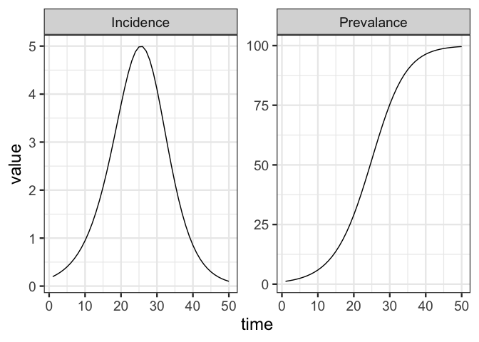

<!-- Auto-generated - do not edit by hand -->
<!-- Edit README.Rmd instead -->
macpan2
================

<!-- badges: start -->

[](https://canmod.r-universe.dev/macpan2)
[](https://github.com/canmod/macpan2/actions/workflows/R-CMD-check.yaml)
[](https://github.com/canmod/macpan2/actions/workflows/test-coverage.yaml)
[](https://github.com/canmod/macpan2/commits)
[](https://github.com/canmod/macpan2/graphs/contributors)

[McMasterPandemic](https://github.com/mac-theobio/McMasterPandemic) was
developed to provide forecasts and insights to Canadian public health
agencies throughout the COVID-19 pandemic. [Much was
learned](https://canmod.github.io/macpan-book/index.html#vision-and-direction)
about developing general purpose compartmental modelling software during
this experience, but the pressure to deliver regular forecasts made it
difficult to focus on the software itself. The goal of this `macpan2`
project is to re-imagine `McMasterPandemic`, building it from the ground
up with architectural and technological decisions that address the many
lessons that we learned from COVID-19 about software.

Impactful applied public health modelling requires many
interdisciplinary steps along the path from epidemiological research
teams to operational decision makers. Researchers must quickly tailor a
model to an emerging public-health concern, validate and calibrate it to
data, work with decision makers to define model outputs useful for
stakeholders, configure models to generate those outputs, and package up
those insights in an appropriate format for stakeholders. Unlike
traditional modelling approaches, `macpan2` tackles this challenge from
a software-engineering perspective, which allows us to systematically
address bottlenecks along this path to impact in ways that will make
future solutions easier to achieve. The goal is to enable researchers to
focus on their core strengths and fill knowledge gaps efficiently and
effectively.

Although `macpan2` is designed as a compartmental modelling tool that is
agnostic about the underlying computational engine, it currently uses
[template model builder](https://github.com/kaskr/adcomp) as the sole
engine. Template model builder (TMB) is an `R` modelling package based
on a `C++` framework incorporating mature [automatic
differentiation](https://cppad.readthedocs.io/en/latest/user_guide.html)
and [matrix
algebra](http://eigen.tuxfamily.org/index.php?title=Main_Page)
libraries.

The [Public Health Risk Sciences
Division](https://github.com/phac-nml-phrsd) at the [Public Health
Agency of Canada](https://www.canada.ca/en/public-health.html) uses
`macpan2` (for example,
[here](https://phac-nml-phrsd.github.io/EPACmodel/)).

## Documentation

-   [Package reference](https://canmod.github.io/macpan2/)
-   [Quick-start
    guide](https://canmod.github.io/macpan2/articles/quickstart)
-   [`TMB` engine](https://canmod.github.io/macpan2/articles/cpp_side)
    \[specification document\]
-   [Project history and
    trajectory](https://canmod.net/misc/macpan2_presentation) \[slides\]

## Installation

The standard recommended way to install `macpan2` is with the following
command.

    repos = c('https://canmod.r-universe.dev', 'https://cloud.r-project.org')
    install.packages('macpan2', repos = repos)

This command will install the current version of `macpan2`. For projects
in production that need to keep track of specific versions of `macpan2`,
snapshots and other reproducibility information can be obtained
[here](https://canmod.r-universe.dev/api). Please see [this
article](https://ropensci.org/blog/2022/01/06/runiverse-renv/) for an
explanation of how to manage reproducibility using `r-universe`.

To get the latest development version of `macpan2`, or if the above
command fails for some reason, an alternative command to install is the
following.

    remotes::install_github("canmod/macpan2")

This command requires the `remotes` package and assumes that your `R`
environment is set up to compile `C++` code contained in packages.

Many workflows with `macpan2` also make use of the following packages.

    install.packages(c("dplyr", "ggplot2", "tidyr", "broom.mixed"))

## Hello World

The following code specifies an [SI
model](https://github.com/canmod/macpan2/blob/main/inst/starter_models/si/README.md),
which is the simplest model of epidemiological transmission.

``` r
library(macpan2)
si = mp_tmb_model_spec(
    before = S ~ 1 - I
  , during = mp_per_capita_flow(
        from     = "S"         ## compartment from which individuals flow
      , to       = "I"         ## compartment to which individuals flow
      , rate     = "beta * I"  ## expression giving _per-capita_ flow rate
      , abs_rate = "infection" ## name for _absolute_ flow rate = beta * I * S
    )
  , default = list(I = 0.01, beta = 0.2)
)
print(si)
```

    ## ---------------------
    ## Default values:
    ## ---------------------
    ##  matrix row col value
    ##       I          0.01
    ##    beta          0.20
    ## 
    ## ---------------------
    ## Before the simulation loop (t = 0):
    ## ---------------------
    ## 1: S ~ 1 - I
    ## 
    ## ---------------------
    ## At every iteration of the simulation loop (t = 1 to T):
    ## ---------------------
    ## 1: mp_per_capita_flow(from = "S", to = "I", rate = "beta * I", abs_rate = "infection")

See [this
article](https://canmod.github.io/macpan2/articles/example_models.html)
for more example models with documentation.

Simulating from this model requires choosing the number of time-steps to
run and the model outputs to generate. Syntax for simulating `macpan2`
models is [designed to combine with standard data prep and plotting
tools in
R](https://canmod.github.io/macpan2/articles/quickstart.html#processing-results),
as we demonstrate with the following code.

``` r
library(ggplot2)
library(dplyr)
(si
 |> mp_simulator(time_steps = 50, outputs = c("I", "infection"))
 |> mp_trajectory()
 |> mutate(quantity = case_match(matrix
    , "I" ~ "Prevalance"
    , "infection" ~ "Incidence"
  ))
 |> ggplot() 
 + geom_line(aes(time, value)) 
 + facet_wrap(~ quantity, scales = "free")
 + theme_bw()
)
```

<!-- -->

## Product Management

The [project board](https://github.com/orgs/canmod/projects/2/views/6)
tracks the details of bugs, tasks, and feature development.
