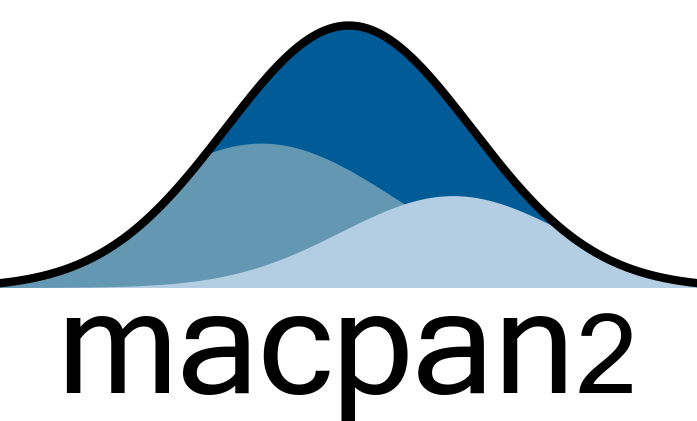

<!-- Auto-generated - do not edit by hand -->
<!-- Edit README.Rmd instead -->

<!-- badges: start -->

[](https://canmod.r-universe.dev/macpan2)
[](https://github.com/canmod/macpan2/actions/workflows/R-CMD-check.yaml)
[](https://doi.org/10.5281/zenodo.14895172)
[](https://github.com/canmod/macpan2/actions/workflows/test-coverage.yaml)
[](https://github.com/canmod/macpan2/commits)
[](https://github.com/canmod/macpan2/graphs/contributors)



`macpan2` is a software platform for building and calibrating
compartmental models of infectious disease. It supports flexible model
specification and fast parameter calibration, making it easier for
modellers to respond to emerging public health threats. Developed
through collaboration with the [Public Health Agency of Canada
(PHAC)](https://www.canada.ca/en/public-health.html), `macpan2` is being
used to support responses to diseases such as mpox ([Milwid et al.
2023](#ref-milwid2023mpox)), measles ([PHAC 2024](#ref-phac2024measles),
[interactive measles
model](https://wzmli.shinyapps.io/two_pop_measles_shiny/)), and COVID-19
([Simmons et al. 2025](#ref-simmons2025cost); [Miranda et al.
2025](#ref-miranda2024strategies)), and internal work on [pandemic
preparedness](https://phac-nml-phrsd.github.io/EPACmodel/).

The precursor to `macpan2` was
[McMasterPandemic](https://github.com/mac-theobio/McMasterPandemic),
which was developed to provide
[forecasts](https://mac-theobio.github.io/covid-19) and insights to
Canadian public health agencies throughout the COVID-19 pandemic
([Public Health Agency of Canada Modelling Group
2020--2022](#ref-phac_modelling_group)). Much was
[learned](https://canmod.github.io/macpan-book/index.html#vision-and-direction)
about developing general purpose compartmental modelling software during
this experience, but the pressure to deliver regular forecasts made it
difficult to focus on the software itself. The goal of this `macpan2`
project is to re-imagine `McMasterPandemic`, building it from the ground
up with architectural and technological decisions that address the many
lessons that we learned from COVID-19 about software.

## Documentation

-   [Package website](https://canmod.github.io/macpan2/)
-   [Package reference and function
    documentation](https://canmod.github.io/macpan2/reference)
-   [Quick-start
    guide](https://canmod.github.io/macpan2/articles/quickstart)
-   [Articles describing the
    package](https://canmod.github.io/macpan2/articles)
-   [Example starter
    models](https://canmod.github.io/macpan2/articles/example_models.html)
-   [Frequently asked
    questions](https://canmod.github.io/macpan2/articles/FAQs)
-   [`TMB` engine](https://canmod.github.io/macpan2/articles/cpp_side)
    \[specification document\]
-   [Project history and trajectory](https://canmod.net/misc/pyRC)
    \[slides\]
-   [Instructional
    videos](https://drive.google.com/drive/folders/1NEQf2sy6QLxMiiWBN5Yn9U7wiPMs1jiS)
-   [Workshop notes](https://canmod.github.io/macpan-workshop)
-   [Publications and reports](#publications-and-reports) \[using
    `macpan2` and `McMasterPandemic`\]
-   [Visual `macpan2` model
    builder](https://canmod.github.io/macpan2-model-builder/) \[proof of
    concept\]

## Installation

Here is the recommended way to install `macpan2` (from within an R
session):

``` r
repos = c('https://canmod.r-universe.dev', 'https://cloud.r-project.org')
install.packages('macpan2', repos = repos)
```

To get the latest development version of `macpan2`, or if the above
command fails for some reason, try:

``` r
remotes::install_github("canmod/macpan2")
```

This command requires the `remotes` package and assumes that your R
environment is set up to build packages that include compiled C++ code
(e.g. see details for
[Windows](https://cran.r-project.org/bin/windows/base/howto-R-devel.html)
or [MacOS](https://mac.r-project.org/tools/) \[you probably only need
Xcode from this page\]).

Many `macpan2` workflows also use these four popular packages:

``` r
install.packages(c("dplyr", "ggplot2", "tidyr", "broom.mixed"))
```

The `Rgraphviz` package is useful for plotting flow diagrams of models
(see `?dot_layout`). To install it:

``` r
if (!require("BiocManager", quietly = TRUE))
    install.packages("BiocManager")
BiocManager::install("Rgraphviz")
```

## Reproducibility

The [r-universe](https://r-universe.dev), which we use to distribute
`macpan2`, suggests two approaches for projects in production that need
to keep track of specific versions of `macpan2`:
[snapshots](https://ropensci.org/blog/2023/05/31/runiverse-snapshots/)
or [`renv`](https://ropensci.org/blog/2022/01/06/runiverse-renv/).

To take the first approach, snapshots of `macpan2` (and its dependency
`oor`) can be obtained using the following download link.

    https://canmod.r-universe.dev/api/snapshot/zip?packages=macpan2,macpan2helpers,oor

Please see [this documentation](https://canmod.r-universe.dev/apis) for
instructions on customizing this download link.

The benefit of the first approach is that it doesn’t require users to be
able to compile C++ code, whereas the second does. The benefit of the
second approach is that it can be used to manage dependencies on all
packages in your workflows. It might be possible to combine the two
approaches to get the best of both worlds, but this isn’t tested.

## Hello World

The following code specifies an [SI
model](https://github.com/canmod/macpan2/blob/main/inst/starter_models/si/README.md),
which is the simplest model of epidemiological transmission.

``` r
library(macpan2)
si = mp_tmb_model_spec(
    before = S ~ 1 - I
  , during = mp_per_capita_flow(
        from      = "S"         ## compartment from which individuals flow
      , to        = "I"         ## compartment to which individuals flow
      , rate      = "beta * I"  ## expression giving _per-capita_ flow rate
      , flow_name = "infection" ## name for _absolute_ flow rate = beta * I * S
    )
  , default = list(I = 0.01, beta = 0.2)
)
print(si)
```

    ## ---------------------
    ## Default values:
    ##  quantity value
    ##         I  0.01
    ##      beta  0.20
    ## ---------------------
    ## 
    ## ---------------------
    ## Before the simulation loop (t = 0):
    ## ---------------------
    ## 1: S ~ 1 - I
    ## 
    ## ---------------------
    ## At every iteration of the simulation loop (t = 1 to T):
    ## ---------------------
    ## 1: mp_per_capita_flow(from = "S", to = "I", rate = "beta * I", flow_name = "infection")

See [this
article](https://canmod.github.io/macpan2/articles/example_models.html)
for more example models with documentation.

Simulating from this model requires choosing the number of time-steps to
run and the model outputs to generate. Syntax for simulating `macpan2`
models is [designed to combine with standard data prep and plotting
tools in
R](https://canmod.github.io/macpan2/articles/quickstart.html#processing-results),
as we demonstrate with the following code.

``` r
library(ggplot2)
library(dplyr)
(si
 |> mp_simulator(time_steps = 50, outputs = c("I", "infection"))
 |> mp_trajectory()
 |> mutate(quantity = case_match(matrix
    , "I" ~ "Prevalence"
    , "infection" ~ "Incidence"
  ))
 |> ggplot() 
 + geom_line(aes(time, value)) 
 + facet_wrap(~ quantity, scales = "free")
 + theme_bw()
)
```

<!-- -->

## Workshops

We have delivered several `macpan2` workshops. Here are the [current
workshop notes](https://canmod.github.io/macpan-workshop/).

| Organization                                                | Date                                                                           |
|:------------------------------------------------------------|:-------------------------------------------------------------------------------|
| Public Health Agency of Canada                              | [2025-03-20](https://canmod.github.io/macpan-workshop)                         |
| Memorial University                                         | 2024-11-07                                                                     |
| Simon Fraser University                                     | 2024-13-05                                                                     |
| Vancouver Machine Learning Group (VanML)                    | [2024-02-22](https://elliottlab.ca/technique.html)                             |
| Canadian Network for Modelling Infectious Diseases (CANMOD) | [2023-11-14](https://www.birs.ca/events/2023/5-day-workshops/23w5151/schedule) |

## Product Management

The [project board](https://github.com/orgs/canmod/projects/2/views/6)
tracks the details of bugs, tasks, and feature development.

## Publications and Reports

<div id="refs" class="references csl-bib-body hanging-indent">

<div id="ref-milwid2023mpox" class="csl-entry">

Milwid, R. M., M. Li, A. Fazil, M. Maheu-Giroux, C. M. Doyle, Y. Xia, J.
Cox, et al. 2023. “Exploring the Dynamics of the 2022 Mpox Outbreak in
Canada.” *Journal of Medical Virology* 95: e29256.
<https://doi.org/10.1002/jmv.29256>.

</div>

<div id="ref-miranda2024strategies" class="csl-entry">

Miranda, Rafael N, Alison E Simmons, Michael WZ Li, Gebremedhin B
Gebretekle, Min Xi, Marina I Salvadori, Bryna Warshawsky, et al. 2025.
“Cost-Utility Analysis of COVID-19 Vaccination Strategies for Endemic
SARS-CoV-2.” *JAMA Network Open* 8 (6): e2515534–34.
<https://doi.org/10.1001/jamanetworkopen.2025.15534>.

</div>

<div id="ref-phac2024measles" class="csl-entry">

PHAC. 2024. “Rapid Risk Assessment: Measles in Canada, Public Health
Implications in 2024.” Public Health Agency of Canada.
<https://www.canada.ca/en/public-health/services/emergency-preparedness-response/rapid-risk-assessments-public-health-professionals/rapid-risk-assessment-measles-public-health-implications-2024.html>.

</div>

<div id="ref-phac_modelling_group" class="csl-entry">

Public Health Agency of Canada Modelling Group. 2020--2022. “PHAC
Modelling Group Reports.”
<https://nccid.ca/covid-19-phac-modelling-group/>.

</div>

<div id="ref-simmons2025cost" class="csl-entry">

Simmons, A. E., R. N. Miranda, M. W. Z. Li, G. B. Gebretekle, M. Xi, M.
I. Salvadori, B. Warshawsky, et al. 2025. “Cost-Utility Analysis of
Current COVID-19 Vaccination Program Recommendations in Canada.”
*Vaccine X* 24: 100660. <https://doi.org/10.1016/j.jvacx.2025.100660>.

</div>

</div>
