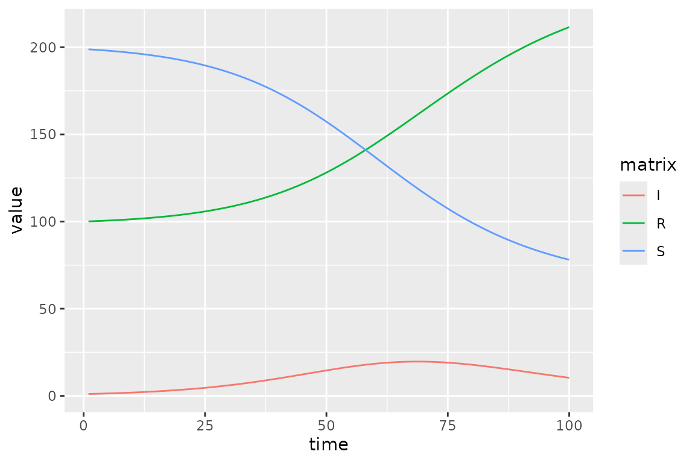
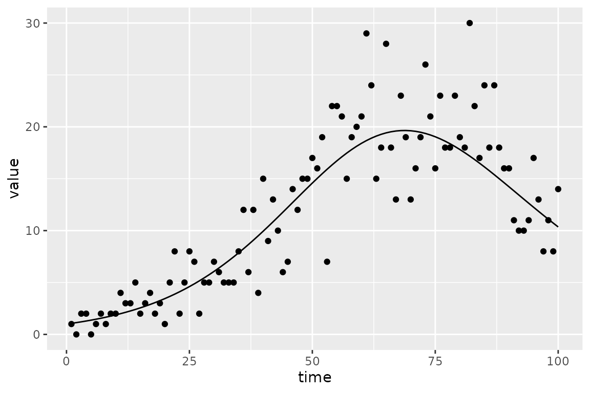
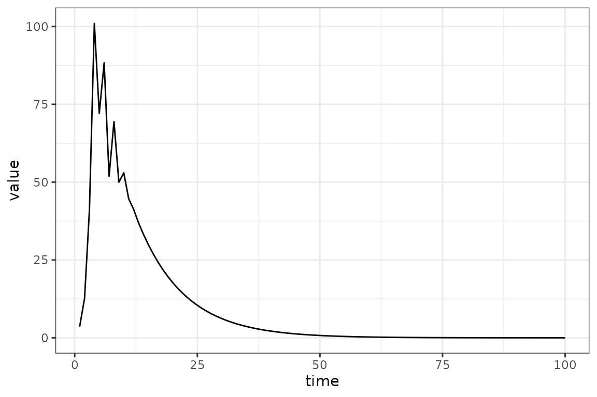
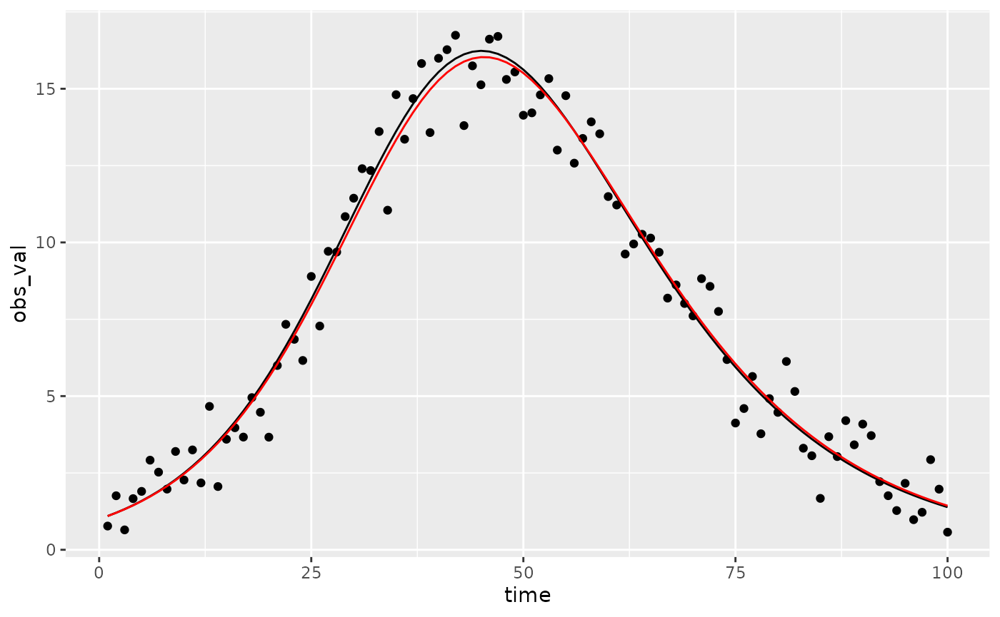

# Calibrating Compartmental Models to Data

[](https://canmod.github.io/macpan2/articles/vignette-status#mature-draft)

``` r
library(macpan2)
library(ggplot2)
library(dplyr)
library(broom.mixed)
options(macpan2_verbose =  FALSE)
```

Before reading this article on calibrating models to data, please first
look at the [quickstart
guide](https://canmod.github.io/macpan2/articles/quickstart) and the
article on the [model
library](https://canmod.github.io/macpan2/articles/example_models).

## Hello, World

We’ll do the first thing you should always do when trying out a new
fitting procedure: simulate clean, nice data from the model and see if
you can recover something close to the true parameters.

### Step 0: set up simulator and generate ‘data’

We will be using several different versions of the SIR model, all of
which can be derived from the SIR specification in the model library.

``` r
sir_spec = mp_tmb_library("starter_models"
  , "sir"
  , package = "macpan2"
)
print(sir_spec)
#> ---------------------
#> Default values:
#>  quantity value
#>      beta   0.2
#>     gamma   0.1
#>         N 100.0
#>         I   1.0
#>         R   0.0
#> ---------------------
#> 
#> ---------------------
#> Before the simulation loop (t = 0):
#> ---------------------
#> 1: S ~ N - I - R
#> 
#> ---------------------
#> At every iteration of the simulation loop (t = 1 to T):
#> ---------------------
#> 1: mp_per_capita_flow(from = "S", to = "I", rate = "beta * I / N", 
#>      flow_name = "infection")
#> 2: mp_per_capita_flow(from = "I", to = "R", rate = "gamma", flow_name = "recovery")
```

From this specification we derive our first version of the model, which
we use to generate synthetic data to see if optimization can recover the
parameters that we use when simulating.

``` r
sir_simulator = mp_simulator(sir_spec
  , time_steps = 100
  , outputs = c("S", "I", "R")
  , default = list(N = 300, R = 100, beta = 0.25, gamma = 0.1)
)
sir_results = mp_trajectory(sir_simulator) |>
    mutate(across(matrix, ~factor(., levels = c("S", "I", "R"))))
(sir_results
  |> ggplot(aes(time, value, colour = matrix))
  + geom_line()
)
```



Note that we changed the default values so that we can try to recover
them using optimization below.

To make things a little more challenging we add some Poisson noise to
the prevalence (`I`) value:

``` r
set.seed(101)
sir_prevalence = (sir_results
    |> dplyr::select(-c(row, col))
    |> filter(matrix == "I")
    |> rename(true_value = value)
    |> mutate(value = rpois(n(), true_value))
)
plot_truth <- ggplot(sir_prevalence, aes(time)) +
    geom_point(aes(y = value)) +
    geom_line(aes(y = true_value))
print(plot_truth)
```



### Step 1: add calibration information

The next step is to produce an object that can be calibrated through
optimization. To make this model we need to specify what trajectory we
will fit to (`I` in this case). We also need to specify what parameters
we will fit. Any value in the `default` list of a model spec can be
selected for fitting. Note that here we only change the default value of
`N`, and leave the other parameters where they were in the model spec.
It is this difference between the defaults in the simulator versus the
calibrator that will will hope to recover using optimization.

``` r
sir_calibrator = mp_tmb_calibrator(sir_spec
  , data = sir_prevalence
  , traj = list(I = mp_pois()),
  , par = c("beta", "R")
  , default = list(N = 300)
)
print(sir_calibrator)
#> ---------------------
#> Before the simulation loop (t = 0):
#> ---------------------
#> 1: S ~ N - I - R
#> 
#> ---------------------
#> At every iteration of the simulation loop (t = 1 to T):
#> ---------------------
#> 1: infection ~ S * (beta * I/N)
#> 2: recovery ~ I * (gamma)
#> 3: S ~ S - infection
#> 4: I ~ I + infection - recovery
#> 5: R ~ R + recovery
#> 
#> ---------------------
#> After the simulation loop (t = T + 1):
#> ---------------------
#> 1: sim_I ~ rbind_time(I, obs_times_I)
#> 
#> ---------------------
#> Objective function:
#> ---------------------
#> ~-sum(dpois(obs_I, sim_I))
```

The calibrator has a few new expressions that deal with comparisons with
data; in particular, it defines the objective function that we will
optimize. But before that we can do a sanity check to make sure that the
default values give a reasonable-looking trajectory.

``` r
(sir_calibrator 
 |> mp_trajectory()
 |> ggplot(aes(time, value)) 
 + geom_line()
)
```



### Step 2: do the fit

Doing the fit is straightforward; this calls a nonlinear optimizer built
into base R (`nlminb` by default), starting from the default values
specified in the calibrator.

``` r
mp_optimize(sir_calibrator)
```

The `mp_optimize` function has **modified** the `sir_calibrator` object
in place; it now contains the new fitted parameter values and the
results of the optimization.

### Step 3: check the fit

We can print the results of the optimizer (`nlminb` in this case) using
the `mp_optimizer_output` function. **Always check the value of the
convergence code** (if it’s not 0, then something may have gone wrong
…).

``` r
mp_optimizer_output(sir_calibrator)
#> $par
#>     params     params 
#>  0.2345619 86.7030875 
#> 
#> $objective
#> [1] 248.5816
#> 
#> $convergence
#> [1] 0
#> 
#> $iterations
#> [1] 15
#> 
#> $evaluations
#> function gradient 
#>       25       15 
#> 
#> $message
#> [1] "both X-convergence and relative convergence (5)"
mp_optimize(sir_calibrator)
#> $par
#>     params     params 
#>  0.2345619 86.7030875 
#> 
#> $objective
#> [1] 248.5816
#> 
#> $convergence
#> [1] 0
#> 
#> $iterations
#> [1] 1
#> 
#> $evaluations
#> function gradient 
#>        2        1 
#> 
#> $message
#> [1] "both X-convergence and relative convergence (5)"
mp_optimizer_output(sir_calibrator, what="all")
#> [[1]]
#> [[1]]$par
#>     params     params 
#>  0.2345619 86.7030875 
#> 
#> [[1]]$objective
#> [1] 248.5816
#> 
#> [[1]]$convergence
#> [1] 0
#> 
#> [[1]]$iterations
#> [1] 15
#> 
#> [[1]]$evaluations
#> function gradient 
#>       25       15 
#> 
#> [[1]]$message
#> [1] "both X-convergence and relative convergence (5)"
#> 
#> 
#> [[2]]
#> [[2]]$par
#>     params     params 
#>  0.2345619 86.7030875 
#> 
#> [[2]]$objective
#> [1] 248.5816
#> 
#> [[2]]$convergence
#> [1] 0
#> 
#> [[2]]$iterations
#> [1] 1
#> 
#> [[2]]$evaluations
#> function gradient 
#>        2        1 
#> 
#> [[2]]$message
#> [1] "both X-convergence and relative convergence (5)"
```

As mentioned above, the best-fit parameters are stored internally; we
can get information about them using the `mp_tmb_coef` function. (If you
get a message about the `broom.mixed` package, please install it.
`mp_tmb_coef` is a wrapper for
[`broom.mixed::tidy()`](https://generics.r-lib.org/reference/tidy.html)).

``` r
sir_estimates = mp_tmb_coef(sir_calibrator, conf.int = TRUE)
print(sir_estimates, digits = 3)
#>       term  mat row col default  type estimate std.error conf.low conf.high
#> 1   params beta   0   0     0.2 fixed    0.235   0.00874    0.217     0.252
#> 2 params.1    R   0   0     0.0 fixed   86.703   7.02875   72.927   100.479
```

This parameter corresponds pretty well to the known true values we used
to simulate.

``` r
mp_default(sir_simulator) |> filter(matrix %in% sir_estimates$mat)
#>   matrix row col  value
#> 1      R         100.00
#> 2   beta           0.25
```

And the known simulated true value of the trajectory (black line) does
in fact fall within the 95% confidence region (red ribbon).

``` r
sim_vals <- (sir_calibrator
  |> mp_trajectory_sd(conf.int = TRUE)
  |> filter(matrix == "I")
)
(plot_truth 
  + geom_line(data = sim_vals
    , aes(y = value)
    , colour = "red"
  )
  + geom_ribbon(data = sim_vals
    , aes(ymin = conf.low, ymax = conf.high)
    , fill = "red"
    , alpha = 0.2
  )
)
```



## Statistical Model

Above we were not specific about the statistical model used to fit the
data. Here we describe it.

Let the observed and simulated trajectories be vectors $I_{\text{obs}}$
and $I_{\text{sim}}$. The $I$ symbol is chosen because we fitted to
prevalence above, but it could be any trajectory in the model. For
example, `traj = "infection"` would have fitted to incidence, because
the `infection` variable in the model is the number of new cases at
every time step.

The simulated trajectories are actually a function of the vector,
$\mathbf{b}$, of default values that we chose to make statistical
parameters. Therefore, we write the simulated trajectory as a function,
$I_{\text{sim}}(\mathbf{b})$.

We assume that the observed trajectory is Poisson distributed with mean
given by the simulated trajectory.

$$I_{\text{obs}} \sim \text{Poisson}\left( I_{\text{sim}}(\mathbf{b}) \right)$$

Given these assumptions we choose $\mathbf{b}$ to maximize the resulting
likelihood function, and use functionality from the `TMB` package (and
sometimes the `tmbstan`/`rstan` packages) to do statistical inference on
the fitted parameters and trajectories.

This statistical model will often be too simple. The `macpan2` package
has an extremely flexible developer interface that allows for more
detailed control over `TMB`, `tmbstan`, and `rstan`. This interface
allows for arbitrary likelihood functions, prior distributions,
parameter transformations, flexible parameter time-variation models,
random effects and more. See
[here](https://canmod.github.io/macpan2/articles/calibration_advanced.html)
and
[here](https://canmod.github.io/macpan2/articles/time_varying_parameters.html)
for more information, although because these guides describe a developer
interface the instructions may be unclear to some or many readers. Our
plan is to continue adding interface layers, such as the interface
described in this vignette, so that more of `macpan2` can be exposed to
users.
