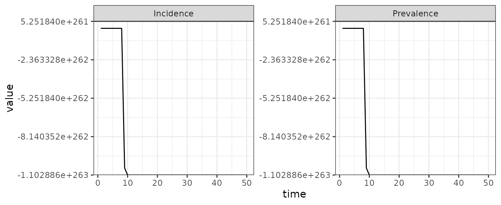

# Quickstart

[](https://canmod.github.io/macpan2/articles/vignette-status#stable)

## Hello World

This vignette shows how to simulate from the SI model, which is I think
is the simplest possible model of epidemiological transmission. Here is
the code for defining an SI model (see [this short
article](https://canmod.github.io/macpan2/articles/example_models) on
how to find other example models).

``` r
library(ggplot2)
library(dplyr)
library(tidyr)
library(macpan2)
si = mp_tmb_model_spec(
    before = S ~ N - I
  , during = mp_per_capita_flow(
        from      = "S"            # compartment from which individuals flow
      , to        = "I"            # compartment to which individuals flow
      , rate      = "beta * I / N" # expression giving per-capita flow rate
      , flow_name = "infection"    # name of absolute flow rate = beta * I * S/N
    )
  , default = list(N = 100, I = 1, beta = 0.25)
)
print(si)
```

    ## ---------------------
    ## Default values:
    ##  quantity  value
    ##         N 100.00
    ##         I   1.00
    ##      beta   0.25
    ## ---------------------
    ## 
    ## ---------------------
    ## Before the simulation loop (t = 0):
    ## ---------------------
    ## 1: S ~ N - I
    ## 
    ## ---------------------
    ## At every iteration of the simulation loop (t = 1 to T):
    ## ---------------------
    ## 1: mp_per_capita_flow(from = "S", to = "I", rate = "beta * I / N", 
    ##      flow_name = "infection")

Simulating from this model requires choosing the number of time-steps to
run and the model outputs to generate. Syntax for simulating `macpan2`
models is designed to combine with standard data prep and plotting tools
in R, as we demonstrate with the following code.

``` r
library(ggplot2)
library(dplyr)
si_plot = (si
 
 ## macpan2
 |> mp_simulator(
        time_steps = 50
      , outputs = c("I", "infection")
    )
 |> mp_trajectory()
 
 ## dplyr
 |> mutate(quantity = case_match(matrix
      , "I" ~ "Prevalence"
      , "infection" ~ "Incidence"
    ))
 
 ## ggplot2
 |> ggplot() 
 + geom_line(aes(time, value)) 
 + facet_wrap(~ quantity, scales = "free")
 + theme_bw()
)
```

    ## Warning: There was 1 warning in `mutate()`.
    ## ℹ In argument: `quantity = case_match(matrix, "I" ~ "Prevalence", "infection" ~
    ##   "Incidence")`.
    ## Caused by warning:
    ## ! `case_match()` was deprecated in dplyr 1.2.0.
    ## ℹ Please use `recode_values()` instead.

``` r
print(si_plot)
```



(Above, we used the [base R pipe
operator](https://www.tidyverse.org/blog/2023/04/base-vs-magrittr-pipe/#pipes),
`|>`.)

The remainder of this article looks at each step required to create this
plot in more detail, and discusses alternative approaches.

## Creating a Simulator

The first step is to produce a simulator object, which can be used to
generate simulation results. This object can be produced using the
`mp_simulator` function, which takes the following arguments.

- `model` : A model specification object, such as `si`.
- `time_steps`: How many time steps should the epidemic simulator run
  for?
- `outputs` : The model variables to return in simulation output.
  Functions
  [`mp_state_vars()`](https://canmod.github.io/macpan2/reference/mp_vars.md)
  and
  [`mp_flow_vars()`](https://canmod.github.io/macpan2/reference/mp_vars.md)
  can be used to programmatically output all state or flow variables
  respectively.
- `default` (optional) : Allows one to update the default parameter
  values and initial conditions provided in the model specification (see
  the argument `default` above in the `mp_tmb_model_spec` function). Any
  variables that are not specified in `default` will be left at the
  values in the specification.

``` r
si_simulator = mp_simulator(
    model = si 
  , time_steps = 50
  , outputs = c("I", "infection")
)
si_simulator
```

    ## ---------------------
    ## Before the simulation loop (t = 0):
    ## ---------------------
    ## 1: S ~ N - I
    ## 
    ## ---------------------
    ## At every iteration of the simulation loop (t = 1 to 50):
    ## ---------------------
    ## 1: infection ~ S * (beta * I/N)
    ## 2: S ~ S - infection
    ## 3: I ~ I + infection

This `si_simulator` object contains all of the information required to
generate model simulations of `I` and `infection` over 50 time steps,
without actually generating the simulations. This more interesting step
of simulation is covered in [the next section](#generating-simulations).
But before moving on we explain why we separate the step of creating a
simulator from the step of running simulations.

The reason for two steps is to optimize performance in more
computationally challenging applications of the software than those
covered in this article. The step of creating the simulator object is
more computationally intensive than the next step of actually generating
the simulations. Therefore this separation is useful when a single
simulator can be used to repeatedly generate many different simulations.
Three common examples requiring repeated simulations from the same
simulator are:

- for models with stochasticity so that the output is different for each
  run,
- for calibrating model parameters to data using iterative optimization
  tools,
- and for running different scenarios by updating certain parameters
  before simulation.

Because `macpan2` is primarily developed for such computationally
challenging iterative simulation problems, we believe that it is better
to introduce these two steps as distinct from the very beginning.
Although two steps might seem unnecessarily complex within the context
of this article, keeping them separate will make life easier when
working with more realistic workflows and models.

## Generating Simulations

Now that we have a simulation engine object, `si_simulator`, we use it
to generate simulation results using the
[`mp_trajectory()`](https://canmod.github.io/macpan2/reference/mp_trajectory.md)
function. The results come out in [long (or “narrow”)
format](https://en.wikipedia.org/wiki/Wide_and_narrow_data), where there
is exactly one value per row:

``` r
si_results = mp_trajectory(si_simulator)
si_results |> head(8)
```

    ##      matrix time row col     value
    ## 1         I    1   0   0 1.2475000
    ## 2 infection    1   0   0 0.2475000
    ## 3         I    2   0   0 1.5554844
    ## 4 infection    2   0   0 0.3079844
    ## 5         I    3   0   0 1.9383066
    ## 6 infection    3   0   0 0.3828223
    ## 7         I    4   0   0 2.4134907
    ## 8 infection    4   0   0 0.4751841

The simulation results are output as a data frame with the following
columns:

- `matrix`: Which matrix does a value come from? All variables are
  represented as matrices, although in this article we only consider
  1-by-1 matrices.
- `time`: The time index from `1` to `time_steps`.
- `row`, `col`: Placeholders for variable components in more complicated
  structured models (not covered in this article, but useful for example
  when S and I in different age groups or geographic locations are
  tracked separately).
- `value`: The simulated value for a particular state and time step.

(Note that the `row` and `col` placeholders can be completely omitted by
using `options(macpan2_collapse_traj = TRUE)` near the top of your
script that calls
[`mp_trajectory()`](https://canmod.github.io/macpan2/reference/mp_trajectory.md))

## Processing Results

`macpan2` does not provide any data manipulation or plotting tools
(although there are a few in `macpan2helpers`). The philosophy is to
focus on the engine and modelling interface, but to provide outputs in
formats that are easy to use with other data processing packages, like
`ggplot2`, `dplyr`, and `tidyr`, all of which readily make use of data
in long format.

In the graphs above for example, we required a step that renames the
model variables into something that makes more sense for the graphical
presentation. Here we reproduce this, but take a little more care to
produce a tidier dataset.

``` r
si_results = (si_results
  |> mutate(matrix = case_match(matrix
      , "I" ~ "Prevalence"
      , "infection" ~ "Incidence"
    ))
  |> rename(quantity = matrix)
  |> select(time, quantity, value)
)
print(head(si_results, 8L))
```

    ##   time   quantity     value
    ## 1    1 Prevalence 1.2475000
    ## 2    1  Incidence 0.2475000
    ## 3    2 Prevalence 1.5554844
    ## 4    2  Incidence 0.3079844
    ## 5    3 Prevalence 1.9383066
    ## 6    3  Incidence 0.3828223
    ## 7    4 Prevalence 2.4134907
    ## 8    4  Incidence 0.4751841

Here we rename the `I` state variable as the disease prevalence (number
of currently infected individuals). Because this is a discrete-time
model, we can reinterpret the `infection` as the incidence (number of
newly infected individuals) over one time step. Note that this approach
to calculating incidence only works if the time period over which
incidence is measured corresponds to the length of one time step. If
this assumption is not met – for example if the time step is one day but
incidence data are reported every week – then other approaches to
computing incidence that are not covered here must be taken.

We can generate a `ggplot` from this dataset as we did above. If you
want to use base R plots, you can convert the long format data to wide
format using the `tidyr` package.

``` r
library(tidyr)
si_results_wide <- (si_results
  |> tidyr::pivot_wider(
      , id_cols = time
      , names_from = quantity
    )
  |> rename(Time = time)
)
head(si_results_wide, n = 3)
```

    ## # A tibble: 3 × 3
    ##    Time Prevalence Incidence
    ##   <int>      <dbl>     <dbl>
    ## 1     1       1.25     0.248
    ## 2     2       1.56     0.308
    ## 3     3       1.94     0.383

``` r
with(si_results_wide,
     plot(x = Time,
          y = Incidence)
)
```


or

``` r
par(las = 1) ## horizontal y-axis ticks
matplot(
    si_results_wide[, 1]
  , si_results_wide[,-1]
  , type = "l"
  , xlab = "Time", ylab = ""
)
legend("topleft"
  , col = 1:3
  , lty = 1:3
  , legend = c("Prevalence", "Incidence")
)
```


