# Fitting to Real Data

[](https://canmod.github.io/macpan2/articles/vignette-status#mature-draft)

The
[`vignette("quickstart")`](https://canmod.github.io/macpan2/articles/quickstart.md)
and
[`vignette("calibration")`](https://canmod.github.io/macpan2/articles/calibration.md)
articles work with simulated data, but it is more interesting to fit
models to real data. The [International Infectious Disease Data Archive
(IIDDA)](https://canmod.github.io/iidda-tools/iidda.api) is a useful
place to look for incidence, mortality, and population data for
illustrating `macpan2`. This archive contains data from [this data
digitization project](http://canmod.net/digitization), which we will use
here. What we find is that with real data, even with relatively simple
models and calibration problems, issues can arise that require careful
thought.

## Setup

As usual we need the following packages. If you don’t have them, please
get them in the usual way (i.e. using `install.packages`).

``` r
library(macpan2)
library(dplyr)
library(ggplot2)
library(broom.mixed)
```

In addition, we need the `iidda.api` package.

``` r
if (!require(iidda.api)) {
  repos = c(
      "https://canmod.r-universe.dev"
    , "https://cran.r-project.org"
  )
  install.packages("iidda.api", repos = repos)
}
api_hook = iidda.api::ops_staging
```

And we set a few options for convenience.

``` r
options(iidda_api_msgs = FALSE, macpan2_verbose = FALSE)
```

## One Scarlet Fever Outbreak in Ontario

The following code will pull data for a single scarlet fever outbreak in
Ontario that ended in 1930.

``` r
scarlet_fever_ontario = api_hook$filter(
    resource_type = "Compilation"
  , dataset_ids = "canmod-cdi-harmonized"
  , iso_3166_2 = "CA-ON"  ## get ontario data
  , time_scale = "wk"  ## weekly incidence data only 
  , disease = "scarlet-fever"
  
  # get data between 1929-08-01 and 1930-10-01
  , period_end_date = "1929-08-01..1930-10-01"
)
print(scarlet_fever_ontario)
#> # A tibble: 61 × 19
#>    basal_disease cases_this_period collection_year dataset_id    digitization_id
#>    <chr>                     <dbl>           <dbl> <chr>         <chr>          
#>  1 scarlet-fever                23            1929 canmod-cdi-h… cdi_sf_ca_1924…
#>  2 scarlet-fever                27            1929 canmod-cdi-h… cdi_sf_ca_1924…
#>  3 scarlet-fever                47            1929 canmod-cdi-h… cdi_sf_ca_1924…
#>  4 scarlet-fever                24            1929 canmod-cdi-h… cdi_sf_ca_1924…
#>  5 scarlet-fever                24            1929 canmod-cdi-h… cdi_sf_ca_1924…
#>  6 scarlet-fever                45            1929 canmod-cdi-h… cdi_sf_ca_1924…
#>  7 scarlet-fever                57            1929 canmod-cdi-h… cdi_sf_ca_1924…
#>  8 scarlet-fever                46            1929 canmod-cdi-h… cdi_sf_ca_1924…
#>  9 scarlet-fever                45            1929 canmod-cdi-h… cdi_sf_ca_1924…
#> 10 scarlet-fever                67            1929 canmod-cdi-h… cdi_sf_ca_1924…
#> # ℹ 51 more rows
#> # ℹ 14 more variables: disease <chr>, historical_disease <chr>,
#> #   historical_disease_family <chr>, historical_disease_subclass <chr>,
#> #   iso_3166 <chr>, iso_3166_2 <chr>, location <chr>, location_type <chr>,
#> #   nesting_disease <chr>, original_dataset_id <chr>, period_end_date <date>,
#> #   period_start_date <date>, scan_id <chr>, time_scale <chr>
```

This is what the data looks like.

``` r
(scarlet_fever_ontario
  |> ggplot(aes(period_end_date, cases_this_period))
  + geom_line() + geom_point()
  + ggtitle("Scarlet Fever Incidence in Ontario, Canada")
  + theme_bw()
)
```

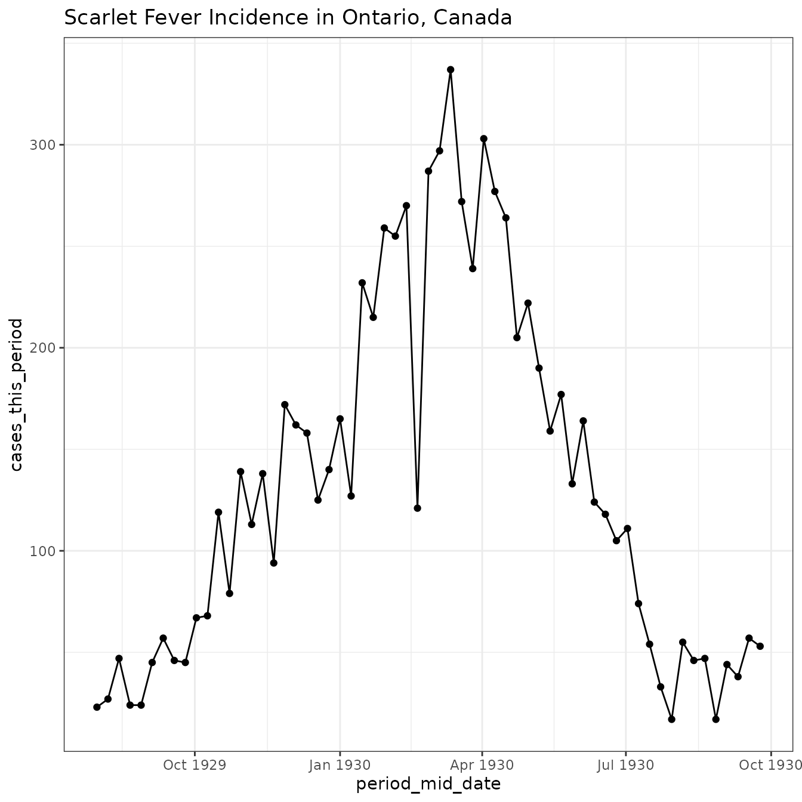

## SIR Model

We will begin by pulling the simple sir model from the model library.

``` r
sir = mp_tmb_library("starter_models", "sir", package = "macpan2")
print(sir)
#> ---------------------
#> Default values:
#>  quantity value
#>      beta   0.2
#>     gamma   0.1
#>         N 100.0
#>         I   1.0
#>         R   0.0
#> ---------------------
#> 
#> ---------------------
#> Before the simulation loop (t = 0):
#> ---------------------
#> 1: S ~ N - I - R
#> 
#> ---------------------
#> At every iteration of the simulation loop (t = 1 to T):
#> ---------------------
#> 1: mp_per_capita_flow(from = "S", to = "I", rate = "beta * I / N", 
#>      flow_name = "infection")
#> 2: mp_per_capita_flow(from = "I", to = "R", rate = "gamma", flow_name = "recovery")
```

## Modify Model for Reality

Once we take any library model off the shelf we need to modify it a bit
to be more realistic. We do this with the
[`mp_tmb_insert()`](https://canmod.github.io/macpan2/reference/mp_tmb_insert.md)
function, which inserts new default values and model expressions.

We first change the population size to the population of Ontario at the
time.

``` r
ontario_population = api_hook$filter(
    resource_type = "Compilation"
  , dataset_ids = "canmod-pop-normalized"
  , iso_3166_2 = "CA-ON"  ## get ontario data
  
  # get data between 1929-08-01 and 1930-10-01
  , date = "1929-08-01..1930-10-01"
)
sf_sir = mp_tmb_insert(sir
  , default = list(N = median(ontario_population$population))
)
```

Second, our SIR model assumes that all of the cases are recorded in the
data, but this is not realistic. We therefore modify the model to
include under-reporting, by creating a case `reports` variable that is
given by the product of incidence (i.e. weekly `infection` rate) and a
reporting probability.

``` r
sf_sir = mp_tmb_insert(sf_sir
    ## insert this expression ...
  , expressions = list(reports ~ infection * report_prob)
    
    ## at the end (i.e. Infinity) of the expressions evaluated
    ## 'during' each iteration of the simulation loop ...
  , at = Inf
  , phase = "during"
  
    ## add a new default value for the reporting probability
  , default = list(report_prob = 1/300)
)
```

Here we can print out the modified model to see if our changes were made
successfully.

``` r
print(sf_sir)
#> ---------------------
#> Default values:
#>     quantity        value
#>         beta 2.000000e-01
#>        gamma 1.000000e-01
#>            N 3.393512e+06
#>            I 1.000000e+00
#>            R 0.000000e+00
#>  report_prob 3.333333e-03
#> ---------------------
#> 
#> ---------------------
#> Before the simulation loop (t = 0):
#> ---------------------
#> 1: S ~ N - I - R
#> 
#> ---------------------
#> At every iteration of the simulation loop (t = 1 to T):
#> ---------------------
#> 1: mp_per_capita_flow(from = "S", to = "I", rate = "beta * I / N", 
#>      flow_name = "infection")
#> 2: mp_per_capita_flow(from = "I", to = "R", rate = "gamma", flow_name = "recovery")
#> 3: reports ~ infection * report_prob
```

## Preparing the Data

The first step in preparing data for `macpan2` is to simulate from the
model that you are considering. Here we simulate the `"reports"`
variable because it corresponds to the reported incidence (the number of
new cases per time-step, which in our case is one week, multiplied by a
reporting probability).

``` r
sir_simulator = mp_simulator(sf_sir
  , time_steps = 5
  , outputs = "reports"
)
head(mp_trajectory(sir_simulator))
#>    matrix time row col        value
#> 1 reports    1   0   0 0.0006666665
#> 2 reports    2   0   0 0.0007333330
#> 3 reports    3   0   0 0.0008066662
#> 4 reports    4   0   0 0.0008873327
#> 5 reports    5   0   0 0.0009760658
```

The next step is to get our data into a format that is compatible with
the format of these simulations. In particular, we need `matrix`,
`time`, and `value` columns. We can omit the `row` and `col` columns,
because all of the ‘matrices’ in the model are 1-by-1 scalars.

``` r
observed_data = (scarlet_fever_ontario
  ## select the variables to be modelled -- a time-series of case reports.
  |> select(period_end_date, cases_this_period)
  
  ## change the column headings so that they match the columns
  ## in the simulated trajectories.
  |> mutate(matrix = "reports")
  |> rename(value = cases_this_period)
  
  ## create a `time` column with the time-step IDs that will correspond
  ## to the time-steps in the simulation. this column heading also 
  ## must match the column with the time-steps in the simulated trajectories
  |> mutate(time = seq_along(period_end_date))
)
print(head(observed_data))
#> # A tibble: 6 × 4
#>   period_end_date value matrix   time
#>   <date>          <dbl> <chr>   <int>
#> 1 1929-08-03         23 reports     1
#> 2 1929-08-10         27 reports     2
#> 3 1929-08-17         47 reports     3
#> 4 1929-08-24         24 reports     4
#> 5 1929-08-31         24 reports     5
#> 6 1929-09-07         45 reports     6
```

## Set up the Optimizer

Now we can create an object that can be calibrated.

``` r
sir_cal = mp_tmb_calibrator(
    spec = sf_sir
  , data = observed_data
  
  ## name the trajectory variable, with a name that
  ## is the same in both the spec and the data
  , traj = "reports"  
  
  ## fit the following parameters
  , par = c("beta", "gamma", "I", "report_prob")
)
```

Here we assert that we will fit `beta`, `gamma`, (the initial value of)
`I`, and `report_prob`. Note that we can only choose to fit parameters
in the `default` list of the model spec. In particular, `I` is in the
default list because the model requires the initial number of infectious
individuals, whereas `S` is not because it is derived before the
simulation loop as `S ~ N - I - R`.

``` r
print(sf_sir)
#> ---------------------
#> Default values:
#>     quantity        value
#>         beta 2.000000e-01
#>        gamma 1.000000e-01
#>            N 3.393512e+06
#>            I 1.000000e+00
#>            R 0.000000e+00
#>  report_prob 3.333333e-03
#> ---------------------
#> 
#> ---------------------
#> Before the simulation loop (t = 0):
#> ---------------------
#> 1: S ~ N - I - R
#> 
#> ---------------------
#> At every iteration of the simulation loop (t = 1 to T):
#> ---------------------
#> 1: mp_per_capita_flow(from = "S", to = "I", rate = "beta * I / N", 
#>      flow_name = "infection")
#> 2: mp_per_capita_flow(from = "I", to = "R", rate = "gamma", flow_name = "recovery")
#> 3: reports ~ infection * report_prob
```

## Run the Optimization

``` r
sir_opt = mp_optimize(sir_cal)
#> Warning in (function (start, objective, gradient = NULL, hessian = NULL, :
#> NA/NaN function evaluation
```

Not off to a good start. Those warnings are not necessarily bad, but
they might get us thinking.

## Examine the fit

``` r
print(sir_opt)
#> $par
#>     params     params     params     params 
#> 38.6470435 38.5312885  1.6654262  0.3868803 
#> 
#> $objective
#> [1] 428.1935
#> 
#> $convergence
#> [1] 1
#> 
#> $iterations
#> [1] 150
#> 
#> $evaluations
#> function gradient 
#>      175      151 
#> 
#> $message
#> [1] "iteration limit reached without convergence (10)"
```

OK, things are not great. The `convergence` code is `1`, indicating that
the model did *not* converge (`convergence == 0` is good). Examining the
parameter estimates, which are stored internally in the calibrator
object, things get worse.

``` r
mp_tmb_coef(sir_cal, conf.int = TRUE)
#>       term         mat row col     default  type   estimate  std.error
#> 1   params        beta   0   0 0.200000000 fixed 38.6470435 37.7100764
#> 2 params.1       gamma   0   0 0.100000000 fixed 38.5312885 37.7102509
#> 3 params.2           I   0   0 1.000000000 fixed  1.6654262  3.2477065
#> 4 params.3 report_prob   0   0 0.003333333 fixed  0.3868803  0.3775919
#>      conf.low  conf.high
#> 1 -35.2633481 112.557435
#> 2 -35.3794450 112.442022
#> 3  -4.6999616   8.030814
#> 4  -0.3531862   1.126947
```

That doesn’t look right! Those are very high `beta` and `gamma` values,
and the confidence intervals are enormous and overlap zero.

But the model fit doesn’t look all that bad.

``` r
fitted_data = mp_trajectory_sd(sir_cal, conf.int = TRUE)
(observed_data
  |> ggplot()
  + geom_point(aes(time, value))
  + geom_line(aes(time, value)
    , data = fitted_data
  )
  + geom_ribbon(aes(time, ymin = conf.low, ymax = conf.high)
    , data = fitted_data
    , alpha = 0.2
    , colour = "red"
  )
  + theme_bw()
  + facet_wrap(~matrix, ncol = 1, scales = "free")
)
```

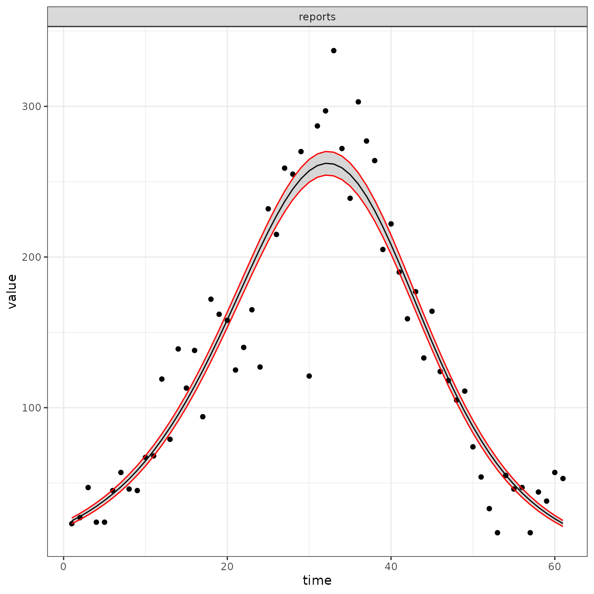

What is going on? Can we modify this model and/or fitting procedure to
get both reasonable parameter estimates and a reasonable trajectory?

## Fixing the Optimization Problem

One way to address the lack of convergence of the optimizer is to assess
the degree to which the parameter estimates are biologically reasonable.
Take the recovery rate, which is estimated as `gamma ~ 26.5` per
time-step. Given that a time-step is one week in this model, this
estimate implies that individuals recover from scarlet fever in `1/26.5`
weeks – much less than a day. A quick search suggests to me that this
recovery rate is not reasonable for scarlet fever, and that a rough
guess that the infectious stage lasts one week is much more plausible
than `1/26.5` weeks. Now look at the transmission rate, `beta`. It is
also estimated to be pretty large, but what is more interesting is the
large standard errors for both `beta` and `gamma`. These standard errors
suggest that the estimates are not precise. However, the estimated
correlation between `beta` and `gamma` is very close to `1`, suggesting
that many values for these parameters would fit the data well as long as
they are both of similar magnitude.

``` r
mp_tmb_fixef_cov(sir_cal) |> cov2cor()
#>                   beta      gamma          I report_prob
#> beta         1.0000000  1.0000000 -0.9999174   0.9998194
#> gamma        1.0000000  1.0000000 -0.9999170   0.9998201
#> I           -0.9999174 -0.9999170  1.0000000  -0.9995983
#> report_prob  0.9998194  0.9998201 -0.9995983   1.0000000
```

This diagnosis suggests that the data are not sufficiently informative
to identify values for both `beta` and `gamma`. Resolving such
identifiability issues is often best done by introducing prior
information, such as our rough guess that `gamma` is close to `1`. The
simplest way to include such prior information is to move `gamma` out of
the `pars` argument to `mp_tmb_calibrator` and into the `default`
argument, as below.

``` r
sir_cal_assume_gamma = mp_tmb_calibrator(
    spec = sf_sir
  , data = observed_data
  
  ## name the trajectory variable, with a name that
  ## is the same in both the spec and the data
  , traj = "reports"  
  
  ## fit the following parameters
  , par = c("beta", "I", "report_prob")
  , default = list(gamma = 1)
)
```

This calibration specification does not try to jointly fit both `beta`
and `gamma`, but rather fits only `beta` while assuming that
`gamma = 1`.

``` r
sir_opt_assume_gamma = mp_optimize(sir_cal_assume_gamma)
#> Warning in (function (start, objective, gradient = NULL, hessian = NULL, :
#> NA/NaN function evaluation
print(sir_opt_assume_gamma)
#> $par
#>       params       params       params 
#> 1.121602e+00 1.878305e+03 1.125689e-02 
#> 
#> $objective
#> [1] 430.0021
#> 
#> $convergence
#> [1] 0
#> 
#> $iterations
#> [1] 77
#> 
#> $evaluations
#> function gradient 
#>      121       78 
#> 
#> $message
#> [1] "relative convergence (4)"
```

More warnings, but now the optimizer converges. And the standard errors
in the coefficient table and fixed effect correlations seem more
plausible.

``` r
mp_tmb_coef(sir_cal_assume_gamma)
#>       term         mat row col     default  type     estimate    std.error
#> 1   params        beta   0   0 0.200000000 fixed 1.121602e+00 1.801964e-03
#> 2 params.1           I   0   0 1.000000000 fixed 1.878305e+03 5.445606e+01
#> 3 params.2 report_prob   0   0 0.003333333 fixed 1.125689e-02 1.927763e-04
mp_tmb_fixef_cov(sir_cal_assume_gamma) |> cov2cor()
#>                   beta          I report_prob
#> beta         1.0000000 -0.7988821  -0.7608921
#> I           -0.7988821  1.0000000   0.5802420
#> report_prob -0.7608921  0.5802420   1.0000000
```

And the fit looks similar to the four-parameter model, which is
consistent with our diagnosis of non-identifiability.

``` r
fitted_data = mp_trajectory_sd(sir_cal_assume_gamma, conf.int = TRUE)
(observed_data
  |> ggplot()
  + geom_point(aes(time, value))
  + geom_line(aes(time, value)
    , data = fitted_data
  )
  + geom_ribbon(aes(time, ymin = conf.low, ymax = conf.high)
    , data = fitted_data
    , alpha = 0.2
    , colour = "red"
  )
  + theme_bw()
  + facet_wrap(~matrix, ncol = 1, scales = "free")
)
```

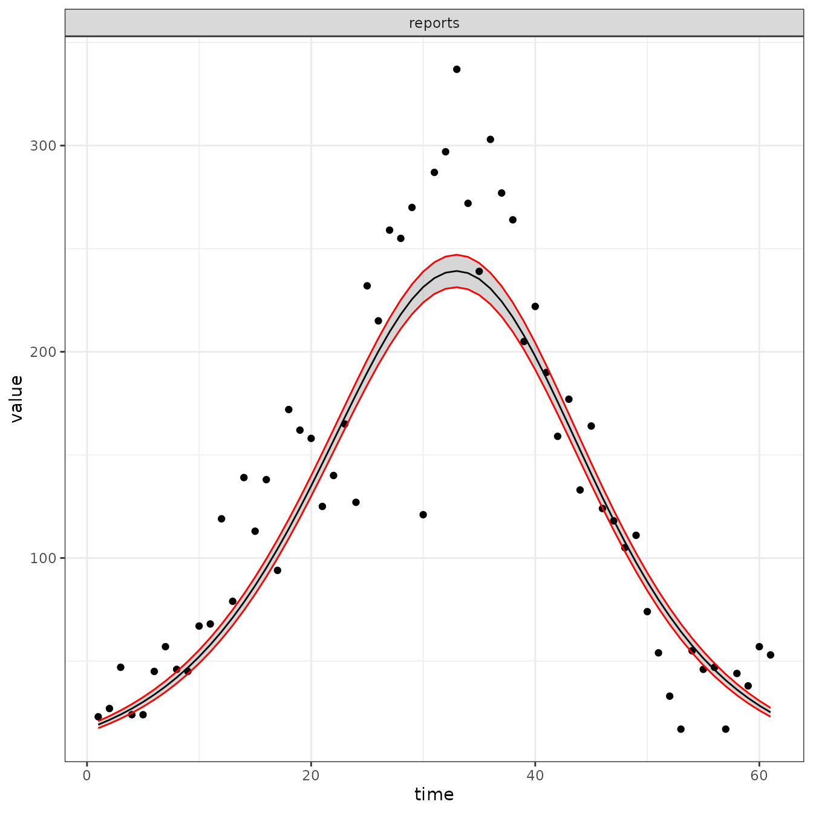

Caution: Here we use prior information to assume a reasonable value of
`gamma = 1`, but ignore prior uncertainty. This can cause underestimates
of uncertainty in other parameters that are fitted (see ([Elderd, Dukic,
and Dwyer 2006](#ref-elderdUncertainty2006))). It is better to use a
[prior
distribution](https://canmod.github.io/macpan2/articles/likelihood_prior_specs.html).

## Learning the Functional form of Time Variation in Transmission (New!)

Let’s get a bit more data to see two seasons.

``` r
scarlet_fever_ontario = api_hook$filter(
    resource_type = "Compilation"
  , dataset_ids = "canmod-cdi-harmonized"
  , iso_3166_2 = "CA-ON"  ## get ontario data
  , time_scale = "wk"  ## weekly incidence data only 
  , disease = "scarlet-fever"
  
  # get data between 1929-08-01 and 1931-10-01
  , period_end_date = "1929-08-01..1931-10-01"  
)
(scarlet_fever_ontario
  |> ggplot(aes(period_end_date, cases_this_period))
  + geom_line() + geom_point()
  + ggtitle("Scarlet Fever Incidence in Ontario, Canada")
  + theme_bw()
)
```

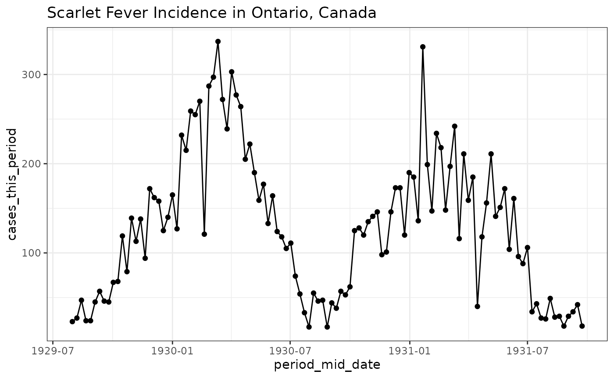

``` r
observed_data = (scarlet_fever_ontario
  ## select the variables to be modelled -- a time-series of case reports.
  |> select(period_end_date, cases_this_period)
  
  ## change the column headings so that they match the columns
  ## in the simulated trajectories.
  |> mutate(matrix = "reports")
  |> rename(value = cases_this_period)
  
  ## create a `time` column with the time-step IDs that will correspond
  ## to the time-steps in the simulation. this column heading also 
  ## must match the column with the time-steps in the simulated trajectories
  |> mutate(time = seq_along(period_end_date))
)
print(head(observed_data))
#> # A tibble: 6 × 4
#>   period_end_date value matrix   time
#>   <date>          <dbl> <chr>   <int>
#> 1 1929-08-03         23 reports     1
#> 2 1929-08-10         27 reports     2
#> 3 1929-08-17         47 reports     3
#> 4 1929-08-24         24 reports     4
#> 5 1929-08-31         24 reports     5
#> 6 1929-09-07         45 reports     6
```

Prepare to fit to the data. We make a function so that we can easily
update the dimension of the radial basis.

``` r
make_rbf_calibrator = function(dimension) {
  mp_tmb_calibrator(
      spec = sf_sir
    , data = observed_data
    , traj = "reports"  
    
    ## -----------------------------
    ## this is the key bit
    , tv = mp_rbf("beta", dimension)
    ## -----------------------------
    
    , par = list(
        gamma = mp_unif()
      , I = mp_unif()
      , report_prob = mp_unif()
    )
  )
}
```

And it is also convenient to make a function for plotting the results

``` r
plot_fit = function(cal_object) {
  fitted_data = mp_trajectory_sd(cal_object, conf.int = TRUE)
  (observed_data
    |> ggplot()
    + geom_point(aes(time, value))
    + geom_line(aes(time, value)
      , data = fitted_data
      , colour = "red"
    )
    + geom_ribbon(aes(time, ymin = conf.low, ymax = conf.high)
      , data = fitted_data
      , alpha = 0.2
      , colour = "red"
    )
    + theme_bw()
  )
}
```

Now we try fitting for a number of different dimensions.

``` r
sir_cal = make_rbf_calibrator(dimension = 1)
mp_optimize(sir_cal)
#> $par
#>       params       params       params       params       params 
#>   1.06264694 436.33391327   0.18347249   0.08100868   0.86580386 
#> 
#> $objective
#> [1] 2896.6
#> 
#> $convergence
#> [1] 1
#> 
#> $iterations
#> [1] 150
#> 
#> $evaluations
#> function gradient 
#>      168      151 
#> 
#> $message
#> [1] "iteration limit reached without convergence (10)"
plot_fit(sir_cal)
```

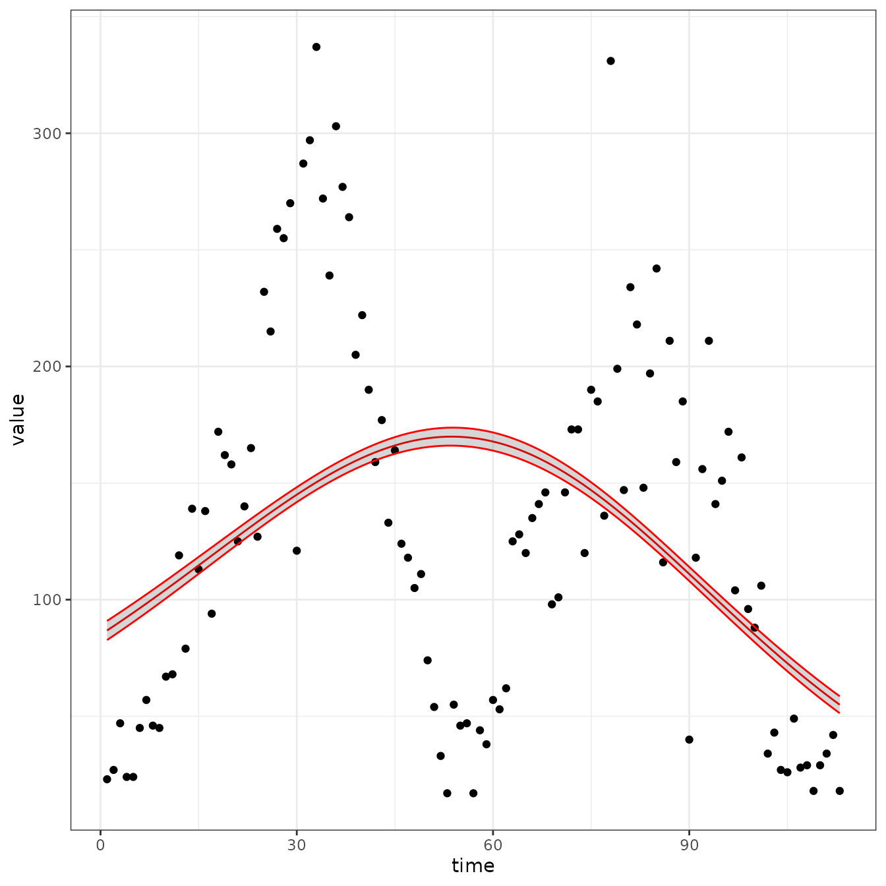

``` r
sir_cal = make_rbf_calibrator(dimension = 2)
mp_optimize(sir_cal)
#> Warning in (function (start, objective, gradient = NULL, hessian = NULL, :
#> NA/NaN function evaluation
#> $par
#>     params     params     params     params     params     params 
#>  0.4433526 15.1322613  9.1639060 -0.6003322 -0.7456381  0.6673706 
#> 
#> $objective
#> [1] 2978.346
#> 
#> $convergence
#> [1] 1
#> 
#> $iterations
#> [1] 147
#> 
#> $evaluations
#> function gradient 
#>      200      147 
#> 
#> $message
#> [1] "function evaluation limit reached without convergence (9)"
plot_fit(sir_cal)
```

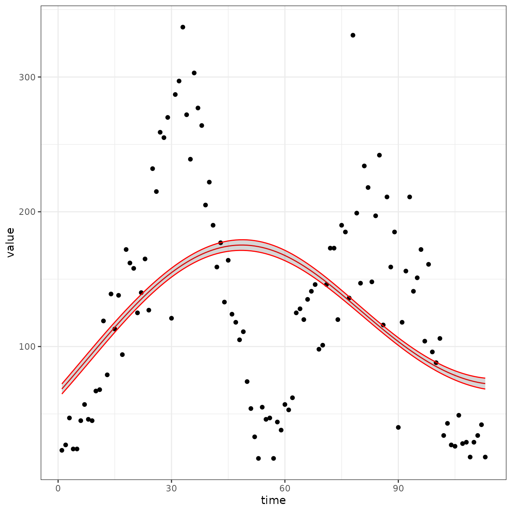

``` r
sir_cal = make_rbf_calibrator(dimension = 3)
mp_optimize(sir_cal)
#> Warning in (function (start, objective, gradient = NULL, hessian = NULL, :
#> NA/NaN function evaluation
#> Warning in (function (start, objective, gradient = NULL, hessian = NULL, :
#> NA/NaN function evaluation
#> $par
#>        params        params        params        params        params 
#>  7.480423e-01  7.126562e+03  5.678344e-03 -1.637587e-01 -2.970186e-02 
#>        params        params 
#>  9.244461e-01  6.246204e-01 
#> 
#> $objective
#> [1] 1574.227
#> 
#> $convergence
#> [1] 0
#> 
#> $iterations
#> [1] 67
#> 
#> $evaluations
#> function gradient 
#>       98       68 
#> 
#> $message
#> [1] "relative convergence (4)"
plot_fit(sir_cal)
```

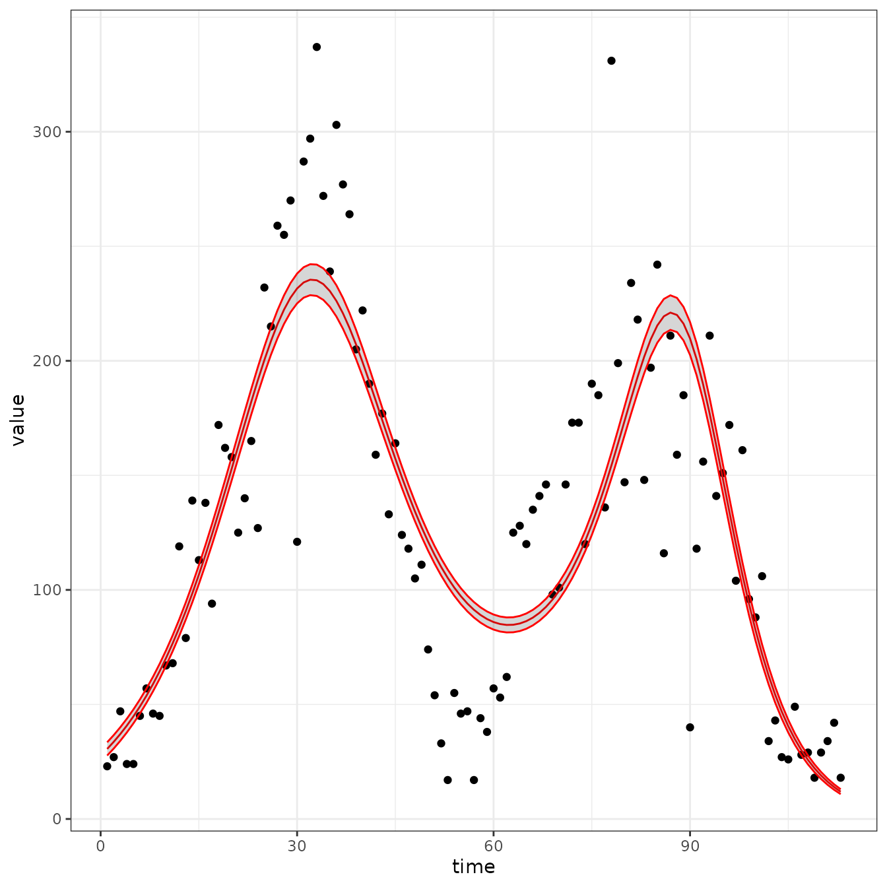

``` r
sir_cal = make_rbf_calibrator(dimension = 4)
mp_optimize(sir_cal)
#> Warning in (function (start, objective, gradient = NULL, hessian = NULL, :
#> NA/NaN function evaluation
#> Warning in (function (start, objective, gradient = NULL, hessian = NULL, :
#> NA/NaN function evaluation
#> $par
#>     params     params     params     params     params     params     params 
#>  1.2466063 61.9900614  0.1595416  0.4059529 -0.1147400  0.3394152 -0.0741463 
#>     params 
#>  0.6104034 
#> 
#> $objective
#> [1] 1601.521
#> 
#> $convergence
#> [1] 1
#> 
#> $iterations
#> [1] 128
#> 
#> $evaluations
#> function gradient 
#>      200      129 
#> 
#> $message
#> [1] "function evaluation limit reached without convergence (9)"
plot_fit(sir_cal)
#> Warning in sqrt(as.numeric(unlist(tmp))): NaNs produced
#> Warning: Removed 8 rows containing missing values or values outside the scale range
#> (`geom_ribbon()`).
```

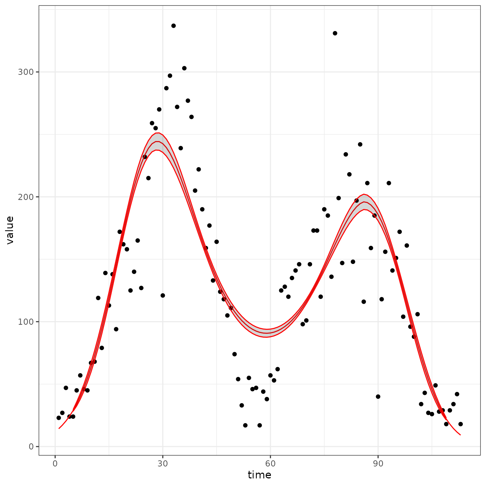

``` r
sir_cal = make_rbf_calibrator(dimension = 5)
mp_optimize(sir_cal)
#> $par
#>       params       params       params       params       params       params 
#> -0.003092847 50.417568440 33.763662823 -4.564431830  1.942307684 -6.206699276 
#>       params       params       params 
#>  1.780538691 -7.036314207  0.596297469 
#> 
#> $objective
#> [1] 1433.844
#> 
#> $convergence
#> [1] 1
#> 
#> $iterations
#> [1] 120
#> 
#> $evaluations
#> function gradient 
#>      200      120 
#> 
#> $message
#> [1] "function evaluation limit reached without convergence (9)"
plot_fit(sir_cal)
```

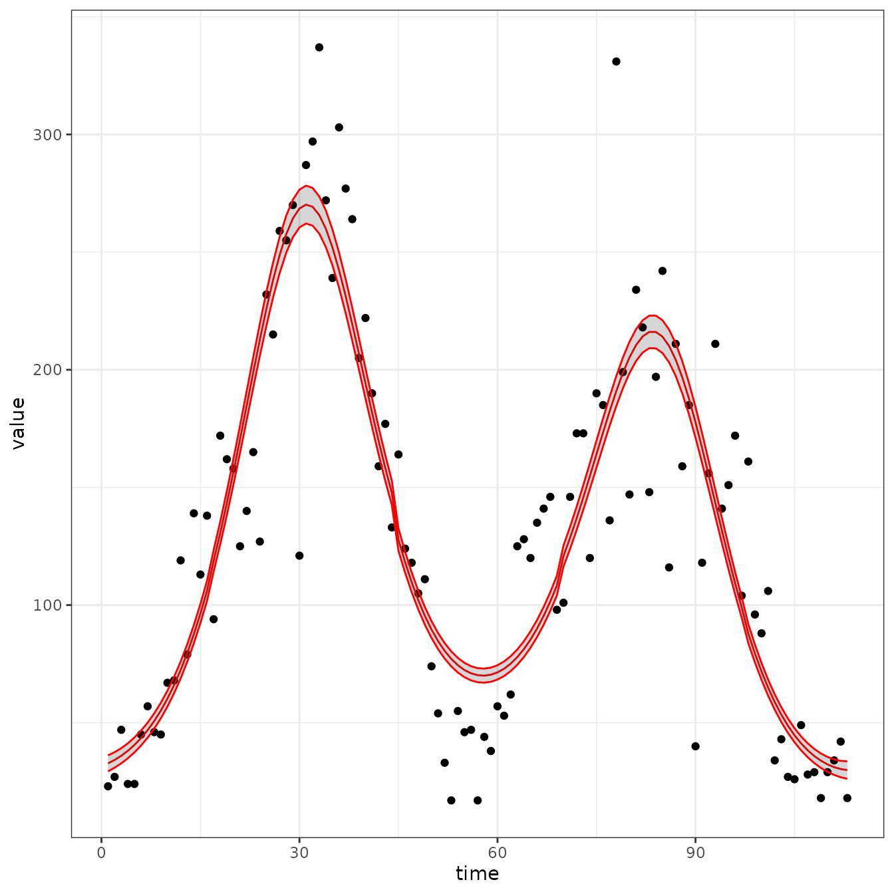

``` r
sir_cal = make_rbf_calibrator(dimension = 6)
mp_optimize(sir_cal)
#> Warning in (function (start, objective, gradient = NULL, hessian = NULL, :
#> NA/NaN function evaluation
#> $par
#>     params     params     params     params     params     params     params 
#>  0.7868422  7.8545145  5.0384023 -0.2687894  0.2564067 -0.5855425  0.3094323 
#>     params     params     params 
#> -0.3683463 -0.1327255  0.5863554 
#> 
#> $objective
#> [1] 1441.326
#> 
#> $convergence
#> [1] 1
#> 
#> $iterations
#> [1] 127
#> 
#> $evaluations
#> function gradient 
#>      200      127 
#> 
#> $message
#> [1] "function evaluation limit reached without convergence (9)"
plot_fit(sir_cal)
```

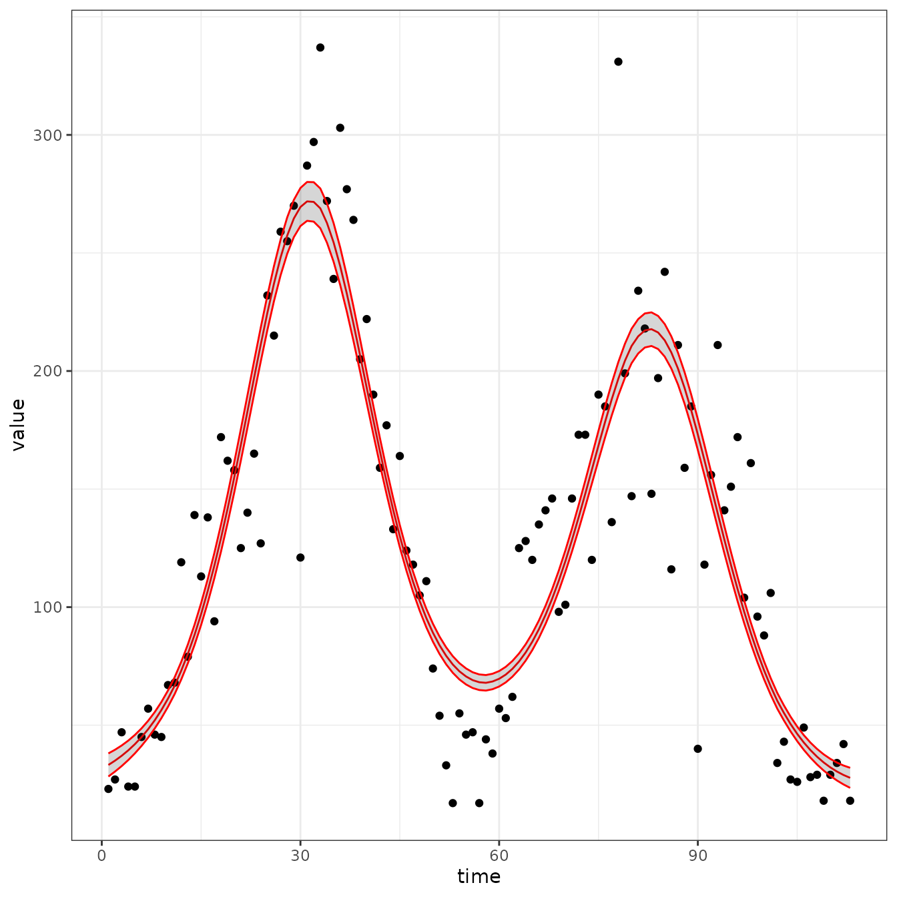

``` r
sir_cal = make_rbf_calibrator(dimension = 7)
mp_optimize(sir_cal)
#> $par
#>      params      params      params      params      params      params 
#>  0.02862237 13.99612692  6.43161701 -0.64364670 -1.38502721 -0.17206594 
#>      params      params      params      params      params 
#> -3.83455120 -0.06295877 -1.56407222 -3.70587604  0.58017538 
#> 
#> $objective
#> [1] 1471.266
#> 
#> $convergence
#> [1] 1
#> 
#> $iterations
#> [1] 117
#> 
#> $evaluations
#> function gradient 
#>      200      117 
#> 
#> $message
#> [1] "function evaluation limit reached without convergence (9)"
plot_fit(sir_cal)
```

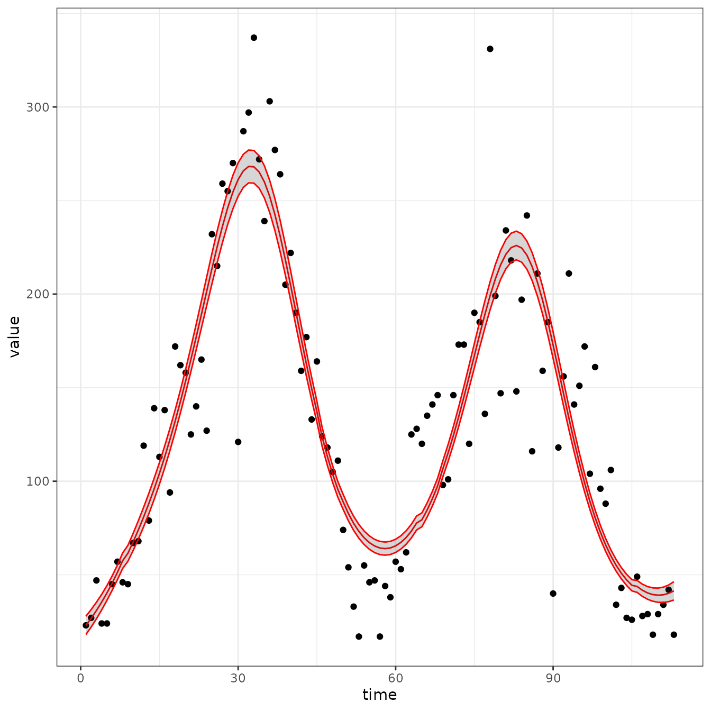

Interestingly we have now managed to fit `gamma`

``` r
mp_tmb_coef(sir_cal)
#>         term           mat row col     default  type    estimate    std.error
#> 1     params         gamma   0   0 0.100000000 fixed  0.02862237  0.006525211
#> 2   params.1             I   0   0 1.000000000 fixed 13.99612692 18.179726520
#> 3  params.10 prior_sd_beta   0   0 1.000000000 fixed  0.58017538  0.018255583
#> 4   params.2   report_prob   0   0 0.003333333 fixed  6.43161701  8.357926297
#> 5   params.3 time_var_beta   0   0 0.000000000 fixed -0.64364670  0.183439360
#> 6   params.4 time_var_beta   1   0 0.000000000 fixed -1.38502721  0.149594802
#> 7   params.5 time_var_beta   2   0 0.000000000 fixed -0.17206594  0.118303083
#> 8   params.6 time_var_beta   3   0 0.000000000 fixed -3.83455120  0.138042922
#> 9   params.7 time_var_beta   4   0 0.000000000 fixed -0.06295877  0.166116176
#> 10  params.8 time_var_beta   5   0 0.000000000 fixed -1.56407222  0.105245865
#> 11  params.9 time_var_beta   6   0 0.000000000 fixed -3.70587604  0.244875312
```

This is a much slower recovery rate. Expected time in the R box is about
one year! Not believeable, but the point is to make it easier to fit
models so you can try more things.

``` r
mp_tmb_calibrator(
    spec = sf_sir
  , data = observed_data
  , traj = "reports"  
  , tv = mp_rbf("beta", dimension = 7)
  , par = c("gamma", "I", "report_prob")
  , outputs = c("reports", "beta")
)
#> ---------------------
#> Before the simulation loop (t = 0):
#> ---------------------
#> 1: S ~ N - I - R
#> 2: outputs_var_beta ~ group_sums(values_var_beta * time_var_beta[col_indexes_beta], row_indexes_beta, outputs_var_beta)
#> 3: outputs_var_beta ~ c(outputs_var_beta[0], outputs_var_beta)
#> 
#> ---------------------
#> At every iteration of the simulation loop (t = 1 to T):
#> ---------------------
#> 1: beta ~ exp(time_var(outputs_var_beta, data_time_indexes_beta))
#> 2: infection ~ S * (beta * I/N)
#> 3: recovery ~ I * (gamma)
#> 4: S ~ S - infection
#> 5: I ~ I + infection - recovery
#> 6: R ~ R + recovery
#> 7: reports ~ infection * report_prob
#> 
#> ---------------------
#> After the simulation loop (t = T + 1):
#> ---------------------
#> 1: sim_reports ~ rbind_time(reports, obs_times_reports)
#> 
#> ---------------------
#> Objective function:
#> ---------------------
#> ~-sum(dpois(obs_reports, clamp(sim_reports))) - sum(dnorm(values_var_beta, 0, prior_sd_beta))
```

## References

Elderd, Bret D., Vanja M. Dukic, and Greg Dwyer. 2006. “Uncertainty in
Predictions of Disease Spread and Public Health Responses to
Bioterrorism and Emerging Diseases.” *Proceedings of the National
Academy of Sciences* 103 (42): 15693–97.
<https://doi.org/10.1073/pnas.0600816103>.
