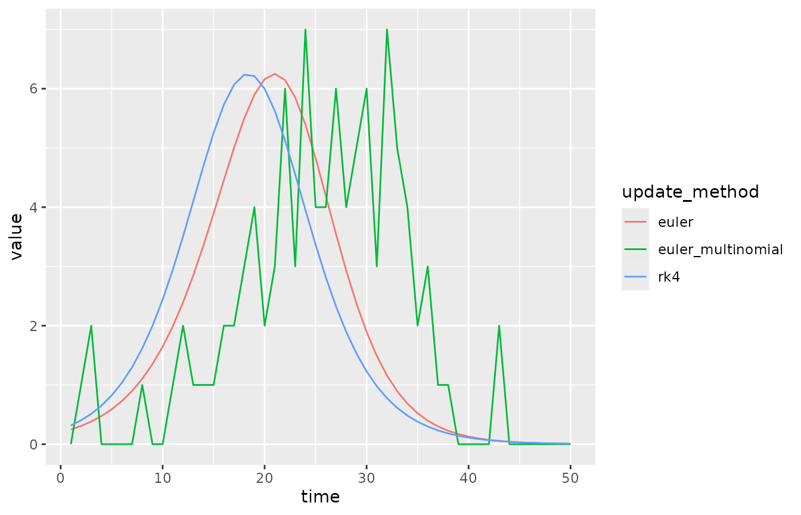
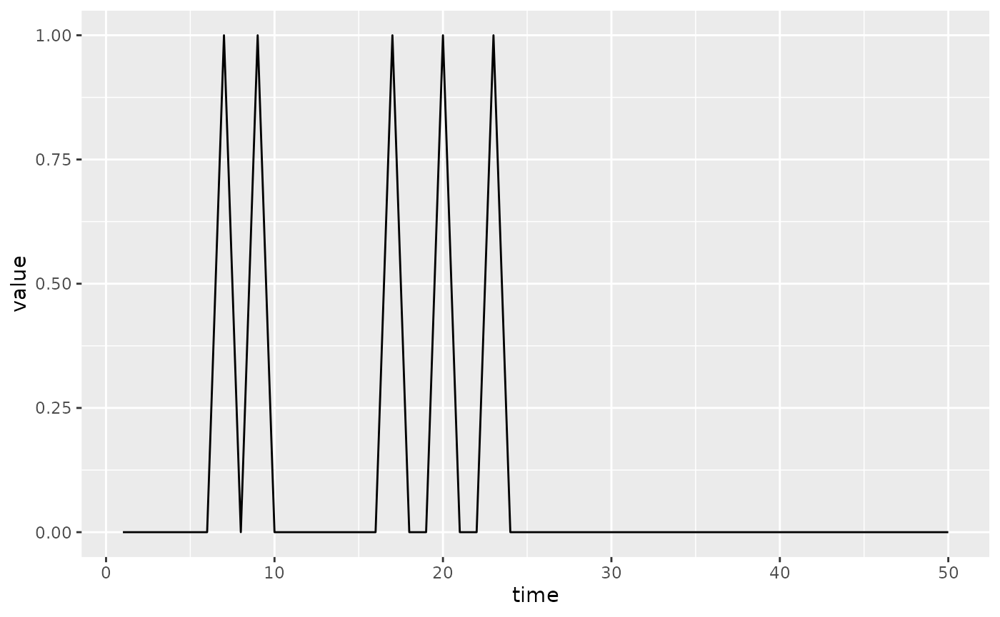

# ODE Solvers, Process Error, and Difference Equations

[](https://canmod.github.io/macpan2/articles/vignette-status#working-draft)

The `McMasterPandemic` project has focused on using discrete time
difference equations to solve the dynamical system. Here we describe
experimental features that allow one to update the data differently. In
particular, it is now possible to use a Runge-Kutta 4 ODE solver (to
approximate the solution to the continuous time analogue) as well as the
Euler Multinomial distribution to generate process error. These features
have in principle been available for most of the life of `macpan2`, but
only recently have they been given a more convenient interface.

In order to use this interface, models must be rewritten using explicit
declarations of state updates. By explicitly declaring what expressions
correspond to state updates, `macpan2` is able to modify the method of
updating without further user input. This makes it easier to compare
difference equations (i.e. Euler steps), ODEs (i.e. Runge-Kutta), and
process error (i.e. Euler Multinomial) runs for the same underlying
dynamical model.

To declare a state update one replaces formulas in the `during` argument
of a model spec to include calls to the
[`mp_per_capita_flow()`](https://canmod.github.io/macpan2/reference/mp_per_capita_flow.md)
function. As an example we will modify the SI model to include explicit
state updates. The original form of the model looks like this.

``` r
library(macpan2)
si_implicit = mp_tmb_model_spec(
    before = list(S ~ N - I)
  , during = list(
        infection ~ beta * S * I / N
      , S ~ S - infection
      , I ~ I + infection
    )
  , default = list(I = 1, N = 100, beta = 0.25)
)
print(si_implicit)
#> ---------------------
#> Default values:
#>  quantity  value
#>         I   1.00
#>         N 100.00
#>      beta   0.25
#> ---------------------
#> 
#> ---------------------
#> Before the simulation loop (t = 0):
#> ---------------------
#> 1: S ~ N - I
#> 
#> ---------------------
#> At every iteration of the simulation loop (t = 1 to T):
#> ---------------------
#> 1: infection ~ beta * S * I/N
#> 2: S ~ S - infection
#> 3: I ~ I + infection
```

The modified version looks like this.

``` r
si_explicit = mp_tmb_model_spec(
    before = list(S ~ N - I)
  , during = list(mp_per_capita_flow("S", "I", infection ~ beta * I / N))
  , default = list(I = 1, N = 100, beta = 0.25)
)
print(si_explicit)
#> ---------------------
#> Default values:
#>  quantity  value
#>         I   1.00
#>         N 100.00
#>      beta   0.25
#> ---------------------
#> 
#> ---------------------
#> Before the simulation loop (t = 0):
#> ---------------------
#> 1: S ~ N - I
#> 
#> ---------------------
#> At every iteration of the simulation loop (t = 1 to T):
#> ---------------------
#> 1: mp_per_capita_flow(from = "S", to = "I", rate = infection ~ beta * 
#>      I/N)
```

With this explicit spec we can make three different simulators.

``` r
si_euler = (si_explicit 
  |> mp_euler()
  |> mp_simulator(time_steps = 50, outputs = "infection")
)
si_rk4 = (si_explicit 
  |> mp_rk4()
  |> mp_simulator(time_steps = 50, outputs = "infection")
)
si_euler_multinomial = (si_explicit 
  |> mp_euler_multinomial()
  |> mp_simulator(time_steps = 50, outputs = "infection")
)
```

``` r
library(dplyr)
#> 
#> Attaching package: 'dplyr'
#> The following object is masked from 'package:macpan2':
#> 
#>     all_equal
#> The following objects are masked from 'package:stats':
#> 
#>     filter, lag
#> The following objects are masked from 'package:base':
#> 
#>     intersect, setdiff, setequal, union
trajectory_comparison = list(
    euler = mp_trajectory(si_euler)
  , rk4 = mp_trajectory(si_rk4)
  , euler_multinomial = mp_trajectory(si_euler_multinomial)
) |> bind_rows(.id = "update_method")
print(head(trajectory_comparison))
#>   update_method    matrix time row col     value
#> 1         euler infection    1   0   0 0.2475000
#> 2         euler infection    2   0   0 0.3079844
#> 3         euler infection    3   0   0 0.3828223
#> 4         euler infection    4   0   0 0.4751841
#> 5         euler infection    5   0   0 0.5888103
#> 6         euler infection    6   0   0 0.7280407
```

``` r
library(ggplot2)
(trajectory_comparison
  |> rename(`Time Step` = time, Incidence = value)
  |> ggplot()
  + geom_line(aes(`Time Step`, Incidence, colour = update_method))
)
```



The incidence trajectory is different for the three update methods, even
though the initial values of the state variables were identical in all
three cases.

``` r
mp_initial(si_euler)
#>   matrix row col  value
#> 1      N         100.00
#> 2      I           1.00
#> 3   beta           0.25
#> 4      S          99.00
mp_initial(si_euler_multinomial)
#>   matrix row col  value
#> 1      N         100.00
#> 2      I           1.00
#> 3   beta           0.25
#> 4      S          99.00
mp_initial(si_rk4)
#>   matrix row col  value
#> 1      N         100.00
#> 2      I           1.00
#> 3   beta           0.25
#> 4      S          99.00
```

The incidence is different, even during the first time step, because
each state update method causes different numbers of susceptible
individuals to become infectious at each time step. Further, incidence
here is defined for a single time step and so this number of new
infectious individuals is exactly the incidence.

## Branching Flows and Process Error

``` r
 siv = mp_tmb_model_spec(
    before = list(S ~ N - I - V)
  , during = list(
        mp_per_capita_flow("S", "I", infection ~ beta * I / N)
      , mp_per_capita_flow("S", "V", vaccination ~ rho)
    )
  , default = list(I = 1, V = 0, N = 100, beta = 0.25, rho = 0.1)
)
print(siv)
#> ---------------------
#> Default values:
#>  quantity  value
#>         I   1.00
#>         V   0.00
#>         N 100.00
#>      beta   0.25
#>       rho   0.10
#> ---------------------
#> 
#> ---------------------
#> Before the simulation loop (t = 0):
#> ---------------------
#> 1: S ~ N - I - V
#> 
#> ---------------------
#> At every iteration of the simulation loop (t = 1 to T):
#> ---------------------
#> 1: mp_per_capita_flow(from = "S", to = "I", rate = infection ~ beta * 
#>      I/N)
#> 2: mp_per_capita_flow(from = "S", to = "V", rate = vaccination ~ 
#>      rho)
```

``` r
(siv 
 |> mp_euler_multinomial()
 |> mp_simulator(50, "infection")
 |> mp_trajectory()
 |> ggplot()
  + geom_line(aes(time, value))
)
```



## Internal Design

``` r
sir = mp_tmb_model_spec(
  during = list(
      N ~ S + I + R
    , mp_per_capita_flow("S", "I", "beta * I / N", "infection")
    , mp_per_capita_flow("I", "R", "(1 - p) * gamma", "recovery")
    , mp_per_capita_flow("I", "D", "p * gamma", "death")
  )
)
```

### `ChangeComponent()` classes

Model specs contain a set of three lists: \* `before` : instructions to
run before the simulation loop begins. \* `during` : instructions to run
at each iteration of the simulation loop. \* `after` : instructions to
run after the simulation loop ends.

The simplest way to define these lists is using two-sided R formulas.
But in the `during` list one may specify different types of list
components, which are of class `ChangeComponent`. Internally, standard R
formulas are converted into an object of class `Formula`, which is the
simplest kind of `ChangeComponent`. Another important `ChangeComponent`
is the `PerCapitaFlow` type, which is used for standard flows from one
compartment to another.

The list of change components, which is just the `during` field but
ensuring that all elements are valid `ChangeComponent` objects, can be
obtained using the `change_components()` method in a model spec object.

``` r
cc = sir$change_components()
print(cc)
#> [[1]]
#> N ~ S + I + R
#> 
#> [[2]]
#> From: S
#> To: I
#> Per-capita rate expression: beta * I/N
#> Absolute rate symbol: infection
#> [[3]]
#> From: I
#> To: R
#> Per-capita rate expression: (1 - p) * gamma
#> Absolute rate symbol: recovery
#> [[4]]
#> From: I
#> To: D
#> Per-capita rate expression: p * gamma
#> Absolute rate symbol: death
```

All `ChangeComponent` objects must have the following methods.

#### The `change_frame()` method

Returns a data frame with two columns: \* `state` : state variable being
changed (i.e. updated at each step) \* `change` : signed absolute flow
rates (variables or expressions that don’t involve any state variables)

An example of this data frame for a flow from `S` to `I` is as follows.

``` r
cc[[2]]$change_frame()
#>   state     change
#> 1     S -infection
#> 2     I +infection
```

For a simple `Formula` change component this data frame is just an empty
two-column data frame with zero rows.

``` r
cc[[1]]$change_frame()
#> [1] state  change
#> <0 rows> (or 0-length row.names)
```

#### The `flow_frame()` method

Returns a data frame with three columns. \* `size` : variable (often a
state variable or function of state variables) that gives the size of
the population being drawn from in a flow (e.g. S is the size of an
infection flow). \* `change` : unsigned absolute flow rates. \* `rate` :
per-capita flow rates (variables or expresions that sometimes involve
state variables).

An example of this data frame for a flow from `S` to `I` is as follows.

``` r
cc[[2]]$flow_frame()
#>   size    change       rate         abs_rate
#> 1    S infection beta * I/N S * (beta * I/N)
```

For a simple `Formula` change component this data frame is just an empty
three-column data frame with zero rows.

``` r
cc[[1]]$flow_frame()
#> [1] size     change   rate     abs_rate
#> <0 rows> (or 0-length row.names)
```

### `ChangeModel()` classes

The `ChangeModel` objects combine the information in lists of
`ChangeComponent` objects, so that they specify a full model. It expands
the concept of `before`, `during`, and `after` into a more refined set
of steps. All of these methods return lists of two-sided formulas.

- `before_loop()` : The `before` list formulas.
- `once_start()` : Formulas to evaluate at the start of the `during`
  list, and which will not be repeated (or modified and repeated)
  throughout expansions of the `during` loop. An example of such an
  expansion is a Runge-Kutta differential equation solver that reuses
  expressions in an iterative manner. Formulas returned by
  `once_during()` are useful for specifying exogeneous changes (e.g.,
  time-varying parameters) that occur once per time-step but that should
  not change throughout the within-time-step iterations of a
  differential equation solver.
- `before_flows()` : Formulas to evaluate before the absolute flow rates
  are computed.
- `update_flows()` : Formulas that update the flows, using
  `flow_frame()` methods of individual `ChangeComponent` objects.
- `before_state()` : Formulas to evaluate before the state vector is
  updated.
- `update_state()` : Formulas that update the state vector, using
  `change_frame()` method s of individual `ChangeComponent` objects.
- `after_state()` : Formulas to evaluate after the state vector is
  updated.
- `once_end()` : Formulas to evaluate at the end of the `during` list,
  and which will not be repeated throughout (similar to `once_start()`).
- `after_loop()` : The `after` list formulas.

The `ChangeModel` objects also have `flow_frame()` and `change_frame()`
methods for combining the outputs of these methods within the individual
`ChangeComponent` objects. An example for an SIR model gives the
`flow_frame()` and `change_frame()` output as follows.

    state   change
    -----   ------
    S       -infection
    I       +infection
    I       -recovery
    R       +recovery

    size  change     rate
    ----  ------     ----
    S     infection  beta * I / N
    I     recovery   gamma

The `update_flows()` method The `update_state()` method makes use of
this `flow_frame()` to produce the

``` r
si = mp_tmb_library("starter_models", "sir", package = "macpan2")
si$change_model
#> Classes 'SimpleChangeModel', 'ChangeModelDefaults', 'ChangeModel', 'Base' <environment: 0x55e43cf9d8c8> 
#> after_loop : function ()  
#> after_state : function ()  
#> all_user_aware_names : function ()  
#> before_flows : function ()  
#> before_loop : function ()  
#> before_state : function ()  
#> change_classes : function ()  
#> change_frame : function ()  
#> check : function ()  
#> duplicated_change_names : function ()  
#> flow_frame : function ()  
#> no_change_components : function ()  
#> once_finish : function ()  
#> once_start : function ()  
#> other_generated_formulas : function ()  
#> update_flows : function ()  
#> update_state : function ()  
#> user_formulas : function ()
si$change_model$flow_frame()
#>   size    change       rate         abs_rate
#> 1    S infection beta * I/N S * (beta * I/N)
#> 2    I  recovery      gamma      I * (gamma)
si$change_model$change_frame()
#>   state     change
#> 1     S -infection
#> 2     I +infection
#> 3     I  -recovery
#> 4     R  +recovery
si$change_model$update_state()
#> [[1]]
#> S ~ -infection
#> <environment: 0x55e43d423980>
#> 
#> [[2]]
#> I ~ +infection - recovery
#> <environment: 0x55e43d423980>
#> 
#> [[3]]
#> R ~ +recovery
#> <environment: 0x55e43d423980>
si$change_model$update_flows()
#> $S
#> $S[[1]]
#> infection ~ beta * I/N
#> <environment: 0x55e43d4d7f60>
#> 
#> 
#> $I
#> $I[[1]]
#> recovery ~ gamma
#> <environment: 0x55e43d4d7f60>
```

``` r
spec = mp_tmb_model_spec(
  during = list(
      mp_per_capita_flow("A", "B", "a", "r")
    , mp_per_capita_flow("B", "C", "b", "rr")
  )
)
spec$change_model$update_flows()
#> $A
#> $A[[1]]
#> r ~ a
#> <environment: 0x55e43d952e00>
#> 
#> 
#> $B
#> $B[[1]]
#> rr ~ b
#> <environment: 0x55e43d952e00>
```

### `UpdateMethod()` classes

In order to define a state updater one must define a new `UpdateMethod`
class. These classes are required to update three methods that do not
take any arguments: `before`, `during`, and `after`. Each of these
methods are required to return a list of two-sided formulas giving the
expression list for the three phases of the simulation: before the
simulation loop, at every iteration of the simulation loop, and after
the simulation loop. Examples of `UpdateMethod` classes include:
`EulerUpdateMethod`, `RK4UpdateMethod`, `EulerMultinomialUpdateMethod`,
and `HazardUpdateMethod`.

The constructors of these `UpdateMethod` classes often have a field of
class `ChangeModel`, which specifies how to sort the components of

## Relationship to Ordinary Differential Equation Solvers

It is instructive to view these state update methods as approximate
solutions to ordinary differential equations (ODEs). We consider ODEs of
the following form.

$$\frac{dx_{i}}{dt} = \underset{\text{inflow}}{\underbrace{\sum\limits_{j}x_{j}r_{ji}}} - \underset{\text{outflow}}{\underbrace{\sum\limits_{j}x_{i}r_{ij}}}$$
Where the per-capita rate of flowing from compartment $i$ to compartment
$j$ is $r_{ij}$, and $x_{i}$ is the number of individuals in the $i$th
compartment. We allow each $r_{ij}$ to depend on any number of state
variables and time-varying parameters. For example, for an SIR model we
have $x_{S},x_{I},x_{R}$ (for readability we use $S,I,R$). In this case
$r_{SI} = \beta I/N$, $r_{IR} = \gamma$, and all other values of
$r_{ij}$ are zero. Here the force of infection, $r_{SI}$, depends on a
state variable $I$.

Although each state-update method presented below can be thought of as
an approximate solution to this ODE, they can also be thought of as
dynamical models in their own right. For example, the Euler-multinomial
model is a useful model of process error.

### Euler

The simplest approach is to just pretend that the ODEs are difference
equations. In this case, at each time-step, each state variable is
updated as follows.
$$x_{i} = x_{i} - \sum\limits_{j}x_{i}r_{ij} + \sum\limits_{j}x_{j}r_{ji}$$
The SIR example is as follows.

$$S = S - Sr_{SI}$$$$I = I - Ir_{IR} + Sr_{SI}$$$$R = R + Ir_{IR}$$

### Runge Kutta 4

TODO

### Euler-Multinomial

The
[Euler-multinomial](https://kingaa.github.io/manuals/pomp/html/eulermultinom.html)
state update method assumes that the number of individuals that move
from one box to another in a single time-step is a random non-negative
integer, coming from a particular multinomial distribution that we now
describe.

The probability of staying in the $i$th box through an entire time-step
is assumed to be the following (TODO: relate this to Poisson processes).

$$p_{ii} = \exp\left( - \sum\limits_{j}r_{ij} \right)$$

This probability assumes that the $r_{ij}$ are held constant throughout
the entire time-step, although they can change when each time-step
begins.

The probability of moving from box $i$ to box $j$ in one time-step is
given by the following.

$$p_{ij} = \left( 1 - p_{ii} \right)\frac{r_{ij}}{\sum\limits_{j}r_{ij}}$$

This probability is just the probability of not staying in box $i$,
which is $1 - p_{ii}$, and specifically going to box $j$, which is
assumed to be given by this expression $\frac{r_{ij}}{\sum_{j}r_{ij}}$.

Let $\rho_{ij}$ be the random number of individuals that move from box
$i$ to box $j$ in one time-step. The expected value of $\rho_{ij}$ is
$p_{ij}x_{i}$. However, these random variables are not independent
events, because the total number of individuals, $\sum_{i}x_{i}$, has to
remain constant through a single time-step (at least in the models that
we are currently considering).

To account for this non-independence, we collect the $\rho_{ij}$
associated with a from compartment $i$ into a vector $\rho_{i}$. We
collect similar vector of probabilities, $p_{i}$. Each $\rho_{i}$ is a
random draw from a multinomial distribution with $x_{i}$ trials and
probability vector, $p_{i}$.

Once these random draws have been made, the state variables can be
updated at each time-step as follows.

$$x_{i} = x_{i} - \sum\limits_{j}\rho_{ij} + \sum\limits_{j}\rho_{ji}$$

Note that we do not actually need to generate values for the diagonal
elements, $\rho_{ii}$, because they cancel out in this update equation.
We also can ignore any $\rho_{ij}$ such that $r_{ij} = 0$.

Under the SIR example we have a particularly simple Euler-binomial
distribution because there are no branching flows – when individuals
leave S they can only go to I and when they leave I they can only go to
R. These two flows are given by the following distributions.

$$\rho_{SI} \sim \text{Binomial}\left( S,p_{SI} \right)$$

$$\rho_{IR} \sim \text{Binomial}\left( I,p_{IR} \right)$$

In models with branching flows we would have multinomial distributions.
But in this model the state update is given by the following equations.

$$S = S - \rho_{SI}$$$$I = I - \rho_{IR} + \rho_{SI}$$$$R = R + \rho_{IR}$$

### Hazard

The Hazard update-method uses the expected values associated with the
Euler-multinomial described above. In particular, the state variables
are updated as follows.

$$x_{i} = x_{i} - \sum\limits_{j}x_{i}p_{ij} + \sum\limits_{j}x_{j}p_{ji}$$

The SIR model would be as follows.

$$S = S - Sp_{SI}$$$$I = I - Ip_{IR} + Sp_{SI}$$$$R = R + Ip_{IR}$$

More explicitly for the $I$ compartment this would be.
$$I(t + 1) = I(t) - I(t)\left( 1 - \exp( - \gamma) \right) + S(t)\left( 1 - \exp\left( - \beta I(t) \right) \right)$$

### Linearizing at Each Time-Step

Because the $r_{ij}$ could depend on any state variable, the ODE above
is generally non-linear. However, we could linearize the model at every
time-step and explicitly compute the matrix exponential to find the
approximate state update.

### Hazard in models including more than unbalanced per-capita flows

The perfectly balanced per-capita flows approach used above does not
always work. For example, virus shedding to a wastewater compartment
does not involve infected individuals flowing into a wastewater
compartment, because people do not become wastewater obviously. In such
models we need to think more clearly about how to use the Hazard
approximation.

For such cases we can modify the differential equation to include an
arbitrary number of absolute inflows and outflows.

$$\frac{dx_{i}}{dt} = \underset{\text{inflow}}{\underbrace{\sum\limits_{j}x_{j}r_{ji}}} - \underset{\text{outflow}}{\underbrace{\sum\limits_{j}x_{i}r_{ij}}} + \underset{\text{absolute inflow}}{\underbrace{\sum\limits_{k}r_{ik}^{+}}} - \underset{\text{absolute outflow}}{\underbrace{\sum\limits_{l}r_{il}^{-}}}$$

Where $r_{ik}^{+}$ is the absolute rate at which $x_{i}$ increases due
to mechanism $k$ and $r_{il}^{-}$ is the absolute rate at which $x_{i}$
decreases due to mechanism $l$.
