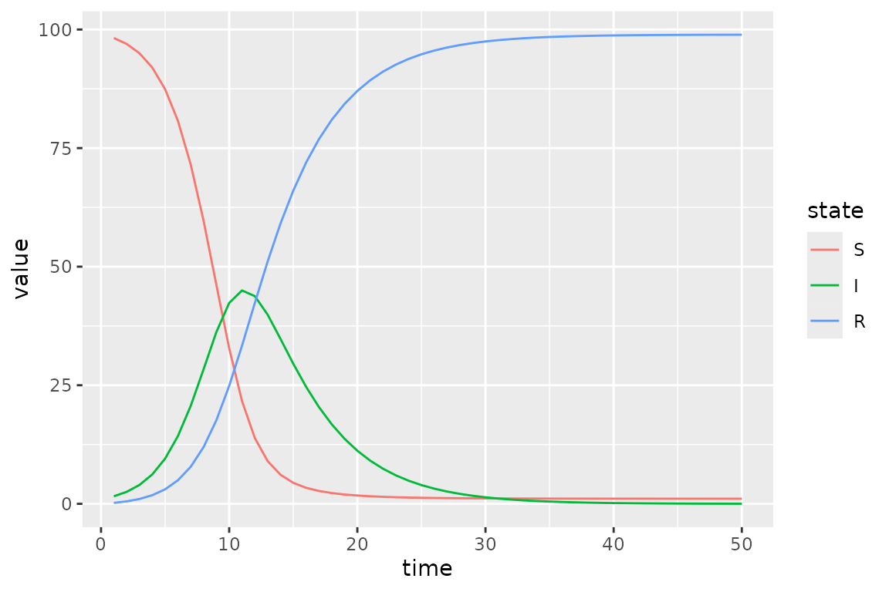
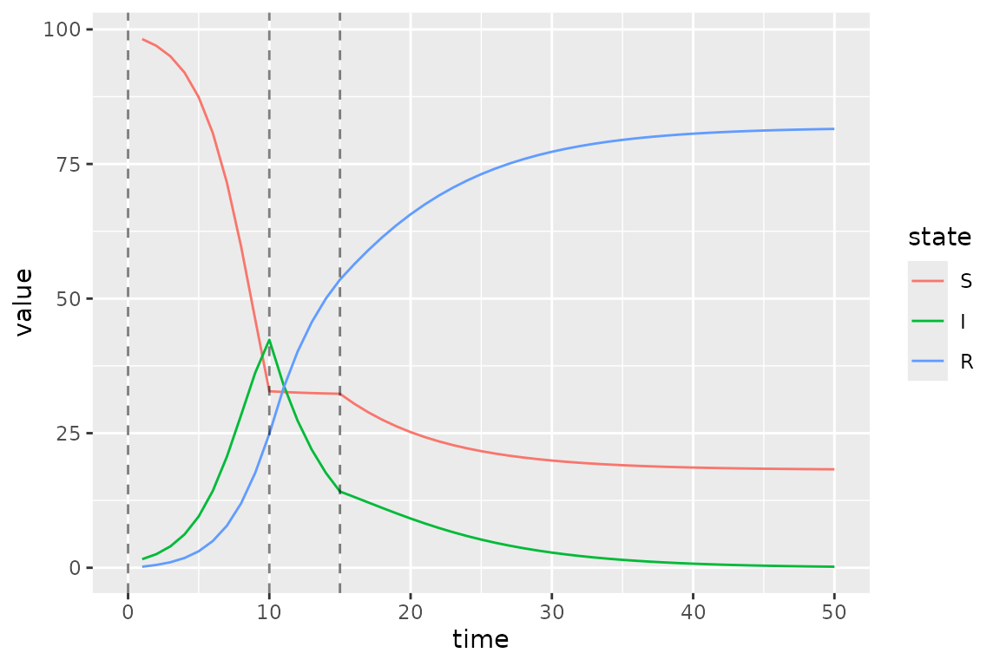
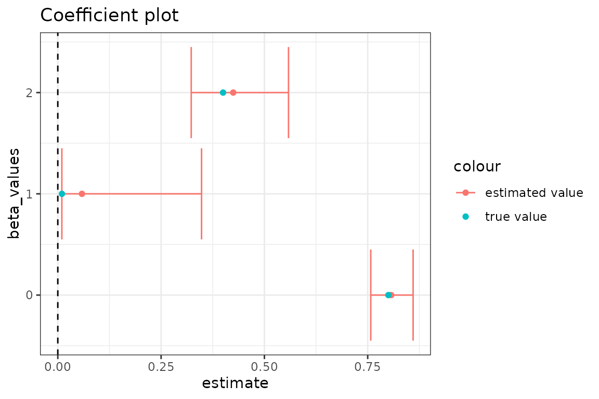
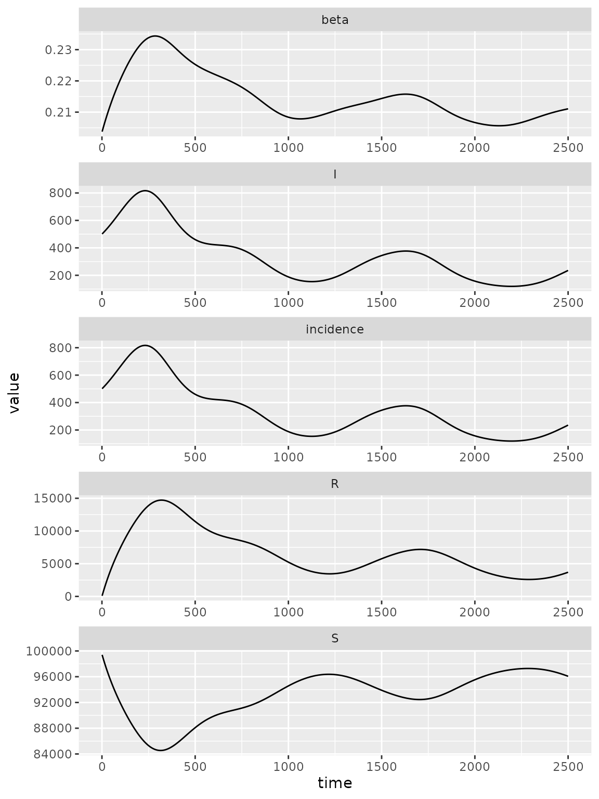
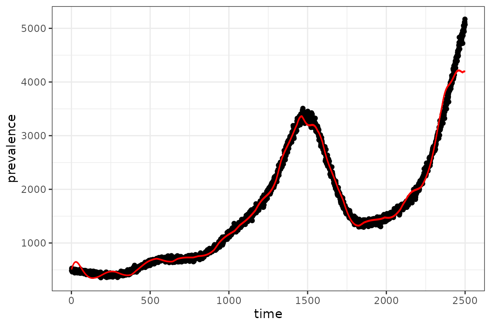

# Specifying Time-Varying Parameters

[](https://canmod.github.io/macpan2/articles/vignette-status#working-draft)

## Baseline SIR Model

Here we modify an
[SIR](https://github.com/canmod/macpan2/tree/main/inst/starter_models/sir)
model so that transmission rate is time-varying.

We initialize a vector of state labels and parameter default values for
convenience and specify a simulation time of 50 time steps.

``` r
state_labels = c("S", "I", "R")
time_steps = 50
beta = 0.8 # per-capita transmission rate
gamma = 0.2 # per-capita recovery rate
```

Using a fixed transmission rate of 0.8 we visualize the baseline SIR
dynamics.


## Piecewise Time Variation

To create a piecewise time-varying transmission rate, we need to specify
two variables:

1.  `beta_changepoints` - An integer vector containing the starting time
    steps at which the transmission rate `beta` changes. This vector
    starts with a time step of 0 because we want to specify an initial
    default value of `beta` followed by changing transmission rates at
    the beginning of time-step 10 and 15. (**Note: Currently
    [`macpan2::time_var`](https://canmod.github.io/macpan2/reference/engine_functions.md)
    expects the argument `change_points` to start at 0, so the default
    value of `beta` in this example is not used. In future development,
    `time_var` will accept `change_points[1] > 0` and will use the
    default value of the parameter for time steps before
    `change_points[1]`. See [Update time_var to incorporate default
    value](https://github.com/canmod/macpan2/issues/196)**)
2.  `beta_values` A numeric vector containing the values `beta` takes at
    each time step specified in `beta_changepoints`.

``` r
beta_changepoints = c(0, 10, 15)
beta_values = c(0.8, 0.01, 0.4)
```

We then need to specify an expression that updates `beta` to
`beta_values` at the time steps in `beta_changepoints`. We use the
[`time_var`](https://canmod.github.io/macpan2/reference/engine_functions.html#time-indexing)
function that will return a value for `beta`, from `beta_values`, by
comparing the current time step with the time steps in
`beta_changepoints`.

``` r
# see ?time_var for arguments
expr = list(
 beta ~ time_var(beta_values, beta_changepoints)
)
```

Let’s test that `time_var` is computing what we want for 20 time steps.

``` r
simple_sims(
    iteration_exprs = expr
  , time_steps = 20
  
  # for integer vectors (usually indexing vectors) use `int_vecs`
  , int_vecs = list(beta_changepoints = beta_changepoints)
  
  # for numeric vectors (model defaults) use `mats`
  # we need to initialize beta because it is a variable in our model
  # so we set to 0.8 - at the beginning of the simulation loop (time_step==1)
  # beta gets updated so the initial value of beta has no effect in this case
  , mats = list(
      beta = beta
    , beta_values = beta_values)

) |> filter(matrix == "beta")
#>    matrix time row col value
#> 1    beta    1   0   0  0.80
#> 2    beta    2   0   0  0.80
#> 3    beta    3   0   0  0.80
#> 4    beta    4   0   0  0.80
#> 5    beta    5   0   0  0.80
#> 6    beta    6   0   0  0.80
#> 7    beta    7   0   0  0.80
#> 8    beta    8   0   0  0.80
#> 9    beta    9   0   0  0.80
#> 10   beta   10   0   0  0.01
#> 11   beta   11   0   0  0.01
#> 12   beta   12   0   0  0.01
#> 13   beta   13   0   0  0.01
#> 14   beta   14   0   0  0.01
#> 15   beta   15   0   0  0.40
#> 16   beta   16   0   0  0.40
#> 17   beta   17   0   0  0.40
#> 18   beta   18   0   0  0.40
#> 19   beta   19   0   0  0.40
#> 20   beta   20   0   0  0.40
```

Now that we know our expression is updating `beta` correctly, we can
modify the SIR model to include this piece-wise transmission rate.

``` r
# model specification with piece-wise transmission rates
piecewise_spec = (
  "starter_models"
  # read in model from library                    
  |> mp_tmb_library("sir", package = "macpan2")
  # insert expression for updating beta at the beginning of the simulation loop
  |> mp_tmb_insert(
      phase="during"
    , at=1
    , expressions = expr
    , default = list(
        # Note: the default value of beta here has no effect, because at the
        # first time step beta is updated to beta_values[1]
        beta = beta
      , gamma = gamma
      , beta_values = beta_values
      )
    , integers = list(beta_changepoints = beta_changepoints))
)
# check that model spec was updated accordingly
print(piecewise_spec)
#> ---------------------
#> Default values:
#>       matrix row value
#>         beta     8e-01
#>        gamma     2e-01
#>            N     1e+02
#>            I     1e+00
#>            R     0e+00
#>  beta_values   0 8e-01
#>  beta_values   1 1e-02
#>  beta_values   2 4e-01
#> ---------------------
#> 
#> ---------------------
#> Before the simulation loop (t = 0):
#> ---------------------
#> 1: S ~ N - I - R
#> 
#> ---------------------
#> At every iteration of the simulation loop (t = 1 to T):
#> ---------------------
#> 1: beta ~ time_var(beta_values, beta_changepoints)
#> 2: mp_per_capita_flow(from = "S", to = "I", rate = "beta * I / N", 
#>      flow_name = "infection")
#> 3: mp_per_capita_flow(from = "I", to = "R", rate = "gamma", flow_name = "recovery")

# create simulator object
piecewise_simulator = (piecewise_spec
   |> mp_simulator(time_steps = time_steps, outputs=c(state_labels))

)
```

Now we plot the updated simulations using these change-points, which we
highlight with vertical lines.


The clear changes in dynamics at times 10 and 15 are due to the drop and
then lift of the transmission rate at these time steps.

## Calibrating Time Variation Parameters

First we simulate data to fit our model to, to see if we can recover the
time-varying parameters.

``` r
set.seed(1L)
I_observed = (sim_data
              |> filter(matrix=="I")
              # add some poisson noise
              |> mutate(value = rpois(n(),value))
)
plot(I_observed$time, I_observed$value)
```


We often want to include parameter constraints in our models, and one
way to do this implicitly is to transform the parameters ([Bolker
2008](#ref-bolker2008)). Further, transformations can sometimes help
when estimating parameters by making the “likelihood surface closer to
quadratic” and reducing parameter correlation ([Bolker
2008](#ref-bolker2008)). Here we log-transform $\beta$ because our
constraint is that $\beta$ must be positive and the domain of the
logarithm is $(0,\infty)$.

``` r

# transformed model specification
transformed_spec = mp_tmb_insert(
    model = piecewise_spec
  , phase = "before"
  , at = 1
  # we need to exponentiate log transformed values so beta is on the appropriate
  # scale when computing model dynamics
  , expressions = list(beta_values ~ exp(log_beta_values))
  # we also need to specify default values for log_beta_values
  # here we set all default values for beta to the mean of the true values
  # i.e. mean(log(beta_values))
  , default = list(
      log_beta_values = rep(mean(log(beta_values)), length(beta_values))
    )
)
# Note the true values of beta (`beta_values`) are still included in the default
# list, however they get updated before the simulation loop, so they are not
# informing our estimates for these values when calibrating.
transformed_spec
#> ---------------------
#> Default values:
#>           matrix row      value
#>             beta       0.800000
#>            gamma       0.200000
#>                N     100.000000
#>                I       1.000000
#>                R       0.000000
#>      beta_values   0   0.800000
#>      beta_values   1   0.010000
#>      beta_values   2   0.400000
#>  log_beta_values   0  -1.914868
#>  log_beta_values   1  -1.914868
#>  log_beta_values   2  -1.914868
#> ---------------------
#> 
#> ---------------------
#> Before the simulation loop (t = 0):
#> ---------------------
#> 1: beta_values ~ exp(log_beta_values)
#> 2: S ~ N - I - R
#> 
#> ---------------------
#> At every iteration of the simulation loop (t = 1 to T):
#> ---------------------
#> 1: beta ~ time_var(beta_values, beta_changepoints)
#> 2: mp_per_capita_flow(from = "S", to = "I", rate = "beta * I / N", 
#>      flow_name = "infection")
#> 3: mp_per_capita_flow(from = "I", to = "R", rate = "gamma", flow_name = "recovery")
```

Next we create the calibrator object and specify that we want to
estimate the vector of time varying transmission rates,
`log_beta_values`, by passing this parameter name to the `par` argument.

``` r
# set up calibrator object
piecewise_calib = mp_tmb_calibrator(
    spec = transformed_spec
  , data = I_observed
  , traj = "I"
  # we want to estimate the log-transformed parameters
  , par = "log_beta_values"
  , outputs = state_labels
)

# optimization step
mp_optimize(piecewise_calib)
#> Warning in (function (start, objective, gradient = NULL, hessian = NULL, :
#> NA/NaN function evaluation
#> $par
#>     params     params     params 
#> -0.2144229 -2.8405257 -0.8566479 
#> 
#> $objective
#> [1] 94.85064
#> 
#> $convergence
#> [1] 0
#> 
#> $iterations
#> [1] 10
#> 
#> $evaluations
#> function gradient 
#>       14       11 
#> 
#> $message
#> [1] "relative convergence (4)"
```

After optimizing, we can make a coefficient plot with the estimated
values and their confidence intervals, to compare with the true values.

    #> Warning: `geom_errorbarh()` was deprecated in ggplot2 4.0.0.
    #> ℹ Please use the `orientation` argument of `geom_errorbar()` instead.
    #> This warning is displayed once per session.
    #> Call `lifecycle::last_lifecycle_warnings()` to see where this warning was
    #> generated.



In general, the transmission rate estimates follow the expected pattern
changing from high, to low, to moderate. The most precise estimate, for
the true value of 0.8, results because the observed prevalence data is
most informative about the transmission rate when the infection is
initially spreading. It makes sense that we get the most accurate
estimate for the final transmission rate because most of the observed
data is simulated with the final known transmission rate. We lose
accuracy and precision for the middle rate because there is only 5 time
steps of observed data informing this parameter.

## Radial Basis Functions for Flexible Time Variation (In-Progress)

This section uses radial basis functions (RBFs) to generate models with
a flexible functional form for smooth changes in the transmission rate.

Before we can add the fancy radial basis for the transmission rate, we
need a base model. We use an SIR model that has been modified to include
waning.

``` r
sir_waning = mp_tmb_library("starter_models"
  , "sir_waning"
  , package = "macpan2"
)
```

The [`macpan2::rbf`](https://canmod.github.io/macpan2/reference/rbf.md)
function can be used to produce a matrix giving the values of each basis
function (each column) at each time step (each row). Using this matrix,
$X$, and a weights vector, $b$, we can get a flexible output vector,
$y$, with a shape that can be modified by changing the weights vector.

$$y = Xb$$

The following code illustrates this approach.

``` r
set.seed(1L)
d = 20
n = 2500
X = rbf(n, d)
b = rnorm(d, sd = 0.01)
par(mfrow = c(3, 1)
  , mar = c(0.5, 4, 1, 1) + 0.1
)
matplot(X
  , type = "l", lty = 1, col = 1
  , ylab = "basis functions"
  , axes = FALSE
)
axis(side = 2)
box()
barplot(b
  , xlab = ""
  , ylab = "weights"
)
par(mar = c(5, 4, 1, 1) + 0.1)
plot(X %*% b
  , type = "l"
  , xlab = "time"
  , ylab = "output"
)
```


Here `d` is the dimension of the basis, or number of functions, and `n`
is the number of time steps. By multiplying the uniform basis matrix
(top panel) by a set of weights (middle panel), we obtain a non-uniform
curve (bottom panel). Note how the peaks (troughs) in the output are
associated with large positive (negative) weights.

Now we want to transform the output of the (matrix) product of the RBF
matrix and the weights vector into a time-series for the transmission
rate, $\beta$. Although we could just use the output vector as the
$\beta$ time series, it is more convenient to transform it so that the
$\beta$ values yield more interesting dynamics in an SIR model. In
particular, our model for $\beta_{t}$ as a function of time, $t$, is

$$\log\left( \beta_{t} \right) = \log\left( \gamma_{t} \right) + \log(N) - \log\left( S_{t} \right) + x_{t}b$$

Here we have the recovery rate, $\gamma_{t}$, and number of
susceptibles, $S_{t}$, at time, $t$, the total population, $N$, and the
$t$th row of $X$, $x_{t}$. To better understand the rationale for this
equation note that if every element of $b$ is set to zero, we have the
following condition.

$$\frac{\beta_{t}S_{t}}{N} = \gamma_{t}$$

This condition assures that the number of infected individuals remains
constant at time, $t$. This means that positive values of $b$ will tend
to generate outbreaks and negative values will tend to reduce
transmission.

**fixme**: I (BMB) understand why you’re setting the model up this way,
but it’s an odd/non-standard setup - may confuse people who are already
familiar with epidemic models (it confused me initially).

Here is a simulation model with a radial basis for exogenous
transmission rate dynamics.

``` r
set.seed(1L)

spec_waning = (sir_waning
             |> mp_tmb_insert(
                 phase = "before"
               , at = Inf
               , expressions = list(eta ~ gamma * exp(X %*% b))
               , default = list(eta = empty_matrix, X = X, b = b)
             ) |> mp_tmb_insert(
                 phase = "during"
               , at = 1
               , expressions = list(beta  ~ eta[time_step(1)] / clamp(S/N, 1/100))
             )
)


simulator_waning = (spec_waning
  |> mp_simulator(
    time_steps = n
  , outputs = c("S", "I", "R", "infection", "beta")
  , default = list(
      N = 100000, I = 500, R = 0
    , beta = 1, gamma = 0.2, phi = 0.01

  ))
)


print(simulator_waning)
#> ---------------------
#> Before the simulation loop (t = 0):
#> ---------------------
#> 1: S ~ N - I - R
#> 2: eta ~ gamma * exp(X %*% b)
#> 
#> ---------------------
#> At every iteration of the simulation loop (t = 1 to 2500):
#> ---------------------
#> 1: beta ~ eta[time_step(1)]/clamp(S/N, 1/100)
#> 2: infection ~ S * (I * beta/N)
#> 3: recovery ~ I * (gamma)
#> 4: waning_immunity ~ R * (phi)
#> 5: S ~ S - infection + waning_immunity
#> 6: I ~ I + infection - recovery
#> 7: R ~ R + recovery - waning_immunity
```

``` r
(simulator_waning
 |> mp_trajectory()
 |> ggplot()
 + facet_wrap(~ matrix, ncol = 1, scales = 'free')
 + geom_line(aes(time, value))
)
```



### Calibration

We can perform calibration with a time-varying parameter specified with
a radial basis, by using the function
[`macpan2::mp_rbf()`](https://canmod.github.io/macpan2/reference/mp_rbf.md).
We follow the ususal steps in calibration.

1\. Simulate from the model and add some poisson noise:

``` r
obs_rbf = (simulator_waning
 |> mp_trajectory()
 |> filter(matrix=="I")
 |> mutate(across(value, ~ rpois(n(), .)))
)
```

2\. Add calibration information.

``` r
calib_rbf = mp_tmb_calibrator(sir_waning
   , data = obs_rbf
   , traj = "I"
   ## estimate 
   , par = "beta"
   , tv = mp_rbf("beta", dimension = d, initial_weights = b)
   ## pass all defaults, including dimension of the rbf `d` and initial weights vector `b`
   , default = list(N = 100000, I = 500, R = 0, beta = 1, gamma = 0.2, phi = 0.01, d = d, b = b)

  
)   
mp_optimize(calib_rbf)
#> $par
#>      params      params      params      params      params      params 
#> -1.27687503 -0.23926636 -0.88986019 -0.48220813 -0.71756985 -0.54565853 
#>      params      params      params      params      params      params 
#> -0.66539466 -0.56126919 -0.61219622 -0.49270722 -0.54660991 -0.36162006 
#>      params      params      params      params      params      params 
#> -0.05597281 -0.53737138 -0.50953145 -0.54456130 -0.55267666 -0.44928185 
#>      params      params      params 
#> -0.57792348  0.05094216  0.55256297 
#> 
#> $objective
#> [1] 27879.25
#> 
#> $convergence
#> [1] 0
#> 
#> $iterations
#> [1] 19
#> 
#> $evaluations
#> function gradient 
#>       33       20 
#> 
#> $message
#> [1] "relative convergence (4)"
## check estimates
mp_tmb_coef(calib_rbf,conf.int = TRUE)
#>         term           mat row col       default  type    estimate   std.error
#> 1     params time_var_beta   0   0 -0.0062645381 fixed -1.27687503 0.001469568
#> 2   params.1 time_var_beta   1   0  0.0018364332 fixed -0.23926636 0.001987359
#> 3  params.10 time_var_beta  10   0  0.0151178117 fixed -0.54660991 0.002651156
#> 4  params.11 time_var_beta  11   0  0.0038984324 fixed -0.36162006 0.003446087
#> 5  params.12 time_var_beta  12   0 -0.0062124058 fixed -0.05597281 0.003696919
#> 6  params.13 time_var_beta  13   0 -0.0221469989 fixed -0.53737138 0.002870072
#> 7  params.14 time_var_beta  14   0  0.0112493092 fixed -0.50953145 0.002247537
#> 8  params.15 time_var_beta  15   0 -0.0004493361 fixed -0.54456130 0.002093460
#> 9  params.16 time_var_beta  16   0 -0.0001619026 fixed -0.55267666 0.002240181
#> 10 params.17 time_var_beta  17   0  0.0094383621 fixed -0.44928185 0.002723594
#> 11 params.18 time_var_beta  18   0  0.0082122120 fixed -0.57792348 0.003395006
#> 12 params.19 time_var_beta  19   0  0.0059390132 fixed  0.05094216 0.003813952
#> 13  params.2 time_var_beta   2   0 -0.0083562861 fixed -0.88986019 0.002086951
#> 14 params.20 prior_sd_beta   0   0  1.0000000000 fixed  0.55256297 0.003339349
#> 15  params.3 time_var_beta   3   0  0.0159528080 fixed -0.48220813 0.001941415
#> 16  params.4 time_var_beta   4   0  0.0032950777 fixed -0.71756985 0.001768439
#> 17  params.5 time_var_beta   5   0 -0.0082046838 fixed -0.54565853 0.001606983
#> 18  params.6 time_var_beta   6   0  0.0048742905 fixed -0.66539466 0.001508451
#> 19  params.7 time_var_beta   7   0  0.0073832471 fixed -0.56126919 0.001505801
#> 20  params.8 time_var_beta   8   0  0.0057578135 fixed -0.61219622 0.001689447
#> 21  params.9 time_var_beta   9   0 -0.0030538839 fixed -0.49270722 0.002064815
#>       conf.low   conf.high
#> 1  -1.27975533 -1.27399473
#> 2  -0.24316151 -0.23537121
#> 3  -0.55180608 -0.54141374
#> 4  -0.36837426 -0.35486585
#> 5  -0.06321864 -0.04872698
#> 6  -0.54299661 -0.53174614
#> 7  -0.51393654 -0.50512636
#> 8  -0.54866441 -0.54045819
#> 9  -0.55706733 -0.54828598
#> 10 -0.45462000 -0.44394371
#> 11 -0.58457757 -0.57126939
#> 12  0.04346695  0.05841737
#> 13 -0.89395054 -0.88576984
#> 14  0.54601796  0.55910797
#> 15 -0.48601323 -0.47840303
#> 16 -0.72103593 -0.71410377
#> 17 -0.54880816 -0.54250890
#> 18 -0.66835117 -0.66243815
#> 19 -0.56422051 -0.55831788
#> 20 -0.61550747 -0.60888496
#> 21 -0.49675418 -0.48866026
```

3\. Review results.

The fit to the observed data looks reasonable, however there are some
obvious wiggly deviations.



## References

Bolker, Benjamin M. 2008. *Ecological Models and Data in R*. Princeton:
Princeton University Press. <https://doi.org/doi:10.1515/9781400840908>.
