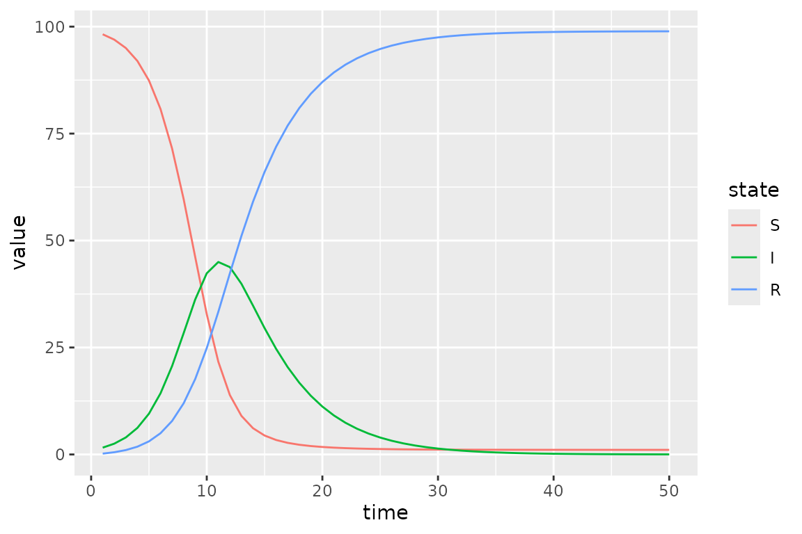
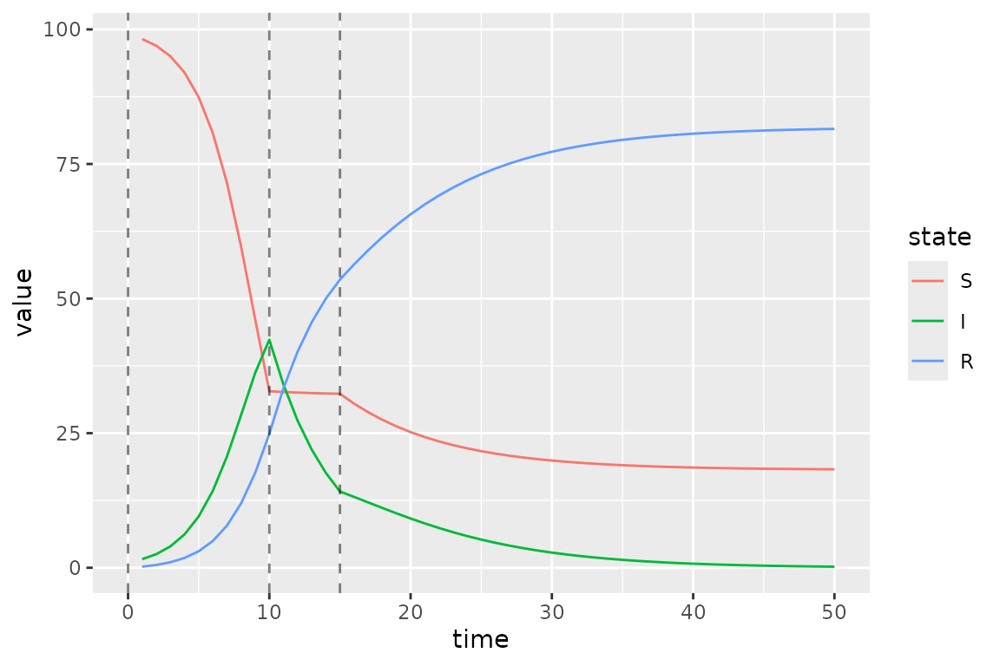
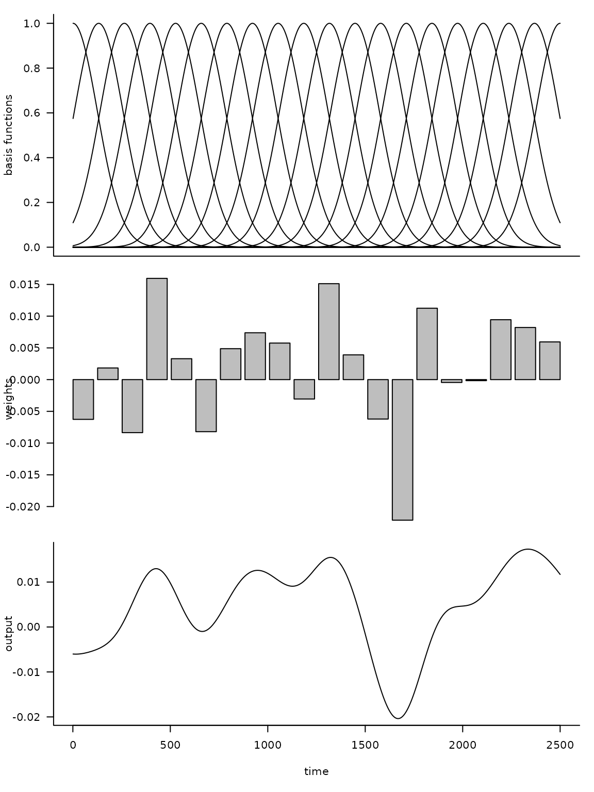
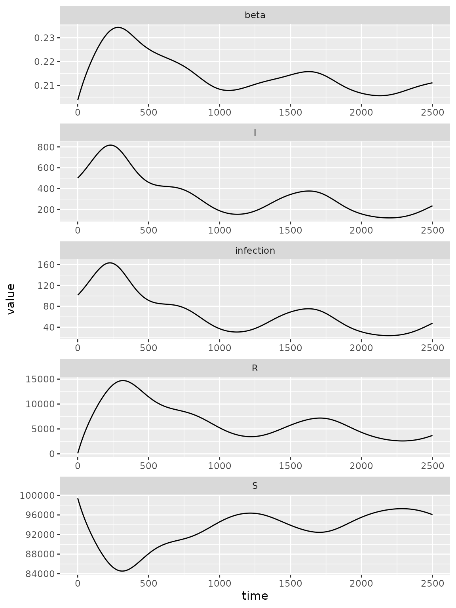
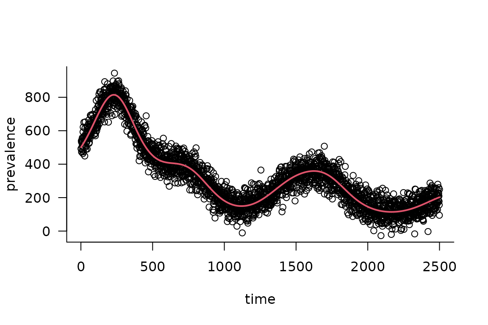

# Advanced Specification of Time-Varying Parameters

[](https://canmod.github.io/macpan2/articles/vignette-status#working-draft)

## Baseline SIR Model

Here we modify an
[SIR](https://github.com/canmod/macpan2/tree/main/inst/starter_models/sir)
model so that transmission rate is time-varying.

``` r
state_labels = c("S", "I", "R")
simulator = ("starter_models"
  |> mp_tmb_library("sir", package = "macpan2")
  |> mp_simulator(time_steps = 50
    , outputs = state_labels
    , default = list(beta = 0.8, gamma = 0.2)
  )
)
(simulator
  |> mp_trajectory()
  |> mutate(state = factor(matrix, state_labels))
  |> ggplot() 
  + geom_line(aes(time, value, colour = state))
)
```



## Piecewise Time Variation

We now change the value of the transmission rate, `beta`, at the
beginning of time-step 10 and 15. In the first step we add to the
simulator a vector containing these change-points.

``` r
simulator$add$matrices(beta_changepoints = c(0, 10, 15))
```

Next we add the values to which `beta` changes at these time-steps.

``` r
simulator$add$matrices(beta_values = c(0.8, 0.01, 0.4))
```

We also need a variable to track the current value of `beta`. This
`beta_pointer` starts at time-step equal to 0, and it will be
incremented throughout the simulation.

``` r
simulator$add$matrices(beta_pointer = 0)
```

We increment `beta_pointer` using the [`time_group`
function](https://canmod.github.io/macpan2/reference/engine_functions.html#time-indexing)
that returns either `beta_pointer` or `beta_pointer + 1` depending on
whether or not the current time-step is at a change-point in
`beta_changepoints`.

``` r
simulator$insert$expressions(
    beta_pointer ~ time_group(beta_pointer, beta_changepoints), 
    .phase = "during"
)
```

We update `beta` at every iteration of the simulation loop using this
`beta_pointer`.

``` r
simulator$insert$expressions(
  beta ~ beta_values[beta_pointer],
  .phase = "during"
)
```

Now we plot the updated simulations using these change-points, which we
highlight with vertical lines.

``` r
s = mp_trajectory(simulator)
cp = simulator$get$initial("beta_changepoints")
(s
  %>% mutate(state = factor(matrix, state_labels))
  %>% ggplot()
  + geom_line(aes(time, value, colour = state))
  + geom_vline(
    aes(xintercept = x), 
    linetype = "dashed", 
    alpha = 0.5, 
    data = data.frame(x = cp)
  )
)
```



The clear kinks at times 10 and 15 are due the drop and then lift of the
transmission rate at these times.

## Calibrating Time Variation Parameters

First we simulate data to fit our model to, to see if we can recover the
time-varying parameters.

``` r
set.seed(1L)
I_observed = rpois(50
  , filter(s, matrix == "I")$value
)
plot(I_observed)
```


Then we add a few matrices to the model for keeping tracking of
information used in model fitting.

``` r
simulator$update$matrices(
  
  ## observed data
  I_obs = I_observed,
  
  ## simulated trajectory to compare with data
  I_sim = empty_matrix, 
  
  ## location of I in the state vector
  ## (the `-1L` bit is to get 0-based indices instead of 1-based)
  I_index = match("I", state_labels) - 1L, 
  
  ## matrix to contain the log likelihood values at 
  ## each time step
  log_lik = empty_matrix, 
  
  ## need to save the simulation history of each of these matrices
  .mats_to_save = c("I_sim", "log_lik")
)
```

Now we need some new expressions. The first expression pulls out the I
state from the state vector.

``` r
simulator$insert$expressions(
  I_sim ~ I,
  .phase = "during"
)
```

The second expression computes a vector of Poisson log-likelihood values
– one for each time step.

``` r
simulator$insert$expressions(
  log_lik ~ dpois(I_obs, clamp(rbind_time(I_sim))),
  .phase = "after"
)
simulator$replace$obj_fn(~ -sum(log_lik))
```

Next we declare the beta values as parameters to be optimized on the log
scale. The clearest way to do this is to form a data frame with one row
for each parameter to be fitted.

``` r
default_beta = mean(simulator$get$initial("beta_values"))
params_to_fit = data.frame(
    mat = "log_beta_values"
  , row = 0:2
  , default = log(default_beta)
)
print(params_to_fit)
#>               mat row    default
#> 1 log_beta_values   0 -0.9079919
#> 2 log_beta_values   1 -0.9079919
#> 3 log_beta_values   2 -0.9079919
```

There are a couple potentially confusing aspects to this data frame.
First, we want to fit the `beta` values on the log scale, and we
indicate this by prepending `log_` in front of the name of the
`beta_values` matrix that is in the model. We will more explicitly add
the `log_beta_values` matrix to the model in the next code chunk.
Second, the word `row` corresponds to an index for the change points. In
particular, `row = 0` corresponds to the initial `beta`, `row = 1` to
the first change point and `row = 2` to the second. This is because all
quantities passed to `macpan2` engines are matrices, and so in this case
different rows of this `log_beta_values` matrix (actually column vector)
correspond to different change points. If we were dealing with matrices
with more than one column we would need to include a `col` column in
this data frame to indicate the matrix columns of the matrix entries
that correspond to parameters to be fitted.

Now we log transform the `beta_values` matrix entries and declare them
as parameters.

``` r
simulator$add$transformations(Log("beta_values"))
simulator$replace$params_frame(params_to_fit)
```

Finally we fit the model back to the simulation data.

``` r
simulator$optimize$nlminb()
#> $par
#>      params      params      params 
#>  -0.1710158 -22.8268369  -0.8291142 
#> 
#> $objective
#> [1] 99.74231
#> 
#> $convergence
#> [1] 0
#> 
#> $iterations
#> [1] 26
#> 
#> $evaluations
#> function gradient 
#>       28       27 
#> 
#> $message
#> [1] "relative convergence (4)"
```

We can see that the optimizer converges (i.e. `$convergence = 0`) in 26
iterations.

On the log scale we see that the optimizer finds different values
(`current`) than it started at (`default`).

``` r
simulator$current$params_frame()
#>   par_id             mat row col    default     current
#> 1      0 log_beta_values   0   0 -0.9079919  -0.1710158
#> 2      1 log_beta_values   1   0 -0.9079919 -22.8268369
#> 3      2 log_beta_values   2   0 -0.9079919  -0.8291142
```

More importantly the beta values on the untransformed scale recover
reasonable values that are qualitatively consistent with the values used
in the simulations.

``` r
data.frame(
  fitted = formatC(
    exp(simulator$current$params_frame()$current),
    format = "e", digits = 2
  ),
  true = simulator$get$initial("beta_values")
)
#>     fitted true
#> 1 8.43e-01 0.80
#> 2 1.22e-10 0.01
#> 3 4.36e-01 0.40
```

Note however that the second fitted beta value is much smaller than the
true value, which is potentially interesting.

## Radial Basis Functions for Flexible Time Variation (In-Progress)

This section uses radial basis functions (RBFs) to generate models with
a flexible functional form for smooth changes in the transmission rate.

Before we can add the fancy radial basis for the transmission rate, we
need a base model. We use an SIR model that has been modified to include
waning.

``` r
sir = mp_tmb_library("starter_models"
  , "sir_waning"
  , package = "macpan2"
)
```

The [`macpan2::rbf`](https://canmod.github.io/macpan2/reference/rbf.md)
function can be used to produce a matrix giving the values of each basis
function (each column) at each time step (each row). Using this matrix,
$X$, and a weights vector, $b$, we can get a flexible output vector,
$y$, with a shape that can be modified by changing the weights vector.

$$y = Xb$$

The following code illustrates this approach.

``` r
set.seed(1L)
d = 20
n = 2500
X = rbf(n, d)
b = rnorm(d, sd = 0.01)
par(mfrow = c(3, 1)
  , mar = c(0.5, 4, 1, 1) + 0.1
)
matplot(X
  , type = "l", lty = 1, col = 1
  , ylab = "basis functions"
  , axes = FALSE
)
axis(side = 2)
box()
barplot(b
  , xlab = ""
  , ylab = "weights"
)
par(mar = c(5, 4, 1, 1) + 0.1)
plot(X %*% b
  , type = "l"
  , xlab = "time"
  , ylab = "output"
)
```



Here `d` is the dimension of the basis, or number of functions, and `n`
is the number of time steps. By multiplying the uniform basis matrix
(top panel) by a set of weights (middle panel), we obtain a non-uniform
curve (bottom panel). Note how the peaks (troughs) in the output are
associated with large positive (negative) weights.

Now we want to transform the output of the (matrix) product of the RBF
matrix and the weights vector into a time-series for the transmission
rate, $\beta$. Although we could just use the output vector as the
$\beta$ time series, it is more convenient to transform it so that the
$\beta$ values yield more interesting dynamics in an SIR model. In
particular, our model for $\beta_{t}$ as a function of time, $t$, is

$$\log\left( \beta_{t} \right) = \log\left( \gamma_{t} \right) + \log(N) - \log\left( S_{t} \right) + x_{t}b$$

Here we have the recovery rate, $\gamma_{t}$, and number of
susceptibles, $S_{t}$, at time, $t$, the total population, $N$, and the
$t$th row of $X$, $x_{t}$. To better understand the rationale for this
equation note that if every element of $b$ is set to zero, we have the
following condition.

$$\frac{\beta_{t}S_{t}}{N} = \gamma_{t}$$

This condition assures that the number of infected individuals remains
constant at time, $t$. This means that positive values of $b$ will tend
to generate outbreaks and negative values will tend to reduce
transmission.

**fixme**: I (BMB) understand why you’re setting the model up this way,
but it’s an odd/non-standard setup - may confuse people who are already
familiar with epidemic models (it confused me initially).

Here is a simulation model with a radial basis for exogenous
transmission rate dynamics.

``` r
set.seed(1L)
simulator = mp_simulator(sir
  , time_steps = n
  , outputs = c("S", "I", "R", "infection", "beta")
  , default = list(
      N = 100000, I = 500, R = 0
    , beta = 1, gamma = 0.2, phi = 0.01
    , X = rbf(n, d)
    , b = rnorm(d, sd = 0.01)
  )
)
simulator$insert$expressions(
    eta ~ gamma * exp(X %*% b)
  , .phase = "before"
  , .at = Inf
)
simulator$insert$expressions(
    beta ~ eta[time_step(1)] / clamp(S/N, 1/100)
  , .phase = "during"
  , .at = 1
)
simulator$add$matrices(
    eta = empty_matrix
)
simulator$replace$params(
    default = rnorm(d, sd = 0.01)
  , mat = rep("b", d)
  , row = seq_len(d) - 1L
)
print(simulator)
#> ---------------------
#> Before the simulation loop (t = 0):
#> ---------------------
#> 1: S ~ N - I - R
#> 2: eta ~ gamma * exp(X %*% b)
#> 
#> ---------------------
#> At every iteration of the simulation loop (t = 1 to 2500):
#> ---------------------
#> 1: beta ~ eta[time_step(1)]/clamp(S/N, 1/100)
#> 2: infection ~ S * (I * beta/N)
#> 3: recovery ~ I * (gamma)
#> 4: waning_immunity ~ R * (phi)
#> 5: S ~ S - infection + waning_immunity
#> 6: I ~ I + infection - recovery
#> 7: R ~ R + recovery - waning_immunity
```

``` r
(simulator
 |> mp_trajectory()
 |> ggplot()
 + facet_wrap(~ matrix, ncol = 1, scales = 'free')
 + geom_line(aes(time, value))
)
```



### Calibration

Now we’re going to calibrate this model to data. The main innovation
here is that we will use a built-in feature of
[TMB](https://cran.r-project.org/package=TMB) (on which `macpan2` is
constructed), estimation of latent variables by [Laplace
approximation](https://en.wikipedia.org/wiki/Laplace%27s_approximation)
to fit the time series efficiently without overfitting (see section 5.10
of Madsen and Thyregod (2011), Kristensen et al. (2016), or the [TMB
documentation](https://kaskr.github.io/adcomp/_book/Tutorial.html#statistical-modelling)
for more detail).

The next few steps will roughly follow the first example in the
[Calibration](https://canmod.github.io/macpan2/articles/calibration.md)
vignette: TODO: make sure to line this state up with the specific code
in the calibration vignette.

1\. Simulate from the model and add some noise:

``` r
obs_I <- (simulator
    |> mp_trajectory()
    |> filter(matrix == "I")
    |> mutate(across(value, ~ rnorm(n(), ., sd = 50)))
    |> pull(value)
)
plot(obs_I, xlab = "time", ylab = "prevalence")
```


2\. Add calibration information.

We start by adding standard boilerplate stuff to include the observed
data and store/return the results.

``` r
## copied from 'calibration/"hello world"' example
simulator$add$matrices(
    I_obs = obs_I
  , I_sim = empty_matrix
  , log_lik = empty_matrix
  , .mats_to_save = c("I_sim")
  , .mats_to_return = c("I_sim")
)
simulator$insert$expressions(
     I_sim ~ I
   , .phase = "during"
   , .at = Inf
)
```

Now we start to deviate from the previous example: in addition to a
parameter (`I_sd`) for the standard deviation of the noise in $I$, we
also add a parameter (`rbf_sd`) for the variance of the RBF
coefficients, and penalize the likelihood using

$$\begin{aligned}
I_{\text{obs}} & {\sim \text{Normal}\left( I_{\text{sim}}(\phi,\mathbf{b}),\sigma_{I}^{2} \right)} \\
b_{i} & {\sim \text{Normal}\left( 0,\sigma_{\text{rbf}}^{2} \right)}
\end{aligned}$$ and the likelihood is defined as: \$\$ \int {\cal
L}(I\_{\textrm{obs}}\|\phi, {\mathbf b}', \sigma^2_I) \cdot {\cal
L}({\mathbf b}'\|\sigma^2\_{\textrm{rbf}}) \\ d{\mathbf b}. \$\$

The $\phi$ vector is a set of *fixed-effect* (unpenalized) parameters;
in this case it is empty, but it could include (for example)
time-constant recovery or immune-waning rates, or a baseline
transmission rate (see note below). (The fixed-effect parameter is
usually denoted as $\beta$ in statistical models, but we’ve already used
that symbol for the transmission coefficient …)

Although this looks awful, (1) the high-dimensional integral over
$\mathbf{b}$ can be separated into a product of one-dimensional
integrals and (2) the Laplace approximation gives us a quick, reasonable
approximation to the one-dimensional integrals.

The `rbf_sd` parameter can be interpreted as a standard deviation on a
Gaussian random effect or as approximately $1/\sqrt{\lambda}$ where
$\lambda$ is a ridge penalty.

Continuing with the coding, we add the parameters and negative
log-likelihood to the model, making the negative log-likelihood a *sum*
of the two terms in the integral above: the NLL of the data
(`-sum(dnorm(I_obs, ...))`) and the likelihood of the RBF parameters
(`-sum(dnorm(b, ...))`): we fit both of the SD parameters on the log
scale.

``` r
simulator$add$matrices(
    I_sd = 1
  , rbf_sd = 1
)
simulator$insert$expressions(
     log_lik ~ 
       -sum(dnorm(I_obs, rbind_time(I_sim), I_sd)) +
       -1*sum(dnorm(b, 0.0, rbf_sd)),
     .phase = "after"
)
## initially forgot this: maybe we could warn when someone is missing this????
simulator$replace$obj_fn(~ log_lik)
simulator$add$transformations(Log("I_sd"))
simulator$add$transformations(Log("rbf_sd"))
## not sure if this is required?
params <- read.delim(sep = "|", header = TRUE,
                     strip.white = TRUE, ## important!
                      text = "
mat         | default
log_I_sd    | 0
log_rbf_sd  | 1
")
simulator$replace$params_frame(params)
```

Finally, we add the `b` vector as a set of *random* parameters: this
tells `macpan2` to apply the Laplace approximation to these parameters …

``` r
matrix_version = "1.6-5"
if (packageVersion("Matrix") >= matrix_version) {
  rparams <- data.frame(
      mat  = "b",
      row = 0:19,
      col = 0,
      default = 0)
  simulator$replace$random_frame(rparams)
}
```

Test the objective function:

``` r
if (packageVersion("Matrix") >= matrix_version) {
  res <- simulator$ad_fun()$fn(c(1,1))
}
```

    #> [1] 458150.5
    #> attr(,"logarithm")
    #> [1] TRUE

**fixme**: can’t get objective function to shut up. Should have
specified `silent = TRUE` when calling `MakeADFun()` initially, now have
tried assigning the value in several different environments, without
success …

This step normally produces lots of output (more output than a model
with random effects) because the Laplace approximation involves an
additional “inner” step where the `b` parameters are optimized, even
though we are only evaluating the objective for a single set of fixed
parameters (`log_I_sd`, `log_rbf_sd`)

**fixme**: note to developers, if we cache results we may need to call
the `$retape()` function to restore internal structure when retrieving …

``` r
if (packageVersion("Matrix") >= matrix_version) {
  ## testing: simulator$ad_fun()$fn()
  fit <- simulator$optimize$nlminb()
}
```

``` r
if (packageVersion("Matrix") >= matrix_version) {

  ## simulator$print$matrix_dims()
  ## fixed effects only:
  ## look at parameters, but skip the random-effects parameters
  ## 'random' holds the indices of the parameters that are treated
  ## as random effects
  (fixed_params <- with(simulator$ad_fun()$env,
                        last.par.best[-random]))
  ## ???
  ## RE only
  (ran_params <- with(simulator$ad_fun()$env,
                      last.par.best[random]))
}
#>        random        random        random        random        random 
#>  0.0067500746  0.0116640359 -0.0036393669 -0.0151820076  0.0011065412 
#>        random        random        random        random        random 
#>  0.0032893069 -0.0028997066 -0.0146779626 -0.0058152472  0.0073952303 
#>        random        random        random        random        random 
#>  0.0096771402  0.0023955587  0.0007541976  0.0014273201 -0.0133524582 
#>        random        random        random        random        random 
#> -0.0070835055 -0.0024234111  0.0029349241  0.0084787712  0.0031347858
```

**fixme**: we need an incantation to extract the full parameters
(including RE parameters) in order to make sure `$report` works
properly? (In general, should caution about mutability/make sure we use
`last.par.best` internally …)

Extract parameters, run the simulator for the best-fit parameters,
compare with data …

``` r
if (packageVersion("Matrix") >= matrix_version) {
  pp <- simulator$ad_fun()$env$last.par.best  ## FIXME: use this
  est_I <- (simulator
      |> mp_trajectory()
      |> filter(matrix == "I")
      |> pull(value)
  )
  par(las = 1, bty = "l")
  plot(obs_I, xlab = "time", ylab = "prevalence")
  lines(est_I, col = 2, lwd = 2)
}
```



**fixme**: there are a few artificialities about this example that
could/should be relaxed

- the only fixed parameters are the standard deviations. Normally we
  would also be estimating `gamma` (possibly with a prior? do we have
  any examples, say in the calibration vignette, of adding priors?)
- the RBF function is penalized to zero. In general, we should augment
  the penalized RBF component (which determines the variation around the
  mean) with an unpenalized intercept/baseline transmission parameter.
  So, for example, the transmission rate should be computed as
  `b0 + exp(X %*% b)`, where `b0` represents an unpenalized parameter
  that’s allowed to vary freely …

**fixme**: compare (1) unpenalized fit; (2) penalized fit without
Laplace approximation …

**fixme**: discuss (somewhere) alternate bases for latent variables
(random-walk, Gaussian process, …)

## References

Kristensen, Kasper, Anders Nielsen, Casper W. Berg, Hans Skaug, and
Bradley M. Bell. 2016. “TMB: Automatic Differentiation and Laplace
Approximation.” *Journal of Statistical Software* 70 (5).
<https://doi.org/10.18637/jss.v070.i05>.

Madsen, Henrik, and Poul Thyregod. 2011. *Introduction to General and
Generalized Linear Models*. CRC Press.
