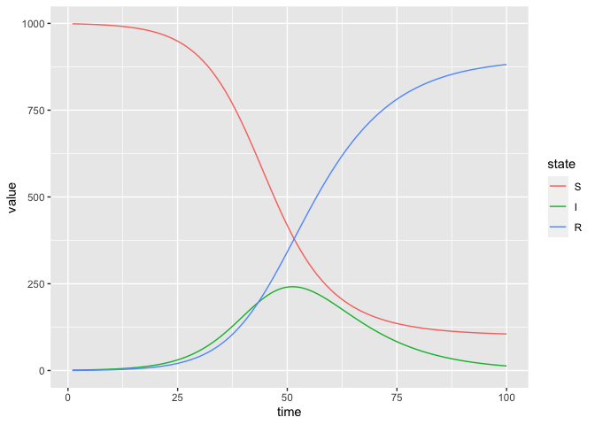

This is (nearly) the simplest possible ‘vanilla’ epidemic model,
implemented as an example.

    library(macpan2)
    library(dplyr)
    library(ggplot2)
    sir_dir = system.file("model_library", "sir", package = "macpan2")
    sir_mod = Compartmental2(sir_dir)
    sir_sim = mp_dynamic_simulator(sir_mod
      , vectors = list(
          state = c(S = 999, I = 1, R = 0),
          flow_rates = c(lambda = NA, gamma = 0.1),
          trans_rates = c(beta = 0.25)
        )
      , time_steps = 100L
    )

The state variables and rates in this model are as follows.

    sir_mod$flows()

    ##   from to   edge
    ## 1    S  I lambda
    ## 2    I  R  gamma

    sir_mod$influences()

    ##   infectious_state infection_flow transmission
    ## 1                I         lambda         beta

    (sir_sim
      |> mp_report()
      |> filter(matrix == "state")
      |> mutate(state = factor(row, levels = c("S", "I", "R")))
      |> ggplot()
      + geom_line(aes(time, value, colour = state))
    )

