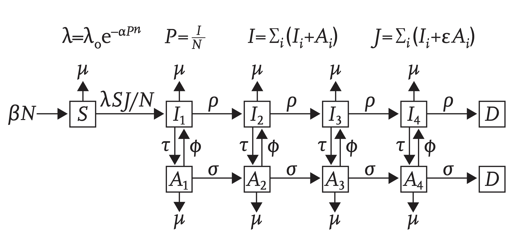

```{r, include = FALSE}
knitr::opts_chunk$set(
  collapse = TRUE,
  comment = "#>",
  fig.path = "./figures/"
)
```

```{r packages}
library(ggplot2)
library(dplyr)
library(tidyr)
library(macpan2)
```

HIV model by [@granich2009universal].

# States

| Variable | Description                                                                                                        |
| -------- | ------------------------------------------------------------------------------------------------------------------ |
| S        | Number of susceptible individuals.                                                                                 |
| I1 - I4  | Numbers of infectious individuals who are not treated. The number gives the state of disease progression from 1-4. |
| A1 - A4  | Numbers of infectious individuals who are treated. The number gives the state of disease progression from 1-4.     |
| D        | Number of individuals who have died from the disease.                                                              |
| D_bg     | Number of individuals who have died from other causes.                                                             |

# Parameters

| Variable    | Description                                                                                                               |
| ----------- | ------------------------------------------------------------------------------------------------------------------------- |
| $\alpha$    | Constant in non-linear transmission rate.                                                                                 |
| $\lambda_0$ | Constant in non-linear transmission rate.                                                                                 |
| $n$         | Constant in non-linear transmission rate.                                                                                 |
| $\epsilon$  | Constant, in non-linear transmission rate, measuring the relative decrease in transmission caused by treatment. |
| $\beta$     | Per-capita birth rate.                                                                                                    |
| $\mu$       | Per-capita (background) death rate.                                                                                       |
| $\rho$      | Per-capita rate of disease progression for non-treated individuals.                                                       |
| $\sigma$    | Per-capita rate of disease progression for treated individuals.                                                           |
| $\tau$      | Per-capita rate at which individuals become protected.                                                                    |
| $\phi$      | Per-capita rate at which individuals become unprotected.                                                                  |


# Dynamics



# Example

```{r}
spec = mp_tmb_library(
    "starter_models", "hiv"
  , package = "macpan2"
)
outputs = c(
    "D_bg", "D", "S"
  , "Itotal", "Atotal", "lambda"
)
sim = (spec
  |> mp_rk4()
  |> mp_simulator(time_steps = 30L, outputs)
)
(sim
  |> mp_trajectory()
  |> ggplot()
  + geom_line(aes(time, value))
  + facet_wrap(~ matrix, ncol = 3, scales = 'free')
)
```

```{r, echo = FALSE, eval = FALSE}
x_map = list(
    S = 1
  , I1 = 2, I2 = 3, I3 = 4, I4 = 5
  , A1 = 2, A2 = 3, A3 = 4, A4 = 5
  , D = 6
)
(spec
  |> mp_flow_frame(topologically_sort = FALSE)
  |> filter(!abs_rate %in% c("mu", "sigma"))
  |> distinct()
  |> as_tbl_graph()
  |> ggraph('sparse', x = x_map[[name]])
  + geom_edge_link(arrow = arrow(length = unit(4, 'mm')), end_cap = circle(3, 'mm'))
  + geom_node_label(aes(label = name))
  + theme_bw()
)
```

# Model Specification

This model has been specified in the `hiv` directory [here](https://github.com/canmod/macpan2/blob/main/inst/starter_models/hiv/tmb.R) and is accessible from the `macpan2` model library (see [Example Models](https://canmod.github.io/macpan2/articles/example_models.html) for details).

# References
