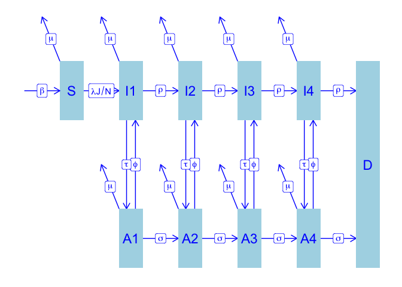

HIV
================
Steve Walker

- [Dynamics](#dynamics)
- [Example](#example)
- [References](#references)

HIV model by ([Granich et al. 2009](#ref-granich2009universal)).

# Dynamics


# Example

``` r
spec = mp_tmb_library(
    "starter_models", "HIV"
  , package = "macpan2"
)
outputs = c(
    "D_bg", "D"
  , "Itotal", "Atotal", "J"
  , "lambda", "N", "P", "S"
)
sim = (spec
  |> mp_hazard()
  |> mp_simulator(time_steps = 30L, outputs)
)
(sim
  |> mp_trajectory()
  |> ggplot()
  + geom_line(aes(time, value))
  + facet_wrap(~ matrix, ncol = 3, scales = 'free')
)
```

<!-- -->

# References

<div id="refs" class="references csl-bib-body hanging-indent">

<div id="ref-granich2009universal" class="csl-entry">

Granich, Reuben M, Charles F Gilks, Christopher Dye, Kevin M De Cock,
and Brian G Williams. 2009. “Universal Voluntary HIV Testing with
Immediate Antiretroviral Therapy as a Strategy for Elimination of HIV
Transmission: A Mathematical Model.” *The Lancet* 373 (9657): 48–57.
<https://www.thelancet.com/journals/lancet/article/PIIS0140-6736(08)61697-9/abstract>.

</div>

</div>
