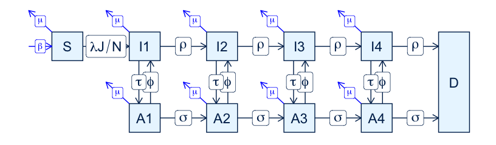
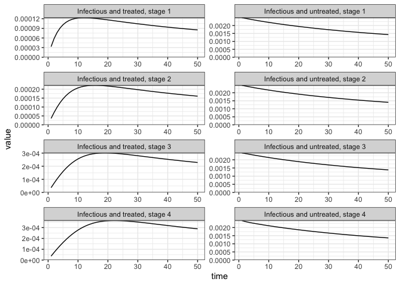
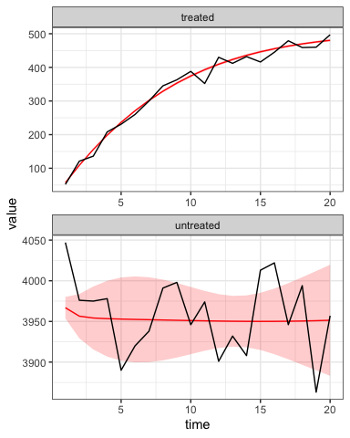

HIV
================
Steve Walker

-   <a href="#packages-used" id="toc-packages-used">Packages Used</a>
-   <a href="#model-specification" id="toc-model-specification">Model
    Specification</a>
-   <a href="#states" id="toc-states">States</a>
-   <a href="#parameters" id="toc-parameters">Parameters</a>
-   <a href="#force-of-infection"
    id="toc-force-of-infection">Force-of-Infection</a>
-   <a href="#solving-the-odes" id="toc-solving-the-odes">Solving the
    ODEs</a>
-   <a href="#calibration" id="toc-calibration">Calibration</a>
-   <a href="#references" id="toc-references">References</a>

This article describes a `macpan2` implementation of the HIV model
proposed by ([Granich et al. 2009](#ref-granich2009universal)). This
model played a key role in advancing HIV prevention using antiretroviral
therapy, predicting that a test-and-treat strategy would substantially
lower HIV incidence ([Hayes et al. 2019](#ref-hayes2019effect)). Default
parameter estimates
[here](https://github.com/canmod/macpan2/blob/main/inst/starter_models/hiv/tmb.R)
are inspired by ([Kretzschmar et al.
2013](#ref-kretzschmar2013prospects)).

# Packages Used

The code in this article uses the following packages, and set an option
that keeps the article tidier by suppressing information about
optimization.

``` r
library(macpan2)
library(ggplot2)
library(dplyr)
options(macpan2_verbose = FALSE)
```

# Model Specification

This model has been specified in the `hiv` directory
[here](https://github.com/canmod/macpan2/blob/main/inst/starter_models/hiv/tmb.R)
and is accessible from the `macpan2` model library (see [Example
Models](https://canmod.github.io/macpan2/articles/example_models.html)
for details). We can read in the model specification using the
`mp_tmb_library` command.

``` r
spec = mp_tmb_library(
    "starter_models"
  , "hiv"
  , package = "macpan2"
)
```

This specification can be used to draw the following flow diagram using
code found in the [source for this
article](https://github.com/canmod/macpan2/blob/main/inst/starter_models/hiv/README.Rmd).

<!-- -->

# States

| Variable | Description                                                                                                        |
|----------|--------------------------------------------------------------------------------------------------------------------|
| S        | Number of susceptible individuals.                                                                                 |
| I1 - I4  | Numbers of infectious individuals who are not treated. The number gives the state of disease progression from 1-4. |
| A1 - A4  | Numbers of infectious individuals who are treated. The number gives the state of disease progression from 1-4.     |
| D        | Number of individuals who have died from the disease.                                                              |

# Parameters

| Variable    | Description                                                                                                     |
|-------------|-----------------------------------------------------------------------------------------------------------------|
| $\lambda_0$ | Baseline transmission rate.                                                                                     |
| $\alpha$    | Constant in non-linear transmission rate, accounting for heterogeneity in sexual behaviour.                     |
| $n$         | Constant in non-linear transmission rate, accounting for heterogeneity in sexual behaviour.                     |
| $\epsilon$  | Constant, in non-linear transmission rate, measuring the relative decrease in transmission caused by treatment. |
| $\beta$     | Per-capita birth rate.                                                                                          |
| $\mu$       | Per-capita (background) death rate.                                                                             |
| $\rho$      | Per-capita rate of disease progression for non-treated individuals.                                             |
| $\sigma$    | Per-capita rate of disease progression for treated individuals.                                                 |
| $\tau$      | Per-capita rate at which individuals become protected.                                                          |
| $\phi$      | Per-capita rate at which individuals become unprotected.                                                        |

# Force-of-Infection

This model has the somewhat non-standard functional form for the
force-of-infection (per-capita transition rate from `S` to `I1`):

$$
\frac{\lambda J}{N}
$$

The symbols in this expression are defined as follows.

-   $\lambda = \lambda_0 e^{-\alpha P^n}$
-   $P = I/N$
-   $I = \sum_i(I_i + A_i)$
-   $J = \sum_i(I_i + \epsilon A_i)$
-   $N$ is the total number of alive boxes

The remaining transition rates are constant per-capita rates.

# Solving the ODEs

Here is an example trajectory from this model with small
[updates](https://canmod.github.io/macpan2/reference/mp_tmb_update) to
the default parameters, using the [Runge-Kutta ODE
solver](https://canmod.github.io/macpan2/reference/state_updates).

``` r
outputs = c(sprintf("I%s", 1:4), sprintf("A%s", 1:4))
sim = (spec
  |> mp_tmb_update(default = list(lambda0 = 0.36, n = 0.2))
  |> mp_rk4()
  |> mp_simulator(time_steps = 50L, outputs)
)
(sim
  |> mp_trajectory()
  |> mutate(matrix = sub("^A([1-4])$", "Infectious and treated, stage \\1", matrix))
  |> mutate(matrix = sub("^I([1-4])$", "Infectious and untreated, stage \\1", matrix))
  |> ggplot()
  + geom_line(aes(time, value))
  + facet_wrap(~ matrix, ncol = 2, scales = 'free', dir = "v")
  + scale_y_continuous(limits = c(0, NA), expand = c(0, 0))
  + theme_bw()
)
```

<!-- -->

# Calibration

To illustrate calibration, we simulate 20 years of data from a
population of `1e7` people using two variables: the prevalence of
infectious individuals who are `treated` and `untreated`. We initialize
with `1000` infectious individuals in each of the four disease stages,
and zero untreated individuals. We add Poisson noise to these variables.
We also compute reported incidence using a reporting fraction of `0.1`.
Although we do not use the resulting `reports` variable in this example,
we include it to demonstrate how such a variable can be generated.

``` r
set.seed(1L)
spec_for_cal = (spec
  |> mp_tmb_update(
      default = list(lambda0 = 0.38, n = 0.2)
    , inits = list(
          S = 1e7 - 4000
        , I1 = 1000, I2 = 1000, I3 = 1000, I4 = 1000
        , A1 = 0   , A2 = 0   , A3 = 0   , A4 = 0
      )
  )
  |> mp_rk4()
  |> mp_tmb_insert(at = Inf, expressions = list(
      treated ~ A1 + A2 + A3 + A4
    , untreated ~ I1 + I2 + I3 + I4
    , reports ~ 0.1 * infection
  ))
)
simulated_data = (spec_for_cal
  |> mp_simulator(time_steps = 20L, c("treated", "untreated"))
  |> mp_trajectory()
  |> mutate(value = rpois(n(), value))
)
(simulated_data
  |> rename(`Observation Year` = time)
  |> rename(Value = value)
  |> ggplot()
  + geom_line(aes(`Observation Year`, Value))
  + facet_wrap(~matrix, ncol = 1, scales = "free")
  + theme_bw()
)
```

<!-- -->

We calibrate this model data simulated from it, but start away from the
true parameter values by specifying that the default `lambda0 = 0.2` and
`n = 0.5`. We assume a Poisson likelihood to match the Poisson noise
that we used to produce the simulated data. For numerical stability, we
optimize `lambda0` and `n` on the log and logit scales respectively.

``` r
calibrator = (spec_for_cal
  |> mp_tmb_update(default = list(lambda0 = 0.2, n = 0.5))
  |> mp_tmb_calibrator(
        data = simulated_data
      , traj = list(
            treated = mp_poisson()
          , untreated = mp_poisson()
      )
      , par = c("log_lambda0", "logit_n")
  )
)
mp_optimize(calibrator)
#> $par
#>     params     params 
#> -0.9526784 -1.8874755 
#> 
#> $objective
#> [1] 194.0068
#> 
#> $convergence
#> [1] 0
#> 
#> $iterations
#> [1] 44
#> 
#> $evaluations
#> function gradient 
#>       51       45 
#> 
#> $message
#> [1] "relative convergence (4)"
```

The convergence code is `0`, which is good.

``` r
mp_optimizer_output(calibrator)$convergence
#> [1] 0
```

The true parameters, `lambda0 = 0.38` and `n = 0.2`, are in the
confidence intervals, although the confidence interval for `n` is quite
wide.

``` r
(mp_tmb_coef(calibrator, conf.int = TRUE)
 |> select(-term, -row, -col, -type)
)
#>       mat default  estimate  std.error    conf.low conf.high
#> 1 lambda0     0.2 0.3857066 0.02514815 0.339436497 0.4382839
#> 2       n     0.5 0.1315326 0.23314560 0.002765574 0.8921398
```

The simulated data (black) that we fit to matches the predictions of the
fitted model (red) with 95% confidence intervals for the point
prediction).

``` r
(calibrator
 |> mp_trajectory_sd(conf.int = TRUE)
 |> ggplot()
 + geom_line(aes(time, value), colour = "red")
 + geom_ribbon(aes(time, ymin = conf.low, ymax = conf.high), alpha = 0.2, fill = "red")
 + geom_line(aes(time, value), data = simulated_data)
 + facet_wrap(~matrix, ncol = 1, scales = "free")
 + theme_bw()
)
```

<!-- -->

# References

<div id="refs" class="references csl-bib-body hanging-indent">

<div id="ref-granich2009universal" class="csl-entry">

Granich, Reuben M, Charles F Gilks, Christopher Dye, Kevin M De Cock,
and Brian G Williams. 2009. “Universal Voluntary HIV Testing with
Immediate Antiretroviral Therapy as a Strategy for Elimination of HIV
Transmission: A Mathematical Model.” *The Lancet* 373 (9657): 48–57.
<https://www.thelancet.com/journals/lancet/article/PIIS0140-6736(08)61697-9/abstract>.

</div>

<div id="ref-hayes2019effect" class="csl-entry">

Hayes, Richard J, Deborah Donnell, Sian Floyd, Nomtha Mandla, Justin
Bwalya, Kalpana Sabapathy, Blia Yang, et al. 2019. “Effect of Universal
Testing and Treatment on HIV Incidence—HPTN 071 (PopART).” *New England
Journal of Medicine* 381 (3): 207–18.

</div>

<div id="ref-kretzschmar2013prospects" class="csl-entry">

Kretzschmar, Mirjam E, Maarten F Schim van der Loeff, Paul J Birrell,
Daniela De Angelis, and Roel A Coutinho. 2013. “Prospects of Elimination
of HIV with Test-and-Treat Strategy.” *Proceedings of the National
Academy of Sciences* 110 (39): 15538–43.

</div>

</div>
