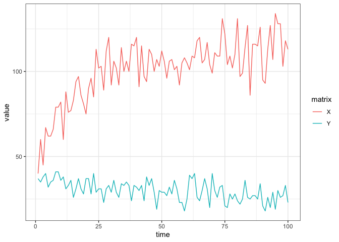
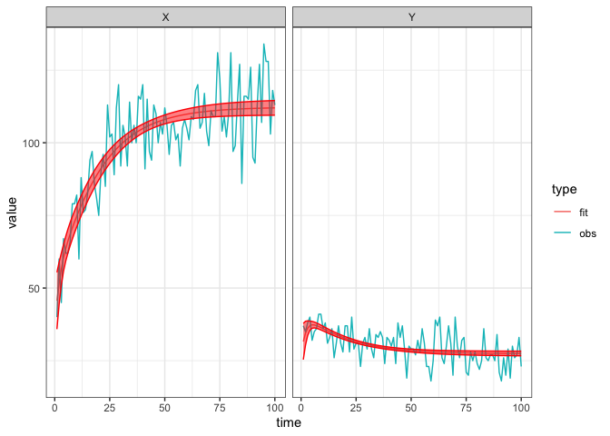

Lotka-Volterra
================
Jen Freeman, Steve Walker

-   <a href="#packages-used-and-settings"
    id="toc-packages-used-and-settings">Packages Used and Settings</a>
-   <a href="#model-specification" id="toc-model-specification">Model
    Specification</a>
-   <a href="#species" id="toc-species">Species</a>
-   <a href="#parameters" id="toc-parameters">Parameters</a>
-   <a href="#dynamics" id="toc-dynamics">Dynamics</a>
-   <a href="#calibration" id="toc-calibration">Calibration</a>
    -   <a href="#simulate-fake-data" id="toc-simulate-fake-data">Simulate fake
        data</a>
    -   <a href="#calibration-1" id="toc-calibration-1">Calibration</a>
    -   <a href="#explore-the-fit" id="toc-explore-the-fit">Explore the fit</a>
-   <a href="#references" id="toc-references">References</a>

The simplest Lotka-Volterra competition model with two competing species
([Hastings 1997](#ref-Hastings1997competition)). This is not a
compartmental model because individuals of one species do not become
individuals of the other, unlike say an SIR model where susceptible
individuals become infectious and then recovered. This competition
model, and this other [predator-prey
model](https://github.com/canmod/macpan2/tree/main/inst/starter_models/lotka_volterra_predator_prey),
illustrate how `macpan2` can be used for general dynamical modelling.

# Packages Used and Settings

The code in this article uses the following packages.

``` r
library(ggplot2)
library(dplyr)
library(tidyr)
library(macpan2)
```

To keep the optimizer from printing too much in this article, we set the
`macpan2_verbose` option to `FALSE`.

``` r
options(macpan2_verbose = FALSE)
```

# Model Specification

This model has been specified in the `lotka_volterra_competition`
directory
[here](https://github.com/canmod/macpan2/blob/main/inst/starter_models/lotka_volterra_competition/tmb.R)
and is accessible from the `macpan2` model library (see [Example
Models](https://canmod.github.io/macpan2/articles/example_models.html)
for details). We can read in the model specification using the
`mp_tmb_library` command.

``` r
spec = mp_tmb_library(
    "starter_models"
  , "lotka_volterra_competition"
  , package = "macpan2"
)
print(spec)
#> ---------------------
#> Default values:
#>  quantity   value
#>        rx 5.0e-01
#>        ry 5.0e-01
#>       axx 5.0e-03
#>       ayy 2.0e-02
#>       axy 1.6e-02
#>       ayx 7.5e-03
#>         X 1.0e+02
#>         Y 1.0e+02
#> ---------------------
#> 
#> ---------------------
#> At every iteration of the simulation loop (t = 1 to T):
#> ---------------------
#> 1: growth_x ~ rx * X
#> 2: growth_y ~ ry * Y
#> 3: intraspecific_x ~ growth_x * axx * X
#> 4: intraspecific_y ~ growth_y * ayy * Y
#> 5: interspecific_xy ~ growth_x * axy * Y
#> 6: interspecific_yx ~ growth_y * ayx * X
#> 7: X ~ X + growth_x - intraspecific_x - interspecific_xy
#> 8: Y ~ Y + growth_y - intraspecific_y - interspecific_yx
```

# Species

| variable | description                          |
|----------|--------------------------------------|
| $X$      | number of individuals in species $x$ |
| $Y$      | number of individuals in species $y$ |

# Parameters

| variable      | description                                                                                          |
|---------------|------------------------------------------------------------------------------------------------------|
| $r_i$         | growth rate of species $i$                                                                           |
| $a_{ij}$      | intra/inter-specific density dependence, \`\`effect of species $j$ on species $i$’’ (Hastings, 1997) |
| $K_{i}$       | carrying capacity of species $i$                                                                     |
| $\alpha_{ij}$ | relative effect of species $j$ on species $i$ (Hastings, 1997)                                       |

# Dynamics

$$
\begin{align*}
\frac{dX}{dt} &= r_x X (1 - a_{xx}X - a_{xy}Y) \\
\frac{dY}{dt} &= r_y Y (1 - a_{yy}Y - a_{yx}X)
\end{align*}
$$

This model can also be expressed in an equivalent form using the
carrying capacity of each species.

$$
\begin{align*}
\frac{dX}{dt} &= \frac{r_x X}{K_x} (K_x - X - \alpha_{xy}Y) \\
\frac{dY}{dt} &= \frac{r_y Y}{K_y} (K_y - Y - \alpha_{yx}X)
\end{align*}
$$

# Calibration

## Simulate fake data

The first step when testing a new fitting procedure is to simulate
clean, well-behaved data from the model and check if you can recover
parameters close to the true values (see
[here](https://canmod.github.io/macpan2/articles/calibration.html) for
an article on this topic). We modify the specification so that it is
different from the default library model, which we will then calibrate
using data generated from this modified model.

``` r
set.seed(1L)
# set number of time steps in simulation
time_steps = 100L
# ayx value to simulate data with (species X has a carrying capacity of 200)
true = list(ayx = 0.8/200)

# simulator object
fake_data = (spec
  |> mp_tmb_insert(
      phase = "during"
    , at = Inf
    , expressions = list(X_noisy ~ rpois(X), Y_noisy ~ rpois(Y))
    , default = true
  )
  |> mp_simulator(  
      time_steps = time_steps
    , outputs = c("X_noisy","Y_noisy")
  )
  |> mp_trajectory()
  |> mutate(matrix = substr(matrix, 1L, 1L))
)

(fake_data
  |> ggplot()
  + geom_line(aes(time, value, colour = matrix))
  + theme_bw()
)
```

<!-- -->

The two species seem to be coexisting.

## Calibration

Even though we only modified one competition coefficient, `ayx`, we find
that we need to also fit the intrinsic rates of increase to get a good
fit (see graph below). This suggests that there is a non-identifiability
issue with this model.

``` r
cal = (spec
  |> mp_tmb_calibrator(
      data = fake_data
    , traj = c("X", "Y")
    , par = c("ayx","rx", "ry")
  )
)
mp_optimize(cal)
#> $par
#>      params      params      params 
#> 0.004023304 0.494351681 0.487803593 
#> 
#> $objective
#> [1] 675.2573
#> 
#> $convergence
#> [1] 0
#> 
#> $iterations
#> [1] 10
#> 
#> $evaluations
#> function gradient 
#>       19       11 
#> 
#> $message
#> [1] "relative convergence (4)"
```

## Explore the fit

The calibration object now contains the information gained through
optimization. We can use this information to check the fitted parameter
values.

``` r
mp_tmb_coef(cal, conf.int = TRUE) |> round_coef_tab()
#>   mat row default estimate std.error conf.low conf.high
#> 1 ayx   0  0.0075   0.0040    0.0000   0.0040    0.0041
#> 2  rx   0  0.5000   0.4944    0.0453   0.4055    0.5832
#> 3  ry   0  0.5000   0.4878    0.0234   0.4420    0.5336
print(true)
#> $ayx
#> [1] 0.004
```

The estimate is different enough from the default to indicate that the
optimizer did ‘something’, and the estimate is close enough to the true
value to indicate that it did the right thing.

Here is the fit to the data.

``` r
comparison_data = list(
    obs = fake_data
  , fit = mp_trajectory_sd(cal, conf.int = TRUE)
) |> bind_rows(.id = "type")
(comparison_data
  |> ggplot()
  + geom_line(aes(time, value, colour = type))
  + facet_wrap(~matrix)
  + geom_ribbon(aes(time, ymin = conf.low, ymax = conf.high)
    , colour = "red"
    , fill = "red"
    , alpha = 0.5
    , filter(comparison_data, type == "fit")
  )
  + theme_bw()
)
```

<!-- -->

# References

<div id="refs" class="references csl-bib-body hanging-indent">

<div id="ref-Hastings1997competition" class="csl-entry">

Hastings, Alan. 1997. “Competition.” In *Population Biology: Concepts
and Models*, 129–49. New York, NY: Springer New York.
<https://doi.org/10.1007/978-1-4757-2731-9_7>.

</div>

</div>
