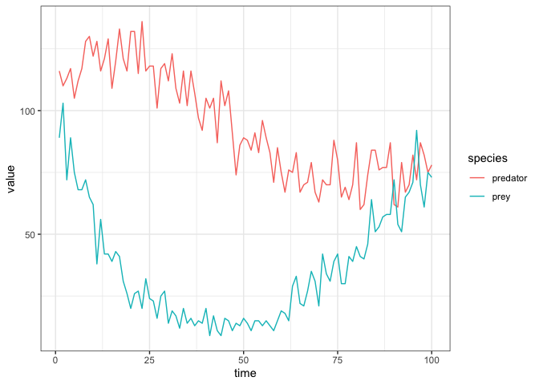
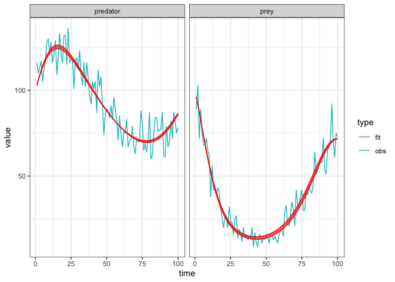

Lotka-Volterra
================
Jen Freeman, Steve Walker

-   <a href="#packages-used-and-settings"
    id="toc-packages-used-and-settings">Packages Used and Settings</a>
-   <a href="#model-specifications" id="toc-model-specifications">Model
    Specifications</a>
-   <a href="#species" id="toc-species">Species</a>
-   <a href="#parameters" id="toc-parameters">Parameters</a>
-   <a href="#dynamics" id="toc-dynamics">Dynamics</a>
    -   <a href="#simple-predator-prey" id="toc-simple-predator-prey">Simple
        Predator-Prey</a>
    -   <a href="#logistic-prey-growth" id="toc-logistic-prey-growth">Logistic
        Prey Growth</a>
    -   <a href="#functional-response" id="toc-functional-response">Functional
        Response</a>
        -   <a href="#holling-type-i" id="toc-holling-type-i">Holling type I</a>
        -   <a href="#holling-type-ii" id="toc-holling-type-ii">Holling type II</a>
        -   <a href="#holling-type-iii" id="toc-holling-type-iii">Holling type
            III</a>
    -   <a href="#general-form" id="toc-general-form">General Form</a>
-   <a href="#calibration" id="toc-calibration">Calibration</a>
    -   <a href="#simulate-fake-data" id="toc-simulate-fake-data">Simulate fake
        data</a>
    -   <a href="#calibration-1" id="toc-calibration-1">Calibration</a>
    -   <a href="#explore-the-fit" id="toc-explore-the-fit">Explore the fit</a>
-   <a href="#references" id="toc-references">References</a>

Lotka-Volterra predator-prey models with two competing species
([Hastings 1997](#ref-Hastings1997predatorprey)). This is not a
compartmental model because individuals of one species do not become
individuals of the other, unlike say an SIR model where susceptible
individuals become infectious and then recovered. This predator-prey
model, and this other [competition
model](https://github.com/canmod/macpan2/tree/main/inst/starter_models/lotka_volterra_competition),
illustrate how `macpan2` can be used for general dynamical modelling.

# Packages Used and Settings

The code in this article uses the following packages.

``` r
library(ggplot2)
library(dplyr)
library(tidyr)
library(macpan2)
```

To keep the optimizer from printing too much in this article, we set the
`macpan2_verbose` option to `FALSE`.

``` r
options(macpan2_verbose = FALSE)
```

# Model Specifications

These models have been specified in the `lotka_volterra_predator_prey`
directory
[here](https://github.com/canmod/macpan2/blob/main/inst/starter_models/lotka_volterra_predator_prey/tmb.R)
and are accessible from the `macpan2` model library (see [Example
Models](https://canmod.github.io/macpan2/articles/example_models.html)
for details). We can read in the model specifications using the
`mp_tmb_library` command.

``` r
specs = mp_tmb_library(
    "starter_models"
  , "lotka_volterra_predator_prey"
  , package = "macpan2"
  , alternative_specs = TRUE
)
```

# Species

| variable | description         |
|----------|---------------------|
| $X$      | number of prey      |
| $Y$      | number of predators |

# Parameters

| variable | description                                                                                                              |
|----------|--------------------------------------------------------------------------------------------------------------------------|
| $\alpha$ | per capita growth rate of prey, in the absence of predators (Hastings, 1997)                                             |
| $\gamma$ | per capita rate of predator loss, in the absence of prey                                                                 |
| $\beta$  | per capita mortality rate of prey fom predation                                                                          |
| $\delta$ | per capita growth rate of predators from predation                                                                       |
| $K$      | prey carrying capacity                                                                                                   |
| $f(X)$   | per predator predation rate as a function of the number of prey, also called [functional response](#functional-response) |

# Dynamics

## Simple Predator-Prey

In the simple predator-prey Lotka-Volterra model, we assume exponential
growth and decay for prey and predators respectively.

$$
\begin{align*}
\frac{dX}{dt} &= \alpha X - \beta X Y \\
\frac{dY}{dt} &= \delta XY - \gamma Y
\end{align*}
$$

The model specification for this model is as follows.

``` r
specs$holling_1
#> ---------------------
#> Default values:
#> ---------------------
#>     matrix row col value
#>      alpha         2e-01
#>      gamma         2e-02
#>      delta         1e-01
#>  K_inverse         2e-03
#>          a         2e-03
#>          h         1e+00
#>          k         2e+00
#>          X         1e+02
#>          Y         1e+02
#> 
#> ---------------------
#> At every iteration of the simulation loop (t = 1 to T):
#> ---------------------
#> 1: growth_x ~ alpha * X * (1 - K_inverse * (X))
#> 2: mortality_y ~ gamma * Y
#> 3: functional_response ~ a * X
#> 4: mortality_x ~ functional_response * Y
#> 5: growth_y ~ delta * functional_response * Y
#> 6: X ~ X + growth_x - mortality_x
#> 7: Y ~ Y + growth_y - mortality_y
```

## Logistic Prey Growth

We modify the simple model to include logisitic prey growth in the
absence of predators with a prey carrying capacity of $K$.

$$
\begin{align*}
\frac{dX}{dt} &= \alpha X \left(1 - \frac{X}{K}\right)- \beta X Y \\
\frac{dY}{dt} &= \delta XY - \gamma Y
\end{align*}
$$

The model specification for this model is as follows.

``` r
specs$holling_2
#> ---------------------
#> Default values:
#> ---------------------
#>     matrix row col value
#>      alpha         2e-01
#>      gamma         2e-02
#>      delta         1e-01
#>  K_inverse         2e-03
#>          a         2e-03
#>          h         1e+00
#>          k         2e+00
#>          X         1e+02
#>          Y         1e+02
#> 
#> ---------------------
#> At every iteration of the simulation loop (t = 1 to T):
#> ---------------------
#> 1: growth_x ~ alpha * X * (1 - K_inverse * (X))
#> 2: mortality_y ~ gamma * Y
#> 3: functional_response ~ a * X/(1 + a * h * X)
#> 4: mortality_x ~ functional_response * Y
#> 5: growth_y ~ delta * functional_response * Y
#> 6: X ~ X + growth_x - mortality_x
#> 7: Y ~ Y + growth_y - mortality_y
```

## Functional Response

The functional response $f(X)$ describes the predation rate as a
function of prey density (Hastings, 1997). In the simplest case, we
assume a linear function of prey, $f(X) = aX$ also called a [type I
Holling](#holling-type-i) response. The simple predator-prey model
includes a type I Holling response. Increasing functions that approach
horizontal asymptotes can be used to represent more ecologically
realistic predation rates to communicate that predation does not
indefinitely increase when prey are abundant. The [type II
Holling](#holling-type-ii) response is parameterized by the predator
*attack rate* $a$, and the time elapsed by the predator capturing and
consuming prey, called the *handling time* $h$ ([Bolker
2008](#ref-bolker2008)). A [Holling type III](#holling-type-iii)
response is defined with higher powers of prey density.

### Holling type I

$$ f(X) = a X \:, a>0$$

### Holling type II

$$ f(X) = \frac{a X}{1+ ahX} \:,  a > 0  \:, h > 0$$

### Holling type III

$$ f(X) = \frac{a X^k}{1 + ah X^k} \:, k > 1$$

## General Form

The general predator-prey dynamics incorporating the functional response
$f(X)$ is given below.

$$
\begin{align*}
\frac{dX}{dt} &= \alpha X\left(1-\frac{X}{K}\right) - f(X) Y\\
\frac{dY}{dt} &= \delta f(X)Y - \gamma Y 
\end{align*}
$$

Note if we parameterize the general dynamics by the inverse of the
carrying capacity $K$, we can recover the exponential prey growth model
by setting $K^{-1}=0$ and using the Holling type I response with $\beta$
as the attack rate.

The model specification for this model is as follows.

``` r
specs$holling_3
#> ---------------------
#> Default values:
#> ---------------------
#>     matrix row col value
#>      alpha         2e-01
#>      gamma         2e-02
#>      delta         1e-01
#>  K_inverse         2e-03
#>          a         2e-03
#>          h         1e+00
#>          k         2e+00
#>          X         1e+02
#>          Y         1e+02
#> 
#> ---------------------
#> At every iteration of the simulation loop (t = 1 to T):
#> ---------------------
#> 1: growth_x ~ alpha * X * (1 - K_inverse * (X))
#> 2: mortality_y ~ gamma * Y
#> 3: functional_response ~ a * (X^k)/(1 + a * h * (X^k))
#> 4: mortality_x ~ functional_response * Y
#> 5: growth_y ~ delta * functional_response * Y
#> 6: X ~ X + growth_x - mortality_x
#> 7: Y ~ Y + growth_y - mortality_y
```

# Calibration

## Simulate fake data

The first step when testing a new fitting procedure is to simulate
clean, well-behaved data from the model and check if you can recover
parameters close to the true values (see
[here](https://canmod.github.io/macpan2/articles/calibration.html)) for
an article on this topic). We modify the specification so that it is
different from the default library model, which we will then calibrate
using data generated from this modified model.

``` r
spec = specs$holling_1
set.seed(1L)
# set number of time steps in simulation
time_steps = 100L
# delta value to simulate data with
true = list(delta = 2.5/10)

# simulator object
fake_data = (spec
  |> mp_tmb_insert(
      phase = "during"
    , at = Inf
    , expressions = list(X_noisy ~ rpois(X), Y_noisy ~ rpois(Y))
    , default = true
  )
  |> mp_simulator(  
      time_steps = time_steps
    , outputs = c("X_noisy","Y_noisy")
  )
  |> mp_trajectory()
  |> mutate(matrix = substr(matrix, 1L, 1L))
)

(fake_data
  |> mutate(species = ifelse(matrix == "X", "prey", "predator"))
  |> ggplot()
  + geom_line(aes(time, value, colour = species))
  + theme_bw()
)
```

<!-- -->

## Calibration

``` r
cal = (spec
  |> mp_tmb_calibrator(
      data = fake_data
    , traj = c("X", "Y")
    , par = "delta"
  )
)
mp_optimize(cal)
#> $par
#>    params 
#> 0.2522155 
#> 
#> $objective
#> [1] 663.3269
#> 
#> $convergence
#> [1] 0
#> 
#> $iterations
#> [1] 6
#> 
#> $evaluations
#> function gradient 
#>        7        7 
#> 
#> $message
#> [1] "relative convergence (4)"
```

## Explore the fit

The calibration object now contains the information gained through
optimization. We can use this information to check the fitted parameter
values.

``` r
coef = mp_tmb_coef(cal) |> round_coef_tab()
coef$true = true[coef$mat]
print(coef)
#>     mat row default estimate std.error true
#> 1 delta   0     0.1   0.2522    0.0027 0.25
```

The estimate is different enough from the default to indicate that the
optimizer did ‘something’, and the estimate is close enough to the true
value to indicate that it did the right thing. Indeed the fit to the
data is excellent, although we should expect this given that we fitted
the same model used to generate the data. Note well that it is usually
not this easy (see the
[seir](https://github.com/canmod/macpan2/tree/main/inst/starter_models/seir)
model for a peak at what can go wrong).

Here is the fit to the data.

``` r
comparison_data = list(
    obs = fake_data
  , fit = mp_trajectory_sd(cal, conf.int = TRUE)
) |> bind_rows(.id = "type") |> mutate(species = ifelse(matrix == "X", "prey", "predator"))
(comparison_data
  |> ggplot()
  + geom_line(aes(time, value, colour = type))
  + facet_wrap(~species)
  + geom_ribbon(aes(time, ymin = conf.low, ymax = conf.high)
    , colour = "red"
    , fill = "red"
    , alpha = 0.5
    , filter(comparison_data, type == "fit")
  )
  + theme_bw()
)
```

<!-- -->

Starting to see those classic predator-prey cycles!

# References

<div id="refs" class="references csl-bib-body hanging-indent">

<div id="ref-bolker2008" class="csl-entry">

Bolker, Benjamin M. 2008. *Ecological Models and Data in R*. Princeton:
Princeton University Press. <https://doi.org/doi:10.1515/9781400840908>.

</div>

<div id="ref-Hastings1997predatorprey" class="csl-entry">

Hastings, Alan. 1997. “Predator-Prey Interactions.” In *Population
Biology: Concepts and Models*, 151–80. New York, NY: Springer New York.
<https://doi.org/10.1007/978-1-4757-2731-9_8>.

</div>

</div>
