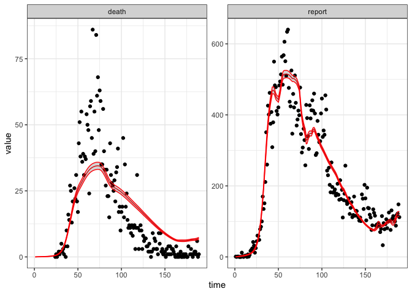

Macpan Base
================
Jennifer Freeman

-   <a href="#packages-and-settings-used"
    id="toc-packages-and-settings-used">Packages and Settings Used</a>
-   <a href="#model-specification" id="toc-model-specification">Model
    Specification</a>
-   <a href="#states" id="toc-states">States</a>
-   <a href="#parameters" id="toc-parameters">Parameters</a>
-   <a href="#differential-equations"
    id="toc-differential-equations">Differential Equations</a>
-   <a href="#calibration" id="toc-calibration">Calibration</a>
    -   <a href="#observed-data-prep" id="toc-observed-data-prep">Observed data
        prep</a>
    -   <a href="#mobility-sub-model" id="toc-mobility-sub-model">Mobility
        Sub-Model</a>
    -   <a href="#update-the-model-specification-for-calibration"
        id="toc-update-the-model-specification-for-calibration">Update the Model
        Specification for Calibration</a>
    -   <a href="#calibration-1" id="toc-calibration-1">Calibration</a>
    -   <a href="#explore-calibration" id="toc-explore-calibration">Explore
        Calibration</a>
-   <a href="#computing-mathcalr_0-with-a-cohort-model"
    id="toc-computing-mathcalr_0-with-a-cohort-model">Computing <span
    class="math inline">ℛ<sub>0</sub></span> with a Cohort Model</a>
-   <a href="#references" id="toc-references">References</a>

The McMasterPandemic model ([Bolker et al. 2024](#ref-macpan)), which is
modified SEIR model that incorporates additional infectious compartments
to reflect COVID-19 epidemiology. Exposed individuals enter four
infectious compartments characterized by symptom status (asymptomatic,
pre-symptomatic, mild, and severe). Severely infected individuals
require care through hospital and/or Intensive Care Unit (ICU)
compartments and either recover or die. This model was used throughout
the pandemic to support public health responses (e.g.,
<https://mac-theobio.github.io/forecasts/outputs/ON_accuracy.html>).

# Packages and Settings Used

The code in this article uses the following packages.

``` r
library(macpan2)
library(ggplot2)
library(dplyr)
```

To keep the optimizer from printing too much in this article, we set the
`macpan2_verbose` option to `FALSE`.

``` r
options(macpan2_verbose = FALSE)
```

# Model Specification

This model has been specified in the `macpan_base` directory
[here](https://github.com/canmod/macpan2/blob/main/inst/starter_models/macpan_base/tmb.R)
and is accessible from the `macpan2` model library (see [Example
Models](https://canmod.github.io/macpan2/articles/example_models.html)
for details). We can read in the model specification using the
`mp_tmb_library` command.

``` r
spec = mp_tmb_library(
    "starter_models"
  , "macpan_base"
  , package = "macpan2"
)
```

This specification can be used to draw the following flow diagram using
code found in the [source for this
article](https://github.com/canmod/macpan2/blob/main/inst/starter_models/macpan_base/README.Rmd).

<!-- -->

# States

| variable | description                                                         |
|----------|---------------------------------------------------------------------|
| $S$      | Number of susceptible individuals                                   |
| $E$      | Number of exposed individuals                                       |
| $I_a$    | Number of asymptomatic infectious individuals                       |
| $I_p$    | Number of pre-symptomatic infectious individuals                    |
| $I_m$    | Number of mildly infectious individuals                             |
| $I_s$    | Number of severely infectious individuals                           |
| $H$      | Number of hospitalized individuals (acute care)                     |
| $ICU_s$  | Number of individuals admitted to the ICU with a survival prognosis |
| $ICU_d$  | Number of individuals admitted to the ICU with a death prognosis    |
| $H_2$    | Number of hospitalized individuals (acute care) after ICU stay      |
| $D$      | Number of dead individuals                                          |
| $R$      | Number of recovered individuals                                     |

The size of the total population is,
$N = S + E + I_a + I_p + I_m + I_s + H + ICU_s + ICU_d + H_2 + D + R$.

# Parameters

| variable       | description                                                                         |
|----------------|-------------------------------------------------------------------------------------|
| $\beta_0$      | baseline (non-intervention) transmission across categories                          |
| $C_a$          | relative asymptomatic transmission (or contact) proportion                          |
| $C_p$          | relative presymptomatic transmission (or contact) proportion                        |
| $C_m$          | relative mildly transmission (or contact) proportion                                |
| $C_s$          | relative severly transmission (or contact) proportion                               |
| $\alpha$       | fraction of infections that are asymptomatic                                        |
| $\mu$          | fraction of symptomatic infections that are mild                                    |
| $\sigma$       | 1/time in exposed class                                                             |
| $\gamma_a$     | 1/time to recovery for asymptomatic infections                                      |
| $\gamma_p$     | 1/time in pre-symptomatic state                                                     |
| $\gamma_m$     | 1/time to recovery for mildly symptomatic infections                                |
| $\gamma_s$     | 1/time spent in severely symptomatic state before either hospitalization or death   |
| $\rho$         | 1/time in hospital (initial acute care admission)                                   |
| $\delta_{nh}$  | probability of mortality without hospitalization                                    |
| $\text{iso}_m$ | relative self-isolation/distancing of mild cases                                    |
| $\text{iso}_s$ | relative self-isolation/distancing of severe cases                                  |
| $\phi_1$       | fraction of hospitalized infections that only require acute care (no ICU admission) |
| $\phi_2$       | fraction of ICU infections that are fatal                                           |
| $\psi_1$       | 1/time spent in ICU before returning to acute care                                  |
| $\psi_2$       | 1/time spent in ICU before dying                                                    |
| $\psi_3$       | 1/time in post-ICU acute care before hospital discharge                             |

# Differential Equations

<!-- nb. do not remove the spaces in `\delta _ {nh}`. https://github.com/github/markup/issues/1575 -->

$$
\begin{align*}
\frac{dS}{dt} &= -\beta_0\left(C_aI_a +C_pI_p + C_mI_m(1-\text{iso}_m) + C_sI_s(1-\text{iso}_s)\right)S/N \\
\frac{dE}{dt} &= \beta_0\left(C_aI_a +C_pI_p + C_mI_m(1-\text{iso}_m) + C_sI_s(1-\text{iso}_s)\right)S/N - \sigma E \\
\frac{dI_a}{dt} &= \alpha\sigma E- \gamma_a I_a \\
\frac{dI_p}{dt} &= (1-\alpha)\sigma E- \gamma_p I_p \\
\frac{dI_m}{dt} &= \mu\gamma_pI_p- \gamma_m I_m \\
\frac{dI_s}{dt} &= (1-\mu)\gamma_pI_p- (1-\delta _ {nh})\gamma_s I_s \\
\frac{dH}{dt} &= (1-\delta _ {nh})\phi_1\gamma_s I_s - \rho H  \\
\frac{dICU_s}{dt} &= (1-\delta _ {nh})(1-\phi_1)(1-\phi_2)\gamma_s I_s - \psi_1 ICU_s \\
\frac{dICU_d}{dt} &= (1-\delta _ {nh})(1-\phi_1)\phi_2\gamma_s I_s - \psi_2 ICU_d \\
\frac{dH_2}{dt} &= \psi_1 ICU_s - \psi_3 H_2  \\
\frac{dR}{dt} &= \gamma_a I_a + \gamma_m I_m + \rho H + \psi_3 H_2 \\
\frac{dD}{dt} &=  \psi_2 ICU_d
\end{align*}
$$

# Calibration

## Observed data prep

We fit this model to observed death and case reports. For convenience we
have saved some Ontario COVID-19 data in the `macpan2` package.

``` r
ts_data  = ("https://github.com/canmod/macpan2"
  |> file.path("releases/download/macpan1.5_data/covid_on.RDS")
  |> url()
  |> readRDS()
)
```

To further prepare the time series data in the [format required by
`macpan2`](https://canmod.github.io/macpan2/reference/mp_trajectory.html#value)
we filter for the appropriate time range and time series variables, to
create a numeric date field named ‘time’.

``` r
prepped_ts_data = (ts_data
  |> rename(matrix = var)
  # dates from base model calibration (Figure 4)
  |> filter(date >= "2020-02-24" & date < "2020-08-31")
  # create unique time identifier
  |> arrange(date)
  |> group_by(date)
  |> mutate(time = cur_group_id())
  |> ungroup()
  # one negative value for daily deaths (removing for now time==178)
  # this explains negative values:
  # https://github.com/ccodwg/Covid19Canada?tab=readme-ov-file#datasets
  |> filter(matrix %in% c("death","report") & value >= 0)
)
```

To further prepare the mobility data for calibration we filter for the
appropriate time range, create a numeric date field named ‘time’ and
compute the logarithm of the mobility index.

``` r
prepped_mobility_data = (ts_data
  |> filter(var == "mobility_index")
  # dates from base model calibration (Figure 4)
  |> filter(date >= "2020-02-24" & date < "2020-08-31")
  # create unique time identifier
  |> arrange(date)
  |> group_by(date)
  |> mutate(time = cur_group_id())
  |> ungroup()
  |> mutate(log_mobility_ind = log(value))
)
```

Mobility breakpoints identified for piecewise varying transmission.

``` r
mobility_breaks = (prepped_ts_data
  |> filter(date %in% c("2020-04-01", "2020-08-07"), matrix == "report")
  |> pull(time)
)
```

To support code below, we define the number of time steps in the model
from the data.

``` r
time_steps = nrow(prepped_ts_data %>% select(date) %>% unique())
prepped_ts_data = select(prepped_ts_data, -date)
```

## Mobility Sub-Model

The function `S_j` computes the logistic transition curve for mobility
breakpoints, and this function is used to produce the model matrix, `X`,
describing the temporal change in transmission using mobility data and
piecewise breaks smoothed with the logistic curve.

``` r
S_j = function(t, tau_j, s) 1/(1 + exp((t - tau_j) / s))
X = cbind(
      prepped_mobility_data$log_mobility_ind
    , S_j(1:time_steps, mobility_breaks[1], 3)
    , S_j(1:time_steps, mobility_breaks[1], 3) * prepped_mobility_data$log_mobility_ind
    , S_j(1:time_steps, mobility_breaks[2], 3)
    , S_j(1:time_steps, mobility_breaks[2], 3) * prepped_mobility_data$log_mobility_ind
    ) %>% as.matrix()
X_sparse = macpan2:::sparse_matrix_notation(X, TRUE)
model_matrix_values = X_sparse$values
row_ind = X_sparse$row_index
col_ind = X_sparse$col_index
```

## Update the Model Specification for Calibration

Update model specification to include additional components described in
manuscript and required for calibration.

``` r
focal_model = (spec 
   # add variable transformations:
   |> mp_tmb_insert(phase = "before"
      , at = 1L
      , expressions = list(
          zeta ~ exp(log_zeta)
        , beta0 ~ exp(log_beta0)
        , nonhosp_mort ~ 1/(1+exp((-logit_nonhosp_mort)))
        , E ~ exp(log_E)
      )
      , default = list(
          log_zeta = empty_matrix
        , log_beta0 = empty_matrix
        , logit_nonhosp_mort = empty_matrix
        , log_E = empty_matrix
      )

   )
   
   # add accumulator variables:
   # death - new deaths each time step
   |> mp_tmb_insert(phase = "during"
      , at = Inf
      , expressions = list(death ~ ICUd.D + Is.D)
   )
   
   # add phenomenological heterogeneity:
   |> mp_tmb_update(phase = "during"
      , at = 1L
      , expressions = list(
        mp_per_capita_flow(
            "S", "E"
          , "((S/N)^zeta) * (beta / N) * (Ia * Ca + Ip * Cp + Im * Cm * (1 - iso_m) + Is * Cs *(1 - iso_s))"
          , "S.E"
        ))

   )
   
   # compute gamma-density delay kernel for convolution:
   |> mp_tmb_insert_reports("S.E"
      , report_prob = 0.1
      , mean_delay = 11
      , cv_delay = 0.25
      , reports_name = "report"
   )
   
   # add time-varying transmission with mobility data:
   |> mp_tmb_insert(phase = "before"
      , at = Inf
      , expressions = list(relative_beta_values ~ group_sums(model_matrix_values * log_mobility_coefficients[col_ind], row_ind, model_matrix_values))
      , default = list(log_mobility_coefficients = empty_matrix, model_matrix_values = empty_matrix)
      , integers = list(row_ind = row_ind, col_ind = col_ind)
   )
   |> mp_tmb_insert(phase = "during"
      , at = 1L
      , expressions = list(
        beta ~ exp(log_beta0 + relative_beta_values[time_step(1)])
      )
   )

)
```

## Calibration

``` r
focal_calib = mp_tmb_calibrator(
    spec = focal_model |> mp_rk4()
  , data = prepped_ts_data
  , traj = c("report","death") 
  , par = c(
      "log_zeta"
    , "log_beta0"
    , "logit_nonhosp_mort"
    , "log_mobility_coefficients"
    , "log_E" 
    # negative binomial dispersion parameters for reports and deaths get added
    # automatically with options(macpan2_default_loss = "neg_bin") set above
  )
  , outputs = c("death","report")
  , default = list(
    
    # states
    # Population of Ontario (2019) from:
    # https://github.com/mac-theobio/macpan_base/blob/main/code/ontario_calibrate_comb.R
      S = 14.57e6 - 5 
    , log_E = log(5)
    , Ia = 0
    , Ip = 0
    , Im = 0
    , Is = 0
    , R = 0
    , H = 0
    , ICUs = 0
    , ICUd = 0
    , H2 = 0
    , D = 0
    
    , model_matrix_values = model_matrix_values
    
    # set initial parameter values for optimizer
    
    , log_beta0 = log(5)
    , logit_nonhosp_mort = -0.5
    , log_mobility_coefficients = rep(0, 5)
    , log_zeta = 1
    
  )
)
# converges
mp_optimize(focal_calib)
#> $par
#>      params      params      params      params      params      params 
#>   4.4042951   0.6842091  -1.3224779 -15.1809756  -0.9490377  -2.1947153 
#>      params      params      params 
#>  -0.6351558  16.6501807   4.3367893 
#> 
#> $objective
#> [1] 2511.469
#> 
#> $convergence
#> [1] 0
#> 
#> $iterations
#> [1] 29
#> 
#> $evaluations
#> function gradient 
#>       44       30 
#> 
#> $message
#> [1] "relative convergence (4)"
```

## Explore Calibration

We can get the trajectory and confidence intervals.

``` r
fitted_data = mp_trajectory_sd(focal_calib, conf.int = TRUE)
```

View estimates and their confidence intervals.

``` r
mp_tmb_coef(focal_calib, conf.int = TRUE) |> round_coef_tab()
#>                     mat row default     estimate    std.error    conf.low
#> 1                  zeta   0  2.7183 8.180150e+01 3.706900e+00     74.8494
#> 2                 beta0   0  5.0000 1.982200e+00 2.147000e-01      1.6030
#> 3 mobility_coefficients   0  1.0000 0.000000e+00 0.000000e+00      0.0000
#> 4 mobility_coefficients   1  1.0000 3.871000e-01 4.840000e-02      0.3030
#> 5 mobility_coefficients   2  1.0000 1.114000e-01 1.520000e-02      0.0852
#> 6 mobility_coefficients   3  1.0000 5.299000e-01 8.700000e-03      0.5130
#> 7 mobility_coefficients   4  1.0000 1.702478e+07 4.289088e+07 122076.6145
#> 8                     E   0  5.0000 7.646170e+01 2.506630e+01     40.2157
#> 9          nonhosp_mort   0  0.3775 2.104000e-01 5.300000e-03      0.2002
#>      conf.high
#> 1 8.939920e+01
#> 2 2.451000e+00
#> 3 0.000000e+00
#> 4 4.945000e-01
#> 5 1.456000e-01
#> 6 5.473000e-01
#> 7 2.374273e+09
#> 8 1.453758e+02
#> 9 2.210000e-01
```

``` r
(ggplot(prepped_ts_data, aes(time,value))
  + geom_point()
  + geom_line(aes(time, value)
              , data = fitted_data |> filter(matrix %in% c("death","report"))
              , colour = "red"
  )
  + geom_ribbon(aes(time, ymin = conf.low, ymax = conf.high)
                , data = fitted_data |> filter(matrix %in% c("death","report"))
                , alpha = 0.2
                , colour = "red"
  )
  + facet_wrap(vars(matrix),scales = 'free')
  + theme_bw()
)
```

<!-- -->

# Computing $\mathcal{R}_0$ with a Cohort Model

The following is some advanced material that we are planning to include
as a feature for calculating $\mathcal{R}_0$ in the package for

Simulate a single exposed individual through time (N=1, E=1, all other
states 0). The transmission kernel is the force of infection at each
time step of the simulation. We sum the transmission kernel to get an
estimate on $\mathcal{R}_0$ (for a given set of parameters?)

In our case, our focal model includes phenomenological heterogeneity and
setting S to 0, leads to 0^0 issues. The way out, I think, is to realize
that the kernel method assumes we are at the beginning of the epidemic
and therefore that S/N \~ 1. In this case, FOI reduces to beta \* I / N,
which presents no issue. So we do not need safe_power.

Update focal model model to remove inflow to E (ensuring no new
susceptible individuals reach E). This update also automatically turns
off outflow from S, which is also what we want because this makes S/N
\~ 1. In this case we don’t initialize S to 0. We have N = N_focal (full
population), `N_cohort` = cohort population (1 in this case).

``` r
cohort_model_ph = (
  focal_model
  %>% mp_tmb_update(phase="during"
                    , at = 2L
                    , expressions = list(S.E ~ (S^zeta) * (beta / (N^(zeta) * N_cohort)) * (Ia * Ca + Ip * Cp + Im * Cm * (1 - iso_m) + Is * Cs *(1 - iso_s)))
                    , default = list(S.E = 0))
)
```

This cohort model allows us to simulate the cohort.

``` r
cohort_sim_ph = (mp_simulator(cohort_model_ph
                  , time_steps = 100L
                  , outputs = "S.E"
                  , default = list(
                      S = 14.57e6 - 1 
                    , log_E = log(1)
                    , Ia = 0
                    , Ip = 0
                    , Im = 0
                    , Is = 0
                    , R = 0
                    , H = 0
                    , ICUs = 0
                    , ICUd = 0
                    , H2 = 0
                    , D = 0
                    , N_cohort = 1
                    , model_matrix_values = model_matrix_values
                    , qmax = 34
                    , log_beta0=log(1)
                    , logit_nonhosp_mort = -0.5
                    , log_mobility_coefficients = rep(0,5)
                    , log_zeta = 1
                    )
  ) |> mp_trajectory()
) 
```

If we ran our simulations for long enough, the sum of these simulations
is $\mathcal{R}_0$.

``` r
R0_ph = sum(cohort_sim_ph$value)
print(R0_ph)
#> [1] 6.787641
```

Should we turn off phenomenological heterogeneity, or turn off inflow to
E? If so, update S.E flow to remove phenomenological heterogeneity add
duplicate foi expression because we can’t recover the foi = S.E / S,
when S is 0. In this case we do initialize S to 0.

``` r
cohort_model = (focal_model
  %>% mp_tmb_update(phase="during"
                    , at = 2L
                    , expressions = list(mp_per_capita_flow(
        "S", "E"
      , "(beta / N) * (Ia * Ca + Ip * Cp + Im * Cm * (1 - iso_m) + Is * Cs * (1 - iso_s))"
      , "S.E" 
    )
  ))
  %>% mp_tmb_insert(phase="during"
                    , at = Inf
                    , expressions = list(foi ~ (beta / N) * (Ia * Ca + Ip * Cp + Im * Cm * (1 - iso_m) + Is * Cs *(1 - iso_s)))
  )
)

cohort_sim = (mp_simulator(cohort_model
                           , time_steps = 100L
                           , outputs = "foi"
                           , default = list(
                               S = 0
                             , log_E = log(1)
                             , Ia = 0
                             , Ip = 0
                             , Im = 0
                             , Is = 0
                             , R = 0
                             , H = 0
                             , ICUs = 0
                             , ICUd = 0
                             , H2 = 0
                             , D = 0
                             , N = 1
                             , model_matrix_values = model_matrix_values
                             , qmax = 34
                             , log_beta0=log(1)
                             , logit_nonhosp_mort = -0.5
                             , log_mobility_coefficients = rep(0,5)
                             , log_zeta = 1) # not actually used
  ) |> mp_trajectory()
) 

R0 = sum(cohort_sim$value)
print(R0)
#> [1] 6.787643
```

It turns out that we arrive at approximately the same answer with both
approaches.

``` r
all.equal(R0_ph, R0)
#> [1] "Mean relative difference: 2.408819e-07"
```

To solve for intrinsic growth rate `r`, we find the root of the
Euler-Lotka equation.

``` r
euler_lotka = function(r) sum(cohort_sim$value * exp(-r * cohort_sim$time)) - 1
uniroot(euler_lotka, c(0,10))
#> $root
#> [1] 0.3485261
#> 
#> $f.root
#> [1] -1.617883e-05
#> 
#> $iter
#> [1] 11
#> 
#> $init.it
#> [1] NA
#> 
#> $estim.prec
#> [1] 6.103516e-05
```

# References

<div id="refs" class="references csl-bib-body hanging-indent">

<div id="ref-macpan" class="csl-entry">

Bolker, Ben, David Earn, Morgan Kain, Mike Li, and Jonathan Dushoff.
2024. *McMasterPandemic: Pandemic Model*.
<https://github.com/bbolker/McMasterPandemic>.

</div>

</div>
