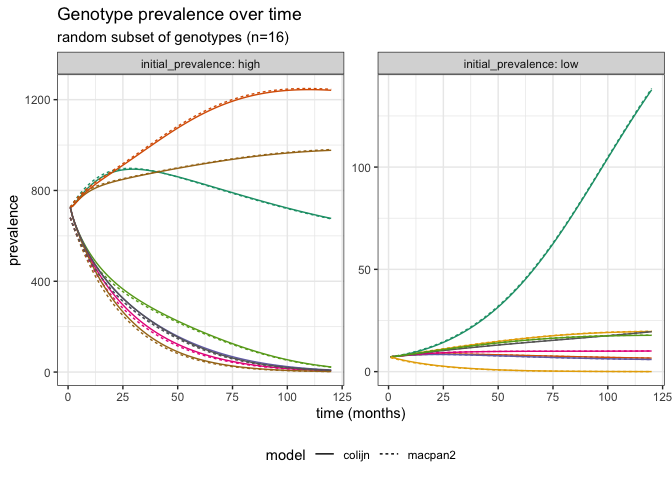

NFDS and Vaccine Design
================
Jennifer Freeman

-   <a href="#states" id="toc-states">States</a>
-   <a href="#parameters" id="toc-parameters">Parameters</a>
    -   <a href="#fixed" id="toc-fixed">Fixed</a>
    -   <a href="#time-varying" id="toc-time-varying">Time Varying</a>
-   <a href="#dynamics" id="toc-dynamics">Dynamics</a>
-   <a href="#model-specification" id="toc-model-specification">Model
    Specification</a>
-   <a href="#model-validation" id="toc-model-validation">Model
    Validation</a>
    -   <a href="#simulating-data" id="toc-simulating-data">Simulating Data</a>
        -   <a href="#a-quick-note-on-run-time-when-constructing-simulators"
            id="toc-a-quick-note-on-run-time-when-constructing-simulators">A quick
            note on run-time when constructing simulators</a>
    -   <a href="#comparing-model-implementations"
        id="toc-comparing-model-implementations">Comparing Model
        Implementations</a>
    -   <a href="#summary" id="toc-summary">Summary</a>
-   <a href="#optimization" id="toc-optimization">Optimization</a>
-   <a href="#references" id="toc-references">References</a>

<!-- population-->

*Streptococcus pneumoniae* (pneumococcus) is a bacteria that can cause
*invasive pneumococcal disease* (IPD), such as meningitis and bacterial
pnuemonia, in vulnerable populations (ie. young children and elderly)
([PHAC 2023](#ref-phac_2023)). Pneumococci typically colonize the
respiratory tract and its subsequent occupation is called *carriage*
([Coughtrie et al. 2019](#ref-coughtrie_2019)). Carriage pneumococcus is
common and individuals are often asymptomatic, becoming *carriers* of
the bacterium ([PHAC 2023](#ref-phac_2023)). Pneumococci populations are
further subdivided by their epidemiological characteristics
(*serotypes*) and genetic variation (*genotypes* and the *loci* they
encode).

<!-- vaccine/motivation -->

*Protein–polysaccharide conjugate vaccines* (PCVs) were introduced to
target small subsets of pneumococcal serotypes to reduce IPD burden
([Colijn, Corander, and Croucher 2020](#ref-colijn_2020)). In a carriage
population after PCV introduction, vaccine serotypes are removed through
herd immunity ([Colijn, Corander, and Croucher 2020](#ref-colijn_2020)).
Pneumococcal carriage prevalence is known to be relatively stable over
time as *serotype replacement* occurs where non-vaccine serotypes
compete and replace vaccine types ([Corander et al.
2017](#ref-corander_2017)). The effect of PCVs in a post-vaccine
carriage population can be problematic when non-vaccine serotypes that
are highly *invasive*, “the rate at which they progress from carriage to
cause IPD”, or anti-microbial resistant become more prevalent ([Colijn,
Corander, and Croucher 2020](#ref-colijn_2020)).

<!-- the problem -->

Colijn, Corander, and Croucher ([2020](#ref-colijn_2020)) formulated
optimal vaccine designs that minimized IPD burden in post-vaccine
carriage populations. Two distinct carriage population datasets were
included in model experiments. One from a vaccinated group of children
in Massachusetts and the second, an unvaccinated group from the Maela
refugee camp in Thailand. In simulations, a hypothetical vaccine was
introduced into the population, and a duration of 10 years was selected
to evaluate the effect of this vaccine on the carriage community make-up
of pneumococcus.

<!-- the model -->

A multi-locus *negative frequency-dependent selection* (NFDS) model was
implemented as a first order ODE to simulate the dynamics of genotype
prevalence in carriage over time. This model assumes “alleles are most
beneficial to genotypes when they are rare” and the fitness of each
genotype is reflected in its dynamic reproductive rate ([Corander et al.
2017](#ref-corander_2017)). This study ignores genetic *recombination*,
assuming the set of unique genotypes in each population is fixed over
time ([Colijn, Corander, and Croucher 2020](#ref-colijn_2020)). Genotype
prevalences in Colijn, Corander, and Croucher ([2020](#ref-colijn_2020))
were simulated using an ODE solver in Matlab.

<!-- the optimization -->

IPD burden was computed using serotype invasiveness estimates, derived
from a meta-analysis, and the post-vaccine carriage prevalences (the ODE
solution). Vaccine design was optimized using Bayesian optimization and
a genetic algorithm, with additional constraints on vaccine valency and
forced serotype inclusion ([Colijn, Corander, and Croucher
2020](#ref-colijn_2020)).

# States

*Note:* Input values provided here are for the Massachusetts population
($M=603$, $L=1090$), to get corresponding Maela input values see
[write_data.m](https://github.com/canmod/macpan2/blob/7126c2217272367eca8e3ea9b9a1fe8e0c6d3d59/inst/starter_models/nfds/data/write_data.m).

| variable   | description                            | input value                                                                                                                                      |
|------------|----------------------------------------|--------------------------------------------------------------------------------------------------------------------------------------------------|
| $Y_{i}(t)$ | prevalence of genotype $i$ at time $t$ | [intial conditions (t=0)](https://github.com/canmod/macpan2/blob/b162156ca3d2787de90f5c080827ee9547b14fab/inst/starter_models/nfds/data/ics.csv) |

# Parameters

*Note:* Input values provided here are for the Massachusetts population
($M=603$, $L=1090$), to get corresponding Maela input values see
[write_data.m](https://github.com/canmod/macpan2/blob/7126c2217272367eca8e3ea9b9a1fe8e0c6d3d59/inst/starter_models/nfds/data/write_data.m).

## Fixed

| variable  | description                                                                                                                                                                                                               | csv input file                                                                                                                                                                                                                                                                                                                                                                                                                                                                                                                           |
|-----------|---------------------------------------------------------------------------------------------------------------------------------------------------------------------------------------------------------------------------|------------------------------------------------------------------------------------------------------------------------------------------------------------------------------------------------------------------------------------------------------------------------------------------------------------------------------------------------------------------------------------------------------------------------------------------------------------------------------------------------------------------------------------------|
| $w_l$     | NFDS weight for locus $l$                                                                                                                                                                                                 | [locusweights](https://github.com/canmod/macpan2/blob/b162156ca3d2787de90f5c080827ee9547b14fab/inst/starter_models/nfds/data/locusweights.csv)                                                                                                                                                                                                                                                                                                                                                                                           |
| $e_l$     | equilibrium frequency for locus $l$                                                                                                                                                                                       | [locusfreq](https://github.com/canmod/macpan2/blob/b162156ca3d2787de90f5c080827ee9547b14fab/inst/starter_models/nfds/data/locusfreq.csv)                                                                                                                                                                                                                                                                                                                                                                                                 |
| $\kappa$  | carriage population carrying capacity                                                                                                                                                                                     | hardcoded, $\kappa = 10,000$                                                                                                                                                                                                                                                                                                                                                                                                                                                                                                             |
| $G_{i,l}$ | $G=$ genotype-loci matrix (size $M$ by $L$). $G_{i,l}=1$ if genotype $i$ encodes locus $i$, 0 otherwise.                                                                                                                  | [G](https://github.com/canmod/macpan2/blob/b162156ca3d2787de90f5c080827ee9547b14fab/inst/starter_models/nfds/data/G.csv)                                                                                                                                                                                                                                                                                                                                                                                                                 |
| $\rho$    | constant representing the “overall strength of NFDS” ([Colijn, Corander, and Croucher 2020](#ref-colijn_2020)), computed as $\log(1 + \sigma)$ where $\sigma$ is taken from Corander et al. ([2017](#ref-corander_2017)). | [sigma](https://github.com/canmod/macpan2/blob/b162156ca3d2787de90f5c080827ee9547b14fab/inst/starter_models/nfds/data/sigma.csv)                                                                                                                                                                                                                                                                                                                                                                                                         |
| $v$       | vaccine efficacy parameter                                                                                                                                                                                                | [v](https://github.com/canmod/macpan2/blob/b162156ca3d2787de90f5c080827ee9547b14fab/inst/starter_models/nfds/data/v.csv)                                                                                                                                                                                                                                                                                                                                                                                                                 |
| $m$       | uniform migration rate per genotype                                                                                                                                                                                       | [m](https://github.com/canmod/macpan2/blob/b162156ca3d2787de90f5c080827ee9547b14fab/inst/starter_models/nfds/data/m.csv)                                                                                                                                                                                                                                                                                                                                                                                                                 |
| $r_i$     | vaccine strategy, $r_i=r$ “if genotype $i$ encodes an antigen included in the vaccine” ([Colijn, Corander, and Croucher 2020](#ref-colijn_2020)), 0 otherwise. Computed as $r_i = -\log(1- (v \text{vax}_i))$             | The user specifies a vector of serotypes to be included, excluded, and *varied* (varied means these serotypes will be optimized i.e. optimizer decides if each serotype in this vector will be included/excluded) in the vaccine. This vaccine vector is then mapped to the level of genotypes, creating a binary vector $\text{vax}$. (See an example of user input for the `macpan2` model implementation [here](https://github.com/canmod/macpan2/blob/7126c2217272367eca8e3ea9b9a1fe8e0c6d3d59/inst/starter_models/nfds/tmb.R#L77)). |

## Time Varying

| variable  | description                                              | calculation                                                 |
|-----------|----------------------------------------------------------|-------------------------------------------------------------|
| $N(t)$    | carriage population of pneumococci organisms at time $t$ | $N(t) = \sum\limits_{i=1}^M Y_i$                            |
| $f_{l,t}$ | instantaneous frequency for locus $l$ at time $t$        | $f_{l,t} = \frac{1}{N(t)} \sum\limits_{i=1}^{M} Y_i G_{il}$ |

# Dynamics

$$\frac{dY_i}{dt} = \left( \log\left( \frac{\kappa}{N(t)}\right) -r_i + \rho\left( \sum_{l=1}^{L} w_l G_{il} (e_l - f_{l,t})\right) \right) Y_i + m, \quad i \in \\{1, M\\}$$

# Model Specification

This model has been specified in the `nfds` directory
[here](https://github.com/canmod/macpan2/blob/main/inst/starter_models/nfds/tmb.R)
and is accessible from the `macpan2` model library (see [Example
Models](https://canmod.github.io/macpan2/articles/example_models.html)
for details).

``` r
spec = mp_tmb_library("starter_models","nfds", package="macpan2")
```

# Model Validation

## Simulating Data

As a first step in validating the model, we can simulate data from the
model to visualize the behaviour of genotype prevalence curves.

``` r
# set number of time steps in simulation
# time_steps = 120L is equal to 10 years (as in Colijn et al. 2020)
# step size = months
time_steps = 120L 

# create simulator
nfds = mp_simulator(  
    model = spec
  , time_steps = time_steps
  , outputs = c("Y","vax_strain","vax_serotypes")
) 
#> Warning in unique(as.numeric(parse_table$x[is_var_or_lit & is_lit])): NAs
#> introduced by coercion
#> Warning in unique(as.numeric(parse_table$x[is_var_or_lit & is_lit])): NAs
#> introduced by coercion
#> Warning in unique(as.numeric(parse_table$x[is_var_or_lit & is_lit])): NAs
#> introduced by coercion
#> Warning in unique(as.numeric(parse_table$x[is_var_or_lit & is_lit])): NAs
#> introduced by coercion

# simulate Y (genotype prevalence state vector) and plot
(nfds
  |> mp_trajectory()
  |> filter(matrix=='Y')
  |> mutate(genotype=as.factor(row))
  |> ggplot()
  + geom_line(aes(time,value,col=genotype))
  + theme_bw()
  + theme(legend.position="none")
  + ylab("prevalence")
  + xlab("time (months)")
  + ggtitle("Prevalence of all genotypes (M=603)",subtitle = "macpan2 implementation")
)
```

<!-- -->

We expect that prevalences of all genotypes should reach equilibirium
prevalences (level off) with sufficient time steps (although Colijn,
Corander, and Croucher ([2020](#ref-colijn_2020)) mentions curves may
not reach mathematical equilibrium, but invasiveness equilibriates
faster). These curves look reasonable because there is some asymptotic
behaviour in the later years.

If we colour code the genotype curves by whether they are included in
the vaccine (In vaccine = 1) or not (In vaccine = 0) we gain more
information about the dynamics.

``` r
# get vaccine mapping by strain/genotype
in_vax = (nfds
          |> mp_trajectory()
          |> filter(matrix %in% c("vax_strain"))
          |> mutate(in_vax=as.factor(value))
)

# simulate Y (genotype prevalence) and plot, coloured by vaccine inclusion
(nfds
  |> mp_trajectory()
  |> filter(matrix=='Y')
  |> rename(prevalence=value)
  |> left_join(in_vax, by=c("time", "col", "row"))
  |> ggplot()
  + geom_line(aes(time,prevalence,group=row,col=in_vax),alpha=0.8)
  + scale_colour_manual(name = 'In vaccine',values=c('darkgrey','#670000'))
  + theme_bw()
  + ylab("prevalence")
  + xlab("time (months)")
  + ggtitle("Prevalence of all genotypes (M=603)",subtitle = "macpan2 implementation")
) 
```

<!-- -->

We expect serotype replacement to take place, so that genotypes not
included in the vaccine will dominate the population after vaccine
perturbation (with sufficient time steps), and this graphically seems to
be happening. Vaccine type strains decrease in prevalence as they are
eliminated from carriage.

### A quick note on run-time when constructing simulators

In general, we know constructing a simulator in `macpan2` is more
computationally intensive than simulating from it (see [Creating a
Simulator](https://canmod.github.io/macpan2/articles/quickstart.html#creating-a-simulator)).
On top of this, we make choices about how our model is specified and
this can also contribute to lengthy run-times.

With earlier versions of the NFDS `macpan2` model specification, the
wall-clock time to construct the simulator was significant.
Experimentation attributed a large portion of this time to the
multiplication of the matrix $G$, when computing the instantaneous locus
frequencies, $f_{l,t}$, and the NFDS term,
$\left( \sum_{l=1}^{L} w_l G_{il} (e_l - f_{l,t}) \right)$, referred to
as $\pi_{i,t}(G,Y)$ in Colijn, Corander, and Croucher
([2020](#ref-colijn_2020)). Model specification changes were made to fix
this and a short demonstration is given to highlight these differences
when computing $f_{l,t}$.

<!-- -->

The expression for $f_{l,t}$ in the old model specification involved the
matrix multiplication of $G$.

``` r
# old expression
old_expr = list(
  # compute f_{i,t}
  f ~ (1/N) * (Y %*% G)
)
```

The current model spec computes $f_{l,t}$ differently by using the fact
that $G$ is a relatively sparse matrix containing only zeroes and ones.
The idea being that we can represent $G$ with two vectors that contain
the column and row indices of $G$ that have an entry of 1, and this
eliminates the need to provide $G$ to the model specification
explicitly.

``` r
# new expression
new_expr = list(
  # compute f_{i,t}
  f ~ (1/N) * group_sums(Y[Gt_i], Gt_j, f)
)
```

We define a `binary_matrix_notation` function that returns these indices
as integer vectors named `col_index` and `row_index` for a binary matrix
`M`. If `M` is not square, its multiplication by a vector on the right
versus on the left will determine whether we need indices for `M` or its
transpose `t(M)`. Note `binary_matrix_notation` returns zero-based
indices (see `?macpan2::group_sums` for details).

``` r
binary_matrix_notation <- function(M){
  
  # get col indices
  col_index = c(t(col(M)*M))
  col_index = as.integer(col_index[col_index!=0]-1) 
  
  # get row indices
  row_index = as.integer(rep(1:nrow(M), times=rowSums(M))-1)
  
  return(macpan2:::nlist(col_index,row_index))
}

# get non-zero indices of G transpose (loci-genotype matrix)
# because we have a left multiplication of G (Y %*% G)
Gt_ind <- binary_matrix_notation(t(G)) 

# save indices to a list
integers = list(
    Gt_i = Gt_ind$col_index                                          
  , Gt_j = Gt_ind$row_index                                         
)
```

$G$ has 657270 entries, where 186693 entries have a value of 1. Since we
need a row and column index for each non-zero entry, this means we need
twice the number of non-zero entries in $G$ to be able to represent it
with integer vectors. This new specification reduces the dimension of
the computation because we need smaller objects to store the same
information.

``` r
# number of entries in integer indices
length(integers$Gt_i)+length(integers$Gt_i)
#> [1] 373386
```

We now define the model specifications. In the old version, we needed to
provide the matrix $G$ in the list of defaults. The new version no
longer needs $G$, and we can introduce the integer indices in the model
using the `integers` argument.

``` r
# old specification
old_spec = mp_tmb_model_spec(
    during = old_expr
  , default = list(
      N = N
    , G = G
    , Y = Y
  )
)
# new specification
new_spec = mp_tmb_model_spec(
    during = new_expr
  , default = list(
       N = N
     , Y = Y
     # group_sums needs 'n' argument (see ?macpan2::group_sums)
     # so we need to initialize f with length = L (# intermedifate frequency loci)
     , f = rep(0,dim(G)[2]) 
    ) 
  , integers = integers
)
```

We can now compare the wall-clock time of creating a simulator object
for both specifications.

``` r
# old spec
start_time <- Sys.time()
old_sim = mp_simulator(old_spec,time_steps = 1L,outputs = "Y")
end_time <- Sys.time()
end_time - start_time
#> Time difference of 0.3909481 secs

# new spec
start_time <- Sys.time()
new_sim = mp_simulator(new_spec,time_steps = 1L,outputs = "Y")
end_time <- Sys.time()
end_time - start_time
#> Time difference of 0.3216069 secs
```

Creating a simulator with one time step results in the new model
specification being twice as fast as the old, and this difference grows
with increasing time steps.

## Comparing Model Implementations

To further validate the `macpan2` NFDS implementation, we can compare
simulation results with simulated data from Colijn, Corander, and
Croucher ([2020](#ref-colijn_2020)).

We first choose a simulation scenario, using the Massachusets data set
with the PCV7 vaccine. Note, serotype ‘4’ is not present in this data
set. I suspect this serotype had low initial carriage prevalence and was
excluded from the population.

With simulated data from both models, we compare each genotypes
simulated prevalence at the final time point (10 years).

<!-- -->

This plot confirms that the `macpan2` implementation of this model
generates very similar results to those simulated from the Colijn,
Corander, and Croucher ([2020](#ref-colijn_2020)) model implementation
in Matlab.

If we look further at prevalence differences by genotype we can see that
the simulated data from both models are not identical.

<!-- -->

The largest absolute difference between the two models is approximately
17 individuals in a population of roughly $N(t)=10000$. This equates to
approximately 0.017 % of the population, and I suspect this difference
is not biologically significant.

Now that we know there are some differences between the two model
implementations, it makes sense to visualize how these models compare
over the entire 10 year time period. As an initial hypothesis, we might
expect differences to grow over time as floating point rounding errors
accumulate.

We select a random subset of genotypes to visualize (8 with high
starting prevalence, and 8 with low starting prevalence) because it’s
difficult to distinguish between curves when all genotypes (M=603) are
graphed.

<!-- --><!-- -->

We see some minimal differences when looking at the top panel of
prevalence over time. In the difference comparison, we can see larger
differences at earlier time points and these differences seem to get
smaller on average over time, with one exception. The sea green coloured
curve in the bottom right plot shows that prevalence differences are
growing over time. When we look at this genotype in the top right plot,
we can see that this specific genotype is growing in prevalence much
faster than any of the others. This highlights that the difference in
prevalences could be better represented as a relative measure.

## Summary

In general, we conclude that there are some differences between the two
model implementations but they are not biologically significant. We can
attribute these numerical differences to the approximations made in each
model implementation. In the `macpan2` implementation we are using the
first-order Euler method with the C++ TMB engine for ODE solving as
compared to the implementation in Colijn, Corander, and Croucher
([2020](#ref-colijn_2020)), who use the ODE solver `ode15s` in Matlab.

# Optimization

No optimization was performed in the `macpan2` implementation, as the
discrete variable being optimized is not well suited for the TMB engine.
A possible future direction for optimization could be
[rBayesianOptimization](https://cran.r-project.org/web/packages/rBayesianOptimization/rBayesianOptimization.pdf).

# References

<div id="refs" class="references csl-bib-body hanging-indent">

<div id="ref-colijn_2020" class="csl-entry">

Colijn, Caroline, Jukka Corander, and Nicholas J. Croucher. 2020.
“Designing Ecologically Optimized Pneumococcal Vaccines Using Population
Genomics.” *Nature Microbiology* 5 (3): 473–85.
<https://doi.org/10.1038/s41564-019-0651-y>.

</div>

<div id="ref-corander_2017" class="csl-entry">

Corander, Jukka, Christophe Fraser, Michael U. Gutmann, Brian Arnold,
William P. Hanage, Stephen D. Bentley, Marc Lipsitch, and Nicholas J.
Croucher. 2017. “Frequency-Dependent Selection in Vaccine-Associated
Pneumococcal Population Dynamics.” *Nature Ecology & Evolution* 1 (12):
1950–60. <https://doi.org/10.1038/s41559-017-0337-x>.

</div>

<div id="ref-coughtrie_2019" class="csl-entry">

Coughtrie, Abigail L., Johanna M. Jefferies, David W. Cleary, C. Patrick
Doncaster, Saul N. Faust, Alex R. Kraaijeveld, Michael V. Moore, et al.
2019. “Microbial Epidemiology and Carriage Studies for the Evaluation of
Vaccines.” *Journal of Medical Microbiology* 68 (10): 1408–18.
<https://doi.org/10.1099/jmm.0.001046>.

</div>

<div id="ref-phac_2023" class="csl-entry">

PHAC, Public Health Agency of Canada. 2023. “Invasive Pneumococcal
Disease - Canada.ca.”
<https://www.canada.ca/en/public-health/services/immunization/vaccine-preventable-diseases/invasive-pneumococcal-disease/health-professionals.html>.

</div>

</div>
