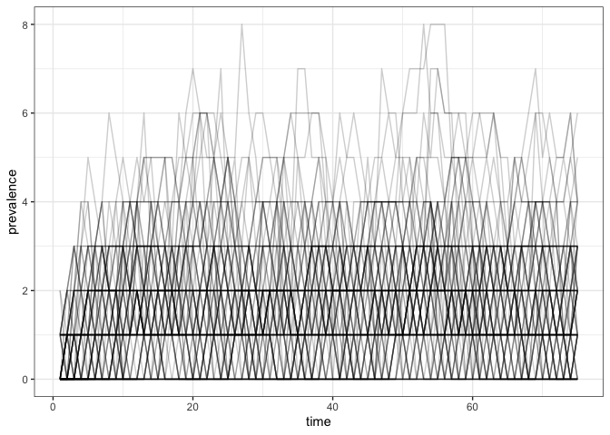

One Box
================
Steve Walker

- [States](#states)
- [Parameters](#parameters)
- [Dynamics](#dynamics)
- [Model Specification](#model-specification)
- [Simulation](#simulation)

This is a very simple model of importation with exponential decay due to
mortality.

The code in this article uses the following packages.

``` r
library(macpan2)
library(ggplot2)
library(dplyr)
```

# States

| variable | description           |
|----------|-----------------------|
| N        | Number of individuals |

# Parameters

| variable | description                  |
|----------|------------------------------|
| $r$      | absolute rate of importation |
| $d$      | per capita death rate        |

# Dynamics

If we interpret this model as an ODE, we have the following dynamics.

$$
\frac{dN}{dt} = r - (d \times N)  \\
$$

We can also interpret this model as a discrete-time stochastic model, as
we show below in the [Simulation](#simulation) section.

# Model Specification

This model has been specified in the `one_box` directory
[here](https://github.com/canmod/macpan2/blob/main/inst/starter_models/one_box/tmb.R)
and is accessible from the `macpan2` model library (see [Example
Models](https://canmod.github.io/macpan2/articles/example_models.html)
for details).

# Simulation

Simulation of this and other models depends on the kind of [state
update](https://canmod.github.io/macpan2/reference/mp_euler) that you
use. Here use the discrete-stochastic method.

``` r
specs = mp_tmb_library("starter_models"
  , "one_box"
  , package = "macpan2"
)
set.seed(1)
(specs
  |> mp_discrete_stoch()
  |> mp_simulator(75, "N")
  |> mp_trajectory_replicate(n = 100)
  |> bind_rows(.id = "replicate")
  |> rename(prevalence = value)
  |> ggplot()
  + geom_line(aes(time, prevalence, group = replicate), alpha = 0.2)
  + theme_bw()
)
```

<!-- -->
