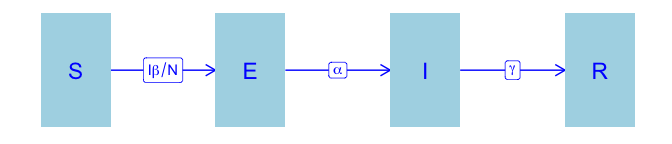
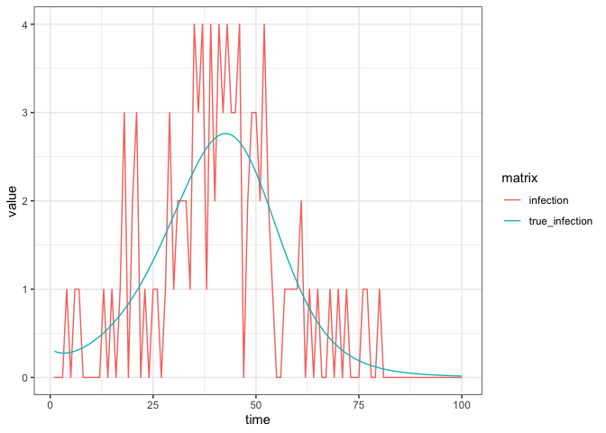
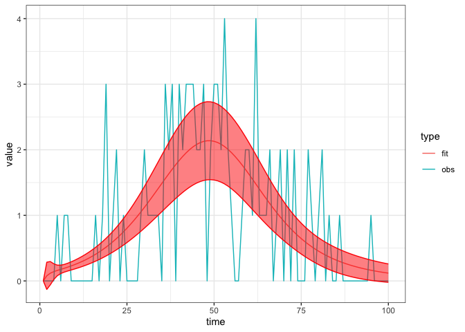

Basic SEIR
================
Steve Walker

-   <a href="#packages-used-and-settings"
    id="toc-packages-used-and-settings">Packages Used and Settings</a>
-   <a href="#model-specification" id="toc-model-specification">Model
    Specification</a>
-   <a href="#states" id="toc-states">States</a>
-   <a href="#parameters" id="toc-parameters">Parameters</a>
-   <a href="#dynamics" id="toc-dynamics">Dynamics</a>
-   <a href="#calibration" id="toc-calibration">Calibration</a>
    -   <a href="#simulate-fake-data" id="toc-simulate-fake-data">Simulate fake
        data</a>
    -   <a href="#calibrate-the-model" id="toc-calibrate-the-model">Calibrate
        the model</a>
    -   <a href="#explore-the-fit" id="toc-explore-the-fit">Explore the fit</a>

We introduce the *exposed* compartment, to capture the time period in
which individuals have been exposed to the disease but are not yet
infectious.

# Packages Used and Settings

The code in this article uses the following packages.

``` r
library(ggplot2)
library(dplyr)
library(tidyr)
library(macpan2)
```

To keep the optimizer from printing too much in this article, we set the
`macpan2_verbose` option to `FALSE`.

``` r
options(macpan2_verbose = FALSE)
```

# Model Specification

This model has been specified in the `seir` directory
[here](https://github.com/canmod/macpan2/blob/main/inst/starter_models/seir/tmb.R)
and is accessible from the `macpan2` model library (see [Example
Models](https://canmod.github.io/macpan2/articles/example_models.html)
for details). We can read in the model specification using the
`mp_tmb_library` command.

``` r
spec = mp_tmb_library(
    "starter_models"
  , "seir"
  , package = "macpan2"
)
```

This specification can be used to draw the following flow diagram using
code found in the [source for this
article](https://github.com/canmod/macpan2/blob/main/inst/starter_models/seir/README.Rmd).

<!-- -->

# States

| variable | description                                                                            |
|----------|----------------------------------------------------------------------------------------|
| S        | Number of susceptible individuals                                                      |
| E        | Number of exposed individuals (i.e., infected individuals that are not yet infectious) |
| I        | Number of infectious individuals                                                       |
| R        | Number of recovered individuals                                                        |

The size of the total population is, $N = S + E + I + R$.

# Parameters

| variable | description                  |
|----------|------------------------------|
| $\beta$  | per capita transmission rate |
| $\alpha$ | per capita progression rate  |
| $\gamma$ | per capita recovery rate     |

# Dynamics

$$
\begin{align*}
\frac{dS}{dt} &= -\beta S\frac{I}{N} \\
\frac{dE}{dt} &= \beta S\frac{I}{N} - \alpha E \\
\frac{dI}{dt} &= \alpha E- \gamma I \\
\frac{dR}{dt} &= \gamma I
\end{align*}
$$

# Calibration

## Simulate fake data

The first step when testing a new fitting procedure is to simulate
clean, well-behaved data from the model and check if you can recover
parameters close to the true values (see
[here](https://canmod.github.io/macpan2/articles/calibration.html) for
an article on this topic). We modify the specification so that it is
different from the default library model, which we will then calibrate
using data generated from this modified model. We simulate incidence
data from this model, and add noise.

``` r
set.seed(1L)
time_steps = 100L
true = list(
    beta = 0.3 # beta value to simulate data with
  , gamma = 0.05 # gamma value to simulate data with
  , alpha = 0.1 # alpha value to simulate data with
)
seir = (spec
  |> mp_tmb_insert(
      phase = "during", at = Inf
    , expressions = list(noisy_infection ~ rpois(infection))
    , default = true
  )
  |> mp_simulator(
      time_steps = time_steps
    , outputs = c("noisy_infection", "infection")
  )
)
  
observed_data = (seir
  |> mp_trajectory() 
  |> mutate(matrix = ifelse(matrix == "infection", "true_infection", "infection"))
)
(observed_data
  |> ggplot()
  + geom_line(aes(time, value, colour = matrix))
  + theme_bw()
)
```

<!-- -->

Note that the incidence per time-step is called `infection` in the
model, to indicate that it is the rate at which individuals move from
`S` to `E` due to infection. Observe the naming convention in the
expanded specification object.

``` r
print(spec |> mp_expand())
#> ---------------------
#> Default values:
#>  quantity value
#>      beta   0.2
#>     alpha   0.5
#>     gamma   0.1
#>         N 100.0
#>         I   1.0
#>         E   0.0
#>         R   0.0
#> ---------------------
#> 
#> ---------------------
#> Before the simulation loop (t = 0):
#> ---------------------
#> 1: S ~ N - I - R - E
#> 
#> ---------------------
#> At every iteration of the simulation loop (t = 1 to T):
#> ---------------------
#> 1: infection ~ S * (beta * I/N)
#> 2: progression ~ E * (alpha)
#> 3: recovery ~ I * (gamma)
#> 4: S ~ S - infection
#> 5: E ~ E + infection - progression
#> 6: I ~ I + progression - recovery
#> 7: R ~ R + recovery
```

## Calibrate the model

``` r
cal = mp_tmb_calibrator(
    spec
  , data = filter(observed_data, matrix == "infection")
  , traj = "infection"
  , par = c("beta", "gamma", "alpha")
)
mp_optimize(cal)
#> $par
#>     params     params     params 
#> 0.14426621 0.01545123 1.08414553 
#> 
#> $objective
#> [1] 98.35556
#> 
#> $convergence
#> [1] 0
#> 
#> $iterations
#> [1] 16
#> 
#> $evaluations
#> function gradient 
#>       22       17 
#> 
#> $message
#> [1] "relative convergence (4)"
```

## Explore the fit

The calibration object now contains the information gained through
optimization. We can use this information to check the fitted parameter
values.

``` r
coef = mp_tmb_coef(cal) |> round_coef_tab()
coef$true = true[coef$mat]
print(coef)
#>     mat row default estimate std.error true
#> 1  beta   0     0.2   0.1443    0.0533  0.3
#> 2 gamma   0     0.1   0.0155    0.0276 0.05
#> 3 alpha   0     0.5   1.0841    2.7316  0.1
```

The estimate is not very close to the true value, indicating that
although the optimizer converged it was not able to find the true
parameter values. This is a strong indication that there is not enough
information in incidence data to estimate all three model parameters.
This case is made stronger by the excellent fit to the data, as we
should below. A good fit that converged, but to incorrect parameter
values, is always a possibility. One should be cautious about estimating
parameters from data and check to make sure that the parameters make
sense. A more realistic exploration of these identifiability issues can
be found in or description of the [SHIVER
model](https://github.com/canmod/macpan2/tree/main/inst/starter_models/shiver).

``` r
comparison_data = list(
    obs = observed_data
  , fit = mp_trajectory_sd(cal, conf.int = TRUE)
) |> bind_rows(.id = "type")
(comparison_data
  |> filter(matrix == "infection")
  |> ggplot()
  + geom_line(aes(time, value, colour = type))
  + geom_ribbon(aes(time, ymin = conf.low, ymax = conf.high)
    , colour = "red"
    , fill = "red"
    , alpha = 0.5
    , filter(comparison_data, type == "fit")
  )
  + theme_bw()
)
```

<!-- -->
