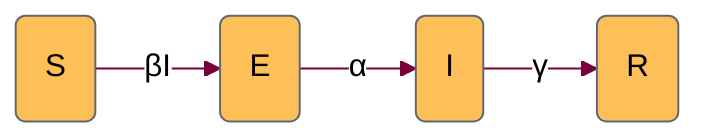

We introduce the *exposed* compartment, to capture the time period in which individuals have been exposed to the disease but are not able to infect others yet.
# States

| variable | description |
| -- | -- |
| S | Number of susceptible individuals |
| E | Number of exposed individuals |
| I | Number of infectious individuals |
| R | Number of recovered individuals | 

The size of the total population is,  $ N = S + E+ I + R$.
# Parameters

| variable | description |
| -- | -- |
| $\beta$ | per capita transmission rate |
| $\alpha$ | per capita rate of infectious progression | %% must be a better way to say this
| $\gamma$ | per capita recovery rate |

# Dynamics 

$$
\begin{align*}
\frac{dS}{dt} &= -\beta SI \\
\frac{dE}{dt} &= \beta SI - \alpha E \\
\frac{dI}{dt} &= \alpha E- \gamma I \\
\frac{dR}{dt} &= \gamma I
\end{align*}
$$

