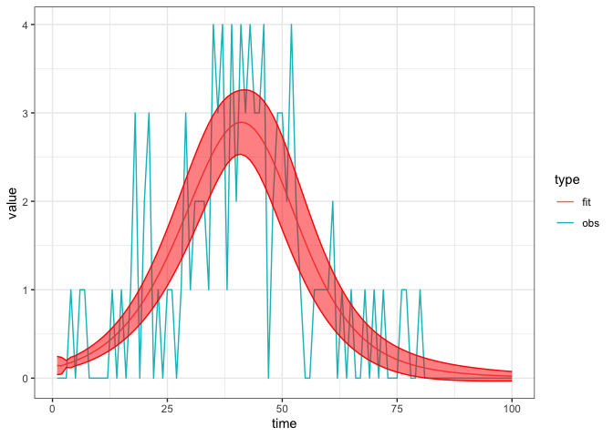

basic SEIR
================
Steve Walker

- [Packages Used and Settings](#packages-used-and-settings)
- [Model Specification](#model-specification)
- [States](#states)
- [Parameters](#parameters)
- [Dynamics](#dynamics)
- [Calibration](#calibration)
  - [Simulate fake data](#simulate-fake-data)
  - [Calibrate the model](#calibrate-the-model)
  - [Explore the fit](#explore-the-fit)

We introduce the *exposed* compartment, to capture the time period in
which individuals have been exposed to the disease but are not able to
infect others yet.

# Packages Used and Settings

The code in this article uses the following packages.

``` r
library(ggplot2)
library(dplyr)
library(tidyr)
library(macpan2)
```

To keep the optimizer from printing too much in this article, we set the
`macpan2_verbose` option to `FALSE`.

``` r
options(macpan2_verbose = FALSE)
```

# Model Specification

This model has been specified in the `seir` directory
[here](https://github.com/canmod/macpan2/blob/main/inst/starter_models/seir/tmb.R)
and is accessible from the `macpan2` model library (see [Example
Models](https://canmod.github.io/macpan2/articles/example_models.html)
for details). We can read in the model specification using the
`mp_tmb_library` command.

``` r
spec = mp_tmb_library(
    "starter_models"
  , "seir"
  , package = "macpan2"
)
```

This specification can be used to draw the following flow diagram using
code found in the [source for this
article](https://github.com/canmod/macpan2/blob/main/inst/starter_models/seir/README.Rmd).

<!-- -->

# States

| variable | description                       |
|----------|-----------------------------------|
| S        | Number of susceptible individuals |
| I        | Number of infectious individuals  |
| R        | Number of recovered individuals   |

The size of the total population is, $N = S + I + R$.

# Parameters

| variable | description                  |
|----------|------------------------------|
| $\beta$  | per capita transmission rate |
| $\gamma$ | per capita recovery rate     |

# Dynamics

$$
\begin{align*}
\frac{dS}{dt} &= -\beta S\frac{I}{N} \\
\frac{dI}{dt} &= \beta S\frac{I}{N} - \gamma I \\
\frac{dR}{dt} &= \gamma I
\end{align*}
$$

# Calibration

## Simulate fake data

We modify the specification so that it is different from the default
library model that we will calibrate. Then we simulate incidence data
from this model, and add noise.

``` r
set.seed(1L)
time_steps = 100L
true = list(
    beta = 0.3 # beta value to simulate data with
  , gamma = 0.05 # gamma value to simulate data with
  , alpha = 0.1 # alpha value to simulate data with
)
seir = (spec
  |> mp_tmb_insert(
      phase = "during", at = Inf
    , expressions = list(noisy_infection ~ rpois(infection))
    , default = true
  )
  |> mp_simulator(
      time_steps = time_steps
    , outputs = c("noisy_infection", "infection")
  )
)
  
observed_data = (seir
  |> mp_trajectory() 
  |> mutate(matrix = ifelse(matrix == "infection", "true_infection", "infection"))
)
(observed_data
  |> ggplot()
  + geom_line(aes(time, value, colour = matrix))
  + theme_bw()
)
```

<!-- -->

Note that the incidence per time-step is called `infection` in the
model, to indicate that it is the rate at which individuals from from
`S` to `I` due to infection. Observe the naming convention in the
expanded specification object.

``` r
print(spec |> mp_expand())
#> ---------------------
#> Default values:
#> ---------------------
#>  matrix row col value
#>    beta           0.2
#>   alpha           0.5
#>   gamma           0.1
#>       N         100.0
#>       I           1.0
#>       E           0.0
#>       R           0.0
#> 
#> ---------------------
#> Before the simulation loop (t = 0):
#> ---------------------
#> 1: S ~ N - I - R - E
#> 
#> ---------------------
#> At every iteration of the simulation loop (t = 1 to T):
#> ---------------------
#> 1: exposure ~ S * (I * beta/N)
#> 2: infection ~ E * (alpha)
#> 3: recovery ~ I * (gamma)
#> 4: S ~ S - exposure
#> 5: E ~ E + exposure - infection
#> 6: I ~ I + infection - recovery
#> 7: R ~ R + recovery
```

## Calibrate the model

``` r
cal = mp_tmb_calibrator(
    spec
  , data = filter(observed_data, matrix == "infection")
  , traj = "infection"
  , par = c("beta", "gamma", "alpha")
)
mp_optimize(cal)
#> $par
#>     params     params     params 
#> 0.18141589 0.05799761 0.43567598 
#> 
#> $objective
#> [1] 109.8502
#> 
#> $convergence
#> [1] 0
#> 
#> $iterations
#> [1] 11
#> 
#> $evaluations
#> function gradient 
#>       14       12 
#> 
#> $message
#> [1] "relative convergence (4)"
```

## Explore the fit

The calibration object now contains the information gained through
optimization. We can use this information to check the fitted parameter
values.

``` r
coef = mp_tmb_coef(cal) |> round_coef_tab()
coef$true = true[coef$mat]
print(coef)
#>     mat row default estimate std.error true
#> 1  beta   0     0.2   0.1814    0.1613  0.3
#> 2 gamma   0     0.1   0.0580    0.0841 0.05
#> 3 alpha   0     0.5   0.4357    0.9622  0.1
```

The estimate is different enough from the default to indicate that the
optimizer did ‘something’, and the estimate is close enough to the true
value to indicate that it did the right thing. Indeed the fit to the
data is excellent, although we should expect this given that we fitted
the same model used to generate the data.

``` r
comparison_data = list(
    obs = observed_data
  , fit = mp_trajectory_sd(cal, conf.int = TRUE)
) |> bind_rows(.id = "type")
(comparison_data
  |> filter(matrix == "infection")
  |> ggplot()
  + geom_line(aes(time, value, colour = type))
  + geom_ribbon(aes(time, ymin = conf.low, ymax = conf.high)
    , colour = "red"
    , fill = "red"
    , alpha = 0.5
    , filter(comparison_data, type == "fit")
  )
  + theme_bw()
)
```

<!-- -->
