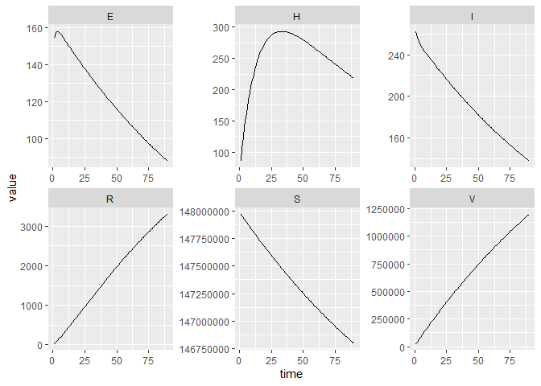
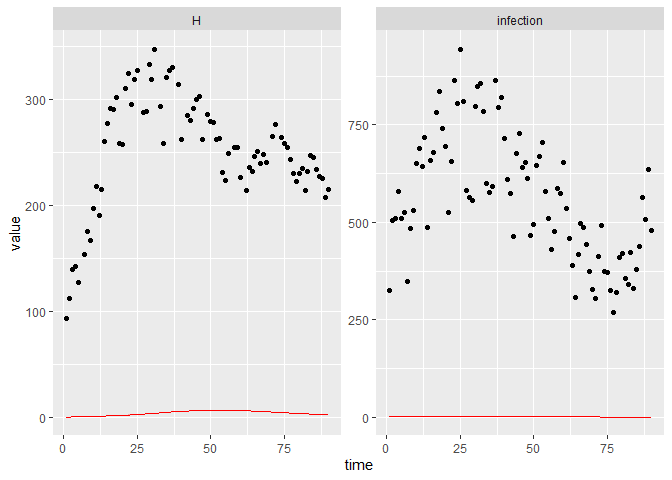
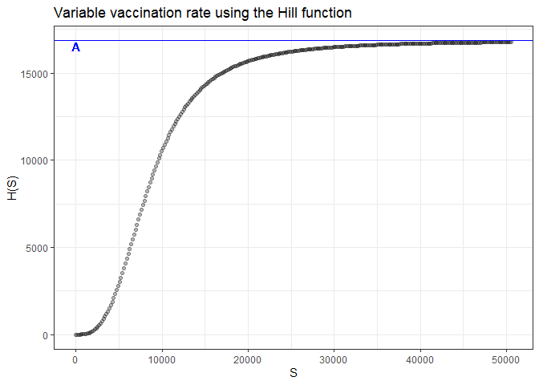
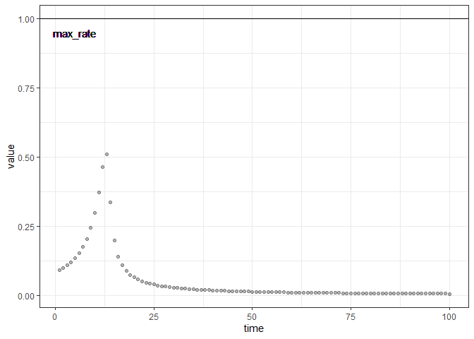
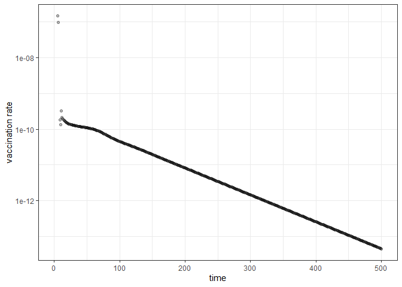

SHIVER = SEIR + H + V
================
Jennifer Freeman

- [States](#states)
- [Parameters](#parameters)
- [Dynamics](#dynamics)
- [Calibration Example](#calibration-example)
  - [Calibration Scenario](#calibration-scenario)
  - [Deciding on Defaults](#deciding-on-defaults)
  - [Simulating Dynamics](#simulating-dynamics)
  - [Estimating Parameters](#estimating-parameters)
  - [Re-parameterizing and introducing
    transformations](#re-parameterizing-and-introducing-transformations)
  - [Runge-Kutta 4](#runge-kutta-4)
  - [Fitting to Multiple
    Trajectories](#fitting-to-multiple-trajectories)
  - [Parameter identifiability](#parameter-identifiability)
- [Vaccine Constraints and Variable Vaccination
  Rate](#vaccine-constraints-and-variable-vaccination-rate)
- [Model Specification](#model-specification)
- [References](#references)

This model builds on the basic SEIR model, with two additional
compartments for vaccination and hospitalizations.

Vaccines are typically subject to resource constraints and distribution
strategies might prioritize vaccinations for specific subpopulations,
such as immunocompromised people, to reduce bad outcomes. We model this
with a flow of susceptibles entering the vaccination class. Following
vaccination, most individuals return to the susceptible class when the
acquired immune response wears off, called *vaccine waning*.

In reality, vaccinations are only partly effective in developing a
protective host immune response. This *vaccine failure* includes both
vaccine-related inadequacies and host-related reasons like health status
and genetic factors ([Wiedermann, Garner-Spitzer, and Wagner
2016](#ref-wiedermann_2016)). Vaccine failure is modelled as flow from
vaccination to the exposed class.

The SHIVER model assumes all individuals can be exposed to the disease,
but transmission rates depend on vaccination status. Additionally,
individuals with severe infections are hospitalized and assumed to be
isolated, before recovering from the disease. Hospital isolation means
this portion of infectious individuals no longer contribute to the
transmission dynamics.

# States

| variable | description                        |
|----------|------------------------------------|
| S        | Number of susceptible individuals  |
| H        | Number of hospitalized individuals |
| I        | Number of infectious individuals   |
| V        | Number of vaccinated individuals   |
| E        | Number of exposed individuals      |
| R        | Number of recovered individuals    |

The size of the total population is, $N = S + H + I + V + E + R$, and
the disease spreads through homogenous mixing of the subpopulation
$N_{\text{mix}}=N -H$.

# Parameters

| variable   | description                                                                                         |
|------------|-----------------------------------------------------------------------------------------------------|
| $\phi$     | per capita vaccination rate of susceptibles                                                         |
| $\rho$     | per capita vaccine waning rate                                                                      |
| $\beta_S$  | per capita transmission rate for susceptibles (in $N_{\text{mix}}$ population)                      |
| $\beta_V$  | per capita transmission rate for vaccinated individuals (in $N_{\text{mix}}$ population)            |
| $\alpha$   | per capita infection rate (average time spent in compartment $E$ is $1/\alpha$)                     |
| $\gamma_I$ | per capita recovery rate for infected individuals                                                   |
| $\gamma_H$ | per capita recovery rate for hospitalized individuals                                               |
| $\sigma$   | per capita rate at which infected individuals develop severe infections and require hospitalization |

# Dynamics

$$
\begin{align*}
\frac{dS}{dt} &= -\beta_{S} S\frac{I}{N_{\text{mix}}} - \phi S + \rho V\\
\frac{dV}{dt} &=  \phi S - \rho V - \beta_{V} V\frac{I}{N_{\text{mix}}} \\
\frac{dE}{dt} &= (\beta_{S} S + \beta_{V} V) \frac{I}{N_{\text{mix}}} - \alpha E \\
\frac{dI}{dt} &= \alpha E - \gamma_I I - \sigma I\\
\frac{dH}{dt} &= \sigma I- \gamma_H H \\
\frac{dR}{dt} &= \gamma_I I + \gamma_H H
\end{align*}
$$

This model could be optionally parameterized with $\beta_{S} = \beta$,
and $\beta_{V} = a \beta$ with $a \in (0, 1)$ to explicitly show that
the rate at which vaccinated individuals acquire infection and transmit
the disease is reduced when compared to unvaccinated individuals
([Brauer and Castillo-Chavez 2012](#ref-brauer_2012)).

# Calibration Example

The general goal of this example is to see if we can fit the SHIVER
model to COVID19 hospitilization data to see if we can estimate
plausible tranmission rates for vaccinated and unvaccinated individuals.

We load the model specification from the model library.

``` r
source("tmb.R")
#spec = mp_tmb_library("starter_models","shiver", package="macpan2")
```

## Calibration Scenario

Let’s create a scenario for calibration. Suppose we have 3 months of
daily COVID hospitalization data where some daily reports are missing.

``` r
expected_daily_reports = 90 # days
missed_reports = 10
actual_daily_reports = expected_daily_reports - missed_reports
```

Daily COVID19 hospitalization data for Ontario was obtained from the
[Ontario Data
Catalogue](https://data.ontario.ca/dataset/covid-19-vaccine-data-in-ontario/resource/274b819c-5d69-4539-a4db-f2950794138c).
The data contains daily hospitalization counts stratitfied by
vaccination status and severity of hospitalization care. For simplicity,
we aggregate all counts into one. We will use the first data point
(August 10, 2021) as the initial condition for H, and the second data
point (August 11, 2021) as day 1 of the scenario. To incorporate missed
data reporting, we randomly remove 10 records.

``` r
set.seed(expected_daily_reports)
# Obtained from here:
# https://data.ontario.ca/dataset/covid-19-vaccine-data-in-ontario/resource/274b819c-5d69-4539-a4db-f2950794138c
daily_hospitalizations = (read.csv(
  system.file(
      "starter_models"
    , "shiver"
    , "data"
    , "hospitalizations_ontario.csv"
    , package = "macpan2"
  )
  , row.names = NULL
  ) 
  |> rename(time = X_id)
  |> group_by(time)
  # assuming all hospital admissions (ICU or not) are part of H compartment
  |> summarize(value = sum(icu_unvac, icu_partial_vac, icu_full_vac,
                            hospitalnonicu_unvac, hospitalnonicu_partial_vac,
                            hospitalnonicu_full_vac))
  |> ungroup()
)

head(daily_hospitalizations)
#> # A tibble: 6 × 2
#>    time value
#>   <int> <int>
#> 1     1    63
#> 2     2    93
#> 3     3   112
#> 4     4   139
#> 5     5   142
#> 6     6   127

reported_hospitalizations = (daily_hospitalizations
  # remove first record (Aug 10, this will be the initial condition for H)
  |> filter(time!=1) 
  # update all times to set Aug 11 to be day 1 of the scenario
  |> mutate(time=time-1) 
  |> head(expected_daily_reports)
  |> mutate(matrix="H")
  |> sample_n(actual_daily_reports)
)
```

## Deciding on Defaults

We want to check the model specification defaults to see what needs
updating.

``` r
# We can view model spec default values here to see if we need to make any changes.
mp_default(spec)
#>     matrix row col value
#> 1      phi         1e-01
#> 2      rho         5e-02
#> 3   beta_s         2e-01
#> 4   beta_v         5e-02
#> 5    alpha         5e-01
#> 6  gamma_i         1e-01
#> 7  gamma_h         7e-02
#> 8    sigma         5e-02
#> 9        N         1e+02
#> 10       I         1e+00
#> 11       V         0e+00
#> 12       E         0e+00
#> 13       H         0e+00
#> 14       R         0e+00
```

We need to update the population size $N$ to the population of Ontario
at the time. [Statistics
Canada](https://doi.org/10.25318/1710000901-eng) estimates a population
of approximately 14.8 million in the second quarter of 2021.

``` r
# N = population size
# ---------------------
N = 14.8e7
```

Vaccination data from [Public Health
Ontario](https://www.publichealthontario.ca/en/Data-and-Analysis/Infectious-Disease/Respiratory-Virus-Tool)
can help us get an estimate for the per capita vaccination rate $\phi$.
The average number of vaccines that can be administered per day was
estimated by averaging weekly vaccination counts for the month preceding
the scenario. We then convert `daily_vaccinations` to a rate by dividing
by the initial population size.

``` r
# phi = vaccination rate
# ---------------------
# for the month of July 2021, number of individuals vaccinated per week in ontario
july_vax = c(
    135177
  , 124468
  , 111299
  , 100825
)
## average july weekly data to per day (4 weeks = 28 days)
daily_vaccinations = sum(july_vax)/28 # seems plausible
# 0.01% of population per day
phi = daily_vaccinations/N
```

We assume the average protection acquired from vaccination lasts 6
months (180 days), individuals spend on average 3.3 days in the exposed
compartment, and 10% of infectious individuals on average require
hospital care before recovery.

``` r
# rho = waning vaccination
# ---------------------
rho = 1/180 # average protection lasts 180 days 

# alpha = exposure rate
# ---------------------
alpha = 1/3.3 #3.3 days in exposed class 

# sigma = hospitalization rate
# ---------------------
# 10% of infections result in hospitalizations
sigma = 1/10
```

The default recovery rates mean an individual takes 10 days on average
to move from I to R, and 14 days on average to go from H to R. These
rates seem plausible for this scenario. Note that the recovery class in
this model, includes deaths from the hospitalization class. We could
speculate that the recovery rate from H to R could be shorter than the
recovery rate from I to R if hospitalized individuals are more likely to
die for instance than recover (and given death on average happens
quicker than recovery from infection). For now, let’s stick with the 2
week recovery rate for H, given we assumed in the observed data above
that all hospitalized individuals are in H regardless of severity.

We want to estimate the transmission parameters `beta_s` and `beta_v`.
It’s more challenging to interpret these state dependent parameters, but
we would expect transmission involving vaccinated suceptibles would be
less effective than unvaccinated transmission (beta_v \< beta_s). These
defaults meet this minimal assumption. Additionally,
$R_{0,S} \approx \beta_s/\gamma_i = 2$ which seems reasonable.

We want to update the initial states with information we can find,
[Public Health
Ontario](https://www.publichealthontario.ca/en/Data-and-Analysis/Infectious-Disease/Respiratory-Virus-Tool)
provides us with daily estimates for $V(0)$ and $I(0)$ and $H(0)$ is
taken from observed data. There is no data on initial exposure, however
we know it is improbable that there are no exposed individuals
initially. We will estimate this value in addition to transmission
parameters when calibrating. Finally, since we are not interested in the
dynamics of S or R, it makes sense to leave the default $R = 0$, even
though we have prior knowledge that by the summer of 2021 $R > 0$.
Individuals in R are removed from the transmission dynamics, so
initializing R to a non-zero value will only deplete the initial
susceptible population by this non-zero value.

``` r
## Initial Conditions
# ---------------------

# V0 = initial V
# ---------------------
# We can get weekly Ontario vaccination data here,
# https://www.publichealthontario.ca/en/Data-and-Analysis/Infectious-Disease/Respiratory-Virus-Tool
# If we divide the number of individuals vaccinated in the first week of August 2021 by 7
V0 = 71096/7


# I0 = initial I
# ---------------------
# We can also look at the number of weekly cases of COVID for this time period from here,
# https://www.publichealthontario.ca/en/Data-and-Analysis/Infectious-Disease/Respiratory-Virus-Tool
# and divide by 7 as above to make it a daily estimate.
I0 = 1903/7

# H0 = initial H
# ---------------------
# Use the first observed data point (Aug 10, 2021) as initial H.
H0 = daily_hospitalizations |> filter(row_number()==1) |> select(value) |> pull()
```

## Simulating Dynamics

Before optimizing, we want to make sure the dynamics look reasonable, so
we simulate from the calibrator object using `mp_trajectory`. The
trajectories look mostly as expected. The sharp initial increase in E
and decrease in I can be attributed to setting $E(0)=1$

``` r

# state variables
states = c("S","H","I","V","E","R")

# set up calibrator
shiver_calibrator = mp_tmb_calibrator(
    spec = spec
  , data = reported_hospitalizations
  , traj = "H"
  # parameters we want to estimate (transmission rates)
  # we also want to estimate initial E
  , par = c("beta_v","beta_s","E") 
  , outputs = states
  # update defaults
  , default = list(
      N=N
    , V=V0
    , I=I0
    , H=H0
    , phi=phi
    , alpha=alpha
    , sigma=sigma
    , rho = rho
  ) 
)
# print to check
shiver_calibrator
#> ---------------------
#> Before the simulation loop (t = 0):
#> ---------------------
#> 1: S ~ N - V - E - I - H - R
#> 2: N ~ sum(S, V, E, I, H, R)
#> 
#> ---------------------
#> At every iteration of the simulation loop (t = 1 to T):
#> ---------------------
#>  1: N_mix ~ N - H
#>  2: vaccination ~ S * phi
#>  3: unvaccinated_exposure ~ S * I * beta_s/N_mix
#>  4: vaccine_waning ~ V * rho
#>  5: vaccinated_exposure ~ V * I * beta_v/N_mix
#>  6: infection ~ E * alpha
#>  7: infectious_recovery ~ I * gamma_i
#>  8: hospitalizations ~ I * sigma
#>  9: hospital_recovery ~ H * gamma_h
#> 10: S ~ S - vaccination + vaccine_waning - unvaccinated_exposure
#> 11: V ~ V + vaccination - vaccine_waning - vaccinated_exposure
#> 12: E ~ E + unvaccinated_exposure + vaccinated_exposure - infection
#> 13: I ~ I + infection - infectious_recovery - hospitalizations
#> 14: R ~ R + infectious_recovery + hospital_recovery
#> 15: H ~ H + hospitalizations - hospital_recovery
#> 
#> ---------------------
#> After the simulation loop (t = T + 1):
#> ---------------------
#> 1: sim_H ~ rbind_time(H, obs_times_H)
#> 
#> ---------------------
#> Objective function:
#> ---------------------
#> ~-sum(dpois(obs_H, clamp(sim_H)))

# trajectory has 90 time steps (which is what we expect)
nrow(shiver_calibrator 
  |> mp_trajectory()
  |> filter(matrix=="H")
  |> select(time) 
  |> unique()
)
#> Constructing atomic D_lgamma
#> [1] 90
  

# which time steps are missing in observed data
(shiver_calibrator 
  |> mp_trajectory()
  |> filter(matrix=="H")
  |> anti_join(reported_hospitalizations, by="time")

) 
#>    matrix time row col    value
#> 1       H    6   0   0 139.1204
#> 2       H   26   0   0 211.5701
#> 3       H   32   0   0 219.1768
#> 4       H   38   0   0 223.9582
#> 5       H   41   0   0 225.6083
#> 6       H   48   0   0 228.1304
#> 7       H   57   0   0 229.5719
#> 8       H   61   0   0 229.7970
#> 9       H   70   0   0 229.7143
#> 10      H   73   0   0 229.5545

# before optimizing, do the dynamics look reasonable? 
(shiver_calibrator 
    |> mp_trajectory()
    |> ggplot(aes(time, value))
    + facet_wrap(vars(matrix), scales='free')
    + geom_line()
    + theme_bw()
)
```

<!-- -->

## Estimating Parameters

We are now ready for the optimization step.

``` r
# optimize to estimate parameters
# this converges!
mp_optimize(shiver_calibrator)
#> outer mgc:  42632.45 
#> Constructing atomic D_lgamma
#> outer mgc:  2090.599 
#> outer mgc:  3118.756 
#> outer mgc:  19490.83 
#> outer mgc:  150.7825 
#> outer mgc:  172.8386 
#> outer mgc:  0.1305724 
#> outer mgc:  4.196191e-06
#> $par
#>      params      params      params 
#>   0.1190577   0.1890366 148.0765729 
#> 
#> $objective
#> [1] 388.2649
#> 
#> $convergence
#> [1] 0
#> 
#> $iterations
#> [1] 7
#> 
#> $evaluations
#> function gradient 
#>       12        8 
#> 
#> $message
#> [1] "relative convergence (4)"

# look at estimates with CI
# beta_s ~ 0.19(0.18,0.19) - good
# beta_v < beta_s but CI contains 0
# E0 ~ 148 std error 11 - good
mp_tmb_coef(shiver_calibrator, conf.int=TRUE)
#> outer mgc:  4.196191e-06 
#> outer mgc:  35.67678 
#> outer mgc:  35.67251 
#> outer mgc:  12260.99 
#> outer mgc:  11884.56 
#> outer mgc:  0.9762339 
#> outer mgc:  0.9762425 
#> outer mgc:  93732.78
#>       term    mat row col default  type    estimate    std.error    conf.low
#> 1   params beta_v   0   0    0.05 fixed   0.1190577  0.719317080  -1.2907779
#> 2 params.1 beta_s   0   0    0.20 fixed   0.1890366  0.002908341   0.1833363
#> 3 params.2      E   0   0    0.00 fixed 148.0765729 10.939141313 126.6362499
#>     conf.high
#> 1   1.5288932
#> 2   0.1947368
#> 3 169.5168959
```

We get a realistic estimate for `beta_s` at 0.18 with a small standard
error and the estimated intial number of exposed individuals, 148, seems
plausible with a standard error of 11. The estimate for $\beta_v$
however has a large standard error and the confidence interval contains
zero indicating we are not learning about this parameter.

To check the fit we plot the observed data as well as the trajectories
of all states.

    #> outer mgc:  4.196191e-06 
    #> outer mgc:  35.67678 
    #> outer mgc:  35.67251 
    #> outer mgc:  12260.99 
    #> outer mgc:  11884.56 
    #> outer mgc:  0.9762339 
    #> outer mgc:  0.9762425 
    #> outer mgc:  93732.78

<!-- --><!-- -->

The simulated hospitalization trajectory fits the data well, and the
other trajectories look as expected.

## Re-parameterizing and introducing transformations

For better interpretability we can re-parameterize the model with one
transmission rate, `beta`, and a proportion, `a` in (0,1), representing
the reduced transmission rate for vaccinated people. We also wish to
parameterize `{I0, E0}` to `{I0, E0/I0}` to de-correlate `I0` and `E0`.

We use the log transformation for `beta` and `E0/I0` because both
quantities take on only positive values. We use the logistic
transformation for the proportion `a` to constrain it to the domain
(0,1).

We define a new model specification object with these changes, and set
the default values for all three parameters to be small values (0.01)
because they all have a lower bound of 0.

``` r
# Create a new model specification with these changes:
#
# - update the before step to transform "new" parameters
reparameterized_spec = mp_tmb_insert(spec
     , phase = "before"
     , at=1L
     , expressions = list(
         E ~ exp(log_E_I_ratio) * I
       , beta ~ exp(log_beta)
       , a ~ 1/(1+exp(-logit_a))
     )
     , default = list(
         logit_a = qlogis(1e-2)
       , log_beta = log(1e-2)
       , log_E_I_ratio = log(2) 
     )
)

# - overwrite existing exposure terms with new ones
reparameterized_spec = mp_tmb_update(reparameterized_spec
    , phase = "during"
     # exposure expressions start at step 4 in the during phase
    , at=4L
    , expressions = list(
        mp_per_capita_flow("S", "E", unvaccinated_exposure ~ I * beta/N_mix)
      , mp_per_capita_flow("V", "E", vaccinated_exposure ~  I * beta * a/N_mix)
    )
)


# all changes have been made
print(reparameterized_spec)
#> ---------------------
#> Default values:
#> ---------------------
#>         matrix row col       value
#>            phi           0.1000000
#>            rho           0.0500000
#>         beta_s           0.2000000
#>         beta_v           0.0500000
#>          alpha           0.5000000
#>        gamma_i           0.1000000
#>        gamma_h           0.0700000
#>          sigma           0.0500000
#>              N         100.0000000
#>              I           1.0000000
#>              V           0.0000000
#>              E           0.0000000
#>              H           0.0000000
#>              R           0.0000000
#>        logit_a          -4.5951199
#>       log_beta          -4.6051702
#>  log_E_I_ratio           0.6931472
#> 
#> ---------------------
#> Before the simulation loop (t = 0):
#> ---------------------
#> 1: E ~ exp(log_E_I_ratio) * I
#> 2: beta ~ exp(log_beta)
#> 3: a ~ 1/(1 + exp(-logit_a))
#> 4: S ~ N - V - E - I - H - R
#> 5: N ~ sum(S, V, E, I, H, R)
#> 
#> ---------------------
#> At every iteration of the simulation loop (t = 1 to T):
#> ---------------------
#> 1: N_mix ~ N - H
#> 2: mp_per_capita_flow(from = "S", to = "V", rate = vaccination ~ 
#>      phi)
#> 3: mp_per_capita_flow(from = "V", to = "S", rate = vaccine_waning ~ 
#>      rho)
#> 4: mp_per_capita_flow(from = "S", to = "E", rate = unvaccinated_exposure ~ 
#>      I * beta/N_mix)
#> 5: mp_per_capita_flow(from = "V", to = "E", rate = vaccinated_exposure ~ 
#>      I * beta * a/N_mix)
#> 6: mp_per_capita_flow(from = "E", to = "I", rate = infection ~ alpha)
#> 7: mp_per_capita_flow(from = "I", to = "R", rate = infectious_recovery ~ 
#>      gamma_i)
#> 8: mp_per_capita_flow(from = "I", to = "H", rate = hospitalizations ~ 
#>      sigma)
#> 9: mp_per_capita_flow(from = "H", to = "R", rate = hospital_recovery ~ 
#>      gamma_h)
```

Next we calibrate and specify the transformed parameters to estimate.

``` r
# let's calibrate
shiver_calibrator = mp_tmb_calibrator(
    spec = reparameterized_spec
  , data = reported_hospitalizations
  , traj = "H"
  # now we want to estimate the transformed parameters
  , par = c("log_beta","logit_a","log_E_I_ratio")
  , outputs = states
  , default = list(
      N=N
    , V=V0
    , I=I0
    , H=H0
    , phi=phi
    , alpha=alpha
    , sigma=sigma
    , rho = rho
  ) 
)


# optimize to estimate transmission parameters
# converges
mp_optimize(shiver_calibrator)
#> outer mgc:  9362.152 
#> outer mgc:  6770.37
#> Warning in (function (start, objective, gradient = NULL, hessian = NULL, :
#> NA/NaN function evaluation
#> outer mgc:  10718.69 
#> outer mgc:  9046.833 
#> outer mgc:  11117.13 
#> outer mgc:  56978.8 
#> outer mgc:  13181.97 
#> outer mgc:  2305.885 
#> outer mgc:  1272.917 
#> outer mgc:  334.5027 
#> outer mgc:  34.84782 
#> outer mgc:  1.452582 
#> outer mgc:  27.11961 
#> outer mgc:  37.68603 
#> outer mgc:  13.63441 
#> outer mgc:  11.91385 
#> outer mgc:  4.401244 
#> outer mgc:  3.418022 
#> outer mgc:  0.0002148937 
#> outer mgc:  1.095472e-05
#> $par
#>     params     params     params 
#> -1.6658149  0.5314146 -0.6075472 
#> 
#> $objective
#> [1] 388.2649
#> 
#> $convergence
#> [1] 0
#> 
#> $iterations
#> [1] 19
#> 
#> $evaluations
#> function gradient 
#>       28       20 
#> 
#> $message
#> [1] "relative convergence (4)"
```

``` r
# looking at coefficients and CIs
# we need to back transform to interpret
cc <- (mp_tmb_coef(shiver_calibrator, conf.int=TRUE)
       |> backtrans()
)
#> outer mgc:  1.095472e-05 
#> outer mgc:  434.8916 
#> outer mgc:  431.034 
#> outer mgc:  0.2977593 
#> outer mgc:  0.2978565 
#> outer mgc:  27.38535 
#> outer mgc:  27.35885 
#> outer mgc:  17745.99
cc 
#>       term       mat row col default  type  estimate   std.error     conf.low
#> 1   params      beta   0   0    0.01 fixed 0.1890366 0.002906492 1.834249e-01
#> 2 params.2 E_I_ratio   0   0    2.00 fixed 0.5446852 0.040219649 4.712949e-01
#> 3 params.1         a   0   0    0.01 fixed 0.6298130 3.811855277 2.220446e-16
#>   conf.high
#> 1 0.1948199
#> 2 0.6295040
#> 3 1.0000000
```

The estimates for our parameters are close to the the previous
estimates, which makes sense because we only re-parameterized instead of
making changes to the model specification. The ratio of initial exposed
to initial infecteds is 0.54, given we specified the initial I as 272,
the estimated initial number of exposed is approximately 148 A reduction
in transmission by 0.63 percent could be plausible but again the CI
contains 0.

## Runge-Kutta 4

By default, `macpan2` uses the first order Euler method for solving
ODEs. We might be able to improve our estimates if we use a higher order
method such as Runge-Kutta 4. Provided our model is specified
appropriately (it is), we can easily perform Runge-Kutta 4 with
`mp_rk4()`. However, in this scenario we get optimization warnings that
lead to extreme estimates and no confidence intervals.

``` r
# let's calibrate
shiver_calibrator_rk4 = mp_tmb_calibrator(
    spec = reparameterized_spec |> mp_rk4()
  , data = reported_hospitalizations
  , traj = "H"
  , par = c("log_beta","logit_a","log_E_I_ratio")
  , outputs = states
  # defaults are specified in model spec alreadt
)

# optimize
# converges with warning
mp_optimize(shiver_calibrator_rk4)
#> outer mgc:  13760.13
#> Warning in (function (start, objective, gradient = NULL, hessian = NULL, :
#> NA/NaN function evaluation
#> outer mgc:  18418 
#> outer mgc:  6370.381 
#> outer mgc:  14570.98 
#> outer mgc:  33162.54 
#> outer mgc:  14708.56 
#> outer mgc:  11111.36 
#> outer mgc:  2003.806 
#> outer mgc:  284.4117 
#> outer mgc:  296.7044 
#> outer mgc:  331.9302 
#> outer mgc:  536.5677 
#> outer mgc:  92156.43 
#> outer mgc:  390406.8 
#> outer mgc:  120427.6 
#> outer mgc:  127747.5 
#> outer mgc:  559541.5 
#> outer mgc:  4189229 
#> outer mgc:  5425732 
#> outer mgc:  10349417 
#> outer mgc:  198450408 
#> outer mgc:  243827445 
#> outer mgc:  322697215470 
#> outer mgc:  684071127755 
#> outer mgc:  9.940995e+13 
#> outer mgc:  1.415946e+14 
#> outer mgc:  1.542802e+14 
#> outer mgc:  2.698862e+13 
#> outer mgc:  1.258777e+12 
#> outer mgc:  28541799898 
#> outer mgc:  10772926801
#> $par
#>     params     params     params 
#> -13.823198  -4.934357   8.446974 
#> 
#> $objective
#> [1] 6355.54
#> 
#> $convergence
#> [1] 0
#> 
#> $iterations
#> [1] 31
#> 
#> $evaluations
#> function gradient 
#>       69       31 
#> 
#> $message
#> [1] "relative convergence (4)"

# looking at coefficients and CIs
rk4_coef <- (mp_tmb_coef(shiver_calibrator_rk4, conf.int=TRUE)
       |> backtrans()
)
#> outer mgc:  10772926801 
#> outer mgc:  79284303 
#> outer mgc:  175844011 
#> outer mgc:  2.321527e+13 
#> outer mgc:  3.297841e+14 
#> outer mgc:  6243.317 
#> outer mgc:  10839.94 
#> outer mgc:  3.25333e+14
#> Warning in sqrt(diag(cov)): NaNs produced
#> Warning in sqrt(diag(object$cov.fixed)): NaNs produced

rk4_coef
#>       term       mat row col default  type     estimate std.error conf.low
#> 1   params      beta   0   0    0.01 fixed 9.923423e-07       NaN      NaN
#> 2 params.2 E_I_ratio   0   0    2.00 fixed 4.660947e+03       NaN      NaN
#> 3 params.1         a   0   0    0.01 fixed 7.143687e-03       NaN      NaN
#>   conf.high
#> 1       NaN
#> 2       NaN
#> 3       NaN
# rk4 doesn't help us learn more about a
# let's try adding more data
```

## Fitting to Multiple Trajectories

If we include more observed data, can we get an estimate for the
proportion `a`?

We obtain COVID case count data from the [Ontario Data
Catalogue](https://data.ontario.ca/dataset/covid-19-vaccine-data-in-ontario/resource/eed63cf2-83dd-4598-b337-b288c0a89a16)
for an experiment to fit the SHIVER model to both hospitialzation and
incidence data.

``` r
(mp_tmb_coef(shiver_calibrator, conf.int=TRUE)
    |> backtrans()
)
#> outer mgc:  0.002760345 
#> outer mgc:  650.4115 
#> outer mgc:  651.2866 
#> outer mgc:  0.002754465 
#> outer mgc:  0.002766232 
#> outer mgc:  26.6642 
#> outer mgc:  26.65645 
#> outer mgc:  114.2185
#>       term       mat row col default  type  estimate    std.error     conf.low
#> 1   params      beta   0   0    0.01 fixed 0.2771663 4.530108e-04 2.762798e-01
#> 2 params.2 E_I_ratio   0   0    2.00 fixed 0.6578376 1.710869e-02 6.251455e-01
#> 3 params.1         a   0   0    0.01 fixed 1.0000000 3.896606e-06 2.220446e-16
#>   conf.high
#> 1 0.2780556
#> 2 0.6922394
#> 3 1.0000000
```

We were not able to estimate `a` again, note the confidence interval is
the entire domain of possible values for a.

Looking at the fit to the observed data, we can clearly see adding more
noisy data leads to major fitting problems.

    #> outer mgc:  0.002760345 
    #> outer mgc:  650.4115 
    #> outer mgc:  651.2866 
    #> outer mgc:  0.002754465 
    #> outer mgc:  0.002766232 
    #> outer mgc:  26.6642 
    #> outer mgc:  26.65645 
    #> outer mgc:  114.2185

<!-- -->

## Parameter identifiability

As a first step in calibration, we advise specifying a default for the
parameter of interest, simulate from the model and then calibrate to
this simulated data to see if we can recover the parameter default. If
we are unable to recover the default, this could mean there are
identifiability issues with the model and parameter.

Here we specify a ground truth for `a` and `beta`, and simulate data
from the model using these default values. We perform two calibrations,
first we estimate `a` with a fixed `beta`, and then we do the reverse.

``` r

# set true values
true_a = 0.2
true_beta = 0.3 


# simulate fake data
simulated_data = (reparameterized_spec
  |> mp_simulator(
      time_steps = expected_daily_reports
    , outputs=states
    , default=list(
        logit_a=qlogis(true_a)
      , log_beta=log(true_beta)
    )
    )
  |> mp_trajectory()
  # add some noise
  |> mutate(value = rpois(n(),value))
  |> select(-c(row,col))
)


## fix beta estimate a
fixed_beta = mp_tmb_calibrator(
    spec = reparameterized_spec |> mp_rk4()
  , data = simulated_data
  , traj = states
  , par = c("logit_a")
  , outputs=states
)
# converges, but not getting estimate for `a`
mp_optimize(fixed_beta)
#> outer mgc:  1.052925 
#> outer mgc:  4.386397e-22
#> $par
#>  params 
#> 53.5867 
#> 
#> $objective
#> [1] 3156.959
#> 
#> $convergence
#> [1] 0
#> 
#> $iterations
#> [1] 2
#> 
#> $evaluations
#> function gradient 
#>        6        2 
#> 
#> $message
#> [1] "relative convergence (4)"
(mp_tmb_coef(fixed_beta, conf.int=TRUE)
  |> backtrans()
)
#> outer mgc:  4.386397e-22 
#> outer mgc:  4.382013e-22 
#> outer mgc:  4.390786e-22 
#> outer mgc:  4.682874e-25
#>     term mat row col default  type estimate    std.error     conf.low conf.high
#> 1 params   a   0   0    0.01 fixed        1 1.060196e-05 2.220446e-16         1
## fix a estimate beta
fixed_a = mp_tmb_calibrator(
  spec = reparameterized_spec |> mp_rk4()
  , data = simulated_data
  , traj = states
  , par = c("log_beta")
  , outputs=states
)
# converges and recovering true beta
mp_optimize(fixed_a)
#> outer mgc:  101.3123
#> Warning in (function (start, objective, gradient = NULL, hessian = NULL, :
#> NA/NaN function evaluation
#> outer mgc:  358.9811 
#> outer mgc:  22.85635 
#> outer mgc:  0.1208861 
#> outer mgc:  3.45011e-06
#> $par
#>    params 
#> -1.009467 
#> 
#> $objective
#> [1] 1141.061
#> 
#> $convergence
#> [1] 0
#> 
#> $iterations
#> [1] 5
#> 
#> $evaluations
#> function gradient 
#>        8        5 
#> 
#> $message
#> [1] "both X-convergence and relative convergence (5)"
(mp_tmb_coef(fixed_a, conf.int=TRUE)
  |> backtrans()
)
#> outer mgc:  3.45011e-06 
#> outer mgc:  8.198257 
#> outer mgc:  8.166633 
#> outer mgc:  47.16622
#>     term  mat row col default  type  estimate   std.error  conf.low conf.high
#> 1 params beta   0   0    0.01 fixed 0.3644132 0.004028586 0.3566023 0.3723953
```

We are able to recover the transmission rate `beta` but not the
proportion `a`, suggesting model indentifiability issues with this
parameter.

# Vaccine Constraints and Variable Vaccination Rate

We can implement vaccine constraints by adding more model complexity.
Resource limitations create an upper bound on the number of vaccines
that can be administered to susceptibles per time step (in this case per
day). There is also the constraint that we can only vaccinate, at most,
the current number of susceptibles i.e. the vaccination rate can be at
most 1. These constraints naturally lead us to consider a variable
vaccination rate $\phi(S(t))$, instead of vaccinating a fixed proportion
$\phi$ per time step.

We choose a sigmoidal function for $\phi(S(t))$ because these curves are
increasing and asymptotic. The Hill function,
$H(x) = x^n/(K_{half}^n + x^n)$, is one such curve that goes through the
origin which is convenient for our case because when we have zero
susceptibles our vaccination rate should be zero. The Hill function is
parameterized by the Hill coefficient $n>0$ and $K_{half}$ is the value
of the dependent variable $x$ at the half maximum.

<!-- example Hill plot -->

``` r
# Hill parameters
# asymptote
A = daily_vaccinations
# value of S at half maximum, seems like a sensible choice
half_max = A/2
# Hill coefficient - chosen randomly, but higher n creates steeper slopes
n = 3
```

<!-- -->

To restrict the vaccination rate to be at most 1, we use the method in
Gharouni et al. ([2022](#ref-gharouni_2022)) Appendix 5 to modify the
output of the hill function.

``` r
# Gharouni parameters
max_rate = 1 #tau parameter in Gharouni
```

We then use this rate as our vaccination rate,
$\phi(S(t)) = \frac{\textrm{max}_{rate} Hill(S)}{\textrm{max}_{rate} S + Hill(S)}$

``` r

# test out Gharouni (2022) rate
hill_data = simple_sims(
    iteration_exprs = list(
        hill_fn ~ (A * (S^n))/((half_max)^n + (S^n))
      , vaccination ~ ((max_rate * hill_fn)/((max_rate * S) + (hill_fn)))
      , flow ~ vaccination * S
      , S ~ S - flow
    )
  , time_steps = 100
  , mats = list(
      hill_fn = 0
    , A = A
    , S = A*10
    , n = n
    , half_max = half_max
    , max_rate = max_rate
    , N_mix = N
    , vaccination = 0
    , flow = 0
  )
)

# rate is always less than 1 and is larger for smaller S, good
# not sure why there is a peak (maybe part of hill coeficient choice)
(hill_data 
   |> filter(matrix %in% c("vaccination"))
   |> ggplot(aes(time,value))
   + geom_point(alpha=0.3)
   + geom_hline(yintercept = 1)
   + geom_text(x=5,y=0.95,label="max_rate")
   + theme_bw()
)
```

<!-- -->

``` r
# update model spec with vaccine supply function phi(S) in place of constant phi
spec_vaccine_rate = mp_tmb_update(
    reparameterized_spec
  , phase = "during"
  , at = 2L
  , expression = list(
      hill_fn ~ (A * (S^n))/((half_max)^n + (S^n)),
      mp_per_capita_flow(
        from = "S"
      , to = "V"
      , rate = vaccination ~ ((max_rate * hill_fn)/((max_rate * S) + (hill_fn)))
  )
  )
  , default = list(
      A = A
    , half_max = half_max
    , n = n
    , max_rate = max_rate
    , vaccination = 0
  )
)
print(spec_vaccine_rate)
#> ---------------------
#> Default values:
#> ---------------------
#>         matrix row col         value
#>            phi             0.1000000
#>            rho             0.0500000
#>         beta_s             0.2000000
#>         beta_v             0.0500000
#>          alpha             0.5000000
#>        gamma_i             0.1000000
#>        gamma_h             0.0700000
#>          sigma             0.0500000
#>              N           100.0000000
#>              I             1.0000000
#>              V             0.0000000
#>              E             0.0000000
#>              H             0.0000000
#>              R             0.0000000
#>        logit_a            -4.5951199
#>       log_beta            -4.6051702
#>  log_E_I_ratio             0.6931472
#>              A         16848.8928571
#>       half_max          8424.4464286
#>              n             3.0000000
#>       max_rate             1.0000000
#>    vaccination             0.0000000
#> 
#> ---------------------
#> Before the simulation loop (t = 0):
#> ---------------------
#> 1: E ~ exp(log_E_I_ratio) * I
#> 2: beta ~ exp(log_beta)
#> 3: a ~ 1/(1 + exp(-logit_a))
#> 4: S ~ N - V - E - I - H - R
#> 5: N ~ sum(S, V, E, I, H, R)
#> 
#> ---------------------
#> At every iteration of the simulation loop (t = 1 to T):
#> ---------------------
#> 1: N_mix ~ N - H
#> 2: hill_fn ~ (A * (S^n))/((half_max)^n + (S^n))
#> 3: mp_per_capita_flow(from = "S", to = "V", rate = vaccination ~ 
#>      ((max_rate * hill_fn)/((max_rate * S) + (hill_fn))))
#> 4: mp_per_capita_flow(from = "S", to = "E", rate = unvaccinated_exposure ~ 
#>      I * beta/N_mix)
#> 5: mp_per_capita_flow(from = "V", to = "E", rate = vaccinated_exposure ~ 
#>      I * beta * a/N_mix)
#> 6: mp_per_capita_flow(from = "E", to = "I", rate = infection ~ alpha)
#> 7: mp_per_capita_flow(from = "I", to = "R", rate = infectious_recovery ~ 
#>      gamma_i)
#> 8: mp_per_capita_flow(from = "I", to = "H", rate = hospitalizations ~ 
#>      sigma)
#> 9: mp_per_capita_flow(from = "H", to = "R", rate = hospital_recovery ~ 
#>      gamma_h)


# simulate from model and plot hill_fn
# update R to skip through dynamics to see what happens when we run out of S
simulated_data = (
    spec_vaccine_rate
  |> mp_simulator(time_steps = 500,outputs=c(states,"vaccination"), default = list(R=0.95*N))
  |> mp_trajectory()
  ##|> mutate(value = rpois(n(),value))
)

# things look good

(simulated_data 
   |> filter(matrix %in% c("vaccination"))
   |> ggplot(aes(time, value))
   + geom_point(alpha=0.3)
   + ylab("daily vaccinations")
   + theme_bw()
)
```

<!-- -->

Let’s check the vaccination rate

    #> Warning in transformation$transform(x): NaNs produced
    #> Warning in scale_y_log10(): log-10 transformation introduced infinite values.
    #> Warning: Removed 6 rows containing missing values or values outside the scale range
    #> (`geom_point()`).

<!-- -->

The vaccination rate is at most 1, and it’s greatest when susceptibles
we have smaller numbers of susceptibles. We can now try calibrating

``` r


# try calibratings ....
# can we estimate fit to real data and see if we can get similar estimates for
# beta and E_I ratio
cal_vaccine_supply = mp_tmb_calibrator(
  spec = spec_vaccine_rate |> mp_rk4()
  , data = reported_hospitalizations
  , traj = "H"
  , par = c("log_beta","log_E_I_ratio")
  , outputs=states
)
cal_vaccine_supply = mp_tmb_calibrator(
  spec = spec_vaccine_rate |> mp_rk4()
  , data = reported_hospitalizations
  , traj = "H"
  , par = c("vaccination")
  , outputs=states
)
# # converges and get similar estimates when phi is constant
# # makes sense I think because these parameters don't relate to vaccination rate
mp_optimize(cal_vaccine_supply)
#> outer mgc:  0
#> $par
#> params 
#>      0 
#> 
#> $objective
#> [1] 144023.6
#> 
#> $convergence
#> [1] 0
#> 
#> $iterations
#> [1] 1
#> 
#> $evaluations
#> function gradient 
#>        1        1 
#> 
#> $message
#> [1] "relative convergence (4)"

(mp_tmb_coef(cal_vaccine_supply, conf.int=TRUE)
  |> backtrans()
)
#> outer mgc:  0 
#> outer mgc:  0 
#> outer mgc:  0 
#> outer mgc:  0
#>     term         mat row col default  type estimate std.error conf.low
#> 1 params vaccination   0   0       0 fixed        0       NaN      NaN
#>   conf.high
#> 1       NaN
```

# Model Specification

This model has been specified in the `shiver` directory
[here](https://github.com/canmod/macpan2/blob/main/inst/starter_models/shiver/tmb.R)
and is accessible from the `macpan2` model library (see [Example
Models](https://canmod.github.io/macpan2/articles/example_models.html)
for details).

# References

<div id="refs" class="references csl-bib-body hanging-indent">

<div id="ref-brauer_2012" class="csl-entry">

Brauer, Fred, and Carlos Castillo-Chavez. 2012. *Mathematical Models in
Population Biology and Epidemiology*. Vol. 40. Texts in Applied
Mathematics. New York, NY: Springer New York.
<https://doi.org/10.1007/978-1-4614-1686-9>.

</div>

<div id="ref-gharouni_2022" class="csl-entry">

Gharouni, Ali, Fred M. Abdelmalek, David J. D. Earn, Jonathan Dushoff,
and Benjamin M. Bolker. 2022. “Testing and Isolation Efficacy: Insights
from a Simple Epidemic Model.” *Bulletin of Mathematical Biology* 84
(6): 66. <https://doi.org/10.1007/s11538-022-01018-2>.

</div>

<div id="ref-wiedermann_2016" class="csl-entry">

Wiedermann, Ursula, Erika Garner-Spitzer, and Angelika Wagner. 2016.
“Primary Vaccine Failure to Routine Vaccines: Why and What to Do?”
*Human Vaccines & Immunotherapeutics* 12 (1): 239–43.
<https://doi.org/10.1080/21645515.2015.1093263>.

</div>

</div>
