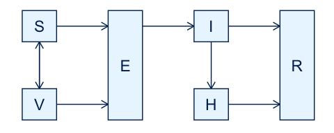
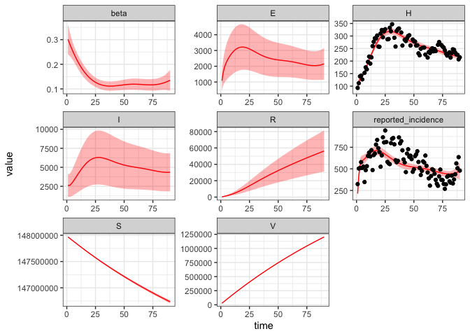

SHIVER = SEIR + H + V
================
Jennifer Freeman

-   <a href="#packages-used-and-settings"
    id="toc-packages-used-and-settings">Packages Used and Settings</a>
-   <a href="#model-specification" id="toc-model-specification">Model
    Specification</a>
-   <a href="#states" id="toc-states">States</a>
-   <a href="#parameters" id="toc-parameters">Parameters</a>
-   <a href="#variable-vaccination-rate"
    id="toc-variable-vaccination-rate">Variable Vaccination Rate</a>
-   <a href="#dynamics" id="toc-dynamics">Dynamics</a>
-   <a href="#calibration-example" id="toc-calibration-example">Calibration
    Example</a>
    -   <a href="#calibration-scenario"
        id="toc-calibration-scenario">Calibration Scenario</a>
    -   <a href="#deciding-on-defaults" id="toc-deciding-on-defaults">Deciding
        on Defaults</a>
    -   <a href="#simulating-dynamics" id="toc-simulating-dynamics">Simulating
        Dynamics</a>
    -   <a href="#estimating-parameters"
        id="toc-estimating-parameters">Estimating Parameters</a>
    -   <a href="#re-parameterizing-and-introducing-transformations"
        id="toc-re-parameterizing-and-introducing-transformations">Re-parameterizing
        and Introducing Transformations</a>
    -   <a href="#runge-kutta-4" id="toc-runge-kutta-4">Runge-Kutta 4</a>
    -   <a href="#fitting-to-multiple-trajectories"
        id="toc-fitting-to-multiple-trajectories">Fitting to Multiple
        Trajectories</a>
    -   <a href="#parameter-identifiability"
        id="toc-parameter-identifiability">Parameter Identifiability</a>
-   <a href="#model-specification-1" id="toc-model-specification-1">Model
    Specification</a>
-   <a href="#references" id="toc-references">References</a>

This model builds on the basic SEIR model, with two additional
compartments for vaccination and hospitalizations.

Vaccines are typically subject to resource constraints and distribution
strategies might prioritize vaccinations for specific subpopulations,
such as immunocompromised people, to reduce bad outcomes. We model this
with a flow of susceptibles entering the vaccination class. This flow
could be a fixed rate, i.e. a constant proportion of the population
receives a vaccine each time step, but instead we wish to capture a more
realistic vaccination rate by allowing it to vary (see [Variable
Vaccination Rate](#variable-vaccination-rate)).

Following vaccination, most individuals return to the susceptible class
when the acquired immune response wears off, called *vaccine waning*.

In reality, vaccinations are only partly effective in developing a
protective host immune response. This *vaccine failure* includes both
vaccine-related inadequacies and host-related reasons like health status
and genetic factors ([Wiedermann, Garner-Spitzer, and Wagner
2016](#ref-wiedermann_2016)). Vaccine failure is modelled as flow from
vaccination to the exposed class.

The SHIVER model assumes all individuals can be exposed to the disease,
but transmission rates depend on vaccination status. Additionally,
individuals with severe infections are hospitalized and assumed to be
isolated, before recovering from the disease. Hospital isolation means
this portion of infectious individuals no longer contribute to the
transmission dynamics.

# Packages Used and Settings

The code in this article uses the following packages.

``` r
library(ggplot2)
library(dplyr)
library(tidyr)
library(macpan2)
```

To keep the optimizer from printing too much in this article, we set the
`macpan2_verbose` option to `FALSE`.

``` r
options(macpan2_verbose = FALSE)
```

# Model Specification

This model has been specified in the `shiver` directory
[here](https://github.com/canmod/macpan2/blob/main/inst/starter_models/shiver/tmb.R)
and is accessible from the `macpan2` model library (see [Example
Models](https://canmod.github.io/macpan2/articles/example_models.html)
for details). We can read in the model specification using the
`mp_tmb_library` command.

``` r
spec = mp_tmb_library(
    "starter_models"
  , "shiver"
  , package = "macpan2"
)
```

This specification can be used to draw the following flow diagrams using
code found in the [source for this
article](https://github.com/canmod/macpan2/blob/main/inst/starter_models/shiver/README.Rmd).
For clarity, we first draw the epidemiological components of the model
first, followed by the wastewater shedding component.

<!-- -->

# States

| variable | description                        |
|----------|------------------------------------|
| S        | Number of susceptible individuals  |
| H        | Number of hospitalized individuals |
| I        | Number of infectious individuals   |
| V        | Number of vaccinated individuals   |
| E        | Number of exposed individuals      |
| R        | Number of recovered individuals    |

The size of the total population is, $N = S + H + I + V + E + R$, and
the disease spreads through homogeneous mixing of the subpopulation
$N_{\text{mix}}=N -H$.

# Parameters

| variable   | description                                                                                         |
|------------|-----------------------------------------------------------------------------------------------------|
| $\phi$     | per capita vaccination rate of susceptibles                                                         |
| $\rho$     | per capita vaccine waning rate                                                                      |
| $\beta_S$  | per capita transmission rate for susceptibles (in $N_{\text{mix}}$ population)                      |
| $\beta_V$  | per capita transmission rate for vaccinated individuals (in $N_{\text{mix}}$ population)            |
| $\alpha$   | per capita infection rate (average time spent in compartment $E$ is $1/\alpha$)                     |
| $\gamma_I$ | per capita recovery rate for infected individuals                                                   |
| $\gamma_H$ | per capita recovery rate for hospitalized individuals                                               |
| $\sigma$   | per capita rate at which infected individuals develop severe infections and require hospitalization |

# Variable Vaccination Rate

We can implement vaccine constraints by adding more model complexity.
Resource limitations create an upper bound on the number of vaccines
that can be administered to susceptibles per time step. There is also
the constraint that we can only vaccinate, at most, the current number
of susceptibles i.e. the vaccination rate can be at most 1. These
constraints naturally lead us to consider a variable vaccination rate
$\phi(S(t))$, instead of vaccinating a fixed proportion $\phi > 0$ per
time step.

There are many choices for the function $\phi(S(t))$. We choose a
sigmoidal function because these curves are increasing and asymptotic.
The *Michaelis-Menten* function, $f(x) = ax/(b + x)$, is one such curve
that passes through the origin, which is convenient for our case because
when we have zero susceptibles our vaccination rate should be zero
([Bolker 2008](#ref-bolker2008)). The slope through the origin for
$f(x)$ is $a/b$ and $f(x)$ approaches $a$ as $x \rightarrow \infty$
([Bolker 2008](#ref-bolker2008)).

We interpret $a$ as the maximum number of vaccinations that can be
administered per time step, and we set $b=a$ to fix the vaccination rate
to be at most 1.

``` r
# asymptote
a = 1000
# force slope to be one at the origin
b = a
```

Suppose we can vaccinate at most 1000 individuals per time step, then
the Michaelis-Menten function will approach this asymptote with
increasing $S(t)$. The choice of $b$ restricts the slope of the curve to
be below the line $y=x$

<!-- -->

To convert the Michaelis-Menten curve above to a rate, we divide by
$S(t)$.

<!-- -->

# Dynamics

$$
\begin{align*}
\frac{dS}{dt} &= -\beta_{S} S\frac{I}{N_{\text{mix}}} - \phi(S) S + \rho V\\
\frac{dV}{dt} &=  \phi(S) S - \rho V - \beta_{V} V\frac{I}{N_{\text{mix}}} \\
\frac{dE}{dt} &= (\beta_{S} S + \beta_{V} V) \frac{I}{N_{\text{mix}}} - \alpha E \\
\frac{dI}{dt} &= \alpha E - \gamma_I I - \sigma I\\
\frac{dH}{dt} &= \sigma I- \gamma_H H \\
\frac{dR}{dt} &= \gamma_I I + \gamma_H H
\end{align*}
$$

This model could be optionally parameterized with $\beta_{S} = \beta$,
and $\beta_{V} = p \beta$ with $p \in (0, 1)$ to explicitly show that
the rate at which vaccinated individuals acquire infection and transmit
the disease is reduced when compared to unvaccinated individuals
([Brauer and Castillo-Chavez 2012](#ref-brauer_2012)).

# Calibration Example

The general goal of this example is to see if we can fit the SHIVER
model to COVID19 hospitilization data to estimate plausible transmission
rates for vaccinated and unvaccinated individuals.

## Calibration Scenario

Let’s create a scenario for calibration. Suppose we have 3 months of
daily COVID19 hospitalization data where some daily reports are missing.

``` r
expected_daily_reports = 90 # days
missed_reports = 10
actual_daily_reports = expected_daily_reports - missed_reports
```

Daily COVID19 hospitalization data for Ontario was obtained from the
[Ontario Data
Catalogue](https://data.ontario.ca/dataset/covid-19-vaccine-data-in-ontario/resource/274b819c-5d69-4539-a4db-f2950794138c).
The data contains daily hospitalization counts stratitfied by
vaccination status and severity of hospitalization care. For simplicity,
we aggregate all counts into one. We will use the first data point
(August 10, 2021) as the initial condition for H, and the second data
point (August 11, 2021) as day 1 of the scenario. To incorporate missed
data reporting, we randomly remove 10 records.

``` r
set.seed(expected_daily_reports)
# Obtained from here:
# https://data.ontario.ca/dataset/covid-19-vaccine-data-in-ontario/resource/274b819c-5d69-4539-a4db-f2950794138c
daily_hospitalizations = (read.csv(
  system.file(
      "starter_models"
    , "shiver"
    , "data"
    , "hospitalizations_ontario.csv"
    , package = "macpan2"
  )
  , row.names = NULL
  ) 
  |> rename(time = X_id)
  |> group_by(time)
  # assuming all hospital admissions (ICU or not) are part of H compartment
  |> summarize(value = sum(icu_unvac, icu_partial_vac, icu_full_vac,
                            hospitalnonicu_unvac, hospitalnonicu_partial_vac,
                            hospitalnonicu_full_vac))
  |> ungroup()
)

head(daily_hospitalizations)
#> # A tibble: 6 × 2
#>    time value
#>   <int> <int>
#> 1     1    63
#> 2     2    93
#> 3     3   112
#> 4     4   139
#> 5     5   142
#> 6     6   127

reported_hospitalizations = (daily_hospitalizations
  # remove first record (Aug 10, this will be the initial condition for H)
  |> filter(time!=1) 
  # update all times to set Aug 11 to be day 1 of the scenario
  |> mutate(time=time-1) 
  |> head(expected_daily_reports)
  |> mutate(matrix="H")
  |> sample_n(actual_daily_reports)
  |> arrange(time)
)
```

## Deciding on Defaults

We want to check the model specification defaults to see what needs
updating.

``` r
# We can view model spec default values here to see if we need to make any
# changes
mp_default(spec)
#>     matrix row col value
#> 1        a         1e+01
#> 2        b         1e+01
#> 3      rho         5e-02
#> 4   beta_s         2e-01
#> 5   beta_v         5e-02
#> 6    alpha         5e-01
#> 7  gamma_i         1e-01
#> 8  gamma_h         7e-02
#> 9    sigma         5e-02
#> 10       N         1e+02
#> 11       I         1e+00
#> 12       V         0e+00
#> 13       E         0e+00
#> 14       H         0e+00
#> 15       R         0e+00
```

We need to update the population size $N$ to the population of Ontario
at the time. [Statistics
Canada](https://doi.org/10.25318/1710000901-eng) estimates a population
of approximately 14.8 million in the second quarter of 2021.

``` r
# N = population size
# ---------------------
N = 14.8e7
```

Vaccination data from [Public Health
Ontario](https://www.publichealthontario.ca/en/Data-and-Analysis/Infectious-Disease/Respiratory-Virus-Tool)
can help us get an estimate for the maximum number of vaccines that can
be administered per day. We average weekly vaccination counts for the
month preceding the scenario, and use this as our estimate for the
Michaelis-Menten asymptote parameter $a$.

``` r
# phi = vaccination rate
# ---------------------
# for the month of July 2021, number of individuals vaccinated per week in ontario
july_vax = c(
    135177
  , 124468
  , 111299
  , 100825
)
## average july weekly data to per day (4 weeks = 28 days)
# use this as the maximum number of daily vaccinations
a = sum(july_vax)/28 # seems plausible
```

We assume the average protection acquired from vaccination lasts 6
months (180 days), individuals spend on average 3.3 days in the exposed
compartment, and 10% of infectious individuals on average require
hospital care before recovery.

``` r
# rho = waning vaccination
# ---------------------
rho = 1/180 # average protection lasts 180 days 

# alpha = exposure rate
# ---------------------
alpha = 1/3.3 #3.3 days in exposed class 

# sigma = hospitalization rate
# ---------------------
# 10% of infections result in hospitalizations
sigma = 1/10
```

The default recovery rates mean an individual takes 10 days on average
to move from I to R, and 14 days on average to go from H to R. These
rates seem plausible for this scenario. Note that the recovery class in
this model, also called the removed compartment, includes deaths from
the hospitalization class. We could speculate that the recovery rate
from H to R could be shorter than the recovery rate from I to R if
hospitalized individuals are more likely to die for instance than
recover (and given death on average happens quicker than recovery from
infection). For now, let’s stick with the 2 week recovery rate for H,
given we assumed in the observed data above that all hospitalized
individuals are in H regardless of severity.

We want to estimate the transmission parameters `beta_s` and `beta_v`.
It’s more challenging to interpret these state dependent parameters, but
we would expect transmission involving vaccinated suceptibles would be
less effective than unvaccinated transmission (`beta_v` \< `beta_s`).
These defaults meet this minimal assumption. Additionally,
$R_{0,S} \approx \beta_s/\gamma_i = 2$ which seems reasonable.

We want to update the initial states with data we can find. [Public
Health
Ontario](https://www.publichealthontario.ca/en/Data-and-Analysis/Infectious-Disease/Respiratory-Virus-Tool)
provides us with daily estimates for $V(0)$ and $I(0)$ and $H(0)$. There
is no data on initial exposure, however we know it is improbable that
there are no exposed individuals initially. We will estimate this value
in addition to transmission parameters when calibrating. Finally, since
we are not interested in the dynamics of S or R, it makes sense to leave
the default $R = 0$, even though we have prior knowledge that by the
summer of 2021 $R > 0$. Individuals in $R$ are removed from the
transmission dynamics, so initializing $R$ to a non-zero value will only
deplete the initial susceptible population by this value.

``` r
## Initial Conditions
# ---------------------

# V0 = initial V
# ---------------------
# We can get weekly Ontario vaccination data here,
# https://www.publichealthontario.ca/en/Data-and-Analysis/Infectious-Disease/Respiratory-Virus-Tool
# If we divide the number of individuals vaccinated in the first week of August 2021 by 7
V0 = 71096/7


# I0 = initial I
# ---------------------
# We can also look at the number of weekly cases of COVID for this time period from here,
# https://www.publichealthontario.ca/en/Data-and-Analysis/Infectious-Disease/Respiratory-Virus-Tool
# and divide by 7 as above to make it a daily estimate. We should also multiply by something
# to account for under-reporting ... say 10.
I0 = 10 * 1903/7

# H0 = initial H
# ---------------------
# Use the first observed data point (Aug 10, 2021) as initial H.
H0 = daily_hospitalizations |> filter(row_number() == 1) |> select(value) |> pull()
```

Now we update the specification to include these defaults.

``` r
spec = mp_tmb_update(spec
  , default = list(
      N = N
    , V = V0
    , I = I0
    , H = H0
    , a = a
    , b = a
    , alpha = alpha
    , sigma = sigma
    , rho = rho
  ) 
)
```

## Simulating Dynamics

Before optimizing, we want to make sure the dynamics look reasonable, so
we simulate from the calibrator object using `mp_trajectory`. The
trajectories look mostly as expected. The sharp initial increase in $E$
and decrease in $I$ might be attributed to setting $E(0)=1$

``` r

# state variables
states = c("S","H","I","V","E","R")

# set up calibrator
shiver_calibrator = mp_tmb_calibrator(
    spec = spec
  , data = reported_hospitalizations
  , traj = "H"
  # parameters we want to estimate (transmission rates)
  # we also want to estimate initial E
  , par = c("beta_v","beta_s","E", "sigma", "gamma_h") 
  , outputs = states
)
# print to check
shiver_calibrator
#> ---------------------
#> Before the simulation loop (t = 0):
#> ---------------------
#> 1: S ~ N - V - E - I - H - R
#> 2: N ~ sum(S, V, E, I, H, R)
#> 
#> ---------------------
#> At every iteration of the simulation loop (t = 1 to T):
#> ---------------------
#>  1: N_mix ~ N - H
#>  2: vaccination ~ S * (((a * S)/(b + S))/S)
#>  3: vaccine_waning ~ V * (rho)
#>  4: unvaccinated_infection ~ S * (I * beta_s/N_mix)
#>  5: vaccinated_infection ~ V * (I * beta_v/N_mix)
#>  6: progression ~ E * (alpha)
#>  7: infectious_recovery ~ I * (gamma_i)
#>  8: hospitalizations ~ I * (sigma)
#>  9: hospital_recovery ~ H * (gamma_h)
#> 10: S ~ S - vaccination + vaccine_waning - unvaccinated_infection
#> 11: V ~ V + vaccination - vaccine_waning - vaccinated_infection
#> 12: E ~ E + unvaccinated_infection + vaccinated_infection - progression
#> 13: I ~ I + progression - infectious_recovery - hospitalizations
#> 14: R ~ R + infectious_recovery + hospital_recovery
#> 15: H ~ H + hospitalizations - hospital_recovery
#> 
#> ---------------------
#> After the simulation loop (t = T + 1):
#> ---------------------
#> 1: sim_H ~ rbind_time(H, obs_times_H)
#> 
#> ---------------------
#> Objective function:
#> ---------------------
#> ~-sum(dpois(obs_H, clamp(sim_H)))

# trajectory has 90 time steps (which is what we expect)
nrow(shiver_calibrator 
  |> mp_trajectory()
  |> filter(matrix == "H")
  |> select(time) 
  |> unique()
)
#> [1] 90
  

# which time steps are missing in observed data
(shiver_calibrator 
  |> mp_trajectory()
  |> filter(matrix == "H")
  |> anti_join(reported_hospitalizations, by = "time")

) 
#>    matrix time row col    value
#> 1       H    6   0   0 1024.357
#> 2       H   26   0   0 2029.666
#> 3       H   32   0   0 2136.003
#> 4       H   38   0   0 2203.361
#> 5       H   41   0   0 2226.851
#> 6       H   48   0   0 2263.465
#> 7       H   57   0   0 2286.020
#> 8       H   61   0   0 2290.445
#> 9       H   70   0   0 2292.591
#> 10      H   73   0   0 2291.580

# before optimizing, do the dynamics look reasonable? 
(shiver_calibrator 
    |> mp_trajectory()
    |> ggplot(aes(time, value))
    + facet_wrap(vars(matrix), scales = 'free')
    + geom_line()
    + theme_bw()
)
```

<!-- -->

## Estimating Parameters

We are now ready for the optimization step.

``` r
# optimize to estimate parameters
# this converges!
mp_optimize(shiver_calibrator)
#> Warning in (function (start, objective, gradient = NULL, hessian = NULL, :
#> NA/NaN function evaluation

#> Warning in (function (start, objective, gradient = NULL, hessian = NULL, :
#> NA/NaN function evaluation

#> Warning in (function (start, objective, gradient = NULL, hessian = NULL, :
#> NA/NaN function evaluation

#> Warning in (function (start, objective, gradient = NULL, hessian = NULL, :
#> NA/NaN function evaluation

#> Warning in (function (start, objective, gradient = NULL, hessian = NULL, :
#> NA/NaN function evaluation

#> Warning in (function (start, objective, gradient = NULL, hessian = NULL, :
#> NA/NaN function evaluation

#> Warning in (function (start, objective, gradient = NULL, hessian = NULL, :
#> NA/NaN function evaluation

#> Warning in (function (start, objective, gradient = NULL, hessian = NULL, :
#> NA/NaN function evaluation

#> Warning in (function (start, objective, gradient = NULL, hessian = NULL, :
#> NA/NaN function evaluation

#> Warning in (function (start, objective, gradient = NULL, hessian = NULL, :
#> NA/NaN function evaluation

#> Warning in (function (start, objective, gradient = NULL, hessian = NULL, :
#> NA/NaN function evaluation
#> $par
#>       params       params       params       params       params 
#> 6.585933e+00 6.407071e-02 2.381306e+03 6.358734e-03 4.038911e-02 
#> 
#> $objective
#> [1] 367.9839
#> 
#> $convergence
#> [1] 0
#> 
#> $iterations
#> [1] 47
#> 
#> $evaluations
#> function gradient 
#>      126       48 
#> 
#> $message
#> [1] "relative convergence (4)"

# look at estimates with CI
est_coef = mp_tmb_coef(shiver_calibrator, conf.int=TRUE) |> round_coef_tab()
est_coef
#>       mat row default  estimate std.error  conf.low conf.high
#> 1  beta_v   0    0.05    6.5859    1.9745    2.7159   10.4559
#> 2  beta_s   0    0.20    0.0641    0.0102    0.0442    0.0840
#> 3       E   0    0.00 2381.3062  357.0389 1681.5228 3081.0895
#> 4   sigma   0    0.10    0.0064    0.0003    0.0058    0.0069
#> 5 gamma_h   0    0.07    0.0404    0.0083    0.0241    0.0567
```

We get an unrealistically low estimate for `beta_s` at 0.06 with a small
standard error and the estimated initial number of exposed individuals,
2381, seems plausible with a standard error of 357. The estimate for
$\beta_v$ however has a large standard error and the point estimate is
too high, indicating that vaccination leads to higher transmission.

What’s worse is the fit is good, even though the parameter estimates do
not make sense. To check the fit we plot the observed data as well as
the trajectories of all states.

<!-- -->

The simulated hospitalization trajectory fits the data well.

## Re-parameterizing and Introducing Transformations

Before addressing this issue with unrealistic parameter estimates, we
re-parameterize ror better interpretability. We model with one
transmission rate, `beta`, and a proportion, `p` in (0,1), representing
the reduced transmission rate for vaccinated people. We also wish to
parameterize `{I0, E0}` to `{I0, E0/I0}` to de-correlate `I0` and `E0`.

We use the log transformation for `beta` and `E0/I0` because both
quantities take on only positive values. We use the logistic
transformation for the proportion `p` to constrain it to the domain
(0,1).

We define a new model specification object with these changes, and set
the default values for all three parameters to be small values (0.01)
because they all have a lower bound of 0.

``` r
# Create a new model specification with these changes:
#
# - update the before step to transform "new" parameters
reparameterized_spec = mp_tmb_insert(spec
     , phase = "before"
     , at=1L
     , expressions = list(
         E ~ exp(log_E_I_ratio) * I
       , beta ~ exp(log_beta)
       , p ~ 1/(1+exp(-logit_p))
     )
     , default = list(
         logit_p = qlogis(1e-2)
       , log_beta = log(1e-2)
       , log_E_I_ratio = log(1e-2) 
     )
)

# - overwrite existing exposure terms with new ones
reparameterized_spec = mp_tmb_update(reparameterized_spec
    , phase = "during"
     # exposure expressions start at step 4 in the during phase
    , at=4L
    , expressions = list(
        mp_per_capita_flow("S", "E", unvaccinated_infection ~ I * beta/N_mix)
      , mp_per_capita_flow("V", "E", vaccinated_infection ~  I * beta * p/N_mix)
    )
)


# all changes have been made
print(reparameterized_spec)
#> ---------------------
#> Default values:
#> ---------------------
#>         matrix row col         value
#>              a          1.684889e+04
#>              b          1.684889e+04
#>            rho          5.555556e-03
#>         beta_s          2.000000e-01
#>         beta_v          5.000000e-02
#>          alpha          3.030303e-01
#>        gamma_i          1.000000e-01
#>        gamma_h          7.000000e-02
#>          sigma          1.000000e-01
#>              N          1.480000e+08
#>              I          2.718571e+03
#>              V          1.015657e+04
#>              E          0.000000e+00
#>              H          6.300000e+01
#>              R          0.000000e+00
#>        logit_p         -4.595120e+00
#>       log_beta         -4.605170e+00
#>  log_E_I_ratio         -4.605170e+00
#> 
#> ---------------------
#> Before the simulation loop (t = 0):
#> ---------------------
#> 1: E ~ exp(log_E_I_ratio) * I
#> 2: beta ~ exp(log_beta)
#> 3: p ~ 1/(1 + exp(-logit_p))
#> 4: S ~ N - V - E - I - H - R
#> 5: N ~ sum(S, V, E, I, H, R)
#> 
#> ---------------------
#> At every iteration of the simulation loop (t = 1 to T):
#> ---------------------
#> 1: N_mix ~ N - H
#> 2: mp_per_capita_flow(from = "S", to = "V", rate = "((a * S)/(b + S))/S", 
#>      abs_rate = "vaccination")
#> 3: mp_per_capita_flow(from = "V", to = "S", rate = "rho", abs_rate = "vaccine_waning")
#> 4: mp_per_capita_flow(from = "S", to = "E", rate = unvaccinated_infection ~ 
#>      I * beta/N_mix)
#> 5: mp_per_capita_flow(from = "V", to = "E", rate = vaccinated_infection ~ 
#>      I * beta * p/N_mix)
#> 6: mp_per_capita_flow(from = "E", to = "I", rate = "alpha", abs_rate = "progression")
#> 7: mp_per_capita_flow(from = "I", to = "R", rate = "gamma_i", abs_rate = "infectious_recovery")
#> 8: mp_per_capita_flow(from = "I", to = "H", rate = "sigma", abs_rate = "hospitalizations")
#> 9: mp_per_capita_flow(from = "H", to = "R", rate = "gamma_h", abs_rate = "hospital_recovery")
```

Next we calibrate and specify the parameters to estimate.

``` r
prior_distributions = list(
      log_beta = mp_uniform()
    , log_E_I_ratio = mp_uniform()
    , logit_p = mp_normal(qlogis(1/4), 8)
    , sigma = mp_uniform()
    , gamma_h = mp_uniform()
)
shiver_calibrator = mp_tmb_calibrator(
    spec = reparameterized_spec
  , data = reported_hospitalizations
  , traj = "H"
  , par = prior_distributions
  , outputs = c(states, "infection")
)
#> Warning in check_outputs(outputs, matrix_outputs, row_outputs): The following outputs were requested but not available in the model:
#> infection, 
#> They will be silently ignored.

# optimize to estimate transmission parameters
# converges with warnings
mp_optimize(shiver_calibrator)
#> Warning in (function (start, objective, gradient = NULL, hessian = NULL, :
#> NA/NaN function evaluation
#> Warning in (function (start, objective, gradient = NULL, hessian = NULL, :
#> NA/NaN function evaluation

#> Warning in (function (start, objective, gradient = NULL, hessian = NULL, :
#> NA/NaN function evaluation

#> Warning in (function (start, objective, gradient = NULL, hessian = NULL, :
#> NA/NaN function evaluation
#> $par
#>       params       params       params       params       params 
#> -4.157752739 -0.207593565 -8.769173074  0.005611944  0.006871819 
#> 
#> $objective
#> [1] 383.1069
#> 
#> $convergence
#> [1] 0
#> 
#> $iterations
#> [1] 34
#> 
#> $evaluations
#> function gradient 
#>       50       35 
#> 
#> $message
#> [1] "relative convergence (4)"
```

Note here that we have to put a normal prior on the logit-transformed
vaccine-efficacy, `p`, parameter, albeit with a very large standard
deviation. If we do not put this prior the optimization fails. The
posterior for this parameter will be effectively identical however to
the prior, suggesting that there is very little information in the data
about vaccine efficacy in this model, as we see in the following
coefficient table.

    #>         mat row default estimate std.error conf.low conf.high
    #> 1     sigma   0    0.10   0.0056    0.0003   0.0051    0.0062
    #> 2   gamma_h   0    0.07   0.0069    0.0007   0.0056    0.0082
    #> 3      beta   0    0.01   0.0156    0.0059   0.0075    0.0328
    #> 4 E_I_ratio   0    0.01   0.8125    0.1243   0.6021    1.0965
    #> 5         p   0    0.01   0.0002    0.1557   0.0000    1.0000

This re-parameterization is beginning to help make a more reasonable
model. Our prior vaccine transmission reduction parameter, `p`, is
restricted to `0-1` and this ensures that vaccination with reduce
transmission. On the other hand, although a reduction in transmission by
0 percent could be plausible but the confidence interval is effectively
all possible values for `p`. The ratio of initial exposed to initial
number of infected is 0.81. Given we specified the initial $I$ as 2719,
the estimated initial number of exposed is approximately 2209. The
biggest issue with these estimates though is that the transmission rate,
`beta`, for unvaccinated people is much too low (we expect something
more like `0.2`).

The fit is very similar to the model without a reparameterization, but
with different inferences for the variables that are not fitted. In
particular, the reparameterized model has a saturating function for the
number of recovered individuals and the number of infectious individuals
goes to zero, which is not at all realistic.

``` r
(shiver_calibrator 
  |> mp_trajectory_sd(conf.int = TRUE)
  |> ggplot(aes(time, value))
  + facet_wrap(~matrix, scales = "free")
  + geom_line(aes(y=value), colour = "red")
  + geom_ribbon(aes(ymin = conf.low, ymax = conf.high), fill = "red", alpha = 0.3)
  + geom_point(data = reported_hospitalizations, aes(time, value))
  + ylim(c(0, NA))
)
```

<!-- -->

## Runge-Kutta 4

By default, `macpan2` uses the first order Euler method for solving
ODEs. We might be able to improve our estimates if we use a higher order
method such as Runge-Kutta 4. Provided our model is specified with the
appropriate flow rates between compartments (it is, see
`?mp_per_capita_flow`), we can easily perform Runge-Kutta 4 with
`mp_rk4()`.

``` r
# let's calibrate
shiver_calibrator_rk4 = mp_tmb_calibrator(
    spec = reparameterized_spec |> mp_rk4()
  , data = reported_hospitalizations
  , traj = "H"
  , par = prior_distributions
  , outputs = c(states, "infection")
)
#> Warning in check_outputs(outputs, matrix_outputs, row_outputs): The following outputs were requested but not available in the model:
#> infection, 
#> They will be silently ignored.

# optimize
# converges with warning
mp_optimize(shiver_calibrator_rk4)
#> Warning in (function (start, objective, gradient = NULL, hessian = NULL, :
#> NA/NaN function evaluation
#> Warning in (function (start, objective, gradient = NULL, hessian = NULL, :
#> NA/NaN function evaluation

#> Warning in (function (start, objective, gradient = NULL, hessian = NULL, :
#> NA/NaN function evaluation

#> Warning in (function (start, objective, gradient = NULL, hessian = NULL, :
#> NA/NaN function evaluation
#> $par
#>       params       params       params       params       params 
#> -4.885527806  0.189588029 -7.950950968  0.004941136  0.006715506 
#> 
#> $objective
#> [1] 381.8805
#> 
#> $convergence
#> [1] 0
#> 
#> $iterations
#> [1] 39
#> 
#> $evaluations
#> function gradient 
#>       55       40 
#> 
#> $message
#> [1] "relative convergence (4)"

# looking at coefficients and CIs
rk4_coef <- mp_tmb_coef(shiver_calibrator_rk4, conf.int = TRUE) |> round_coef_tab()

print(rk4_coef)
#>         mat row default estimate std.error conf.low conf.high
#> 1     sigma   0    0.10   0.0049    0.0002   0.0045    0.0054
#> 2   gamma_h   0    0.07   0.0067    0.0006   0.0055    0.0080
#> 3      beta   0    0.01   0.0076    0.0064   0.0014    0.0394
#> 4 E_I_ratio   0    0.01   1.2088    0.1419   0.9603    1.5215
#> 5         p   0    0.01   0.0004    0.3736   0.0000    1.0000
# rk4 doesn't help us learn more about p
# let's try adding more data
```

In this scenario, Runge-Kutta 4 did not improve our parameter estimates.

## Fitting to Multiple Trajectories

If we include more observed data, can we get a more believable fit and
parameter estimates?

We obtain COVID case count data from the [Ontario Data
Catalogue](https://data.ontario.ca/dataset/covid-19-vaccine-data-in-ontario/resource/eed63cf2-83dd-4598-b337-b288c0a89a16)
for an experiment to fit the SHIVER model to both hospitalization and
incidence data.

We need to expand our model to accommodate more data.

``` r
multi_traj_spec = (reparameterized_spec
  |> mp_tmb_insert(
      phase = "during"
    , at = Inf
    , expressions = list(incidence ~ unvaccinated_infection + vaccinated_infection)
  ) 
  
  ## with case report data, we need to account for reporting delays and 
  ## under-reporting.
  |> mp_tmb_insert_reports("incidence", report_prob = 0.1, mean_delay = 11, cv_delay = 0.25)
  
  ## we again want to fit many parameters on log or logit scales.
  |> mp_tmb_insert(phase = "before", at = 1L
    , expressions = list(
          incidence_report_prob ~ 1/(1 + exp(-logit_report_prob))
        , I ~ exp(log_I)
        , H ~ exp(log_H)
        , R ~ exp(log_R)
        , sigma ~ exp(log_sigma)
        , gamma_h ~ exp(log_gamma_h)
      )
    , default = list(
          logit_report_prob = 0
        , rbf_beta = 1
        , V = V0
        , log_I = log(I0)
        , log_H = log(H0)
        , log_R = 0
        , log_sigma = -3
        , log_gamma_h = -3
        , N = N
      )
  )
  
  ## we also need to prepare for a more flexible fit to the transmission
  ## rate that varies over time, as the report data provide sufficiently more
  ## information for this purposes.
  |> mp_tmb_insert(phase = "during"
    , at = 1L
    , expressions = list(beta ~ beta * rbf_beta)
  )
)
```

``` r
## we need a more elaborate prior distribution
sd_par = 1 ## for convenience we give all parameters the same prior sd, for now
sd_state = 8 ## extremely vague priors on state variables
prior_distributions = list(
    log_beta = mp_normal(log(0.2), sd_par)
  , log_sigma = mp_normal(log(sigma), sd_par)
  , log_gamma_h = mp_normal(log(0.07), sd_par)
  , logit_report_prob = mp_normal(qlogis(0.1), sd_par)
  , logit_p = mp_normal(qlogis(1/4), 4)
  , log_E_I_ratio = mp_normal(0, sd_par)
  , log_I = mp_normal(log(I0), sd_state)
  , log_H = mp_normal(log(H0), sd_state)
  , log_R = mp_normal(log(1), sd_state)
)

## put the data together
dd = rbind(reported_hospitalizations, reported_cases)

# calibrate
shiver_calibrator = mp_tmb_calibrator(
    spec = multi_traj_spec |> mp_hazard()
    # row bind both observed data
  , data = dd
    # fit both trajectories with negative binomial distributions
  , traj = list(H = mp_neg_bin(
      disp = mp_fit(1))
    , reported_incidence = mp_neg_bin(disp = mp_fit(1))
  )
  , par = prior_distributions
    # fit the transmission rate using four radial basis functions for
    # a flexible model of time variation.
  , tv = mp_rbf("rbf_beta", 4, sparse_tol = 1e-8)
  , outputs = c(states, "reported_incidence", "beta")
)
```

Next we optimize, and look at our estimates.

    #>                                     mat row   default  estimate std.error
    #> 1                     time_var_rbf_beta   1    0.0000    0.2041    0.0220
    #> 2                     time_var_rbf_beta   2    0.0000   -0.5628    0.0616
    #> 3                     time_var_rbf_beta   3    0.0000    2.8213    0.2924
    #> 4                     prior_sd_rbf_beta   0    1.0000    0.5721    0.0155
    #> 5                     time_var_rbf_beta   0    0.0000   -0.1323    0.0130
    #> 6                                  beta   0    0.0100    0.3680    0.0302
    #> 7                                 sigma   0    0.0498    0.0388    0.0116
    #> 8                   distr_params_disp_H   0    1.0000  528.7879   59.1467
    #> 9  distr_params_disp_reported_incidence   0    1.0000   22.5734    3.6071
    #> 10                              gamma_h   0    0.0498    1.1633    0.2734
    #> 11                            E_I_ratio   0    0.0100    0.0910    0.1082
    #> 12                                    I   0 2718.5714 2697.4890  703.2089
    #> 13                                    H   0   63.0000    0.0001    0.0909
    #> 14                                    R   0    1.0000    0.9951 2959.8807
    #> 15                          report_prob   0    0.5000    0.8547    0.1647
    #> 16                                    p   0    0.0100    0.2816   11.2698
    #>     conf.low conf.high
    #> 1     0.1609    0.2472
    #> 2    -0.6836   -0.4420
    #> 3     2.2482    3.3945
    #> 4     0.5417    0.6025
    #> 5    -0.1578   -0.1067
    #> 6     0.3133    0.4321
    #> 7     0.0216    0.0698
    #> 8   424.6897  658.4022
    #> 9    16.5037   30.8754
    #> 10    0.7339    1.8441
    #> 11    0.0089    0.9354
    #> 12 1618.3028 4496.3445
    #> 13    0.0000       Inf
    #> 14    0.0000       Inf
    #> 15    0.3040    0.9875
    #> 16    0.0000    1.0000

Our prior for `sigma` is similar to the posterior, but `gamma_h` seems
to have been pushed up by the data from about `0.05` to about `1.11`. We
still do not have confidence in our estimate of `p`. We now have five
other parameters controlling transmission, and so to interpret them we
really need a plot of how transmission varies over time in the model. We
add this variable to our model fit plot.

<!-- -->

This fit makes more sense. The transmission rate for unvaccinated people
varies from about `0.1` to `0.3`. We have a lot of uncertainty about
state variables that we don’t fit, but this makes sense. Importantly `I`
does not drop off to zero, which was an unrealistic aspect of previous
fits.

## Parameter Identifiability

As a first step in calibration, we advise specifying a default for the
parameter of interest, simulate data from the model and then calibrate
to this simulated data to see if the default parameter can be recovered.
If we are unable to recover the default, this could mean there are
identifiability issues with the model and parameter. This should have
been the first step in this example, before calibrating to observed
data.

Here we specify a ground truth for `p` and `beta`, and simulate data
from the model using these default values. We perform two calibrations,
first we estimate `p` with a fixed `beta`, and then we do the reverse.

``` r
# set true values
true_p = 0.2
true_beta = 0.3 
```

``` r
# simulate fake data
simulated_data = (reparameterized_spec
  |> mp_simulator(
      time_steps = expected_daily_reports
    , outputs=states
    , default=list(
        logit_p=qlogis(true_p)
      , log_beta=log(true_beta)
    )
    )
  |> mp_trajectory()
  # add some noise
  |> mutate(value = rpois(n(),value))
  |> select(-c(row,col))
)


## fix beta estimate p
fixed_beta = mp_tmb_calibrator(
    spec = reparameterized_spec |> mp_rk4()
  , data = simulated_data
  , traj = states
  , par = c("logit_p")
  , outputs=states
)
# converges, but not getting estimate for `p`
mp_optimize(fixed_beta)
#> $par
#>  params 
#> 53.5867 
#> 
#> $objective
#> [1] 156031309
#> 
#> $convergence
#> [1] 0
#> 
#> $iterations
#> [1] 2
#> 
#> $evaluations
#> function gradient 
#>        6        2 
#> 
#> $message
#> [1] "relative convergence (4)"
mp_tmb_coef(fixed_beta, conf.int = TRUE) |> round_coef_tab()
#>   mat row default estimate std.error conf.low conf.high
#> 1   p   0    0.01        1         0        0         1
## fix p estimate beta
fixed_a = mp_tmb_calibrator(
  spec = reparameterized_spec |> mp_rk4()
  , data = simulated_data
  , traj = states
  , par = c("log_beta")
  , outputs=states
)
# converges and recovering true beta
mp_optimize(fixed_a)
#> Warning in (function (start, objective, gradient = NULL, hessian = NULL, :
#> NA/NaN function evaluation
#> $par
#>    params 
#> -1.214201 
#> 
#> $objective
#> [1] 7464.532
#> 
#> $convergence
#> [1] 0
#> 
#> $iterations
#> [1] 10
#> 
#> $evaluations
#> function gradient 
#>       17       10 
#> 
#> $message
#> [1] "both X-convergence and relative convergence (5)"
mp_tmb_coef(fixed_a, conf.int = TRUE) |> round_coef_tab()
#>    mat row default estimate std.error conf.low conf.high
#> 1 beta   0    0.01   0.2969         0   0.2969     0.297
```

We are able to recover the transmission rate `beta` but not the
proportion `p`, suggesting model identifiability issues with this
parameter.

# Model Specification

This model has been specified in the `shiver` directory
[here](https://github.com/canmod/macpan2/blob/main/inst/starter_models/shiver/tmb.R)
and is accessible from the `macpan2` model library (see [Example
Models](https://canmod.github.io/macpan2/articles/example_models.html)
for details).

# References

<div id="refs" class="references csl-bib-body hanging-indent">

<div id="ref-bolker2008" class="csl-entry">

Bolker, Benjamin M. 2008. *Ecological Models and Data in R*. Princeton:
Princeton University Press. <https://doi.org/doi:10.1515/9781400840908>.

</div>

<div id="ref-brauer_2012" class="csl-entry">

Brauer, Fred, and Carlos Castillo-Chavez. 2012. *Mathematical Models in
Population Biology and Epidemiology*. Vol. 40. Texts in Applied
Mathematics. New York, NY: Springer New York.
<https://doi.org/10.1007/978-1-4614-1686-9>.

</div>

<div id="ref-wiedermann_2016" class="csl-entry">

Wiedermann, Ursula, Erika Garner-Spitzer, and Angelika Wagner. 2016.
“Primary Vaccine Failure to Routine Vaccines: Why and What to Do?”
*Human Vaccines & Immunotherapeutics* 12 (1): 239–43.
<https://doi.org/10.1080/21645515.2015.1093263>.

</div>

</div>
