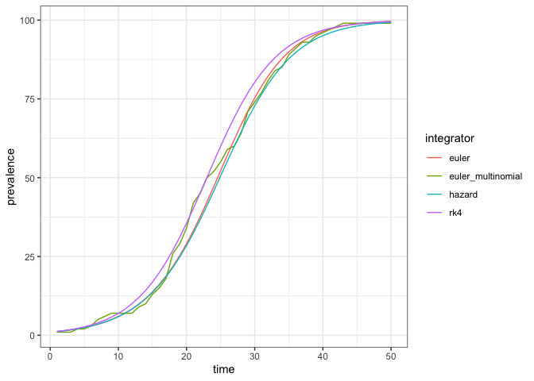

Basic SI
================
Jennifer Freeman

- [States](#states)
- [Parameters](#parameters)
- [Dynamics](#dynamics)
- [Model Specification](#model-specification)
- [Simulation](#simulation)
- [References](#references)

This is the simplest possible epidemic model ([Earn
2008](#ref-earn2008light)).

<!-- -->

The code in this article uses the following packages.

``` r
library(macpan2)
library(ggplot2)
library(dplyr)
```

# States

| variable | description                       |
|----------|-----------------------------------|
| S        | Number of susceptible individuals |
| I        | Number of infectious individuals  |

The size of the total population is, $N = S + I$.

# Parameters

| variable | description                  |
|----------|------------------------------|
| $\beta$  | per capita transmission rate |

# Dynamics

$$
\begin{align*}
\frac{dS}{dt} &= -\beta S\frac{I}{N} \\
\frac{dI}{dt} &= \beta S\frac{I}{N}\\
\end{align*}
$$

# Model Specification

This model has been specified in the `si` directory
[here](https://github.com/canmod/macpan2/blob/main/inst/starter_models/si/tmb.R)
and is accessible from the `macpan2` model library (see [Example
Models](https://canmod.github.io/macpan2/articles/example_models.html)
for details).

# Simulation

Simulation of this and other models depends on the kind of [state
update](https://canmod.github.io/macpan2/reference/mp_euler) that you
use. Here we compare Euler, Euler-multinomial, hazard, and RK4.

``` r
specs = mp_tmb_library("starter_models"
  , "si"
  , package = "macpan2"
  , alternative_specs = TRUE
)
(specs
  |> lapply(mp_simulator, 50L, "I")
  |> lapply(mp_trajectory)
  |> bind_rows(.id = "integrator")
  |> rename(prevalance = value)
  |> ggplot()
  + geom_line(aes(time, prevalance, colour = integrator))
  + theme_bw()
)
```

<!-- -->

# References

<div id="refs" class="references csl-bib-body hanging-indent">

<div id="ref-earn2008light" class="csl-entry">

Earn, David JD. 2008. “A Light Introduction to Modelling Recurrent
Epidemics.” In *Mathematical Epidemiology*, 3–17. Springer.
<https://doi.org/10.1007/978-3-540-78911-6_1>.

</div>

</div>
