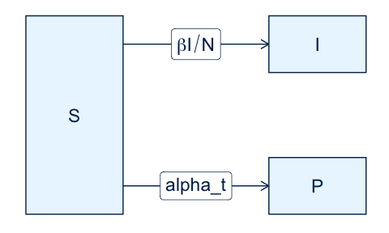
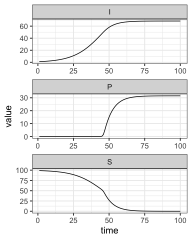
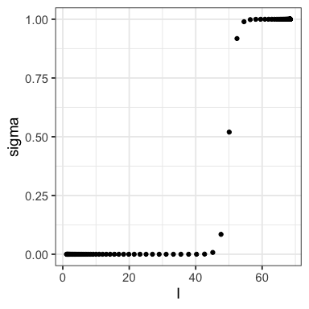
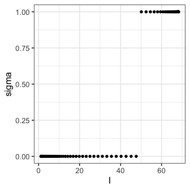

SI with Behaviour
================
Steve Walker

-   <a href="#states" id="toc-states">States</a>
-   <a href="#parameters" id="toc-parameters">Parameters</a>
-   <a href="#dynamics" id="toc-dynamics">Dynamics</a>
-   <a href="#model-specification" id="toc-model-specification">Model
    Specification</a>
-   <a href="#simulation" id="toc-simulation">Simulation</a>

This is an SI model in which individuals can protect themselves.

<!-- -->

The per-capita protection-rate, `alpha_t`, is time-varying, and
increases as the number of infectious individuals, `I`, increases.

The code in this article uses the following packages.

``` r
library(macpan2)
library(ggplot2)
library(dplyr)
library(tidyr)
```

This model was inspired by a question from [Irena
Papst](https://github.com/papsti). The [awareness
model](https://github.com/canmod/macpan2/tree/main/inst/starter_models/awareness)
provides another example of a behavioural response.

# States

| Variable | Description                                         |
|----------|-----------------------------------------------------|
| $S(t)$   | Number of susceptible individuals                   |
| $I(t)$   | Number of infectious individuals                    |
| $P(t)$   | Number of individuals who have protected themselves |

# Parameters

| Parameter             | Description                                                         |
|-----------------------|---------------------------------------------------------------------|
| $\beta$               | Transmission rate                                                   |
| $\alpha_{\text{max}}$ | Maximum per-capita protection rate                                  |
| $I^*$                 | Threshold number of infectious individuals that triggers protection |
| $k$                   | Steepness of the sigmoidal switching function                       |
| $N$                   | Total population size (constant)                                    |

# Dynamics

$$
\begin{align*}
\sigma(I) &= \frac{1}{1 + \exp\left( -k \cdot (I - I^*) \right)} \\
\alpha(t) &= \alpha_{\text{max}} \cdot \sigma(I(t)) \\
\\
\frac{dS}{dt} &= - \beta \cdot \frac{I}{N} \cdot S - \alpha(t) \cdot S \\
\frac{dI}{dt} &= \beta \cdot \frac{I}{N} \cdot S \\
\frac{dP}{dt} &= \alpha(t) \cdot S
\end{align*}
$$

# Model Specification

This model has been specified in the `si_behaviour` directory
[here](https://github.com/canmod/macpan2/blob/main/inst/starter_models/si_behaviour/tmb.R)
and is accessible from the `macpan2` model library (see [Example
Models](https://canmod.github.io/macpan2/articles/example_models.html)
for details).

Printing the steps of the simulation loop illustrates how to implement a
sigmoidal response of the protection rate to the prevalence of
infectious individuals.

``` r
mp_print_during(si)
#> ---------------------
#> At every iteration of the simulation loop (t = 1 to T):
#> ---------------------
#> 1: sigma ~ invlogit(switch_slope * (I - threshold))
#> 2: alpha_t ~ alpha_max * sigma
#> 3: mp_per_capita_flow(from = "S", to = "I", rate = "beta * I / N", 
#>      flow_name = "infection")
#> 4: mp_per_capita_flow(from = "S", to = "P", rate = "alpha_t", flow_name = "protection")
```

One could make this reponse an approximate step-function by increasing
the `switch_slope` parameter, and an exact step-function by modifying
expression `2` as follows.

``` r
alpha_t ~ alpha_max * round(sigma)
```

However, this approach would complicate calibration by introducing a
discontinuity in the log-likelihood. In practice, there is rarely a need
to deviate from an approximate step function, since the approximation
can be made arbitrarily sharp by increasing `switch_slope`.

# Simulation

We simulate the ODEs of this model using the following parameters.

``` r
spec = mp_tmb_library("starter_models"
  , "si_behaviour"
  , package = "macpan2"
)
params = c("beta", "alpha_max", "threshold", "switch_slope")
mp_default_list(spec)[params]
#> $beta
#> [1] 0.1
#> 
#> $alpha_max
#> [1] 0.1
#> 
#> $threshold
#> [1] 50
#> 
#> $switch_slope
#> [1] 1
```

Simulating and plotting the state variables is done using the following
code.

``` r
traj = (spec 
  |> mp_rk4()
  |> mp_simulator(100, c(mp_state_vars(spec), "sigma"))
  |> mp_trajectory()
)
(traj
  |> filter(matrix %in% mp_state_vars(spec))
  |> ggplot()
  + aes(time, value)
  + geom_line()
  + facet_wrap(~matrix, scales = "free", ncol = 1)
  + theme_bw()
)
```

<!-- -->

And here are the points at which the `sigma` function was evaluated
during the simulation, showing a very steep change at `I = 50` from a
regime where nobody is protecting themselves, to one where all
susceptible individuals protect themselves at per-capita rate
`alpha_max`.

``` r
(traj
  |> filter(matrix %in% c("sigma", "I"))
  |> pivot_wider(id_cols = time, names_from = matrix)
  |> ggplot()
  + aes(I, sigma)
  + geom_point()
  + theme_bw()
)
```

<!-- -->

One can effectively make this switch a step function by increasing the
`switch_slope` parameter.

``` r
(spec 
  |> mp_tmb_update(default = list(switch_slope = 100))
  |> mp_rk4()
  |> mp_simulator(100, c("I", "sigma"))
  |> mp_trajectory()
  |> pivot_wider(id_cols = time, names_from = matrix)
  |> ggplot()
  + aes(I, sigma)
  + geom_point()
  + theme_bw()
)
```

<!-- -->
