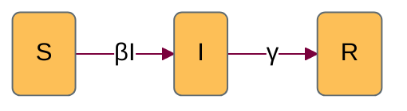

This is (nearly) the simplest possible 'vanilla' epidemic model, implemented as an example.

# States

| variable | description |
| -- | -- |
| S | Number of susceptible individuals |
| I | Number of infectious individuals |
| R | Number of recovered individuals | 

The size of the total population is,  $ N = S + I + R$.
# Parameters

| variable | description |
| -- | -- |
| $\beta$ | per capita transmission rate |
| $\gamma$ | per capita recovery rate |

# Dynamics 

$$
\begin{align*}
\frac{dS}{dt} &= -\beta SI \\
\frac{dI}{dt} &= \beta SI - \gamma I \\
\frac{dR}{dt} &= \gamma I
\end{align*}
$$

# References

Earn, D.J.D. (2008). A Light Introduction to Modelling Recurrent Epidemics. In: Brauer, F., van den Driessche, P., Wu, J. (eds) Mathematical Epidemiology. Lecture Notes in Mathematics, vol 1945. Springer, Berlin, Heidelberg. https://doi.org/10.1007/978-3-540-78911-6_1