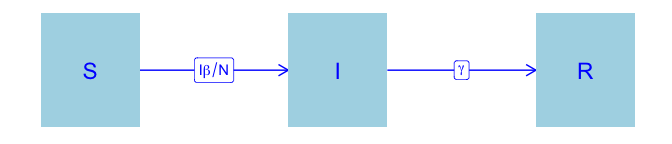
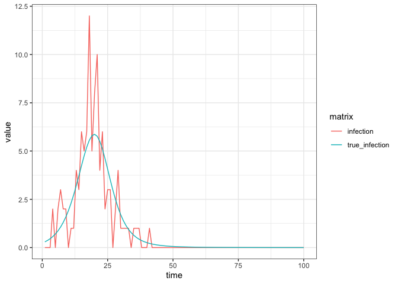
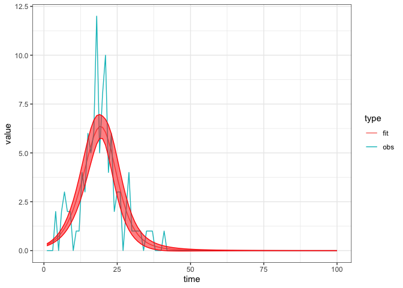

basic SIR
================
Steve Walker

-   <a href="#packages-used-and-settings"
    id="toc-packages-used-and-settings">Packages Used and Settings</a>
-   <a href="#model-specification" id="toc-model-specification">Model
    Specification</a>
-   <a href="#states" id="toc-states">States</a>
-   <a href="#parameters" id="toc-parameters">Parameters</a>
-   <a href="#dynamics" id="toc-dynamics">Dynamics</a>
-   <a href="#calibration" id="toc-calibration">Calibration</a>
    -   <a href="#simulate-fake-data" id="toc-simulate-fake-data">Simulate fake
        data</a>
    -   <a href="#calibrate-the-model" id="toc-calibrate-the-model">Calibrate
        the model</a>
    -   <a href="#explore-the-fit" id="toc-explore-the-fit">Explore the fit</a>

This is (nearly) the simplest possible ‘vanilla’ epidemic model,
implemented as an example. Elaborations on this model are also
available.

-   [sir_waning](https://github.com/canmod/macpan2/tree/main/inst/starter_models/sir_waning)
-   [sir_demog](https://github.com/canmod/macpan2/tree/main/inst/starter_models/sir_demog)
-   [sir_mosquito](https://github.com/canmod/macpan2/tree/main/inst/starter_models/sir_mosquito)

An even simpler model is
[here](https://github.com/canmod/macpan2/tree/main/inst/starter_models/si)

# Packages Used and Settings

The code in this article uses the following packages.

``` r
library(ggplot2)
library(dplyr)
library(tidyr)
library(macpan2)
```

To keep the optimizer from printing too much in this article, we set the
`macpan2_verbose` option to `FALSE`.

``` r
options(macpan2_verbose = FALSE)
```

# Model Specification

This model has been specified in the `sir` directory
[here](https://github.com/canmod/macpan2/blob/main/inst/starter_models/sir/tmb.R)
and is accessible from the `macpan2` model library (see [Example
Models](https://canmod.github.io/macpan2/articles/example_models.html)
for details). We can read in the model specification using the
`mp_tmb_library` command.

``` r
spec = mp_tmb_library(
    "starter_models"
  , "sir"
  , package = "macpan2"
)
```

This specification can be used to draw the following flow diagram using
code found in the [source for this
article](https://github.com/canmod/macpan2/blob/main/inst/starter_models/sir/README.Rmd).

<!-- -->

# States

| variable | description                       |
|----------|-----------------------------------|
| S        | Number of susceptible individuals |
| I        | Number of infectious individuals  |
| R        | Number of recovered individuals   |

The size of the total population is, $N = S + I + R$.

# Parameters

| variable | description                  |
|----------|------------------------------|
| $\beta$  | per capita transmission rate |
| $\gamma$ | per capita recovery rate     |

# Dynamics

$$
\begin{align*}
\frac{dS}{dt} &= -\beta S\frac{I}{N} \\
\frac{dI}{dt} &= \beta S\frac{I}{N} - \gamma I \\
\frac{dR}{dt} &= \gamma I
\end{align*}
$$

# Calibration

## Simulate fake data

We modify the specification so that it is different from the default
library model that we will calibrate. Then we simulate incidence data
from this model, and add noise.

``` r
set.seed(1L)
time_steps = 100L
true = list(
    beta = 0.3 # beta value to simulate data with
  , gamma = 0.05 # gamma value to simulate data with
)
sir = (spec
  |> mp_tmb_insert(
      phase = "during", at = Inf
    , expressions = list(noisy_infection ~ rpois(infection))
    , default = true
  )
  |> mp_simulator(  
      time_steps = time_steps
    , outputs = c("noisy_infection", "infection")
  )
)
  
observed_data = (sir
  |> mp_trajectory() 
  |> mutate(matrix = ifelse(matrix == "infection", "true_infection", "infection"))
)
(observed_data
  |> ggplot()
  + geom_line(aes(time, value, colour = matrix))
  + theme_bw()
)
```

<!-- -->

Note that the incidence per time-step is called `infection` in the
model, to indicate that it is the rate at which individuals from from
`S` to `I` due to infection. Observe the naming convention in the
expanded specification object.

``` r
print(spec |> mp_expand())
#> ---------------------
#> Default values:
#> ---------------------
#>  matrix row col value
#>    beta           0.2
#>   gamma           0.1
#>       N         100.0
#>       I           1.0
#>       R           0.0
#> 
#> ---------------------
#> Before the simulation loop (t = 0):
#> ---------------------
#> 1: S ~ N - I - R
#> 
#> ---------------------
#> At every iteration of the simulation loop (t = 1 to T):
#> ---------------------
#> 1: infection ~ S * (I * beta/N)
#> 2: recovery ~ I * (gamma)
#> 3: S ~ S - infection
#> 4: I ~ I + infection - recovery
#> 5: R ~ R + recovery
```

## Calibrate the model

``` r
cal = mp_tmb_calibrator(
    spec
  , data = filter(observed_data, matrix == "infection")
  , traj = "infection"
  , par = c("beta", "gamma")
)
mp_optimize(cal)
#> Warning in (function (start, objective, gradient = NULL, hessian = NULL, :
#> NA/NaN function evaluation
#> $par
#>     params     params 
#> 0.29778059 0.03310577 
#> 
#> $objective
#> [1] 65.48933
#> 
#> $convergence
#> [1] 0
#> 
#> $iterations
#> [1] 8
#> 
#> $evaluations
#> function gradient 
#>       11        8 
#> 
#> $message
#> [1] "both X-convergence and relative convergence (5)"
```

## Explore the fit

The calibration object now contains the information gained through
optimization. We can use this information to check the fitted parameter
values.

``` r
coef = mp_tmb_coef(cal) |> round_coef_tab()
coef$true = true[coef$mat]
print(coef)
#>     mat row default estimate std.error true
#> 1  beta   0     0.2   0.2978    0.0273  0.3
#> 2 gamma   0     0.1   0.0331    0.0256 0.05
```

The estimate is different enough from the default to indicate that the
optimizer did ‘something’, and the estimate is close enough to the true
value to indicate that it did the right thing. Indeed the fit to the
data is excellent, although we should expect this given that we fitted
the same model used to generate the data. Note well that it is usually
not this easy (see the
[seir](https://github.com/canmod/macpan2/tree/main/inst/starter_models/seir)
model for a peak at what can go wrong).

``` r
comparison_data = list(
    obs = observed_data
  , fit = mp_trajectory_sd(cal, conf.int = TRUE)
) |> bind_rows(.id = "type")
(comparison_data
  |> filter(matrix == "infection")
  |> ggplot()
  + geom_line(aes(time, value, colour = type))
  + geom_ribbon(aes(time, ymin = conf.low, ymax = conf.high)
    , colour = "red"
    , fill = "red"
    , alpha = 0.5
    , filter(comparison_data, type == "fit")
  )
  + theme_bw()
)
```

<!-- -->
