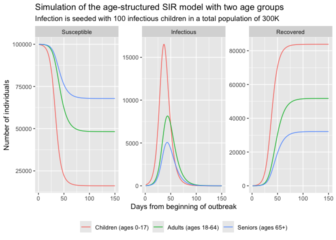

Age-stratified SIR
================
Irena Papst, Steve Walker

-   <a href="#packages-used-and-settings"
    id="toc-packages-used-and-settings">Packages Used and Settings</a>
-   <a href="#model-specification" id="toc-model-specification">Model
    Specification</a>
-   <a href="#states" id="toc-states">States</a>
-   <a href="#parameters" id="toc-parameters">Parameters</a>
-   <a href="#dynamics" id="toc-dynamics">Dynamics</a>
-   <a href="#simulation-example" id="toc-simulation-example">Simulation
    Example</a>
-   <a href="#limitations" id="toc-limitations">Limitations</a>
-   <a href="#references" id="toc-references">References</a>

This is an expansion of the
[sir](https://github.com/canmod/macpan2/tree/main/inst/starter_models/sir)
model to include age-stratification; each state variable is subdivided
by age, and transmission is governed by a age-based contact matrix, as
described in ([Mistry et al. 2021](#ref-Mistry2021)).

# Packages Used and Settings

The code in this article uses the following packages.

``` r
library(ggplot2)
library(dplyr)
library(forcats)
library(scales)
library(macpan2)
```

# Model Specification

This model has been specified in the `sir_age` directory
[here](https://github.com/canmod/macpan2/blob/main/inst/starter_models/sir_age/tmb.R)
and is accessible from the `macpan2` model library (see [Example
Models](https://canmod.github.io/macpan2/articles/example_models.html)
for details). We can read in the model specification using the
`mp_tmb_library` command.

``` r
spec = mp_tmb_library(
    "starter_models"
  , "sir_age"
  , package = "macpan2"
)
```

# States

| variable | description                       |
|----------|-----------------------------------|
| S        | Number of susceptible individuals |
| I        | Number of infectious individuals  |
| R        | Number of recovered individuals   |

Each state variable is a vector with one entry per age group.

The size of the population in each age groups is given by the components
of $N = S + I + R$.

# Parameters

| variable | description                                                                                                                                 |
|----------|---------------------------------------------------------------------------------------------------------------------------------------------|
| $\tau$   | transmissibility, *i.e.*, the proportion of contacts with infecteds that yield infection                                                    |
| $\gamma$ | per capita recovery rate                                                                                                                    |
| $M$      | matrix of contact rates between age groups, *e.g.* $M_{ij}$ is the rate of contact between susceptibles of age $i$ and infecteds of age $j$ |

$\tau$ and $\gamma$ can be specified by age (as vectors), though in the
example below we use a scalar value that applies to all age groups.

# Dynamics

$$
\begin{align*}
\frac{dS}{dt} &= - \lambda S \\
\frac{dI}{dt} &= \lambda S - \gamma I \\
\frac{dR}{dt} &= \gamma I
\end{align*}
$$

Here $\lambda = \tau M \frac{I}{N}$.

# Simulation Example

``` r

# variable labellers
matrix_labeller <-  c(
  "S" = "Susceptible",
  "I" = "Infectious",
  "R" = "Recovered"
)
row_labeller <- c(
  "0" = "Children (ages 0-17)",
  "1" = "Adults (ages 18-64)",
  "2" = "Seniors (ages 65+)"
)

I0 = mp_default_list(spec)$I[1]
N = mp_default_list(spec)$N

# simulate & visualize
(spec
  # simulate
  |> mp_simulator(
    time_steps = 150
  , outputs = mp_state_vars(spec)
  )
  |> mp_trajectory()
  # enforce natural order of variables for plotting
  |> dplyr::mutate(
    matrix = factor(matrix, levels = mp_state_vars(spec))
   , row = forcats::as_factor(row)
   )
  # visualize trajectory
  |> ggplot2::ggplot(
    mapping = ggplot2::aes(x = time, y = value, colour = row)
  ) 
  + ggplot2::geom_line()
  + ggplot2::facet_wrap(
      ~ matrix, 
      labeller = ggplot2::labeller(
        matrix = matrix_labeller
      ),
      scales = "free_y")
  + ggplot2::scale_colour_discrete(
      labels = row_labeller
    )
  + ggplot2::labs(
      title = "Simulation of the age-structured SIR model with two age groups",
      subtitle = paste("Infection is seeded with", I0, "infectious children in a total population of", scales::label_number(scale_cut = scales::cut_short_scale())(sum(N))),
      x = "Days from beginning of outbreak",
      y = "Number of individuals"
    )
  + ggplot2::theme(
      legend.position = "bottom"
    , legend.title = ggplot2::element_blank()
    )
)
```

<!-- -->

# Limitations

Models with vector-valued state variables cannot be simulated with the
[mp_euler_multinomial](https://canmod.github.io/macpan2/reference/state_updates)
state update method. If you try you will get the following error.

    #> Error in self$.runner(..., .phases = .phases, .method = "report") : 
    #> The following error was thrown by the TMB engine:
    #>   The first 'size' argument must be scalar.
    #> This error occurred at the following expression:
    #>   infection ~ reulermultinom(S, lambda)
    #> This error occurred at time-step 1 in the following function:
    #>   reulermultinom
    #> This function call got 2 arguments, each of which is described by the rows of the following table:
    #> 
    #> Rows  Cols  Types 
    #> ----  ----  ----- 
    #> 3     1     double
    #> 3     1     double

# References

<div id="refs" class="references csl-bib-body hanging-indent">

<div id="ref-Mistry2021" class="csl-entry">

Mistry, Dina, Maria Litvinova, Ana Pastore y Piontti, Matteo Chinazzi,
Laura Fumanelli, Marcelo F. C. Gomes, Syed A. Haque, et al. 2021.
“Inferring High-Resolution Human Mixing Patterns for Disease Modeling.”
*Nature Communications* 12 (1).
<https://doi.org/10.1038/s41467-020-20544-y>.

</div>

</div>
