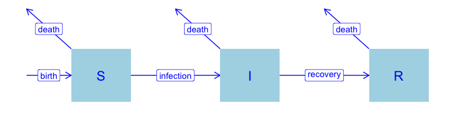

SIR with demography
================
Steve Walker

-   <a href="#setup" id="toc-setup">Setup</a>
-   <a href="#packages-used" id="toc-packages-used">Packages Used</a>
-   <a href="#model-specification" id="toc-model-specification">Model
    Specification</a>
-   <a href="#states" id="toc-states">States</a>
-   <a href="#parameters" id="toc-parameters">Parameters</a>
-   <a href="#dynamics" id="toc-dynamics">Dynamics</a>
-   <a href="#references" id="toc-references">References</a>

# Setup

The R code in this article requires the following setup.

``` r
if (!require(macpan2)) {
  repos = c('https://canmod.r-universe.dev', 'https://cloud.r-project.org')
  install.packages('macpan2', repos = repos)
}
#> Loading required package: macpan2
if (!require(ggplot2)) install.packages("ggplot2")
#> Loading required package: ggplot2
if (!require(dplyr)) install.packages("dplyr")
#> Loading required package: dplyr
#> 
#> Attaching package: 'dplyr'
#> The following object is masked from 'package:macpan2':
#> 
#>     all_equal
#> The following objects are masked from 'package:stats':
#> 
#>     filter, lag
#> The following objects are masked from 'package:base':
#> 
#>     intersect, setdiff, setequal, union
library(ggraph)
library(tidygraph)
#> 
#> Attaching package: 'tidygraph'
#> The following object is masked from 'package:stats':
#> 
#>     filter
```

This is an extension of the [sir](inst/starter_models/sir) model to
include birth and death.

# Packages Used

The code in this article uses the following packages.

``` r
library(ggplot2)
library(dplyr)
library(tidyr)
library(macpan2)
```

# Model Specification

This model has been specified in the `sir_demog` directory
[here](https://github.com/canmod/macpan2/blob/main/inst/starter_models/sir_demog/tmb.R)
and is accessible from the `macpan2` model library (see [Example
Models](https://canmod.github.io/macpan2/articles/example_models.html)
for details). We can read in the model specification using the
`mp_tmb_library` command.

``` r
spec = mp_tmb_library(
    "starter_models"
  , "sir_demog"
  , package = "macpan2"
)
```

This specification can be used to draw the following flow diagrams using
code found in the [source for this
article](https://github.com/canmod/macpan2/blob/main/inst/starter_models/sir_demog/README.Rmd).

<!-- -->

# States

| variable | description                       |
|----------|-----------------------------------|
| S        | Number of susceptible individuals |
| I        | Number of infectious individuals  |
| R        | Number of recovered individuals   |

The size of the total population is, $N = S + I + R$.

# Parameters

| variable | description                  |
|----------|------------------------------|
| $\beta$  | per capita transmission rate |
| $\gamma$ | per capita recovery rate     |
| $\nu$    | per capita birth rate        |
| $\mu$    | per capita mortality rate    |

The SIR model with demography often assumes that the time scale of
epidemic changes is much shorter than demographic changes ([Earn
2008](#ref-earn2008light)). This translates to a constant population
size $N$ over time, with $\nu = \mu$. We parameterize birth and
mortality rates separately to allow for the general case in which
epidemic and demographic dynamics occur on similar time scales.

# Dynamics

We assume new individuals (births) join the susceptible compartment, and
individuals can leave the population (die) from any compartment.

$$
\begin{align*}
\frac{dS}{dt} &= \nu N -\beta S\frac{I}{N} - \mu S \\
\frac{dI}{dt} &= \beta S\frac{I}{N} - \gamma I - \mu I \\
\frac{dR}{dt} &= \gamma I - \mu R
\end{align*}
$$

# References

<div id="refs" class="references csl-bib-body hanging-indent">

<div id="ref-earn2008light" class="csl-entry">

Earn, David JD. 2008. “A Light Introduction to Modelling Recurrent
Epidemics.” In *Mathematical Epidemiology*, 3–17. Springer.
<https://doi.org/10.1007/978-3-540-78911-6_1>.

</div>

</div>
