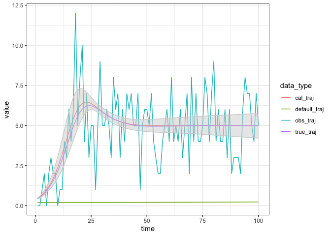

SIR with demography
================
Jen Freeman, Steve Walker

-   <a href="#packages-used" id="toc-packages-used">Packages Used</a>
-   <a href="#model-specification" id="toc-model-specification">Model
    Specification</a>
-   <a href="#states" id="toc-states">States</a>
-   <a href="#parameters" id="toc-parameters">Parameters</a>
-   <a href="#dynamics" id="toc-dynamics">Dynamics</a>
-   <a href="#calibration-example" id="toc-calibration-example">Calibration
    Example</a>
    -   <a href="#simulate-fake-data" id="toc-simulate-fake-data">Simulate fake
        data</a>
    -   <a href="#calibrate-to-fake-data"
        id="toc-calibrate-to-fake-data">calibrate to fake data</a>
    -   <a href="#explore-the-calibration"
        id="toc-explore-the-calibration">Explore the calibration</a>
-   <a href="#references" id="toc-references">References</a>

This is an extension of the
[sir](https://github.com/canmod/macpan2/tree/main/inst/starter_models/sir)
model to include birth and death.

# Packages Used

The code in this article uses the following packages.

``` r
library(ggplot2)
library(dplyr)
library(tidyr)
library(macpan2)
```

# Model Specification

This model has been specified in the `sir_demog` directory
[here](https://github.com/canmod/macpan2/blob/main/inst/starter_models/sir_demog/tmb.R)
and is accessible from the `macpan2` model library (see [Example
Models](https://canmod.github.io/macpan2/articles/example_models.html)
for details). We can read in the model specification using the
`mp_tmb_library` command.

``` r
spec = mp_tmb_library(
    "starter_models"
  , "sir_demog"
  , package = "macpan2"
)
```

This specification can be used to draw the following flow diagram using
code found in the [source for this
article](https://github.com/canmod/macpan2/blob/main/inst/starter_models/sir_demog/README.Rmd).

<!-- -->

# States

| variable | description                       |
|----------|-----------------------------------|
| S        | Number of susceptible individuals |
| I        | Number of infectious individuals  |
| R        | Number of recovered individuals   |

The size of the total population is, $N = S + I + R$.

# Parameters

| variable | description                  |
|----------|------------------------------|
| $\beta$  | per capita transmission rate |
| $\gamma$ | per capita recovery rate     |
| $\nu$    | per capita birth rate        |
| $\mu$    | per capita mortality rate    |

The SIR model with demography often assumes that the time scale of
epidemic changes is much shorter than demographic changes ([Earn
2008](#ref-earn2008light)). This translates to a constant population
size $N$ over time, with $\nu = \mu$. We parameterize birth and
mortality rates separately to allow for the general case in which
epidemic and demographic dynamics occur on similar time scales.

# Dynamics

We assume new individuals (births) join the susceptible compartment, and
individuals can leave the population (die) from any compartment.

$$
\begin{align*}
\frac{dS}{dt} &= \nu N -\beta S\frac{I}{N} - \mu S \\
\frac{dI}{dt} &= \beta S\frac{I}{N} - \gamma I - \mu I \\
\frac{dR}{dt} &= \gamma I - \mu R
\end{align*}
$$

# Calibration Example

## Simulate fake data

We modify the specification so that it is different from the default
library model that we will calibrate. We will use the
[`mp_rk4`](https://canmod.github.io/macpan2/reference/mp_euler.html) ODE
solver.

``` r
spec_for_making_fake_data = mp_tmb_insert(
    spec |> mp_rk4()
  , default = list(mu = 0.1, beta = 0.4)
)
```

We simuate 100 time steps of this model.

``` r
time_steps = 100L
sim = mp_simulator(  
    model = spec_for_making_fake_data
  , time_steps = time_steps
  , outputs = "infection"
)

# simulate data (known 'true' trajectory)
true_traj = obs_traj = mp_trajectory(sim)

# add noise (simulated observed and noisy trajectory)
set.seed(1L)
obs_traj$value = rpois(time_steps, true_traj$value)
```

## calibrate to fake data

We fit `beta` and `mu` to the simulated infection flow (i.e.,
incidence). To be consistent we use the
[`mp_rk4`](https://canmod.github.io/macpan2/reference/mp_euler.html) ODE
solver.

``` r
cal = mp_tmb_calibrator(mp_rk4(spec), obs_traj, "infection", c("beta", "mu"))
```

Before calibrating, we capture the ‘default’ trajectory that we would
simulate before our model is calibrated (represents ignorance). This is
useful to show that calibration ‘did something’.

``` r
default_traj = mp_trajectory(cal)
```

Calibrate the model and check for convergence (convergence = 0 is good).

``` r
mp_optimize(cal)
#> outer mgc:  24440.95 
#> outer mgc:  3296.092 
#> outer mgc:  6809.802 
#> outer mgc:  4930.044 
#> outer mgc:  1241.086 
#> outer mgc:  638.3514 
#> outer mgc:  381.0098 
#> outer mgc:  260.7467 
#> outer mgc:  44.415 
#> outer mgc:  0.5932129 
#> outer mgc:  0.0001203194
#> $par
#>    params    params 
#> 0.4096054 0.1002555 
#> 
#> $objective
#> [1] 204.8933
#> 
#> $convergence
#> [1] 0
#> 
#> $iterations
#> [1] 11
#> 
#> $evaluations
#> function gradient 
#>       14       11 
#> 
#> $message
#> [1] "both X-convergence and relative convergence (5)"
```

## Explore the calibration

The calibration object now contains the information gained through
optimization. We can use this information to check the fitted parameter
values.

``` r
mp_tmb_coef(cal, conf.int = TRUE)
#> outer mgc:  0.0001203194 
#> outer mgc:  61.93006 
#> outer mgc:  62.25842 
#> outer mgc:  1643.722 
#> outer mgc:  1771.836 
#> outer mgc:  498.8395
#>       term  mat row col default  type  estimate    std.error   conf.low
#> 1   params beta   0   0   0.200 fixed 0.4096054 0.0144334428 0.38131633
#> 2 params.1   mu   0   0   0.095 fixed 0.1002555 0.0009279992 0.09843669
#>   conf.high
#> 1 0.4378944
#> 2 0.1020744
```

These fits similar to the true values.

``` r
spec_for_making_fake_data$default[c("beta", "mu")]
#> $beta
#> [1] 0.4
#> 
#> $mu
#> [1] 0.1
```

We can also get the calibrated trajectory with confidence intervals.

``` r
cal_traj = mp_trajectory_sd(cal, conf.int = TRUE) 
#> outer mgc:  0.0001203194 
#> outer mgc:  61.93006 
#> outer mgc:  62.25842 
#> outer mgc:  1643.722 
#> outer mgc:  1771.836
data = (nlist(true_traj, obs_traj, default_traj, cal_traj)
  |> bind_rows(.id = "data_type")
)
```

The calibrated trajectory and confidence interval are consistent with
the true trajectory and go through the observed trajectory. The default
trajectory is much different, indicating that calibration really did do
what it should do.

``` r
(data
  |> ggplot()
  + geom_line(aes(time, value, colour = data_type))
  + geom_ribbon(aes(x = time, ymin = conf.low, ymax = conf.high)
      , alpha = 0.5
      , colour = "lightgrey"
      , fill = "lightgrey"
      , data = cal_traj
    ) 
  + theme_bw()
)
```

<!-- -->

# References

<div id="refs" class="references csl-bib-body hanging-indent">

<div id="ref-earn2008light" class="csl-entry">

Earn, David JD. 2008. “A Light Introduction to Modelling Recurrent
Epidemics.” In *Mathematical Epidemiology*, 3–17. Springer.
<https://doi.org/10.1007/978-3-540-78911-6_1>.

</div>

</div>
