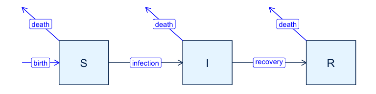

SIR with demography
================
Jen Freeman, Steve Walker

-   <a href="#packages-used-and-settings"
    id="toc-packages-used-and-settings">Packages Used and Settings</a>
-   <a href="#model-specification" id="toc-model-specification">Model
    Specification</a>
-   <a href="#states" id="toc-states">States</a>
-   <a href="#parameters" id="toc-parameters">Parameters</a>
-   <a href="#dynamics" id="toc-dynamics">Dynamics</a>
-   <a href="#calibration-example" id="toc-calibration-example">Calibration
    Example</a>
    -   <a href="#simulate-fake-data" id="toc-simulate-fake-data">Simulate fake
        data</a>
    -   <a href="#calibrate-to-fake-data"
        id="toc-calibrate-to-fake-data">Calibrate to fake data</a>
    -   <a href="#explore-the-calibration"
        id="toc-explore-the-calibration">Explore the calibration</a>
-   <a href="#references" id="toc-references">References</a>

This is an extension of the
[sir](https://github.com/canmod/macpan2/tree/main/inst/starter_models/sir)
model that includes birth and death.

# Packages Used and Settings

The code in this article uses the following packages.

``` r
library(ggplot2)
library(dplyr)
library(tidyr)
library(macpan2)
```

To keep the optimizer from printing too much in this article, we set the
`macpan2_verbose` option to `FALSE`.

``` r
options(macpan2_verbose = FALSE)
```

# Model Specification

This model has been specified in the `sir_demog` directory
[here](https://github.com/canmod/macpan2/blob/main/inst/starter_models/sir_demog/tmb.R)
and is accessible from the `macpan2` model library (see [Example
Models](https://canmod.github.io/macpan2/articles/example_models.html)
for details). We can read in the model specification using the
`mp_tmb_library` command.

``` r
spec = mp_tmb_library(
    "starter_models"
  , "sir_demog"
  , package = "macpan2"
)
```

This specification can be used to draw the following flow diagram using
code found in the [source for this
article](https://github.com/canmod/macpan2/blob/main/inst/starter_models/sir_demog/README.Rmd).

<!-- -->

# States

| variable | description                       |
|----------|-----------------------------------|
| S        | Number of susceptible individuals |
| I        | Number of infectious individuals  |
| R        | Number of recovered individuals   |

The size of the total population is, $N = S + I + R$.

# Parameters

| variable | description                  |
|----------|------------------------------|
| $\beta$  | per capita transmission rate |
| $\gamma$ | per capita recovery rate     |
| $\nu$    | per capita birth rate        |
| $\mu$    | per capita mortality rate    |

The SIR model with demography often assumes that the time scale of
epidemic changes is much shorter than demographic changes ([Earn
2008](#ref-earn2008light)). This translates to a constant population
size $N$ over time, with $\nu = \mu$. We parameterize birth and
mortality rates separately to allow for the general case in which
epidemic and demographic dynamics occur on similar time scales.

# Dynamics

We assume new individuals (births) join the susceptible compartment, and
individuals can leave the population (die) from any compartment.

$$
\begin{align*}
\frac{dS}{dt} &= \nu N -\beta S\frac{I}{N} - \mu S \\
\frac{dI}{dt} &= \beta S\frac{I}{N} - \gamma I - \mu I \\
\frac{dR}{dt} &= \gamma I - \mu R
\end{align*}
$$

# Calibration Example

## Simulate fake data

The first step when testing a new fitting procedure is to simulate
clean, well-behaved data from the model and check if you can recover
parameters close to the true values (see
[here](https://canmod.github.io/macpan2/articles/calibration.html) for
an article on this topic). We modify the specification so that it is
different from the default library model, which we will then calibrate
using data generated from this modified model. We simulate incidence
data from this model, and add noise. We will use the
[`mp_rk4`](https://canmod.github.io/macpan2/reference/mp_euler.html) ODE
solver.

``` r
true = list(mu = 0.1, beta = 0.4)
spec_for_making_fake_data = mp_tmb_insert(
    spec |> mp_rk4()
  , default = true
)
```

We simuate 100 time steps of this model.

``` r
time_steps = 100L
sim = mp_simulator(  
    model = spec_for_making_fake_data
  , time_steps = time_steps
  , outputs = "infection"
)

# simulate data (known 'true' trajectory)
true_traj = obs_traj = mp_trajectory(sim)

# add noise (simulated observed and noisy trajectory)
set.seed(1L)
obs_traj$value = rpois(time_steps, true_traj$value)
```

## Calibrate to fake data

We fit `beta` and `mu` to the simulated infection flow (i.e.,
incidence). To be consistent we use the
[`mp_rk4`](https://canmod.github.io/macpan2/reference/mp_euler.html) ODE
solver.

``` r
cal = mp_tmb_calibrator(mp_rk4(spec), obs_traj, "infection", c("beta", "mu"))
```

Before calibrating, we capture the ‘default’ trajectory that we would
simulate before our model is calibrated (represents ignorance). This is
useful to show that calibration ‘did something’.

``` r
default_traj = mp_trajectory(cal)
```

Calibrate the model and check for convergence (convergence = 0 is good).

``` r
mp_optimize(cal)
#> $par
#>    params    params 
#> 0.4096054 0.1002555 
#> 
#> $objective
#> [1] 204.8933
#> 
#> $convergence
#> [1] 0
#> 
#> $iterations
#> [1] 11
#> 
#> $evaluations
#> function gradient 
#>       14       11 
#> 
#> $message
#> [1] "both X-convergence and relative convergence (5)"
```

## Explore the calibration

The calibration object now contains the information gained through
optimization. We can use this information to check the fitted parameter
values.

``` r
coef = mp_tmb_coef(cal) |> round_coef_tab()
coef$true = true[coef$mat]
print(coef)
#>    mat row default estimate std.error true
#> 1 beta   0   0.200   0.4096    0.0144  0.4
#> 2   mu   0   0.095   0.1003    0.0009  0.1
```

These fits similar to the true values. We can also get the calibrated
trajectory with confidence intervals.

``` r
cal_traj = mp_trajectory_sd(cal, conf.int = TRUE) 
data = (nlist(true_traj, obs_traj, default_traj, cal_traj)
  |> bind_rows(.id = "data_type")
)
```

The calibrated trajectory and confidence interval are consistent with
the true trajectory and go through the observed trajectory. The default
trajectory is much different, indicating that calibration really did do
what it should do.

``` r
(data
  |> ggplot()
  + geom_line(aes(time, value, colour = data_type))
  + geom_ribbon(aes(x = time, ymin = conf.low, ymax = conf.high)
      , alpha = 0.5
      , colour = "lightgrey"
      , fill = "lightgrey"
      , data = cal_traj
    ) 
  + theme_bw()
)
```

<!-- -->

Note well that it is usually not this easy (see the
[seir](https://github.com/canmod/macpan2/tree/main/inst/starter_models/seir)
model for a peak at what can go wrong).

# References

<div id="refs" class="references csl-bib-body hanging-indent">

<div id="ref-earn2008light" class="csl-entry">

Earn, David JD. 2008. “A Light Introduction to Modelling Recurrent
Epidemics.” In *Mathematical Epidemiology*, 3–17. Springer.
<https://doi.org/10.1007/978-3-540-78911-6_1>.

</div>

</div>
