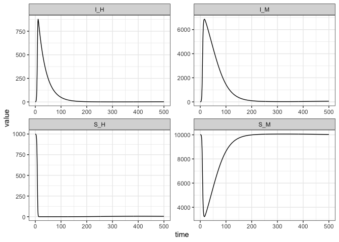

Mosquito-Vector SIR
================
Steve Walker

- [States](#states)
- [Parameters](#parameters)
- [Dynamics](#dynamics)
- [Model Specification](#model-specification)
- [Simulation](#simulation)
- [References](#references)

This
[model](https://homepages.warwick.ac.uk/~masfz/ModelingInfectiousDiseases/Chapter4/Program_4.4/index.html)
from ([Keeling and Rohani 2011](#ref-keeling2011modeling)) describes the
transmission dynamics between humans and mosquitoes, focusing on a
vector-borne disease.

The code in this article uses the following packages.

``` r
library(macpan2)
library(ggplot2)
```

# States

| **Variable** | **Description**                  |
|--------------|----------------------------------|
| $S_H$        | Number of susceptible humans     |
| $I_H$        | Number of infected humans        |
| $S_M$        | Number of susceptible mosquitoes |
| $I_M$        | Number of infected mosquitoes    |

# Parameters

| **Variable** | **Description**                                                              |
|--------------|------------------------------------------------------------------------------|
| $r$          | Rate at which humans are bitten                                              |
| $\beta_{ij}$ | Transmission probability (following a bite) to species $i$ from species $j$. |
| $\gamma_i$   | Recovery rate for host species $i$.                                          |
| $\nu_i$      | Birth rate for host species $i$.                                             |
| $\mu_i$      | Death rate for species $i$                                                   |

# Dynamics

The model is described by the following differential equations:

$$
\frac{dS_H}{dt} = \nu_H - r \beta_{HM} S_H I_M - \mu_H S_H
$$ $$
\frac{dI_H}{dt} = r \beta_{HM} S_H I_M - \gamma_H I_H - \mu_H I_H
$$ $$
\frac{dS_M}{dt} = \nu_M - r \beta_{MH} S_M I_H - \mu_M S_M
$$ $$
\frac{dI_M}{dt} = r \beta_{MH} S_M I_H - \gamma_M I_M - \mu_M I_M
$$

# Model Specification

This model has been specified in the `sir_mosquito` directory
[here](https://github.com/canmod/macpan2/blob/main/inst/starter_models/sir_mosquito/tmb.R)
and is accessible from the `macpan2` model library (see [Example
Models](https://canmod.github.io/macpan2/articles/example_models.html)
for details).

``` r
spec = mp_tmb_library("starter_models", "sir_mosquito", package = "macpan2")
print(spec)
#> ---------------------
#> Default values:
#> ---------------------
#>   matrix row col     value
#>        r         5.000e-04
#>  beta_HM         5.000e-01
#>  beta_MH         8.000e-01
#>     mu_H         5.500e-05
#>     mu_M         1.430e-01
#>     nu_H         5.500e-02
#>     nu_M         1.443e+03
#>  gamma_H         3.300e-02
#>  gamma_M         0.000e+00
#>      S_H         1.000e+03
#>      I_H         1.000e+00
#>      S_M         1.000e+04
#>      I_M         1.000e+00
#>     pool         1.000e+00
#> 
#> ---------------------
#> At every iteration of the simulation loop (t = 1 to T):
#> ---------------------
#>  1: mp_per_capita_inflow(from = "pool", to = "S_H", rate = "nu_H", 
#>       abs_rate = "birth_H")
#>  2: mp_per_capita_inflow(from = "pool", to = "S_M", rate = "nu_M", 
#>       abs_rate = "birth_M")
#>  3: mp_per_capita_flow(from = "S_H", to = "I_H", rate = "r * beta_HM * I_M", 
#>       abs_rate = "infection_H")
#>  4: mp_per_capita_flow(from = "S_M", to = "I_M", rate = "r * beta_MH * I_H", 
#>       abs_rate = "infection_M")
#>  5: mp_per_capita_outflow(from = "I_H", rate = "gamma_H", abs_rate = "recovery_H")
#>  6: mp_per_capita_outflow(from = "I_M", rate = "gamma_M", abs_rate = "recovery_M")
#>  7: mp_per_capita_outflow(from = "S_H", rate = "mu_H", abs_rate = "death_S_H")
#>  8: mp_per_capita_outflow(from = "I_H", rate = "mu_H", abs_rate = "death_I_H")
#>  9: mp_per_capita_outflow(from = "S_M", rate = "mu_M", abs_rate = "death_S_M")
#> 10: mp_per_capita_outflow(from = "I_M", rate = "mu_M", abs_rate = "death_I_M")
```

# Simulation

Simulation of this and other models depends on the kind of [state
update](https://canmod.github.io/macpan2/reference/mp_euler) that you
use. Here we use RK4, which is a standard ODE solver.

``` r
(spec
  |> mp_rk4()
  |> mp_simulator(time_steps = 500, outputs = c("S_H", "I_H", "S_M", "I_M"))
  |> mp_trajectory(include_initial = TRUE)
  |> ggplot()
  + facet_wrap(~matrix, scales = "free")
  + geom_line(aes(time, value))
  + theme_bw()
)
```

<!-- -->

# References

<div id="refs" class="references csl-bib-body hanging-indent">

<div id="ref-keeling2011modeling" class="csl-entry">

Keeling, Matt J, and Pejman Rohani. 2011. *Modeling Infectious Diseases
in Humans and Animals*. Princeton university press.

</div>

</div>
