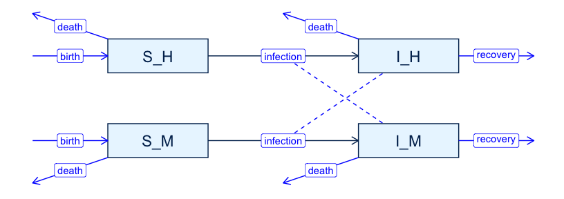

Mosquito-Vector SIR
================
Steve Walker

-   <a href="#states" id="toc-states">States</a>
-   <a href="#parameters" id="toc-parameters">Parameters</a>
-   <a href="#dynamics" id="toc-dynamics">Dynamics</a>
-   <a href="#model-specification" id="toc-model-specification">Model
    Specification</a>
-   <a href="#simulation" id="toc-simulation">Simulation</a>
-   <a href="#references" id="toc-references">References</a>

This
[model](https://homepages.warwick.ac.uk/~masfz/ModelingInfectiousDiseases/Chapter4/Program_4.4/index.html)
from ([Keeling and Rohani 2011](#ref-keeling2011modeling)) describes the
transmission dynamics between humans and mosquitoes, focusing on a
vector-borne disease.

The code in this article uses the following packages.

``` r
library(macpan2)
library(ggplot2)
```

# States

| **Variable** | **Description**                  |
|--------------|----------------------------------|
| $S_H$        | Number of susceptible humans     |
| $I_H$        | Number of infected humans        |
| $S_M$        | Number of susceptible mosquitoes |
| $I_M$        | Number of infected mosquitoes    |

# Parameters

| **Variable** | **Description**                                                              |
|--------------|------------------------------------------------------------------------------|
| $r$          | Rate at which humans are bitten                                              |
| $\beta_{ij}$ | Transmission probability (following a bite) to species $i$ from species $j$. |
| $\gamma_i$   | Recovery rate for host species $i$.                                          |
| $\nu_i$      | Birth rate for host species $i$.                                             |
| $\mu_i$      | Death rate for species $i$                                                   |

# Dynamics

The model is described by the following differential equations:

$$
\begin{align*}
\frac{dS_H}{dt} &= \nu_H - r \beta_{HM} S_H I_M - \mu_H S_H \\
\frac{dI_H}{dt} &= r \beta_{HM} S_H I_M - \gamma_H I_H - \mu_H I_H \\
\frac{dS_M}{dt} &= \nu_M - r \beta_{MH} S_M I_H - \mu_M S_M \\
\frac{dI_M}{dt} &= r \beta_{MH} S_M I_H - \gamma_M I_M - \mu_M I_M \\
\end{align*}
$$

# Model Specification

This model has been specified in the `sir_mosquito` directory
[here](https://github.com/canmod/macpan2/blob/main/inst/starter_models/sir_mosquito/tmb.R)
and is accessible from the `macpan2` model library (see [Example
Models](https://canmod.github.io/macpan2/articles/example_models.html)
for details).

``` r
spec = mp_tmb_library("starter_models", "sir_mosquito", package = "macpan2")
```

This specification can be used to draw the following flow diagrams using
code found in the [source for this
article](https://github.com/canmod/macpan2/blob/main/inst/starter_models/sir_mosquito/README.Rmd).
The dashed lines show the state dependence of infection, which is the
only way that the human and mosquito sub-models interact (e.g.,
mosquitos never become humans, they just infect them). The per-capita
infection rate for humans depends on the number of infectious mosquitos,
and vice versa.

<!-- -->

# Simulation

Simulation of this and other models depends on the kind of [state
update](https://canmod.github.io/macpan2/reference/mp_euler) that you
use. Here we use RK4, which is a standard ODE solver.

``` r
(spec
  |> mp_rk4()
  |> mp_simulator(time_steps = 500, outputs = c("S_H", "I_H", "S_M", "I_M"))
  |> mp_trajectory(include_initial = TRUE)
  |> ggplot()
  + facet_wrap(~matrix, scales = "free")
  + geom_line(aes(time, value))
  + theme_bw()
)
```

<!-- -->

# References

<div id="refs" class="references csl-bib-body hanging-indent">

<div id="ref-keeling2011modeling" class="csl-entry">

Keeling, Matt J, and Pejman Rohani. 2011. *Modeling Infectious Diseases
in Humans and Animals*. Princeton university press.

</div>

</div>
