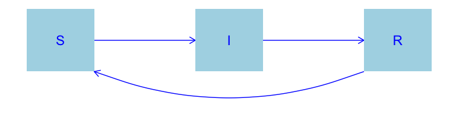
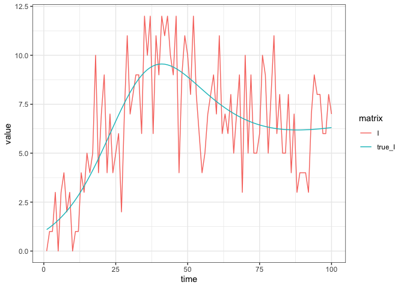
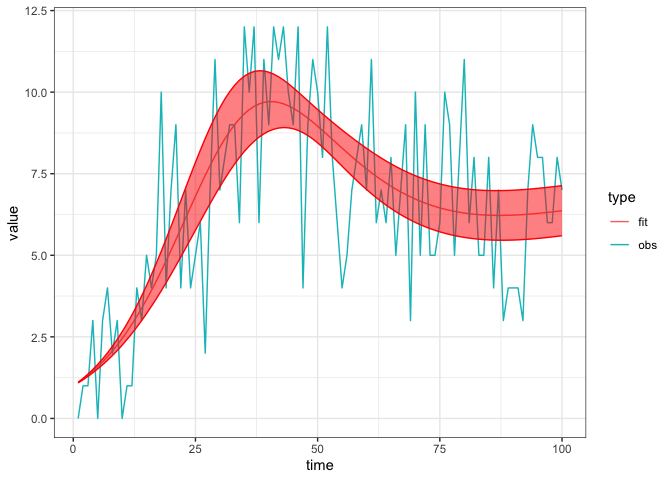

SIR with waning immunity
================
Jen Freeman, Steve Walker

-   <a href="#packages-used-and-settings"
    id="toc-packages-used-and-settings">Packages Used and Settings</a>
-   <a href="#model-specification" id="toc-model-specification">Model
    Specification</a>
-   <a href="#states" id="toc-states">States</a>
-   <a href="#parameters" id="toc-parameters">Parameters</a>
-   <a href="#dynamics" id="toc-dynamics">Dynamics</a>
-   <a href="#calibration" id="toc-calibration">Calibration</a>
    -   <a href="#simulate-fake-data" id="toc-simulate-fake-data">Simulate fake
        data</a>
    -   <a href="#calibrate-the-model" id="toc-calibrate-the-model">Calibrate
        the model</a>
    -   <a href="#explore-the-fit" id="toc-explore-the-fit">Explore the fit</a>
-   <a href="#references" id="toc-references">References</a>

Endemic pathogens can sometimes be modelled by sending R back to S,
thereby controlling susceptible depletion such that new infections keep
arising indefinitely. This is an extension of the
[sir](https://github.com/canmod/macpan2/tree/main/inst/starter_models/sir)
model to include such immunity waning.

# Packages Used and Settings

The code in this article uses the following packages.

``` r
library(ggplot2)
library(dplyr)
library(tidyr)
library(macpan2)
```

To keep the optimizer from printing too much in this article, we set the
`macpan2_verbose` option to `FALSE`.

``` r
options(macpan2_verbose = FALSE)
```

# Model Specification

This model has been specified in the `sir_waning` directory
[here](https://github.com/canmod/macpan2/blob/main/inst/starter_models/sir_waning/tmb.R)
and is accessible from the `macpan2` model library (see [Example
Models](https://canmod.github.io/macpan2/articles/example_models.html)
for details). We can read in the model specification using the
`mp_tmb_library` command.

``` r
spec = mp_tmb_library(
    "starter_models"
  , "sir_waning"
  , package = "macpan2"
)
```

This specification can be used to draw the following flow diagram using
code found in the [source for this
article](https://github.com/canmod/macpan2/blob/main/inst/starter_models/sir_waning/README.Rmd).

<!-- -->

# States

| variable | description                       |
|----------|-----------------------------------|
| S        | Number of susceptible individuals |
| I        | Number of infectious individuals  |
| R        | Number of recovered individuals   |

The size of the total population is, $N = S + I + R$.

# Parameters

| variable | description                     |
|----------|---------------------------------|
| $\beta$  | per capita transmission rate    |
| $\gamma$ | per capita recovery rate        |
| $\phi$   | per capita waning immunity rate |

# Dynamics

$$
\begin{align*}
\frac{dS}{dt} &= -\beta S\frac{I}{N} + \phi R\\
\frac{dI}{dt} &= \beta S\frac{I}{N} - \gamma I \\
\frac{dR}{dt} &= \gamma I  - \phi R
\end{align*}
$$

# Calibration

## Simulate fake data

The first step when testing a new fitting procedure is to simulate
clean, well-behaved data from the model and check if you can recover
parameters close to the true values (see
[here](https://canmod.github.io/macpan2/articles/calibration.html) for
an article on this topic). We modify the specification so that it is
different from the default library model, which we will then calibrate
using data generated from this modified model. We simulate incidence
data from this model, and add noise.

``` r
set.seed(1L)
time_steps = 100L
true = list(
    beta = 0.3 # beta value to simulate data with
  , phi = 0.05 # phi value to simulate data with
)
sir_waning = (spec
  |> mp_tmb_insert(
      phase = "during", at = Inf
    , expressions = list(noisy_I ~ rpois(I))
    , default = true
  )
  |> mp_simulator(  
      time_steps = time_steps
    , outputs = c("noisy_I", "I")
  )
)
  
observed_data = (sir_waning
  |> mp_trajectory() 
  |> mutate(matrix = ifelse(matrix == "I", "true_I", "I"))
)
(observed_data
  |> ggplot()
  + geom_line(aes(time, value, colour = matrix))
  + theme_bw()
)
```

<!-- -->

## Calibrate the model

``` r
cal = mp_tmb_calibrator(
    spec
  , data = filter(observed_data, matrix == "I")
  , traj = "I"
  , par = c("beta", "phi")
)
mp_optimize(cal)
#> $par
#>     params     params 
#> 0.30160534 0.04986632 
#> 
#> $objective
#> [1] 217.2668
#> 
#> $convergence
#> [1] 0
#> 
#> $iterations
#> [1] 6
#> 
#> $evaluations
#> function gradient 
#>        8        7 
#> 
#> $message
#> [1] "relative convergence (4)"
```

## Explore the fit

The calibration object now contains the information gained through
optimization. We can use this information to check the fitted parameter
values.

``` r
coef = mp_tmb_coef(cal) |> round_coef_tab()
coef$true = true[coef$mat]
print(coef)
#>    mat row default estimate std.error true
#> 1 beta   0    0.20   0.3016    0.0049  0.3
#> 2  phi   0    0.01   0.0499    0.0035 0.05
```

The estimate is different enough from the default to indicate that the
optimizer did ‘something’, and the estimate is close enough to the true
value to indicate that it did the right thing. Indeed the fit to the
data is excellent, although we should expect this given that we fitted
the same model used to generate the data. Note well that it is usually
not this easy (see the
[seir](https://github.com/canmod/macpan2/tree/main/inst/starter_models/seir)
model for a peak at what can go wrong).

``` r
comparison_data = list(
    obs = observed_data
  , fit = mp_trajectory_sd(cal, conf.int = TRUE)
) |> bind_rows(.id = "type")
(comparison_data
  |> filter(matrix == "I")
  |> ggplot()
  + geom_line(aes(time, value, colour = type))
  + geom_ribbon(aes(time, ymin = conf.low, ymax = conf.high)
    , colour = "red"
    , fill = "red"
    , alpha = 0.5
    , filter(comparison_data, type == "fit")
  )
  + theme_bw()
)
```

<!-- -->

# References
