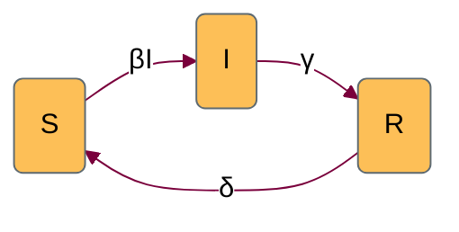

Endemic pathogens can sometimes be modelled by sending R back to S, thereby controlling susceptible depletion such that new infections keep arising indefinitely.

# States

| variable | description |
| -- | -- |
| S | Number of susceptible individuals |
| I | Number of infectious individuals |
| R | Number of recovered individuals | 

The size of the total population is,  $ N = S + I + R$.
# Parameters

| variable | description |
| -- | -- |
| $\beta$ | per capita transmission rate |
| $\gamma$ | per capita recovery rate |
| $\delta$ | per capita waning immunity rate |

# Dynamics 

$$
\begin{align*}
\frac{dS}{dt} &= -\beta SI + \delta R\\
\frac{dI}{dt} &= \beta SI - \gamma I \\
\frac{dR}{dt} &= \gamma I  - \delta R
\end{align*}
$$

