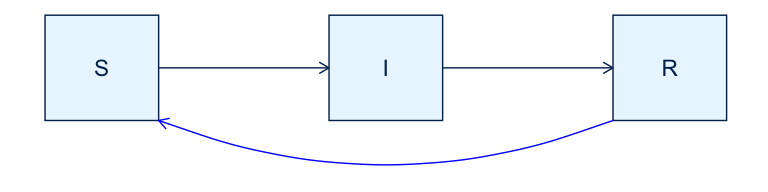

SIR with waning immunity
================
Jen Freeman, Steve Walker

-   <a href="#packages-used" id="toc-packages-used">Packages Used</a>
-   <a href="#model-specification" id="toc-model-specification">Model
    Specification</a>
-   <a href="#states" id="toc-states">States</a>
-   <a href="#parameters" id="toc-parameters">Parameters</a>
-   <a href="#dynamics" id="toc-dynamics">Dynamics</a>
-   <a href="#references" id="toc-references">References</a>

Endemic pathogens can sometimes be modelled by sending R back to S,
thereby controlling susceptible depletion such that new infections keep
arising indefinitely. This is an extension of the
[sir](https://github.com/canmod/macpan2/tree/main/inst/starter_models/sir)
model to include such immunity waning.

# Packages Used

The code in this article uses the following packages.

``` r
library(ggplot2)
library(dplyr)
library(tidyr)
library(macpan2)
```

# Model Specification

This model has been specified in the `sir_waning` directory
[here](https://github.com/canmod/macpan2/blob/main/inst/starter_models/sir_waning/tmb.R)
and is accessible from the `macpan2` model library (see [Example
Models](https://canmod.github.io/macpan2/articles/example_models.html)
for details). We can read in the model specification using the
`mp_tmb_library` command.

``` r
spec = mp_tmb_library(
    "starter_models"
  , "sir_waning"
  , package = "macpan2"
)
```

This specification can be used to draw the following flow diagram using
code found in the [source for this
article](https://github.com/canmod/macpan2/blob/main/inst/starter_models/sir_waning/README.Rmd).

<!-- -->

# States

| variable | description                       |
|----------|-----------------------------------|
| S        | Number of susceptible individuals |
| I        | Number of infectious individuals  |
| R        | Number of recovered individuals   |

The size of the total population is, $N = S + I + R$.

# Parameters

| variable | description                     |
|----------|---------------------------------|
| $\beta$  | per capita transmission rate    |
| $\gamma$ | per capita recovery rate        |
| $\phi$   | per capita waning immunity rate |

# Dynamics

$$
\begin{align*}
\frac{dS}{dt} &= -\beta S\frac{I}{N} + \phi R\\
\frac{dI}{dt} &= \beta S\frac{I}{N} - \gamma I \\
\frac{dR}{dt} &= \gamma I  - \phi R
\end{align*}
$$

# References
