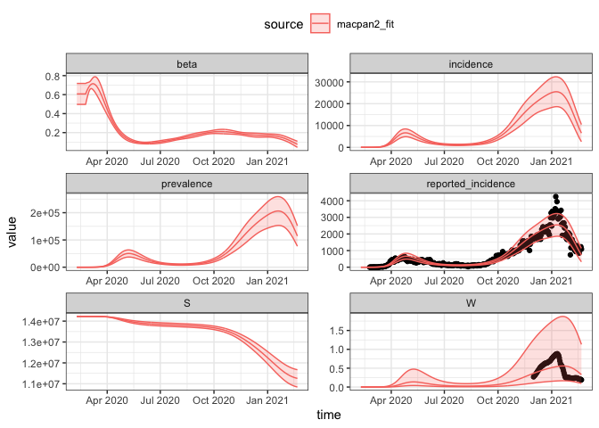

Wastewater model
================
Jennifer Freeman

- [Packages Used](#packages-used)
- [Model Specification](#model-specification)
- [States](#states)
- [Parameters](#parameters)
- [Dynamics](#dynamics)
- [Calibration](#calibration)
  - [Observed Data Prep](#observed-data-prep)
  - [Time Bounds](#time-bounds)
  - [Calibration Model Specification](#calibration-model-specification)
  - [Calibrate to Data](#calibrate-to-data)
  - [Explore Fits](#explore-fits)
- [References](#references)

The McMasterPandemic model ([Bolker et al. 2024](#ref-macpan)) modified
to include a wastewater component.

# Packages Used

The code in this article uses the following packages.

``` r
library(macpan2)
library(ggplot2)
library(dplyr)
library(lubridate)
```

# Model Specification

This model has been specified in the `ww` directory
[here](https://github.com/canmod/macpan2/blob/main/inst/starter_models/ww/tmb.R)
and is accessible from the `macpan2` model library (see [Example
Models](https://canmod.github.io/macpan2/articles/example_models.html)
for details). We can read in the model specification using the
`mp_tmb_library` command.

``` r
spec = mp_tmb_library(
    "starter_models"
  , "ww"
  , package = "macpan2"
)
```

This specification can be used to draw the following flow diagrams using
code found in the [source for this
article](https://github.com/canmod/macpan2/blob/main/inst/starter_models/ww/README.Rmd).
For clarity, we first draw the epidemiological components of the model,
which are identical to the
[macpan_base](https://github.com/canmod/macpan2/tree/main/inst/starter_models/macpan_base)
model.

<!-- -->

The infectious compartments of the above epidemiological component shed
virus into wastewater with the following sub-model.

<!-- -->

# States

| variable | description                                                         |
|----------|---------------------------------------------------------------------|
| $S$      | Number of susceptible individuals                                   |
| $E$      | Number of exposed individuals                                       |
| $I_a$    | Number of asymptomatic infectious individuals                       |
| $I_p$    | Number of pre-symptomatic infectious individuals                    |
| $I_m$    | Number of mildly infectious individuals                             |
| $I_s$    | Number of severely infectious individuals                           |
| $H$      | Number of hospitalized individuals (acute care)                     |
| $ICU_s$  | Number of individuals admitted to the ICU with a survival prognosis |
| $ICU_d$  | Number of individuals admitted to the ICU with a death prognosis    |
| $H_2$    | Number of hospitalized individuals (acute care) after ICU stay      |
| $D$      | Number of dead individuals                                          |
| $R$      | Number of recovered individuals                                     |
| $W$      | Concentration of viral particles in wastewater                      |
| $A$      | Total accumulated concentration of virus in wastewater over time    |

The size of the total population is,
$N = S + E + I_a + I_p + I_m + I_s + H + ICU_s + ICU_d + H_2 + D + R$.

# Parameters

| variable      | description                                                                         |
|---------------|-------------------------------------------------------------------------------------|
| $\beta_0$     | baseline (non-intervention) transmission across categories                          |
| $C_a$         | relative asymptomatic transmission (or contact) proportion                          |
| $C_p$         | relative presymptomatic transmission (or contact) proportion                        |
| $C_m$         | relative mildly transmission (or contact) proportion                                |
| $C_s$         | relative severly transmission (or contact) proportion                               |
| $\alpha$      | fraction of infections that are asymptomatic                                        |
| $\mu$         | fraction of symptomatic infections that are mild                                    |
| $\sigma$      | 1/time in exposed class                                                             |
| $\gamma_a$    | 1/time to recovery for asymptomatic infections                                      |
| $\gamma_p$    | 1/time in pre-symptomatic state                                                     |
| $\gamma_m$    | 1/time to recovery for mildly symptomatic infections                                |
| $\gamma_s$    | 1/time spent in severely symptomatic state before either hospitalization or death   |
| $\rho$        | 1/time in hospital (initial acute care admission)                                   |
| $\delta_{nh}$ | probability of mortality without hospitalization                                    |
| $\phi_1$      | fraction of hospitalized infections that only require acute care (no ICU admission) |
| $\phi_2$      | fraction of ICU infections that are fatal                                           |
| $\psi_1$      | 1/time spent in ICU before returning to acute care                                  |
| $\psi_2$      | 1/time spent in ICU before dying                                                    |
| $\psi_3$      | 1/time in post-ICU acute care before hospital discharge                             |
| $\nu$         | viral shedding rate to wastewater                                                   |
| $\xi$         | rate at which virus is denaturing/removed from wastewater                           |

# Dynamics

<!-- nb. do not remove the spaces in `\delta _ {nh}`. https://github.com/github/markup/issues/1575 -->

$$
\begin{split}
\frac{dS}{dt} &= -\beta_0\left(C_aI_a +C_pI_p + C_mI_m(1-\text{iso}_m) + C_sI_s(1-\text{iso}_s)\right)S/N \\
\frac{dE}{dt} &= \beta_0\left(C_aI_a +C_pI_p + C_mI_m(1-\text{iso}_m) + C_sI_s(1-\text{iso}_s)\right)S/N - \sigma E \\
\frac{dI_a}{dt} &= \alpha\sigma E- \gamma_a I_a \\
\frac{dI_p}{dt} &= (1-\alpha)\sigma E- \gamma_p I_p \\
\frac{dI_m}{dt} &= \mu\gamma_pI_p- \gamma_m I_m \\
\frac{dI_s}{dt} &= (1-\mu)\gamma_pI_p- (1-\delta _ {nh})\gamma_s I_s \\
\frac{dH}{dt} &= (1-\delta _ {nh})\phi_1\gamma_s I_s - \rho H  \\
\frac{dICU_s}{dt} &= (1-\delta _ {nh})(1-\phi_1)(1-\phi_2)\gamma_s I_s - \psi_1 ICU_s \\
\frac{dICU_d}{dt} &= (1-\delta _ {nh})(1-\phi_1)\phi_2\gamma_s I_s - \psi_2 ICU_d \\
\frac{dH_2}{dt} &= \psi_1 ICU_s - \psi_3 H_2  \\
\frac{dR}{dt} &= \gamma_a I_a + \gamma_m I_m + \rho H + \psi_3 H_2 \\
\frac{dD}{dt} &=  \psi_2 ICU_d \\
\frac{dW}{dt} &= \nu I_a + \nu I_p + \nu I_m + \nu I_s - \xi W \\
\frac{dA}{dt} &= \xi W
\end{split}
$$

# Calibration

## Observed Data Prep

We load in an object containing previous information on default
parameters.

``` r
repo = "https://github.com/canmod/macpan2/releases/download/macpan1.5_data"
macpan1.5 = (repo
  |> file.path("covid_on_macpan1.5_calibration.RDS")
  |> url() 
  |> readRDS()
)
```

We also load in Ontario COVID-19 data that comes with the package.

``` r
covid_on = (repo
  |> file.path("covid_on.RDS")
  |> url() 
  |> readRDS()
)
```

Prep the observed incidence and wastewater data to calibrate to.

``` r
obs_data = (covid_on
    |> filter(var %in% c("report","W") & between(date,macpan1.5$settings_sim$start_date,macpan1.5$settings_sim$end_date))
    |> rename(time = date, matrix = var)
    |> mutate(matrix = ifelse(matrix == "report", "reported_incidence", matrix))
    # leading zeroes seem to cause calibration challenges
    |> filter(!is.na(value) & time > as.Date("2020-02-23"))
)
```

## Time Bounds

``` r
burn_in_period  = 15 ## number of days before the data start to begin the simulations
forecast_period = 30 ## number of days after the data end to make forecasts
time_bounds = mp_sim_bounds(
    sim_start = min(obs_data$time) - lubridate::days(burn_in_period)
  , sim_end   = max(obs_data$time) + lubridate::days(forecast_period)
  , "daily"
)
steps = time_bounds$time_id_engine ## function to convert dates to time-steps
```

## Calibration Model Specification

Update model specification to include additional components required for
calibration.

``` r
focal_model = (
  # waste water model with hazard correction
  spec |> mp_hazard()
     
  # add variable transformations:
  |> mp_tmb_insert(phase = "before"
     , at = 1L
     , expressions = list(
          beta0 ~ exp(log_beta0)
        , nu ~ exp(log_nu)
        , xi ~ exp(log_xi)
        , report_prob ~ 1 / (1 + exp(-logit_report_prob))
     )
     , default = list(
          log_beta0 = log(1)
        , log_nu = 0
        , log_xi = 0
        , logit_report_prob = qlogis(0.1)
     )
  )

  # add accumulator variables:
  # death - new deaths each time step
  |> mp_tmb_insert(phase = "during"
     , at = Inf
     , expressions = list(
          death ~ ICUd.D + Is.D
       ,  prevalence ~ Ip + Ia + Im + Is
      )
  )
     
  # add phenomenological heterogeneity:
  |> mp_tmb_update(phase = "during"
     , at = 1L
     , expressions = list(mp_per_capita_flow("S", "E", "((S/N)^zeta) * (beta / N) * (Ia * Ca + Ip * Cp + Im * Cm * (1 - iso_m) + Is * Cs *(1 - iso_s))", "incidence"))

  )
     
  # add convolution to compute case reports from incidence:
  |> mp_tmb_insert_reports("incidence"
     , report_prob = NA_real_  # defined above with a logit transform
     , mean_delay = 11
     , cv_delay = 0.25
     , report_prob_name = "report_prob"
  )

  # add time-varying transmission
  |> mp_tmb_insert(phase = "during"
     , at = 1L
     , expressions = list(beta ~ beta0 * beta1 * beta2)
  )
  
  |> mp_tmb_insert(phase = "during"
     , at = 1L
     , expressions = list(
          beta2 ~ time_var(beta_changes, beta_changepoints)
     )
     , default  = list(beta_changes      = c(1))#, 3))
     , integers = list(beta_changepoints = c(0))#, steps("2021-03-05")))
  )
)
```

## Calibrate to Data

``` r
useful_params = names(macpan1.5$params) %in% names(focal_model$default)
macpan1.5_defaults = c(
    macpan1.5$params[useful_params]
  , list(
      S = macpan1.5$params$N
    , log_beta0 = log(macpan1.5$params$beta0)
    , log_nu = log(macpan1.5$params$nu)
    , beta1 = 1
    , E = macpan1.5$params$E0
  )
)

# calibrator
focal_calib = mp_tmb_calibrator(
    spec = focal_model
  , data = obs_data
  , traj = list(
      # set likelihoods for trajectories we are fitting to
      reported_incidence = mp_neg_bin(disp = 0.1)
    , W = mp_normal(sd = 1)
  )
  , par = c(
        # parameters to fit
        "log_beta0" # baseline transmission
      , "log_nu"    # viral shedding rate
      , "log_xi"
      #, "logit_report_prob" # reporting probability (only makes sense to fit if you fit to incidence)
  )
    # flexible non-parametric (radial basis function) fit
    # for the time-varying transmission rate
  , tv = mp_rbf("beta1", dimension = 7, sparse_tol = 1e-4)
    
    # return these trajectories so that they can be
    # explored after fitting
  , outputs = c(
        "reported_incidence", "W", "beta"
      , "prevalence", "incidence", "S"
    )
  
    # update defaults with macpan1.5 wastewater model defaults
  , default = macpan1.5_defaults
  
  , time = time_bounds
)
# converges
mp_optimize(focal_calib)
#> outer mgc:  34213183472 
#> outer mgc:  1808704 
#> outer mgc:  2551045 
#> outer mgc:  315372 
#> outer mgc:  364062.9 
#> outer mgc:  65241.37 
#> outer mgc:  113934.9 
#> outer mgc:  158729 
#> outer mgc:  13362.04
#> Warning in (function (start, objective, gradient = NULL, hessian = NULL, :
#> NA/NaN function evaluation
#> outer mgc:  37182.53 
#> outer mgc:  222532.7 
#> outer mgc:  139896.7 
#> outer mgc:  5636.26 
#> outer mgc:  19800.53 
#> outer mgc:  2662.605 
#> outer mgc:  1958.237 
#> outer mgc:  3940.576 
#> outer mgc:  849.9417 
#> outer mgc:  689.8649 
#> outer mgc:  449.8951 
#> outer mgc:  1238.384 
#> outer mgc:  483.1618 
#> outer mgc:  217.6186 
#> outer mgc:  1214.281 
#> outer mgc:  762.7452 
#> outer mgc:  170.8267 
#> outer mgc:  474.4059 
#> outer mgc:  2443.055 
#> outer mgc:  3114.345 
#> outer mgc:  1735.96 
#> outer mgc:  1880.754 
#> outer mgc:  842.6753 
#> outer mgc:  446.8432 
#> outer mgc:  111.6187 
#> outer mgc:  30.10798 
#> outer mgc:  13.24426 
#> outer mgc:  2.377015 
#> outer mgc:  35.81794 
#> outer mgc:  3.506537 
#> outer mgc:  0.05931208 
#> outer mgc:  0.04557651 
#> outer mgc:  0.02944557 
#> outer mgc:  0.01707333 
#> outer mgc:  0.009711682 
#> outer mgc:  0.003303307 
#> outer mgc:  0.001104547 
#> outer mgc:  0.0003484738
#> $par
#>       params       params       params       params       params       params 
#>  -6.52995834 -12.70164806   2.46932057   5.94570085   0.03153882   2.60307739 
#>       params       params       params       params       params 
#>   2.48856516   1.77014545   3.33504510  -1.29713155   0.51309682 
#> 
#> $objective
#> [1] 4573.278
#> 
#> $convergence
#> [1] 0
#> 
#> $iterations
#> [1] 46
#> 
#> $evaluations
#> function gradient 
#>       77       47 
#> 
#> $message
#> [1] "relative convergence (4)"
```

## Explore Fits

Get fitted data and coefficients.

``` r
macpan2_fit = mp_trajectory_sd(focal_calib, conf.int = TRUE)
#> outer mgc:  0.0003484738 
#> outer mgc:  75.90668 
#> outer mgc:  78.13266 
#> outer mgc:  0.03653088 
#> outer mgc:  0.03572156 
#> outer mgc:  0.0003453333 
#> outer mgc:  0.0003516485 
#> outer mgc:  33.86326 
#> outer mgc:  34.33087 
#> outer mgc:  42.14893 
#> outer mgc:  42.80556 
#> outer mgc:  34.69467 
#> outer mgc:  35.15062 
#> outer mgc:  24.97114 
#> outer mgc:  25.29291 
#> outer mgc:  12.80699 
#> outer mgc:  12.93173 
#> outer mgc:  3.718643 
#> outer mgc:  3.734022 
#> outer mgc:  0.4876116 
#> outer mgc:  0.487327 
#> outer mgc:  19.20977 
#> outer mgc:  19.39788
fitted_coefs = mp_tmb_coef(focal_calib, conf.int = TRUE)
#> outer mgc:  0.0003484738 
#> outer mgc:  75.90668 
#> outer mgc:  78.13266 
#> outer mgc:  0.03653088 
#> outer mgc:  0.03572156 
#> outer mgc:  0.0003453333 
#> outer mgc:  0.0003516485 
#> outer mgc:  33.86326 
#> outer mgc:  34.33087 
#> outer mgc:  42.14893 
#> outer mgc:  42.80556 
#> outer mgc:  34.69467 
#> outer mgc:  35.15062 
#> outer mgc:  24.97114 
#> outer mgc:  25.29291 
#> outer mgc:  12.80699 
#> outer mgc:  12.93173 
#> outer mgc:  3.718643 
#> outer mgc:  3.734022 
#> outer mgc:  0.4876116 
#> outer mgc:  0.487327 
#> outer mgc:  19.20977 
#> outer mgc:  19.39788 
#> outer mgc:  42590615
print(fitted_coefs)
#>         term            mat row col default  type      estimate    std.error
#> 3  params.10 prior_sd_beta1   0   0    1.00 fixed  5.130968e-01 7.197444e-03
#> 5   params.3 time_var_beta1   0   0    0.00 fixed  5.945701e+00 2.248685e+00
#> 6   params.4 time_var_beta1   1   0    0.00 fixed  3.153882e-02 6.643082e-01
#> 7   params.5 time_var_beta1   2   0    0.00 fixed  2.603077e+00 1.816507e+00
#> 8   params.6 time_var_beta1   3   0    0.00 fixed  2.488565e+00 9.195061e-01
#> 9   params.7 time_var_beta1   4   0    0.00 fixed  1.770145e+00 1.986389e+00
#> 10  params.8 time_var_beta1   5   0    0.00 fixed  3.335045e+00 1.444504e+00
#> 11  params.9 time_var_beta1   6   0    0.00 fixed -1.297132e+00 4.256654e+00
#> 1     params          beta0   0   0    0.25 fixed  1.459067e-03 4.023029e-03
#> 2   params.1             nu   0   0    0.03 fixed  3.046101e-06 1.894822e-06
#> 4   params.2             xi   0   0    1.00 fixed  1.181442e+01 3.524161e+03
#>         conf.low     conf.high
#> 3   4.989901e-01  5.272036e-01
#> 5   1.538360e+00  1.035304e+01
#> 6  -1.270481e+00  1.333559e+00
#> 7  -9.572102e-01  6.163365e+00
#> 8   6.863663e-01  4.290764e+00
#> 9  -2.123106e+00  5.663396e+00
#> 10  5.038697e-01  6.166220e+00
#> 11 -9.640021e+00  7.045758e+00
#> 1   6.562802e-06  3.243852e-01
#> 2   9.000275e-07  1.030939e-05
#> 4   2.220446e-16 9.551758e+254
```

Plot the fitted values.

``` r
macpan1.5_fit = (macpan1.5$sim
  |> group_by(Date, state)
  # summarize to ignore vaccination status
  |> summarise(value = sum(value))
  |> ungroup()
  |> rename(time = Date, matrix = state)
  |> filter(matrix %in% c("conv", "W"))
  |> filter(!is.na(value))
  |> mutate(matrix = ifelse(matrix == "conv", "reported_incidence", matrix))
)
#> `summarise()` has grouped output by 'Date'. You can override using the
#> `.groups` argument.

plot_fit = function(obs_data, sim_data, ncol = 1L) {
  (ggplot(obs_data, aes(time, value))
   + geom_point()
   + geom_line(aes(
          time
        , value
        , colour = source
      )
      , data = sim_data
   )
   #+ scale_y_log10()
   + geom_ribbon(aes(
          time
        , ymin = conf.low
        , ymax = conf.high
        , colour = source
        , fill = source
      )
      , data = sim_data
      , alpha = 0.2
   )
   + facet_wrap(vars(matrix), scales = 'free', ncol = ncol)
   + theme_bw()
   + theme(legend.position = "top")
   #+ scale_x_date(limits = c(as.Date("2020-11-01"), NA))
  )
}
plot_fit(obs_data, mutate(macpan2_fit, source = "macpan2_fit"), ncol = 2L)
```

<!-- -->

# References

<div id="refs" class="references csl-bib-body hanging-indent">

<div id="ref-macpan" class="csl-entry">

Bolker, Ben, David Earn, Morgan Kain, Mike Li, and Jonathan Dushoff.
2024. *McMasterPandemic: Pandemic Model*.
<https://github.com/bbolker/McMasterPandemic>.

</div>

</div>
