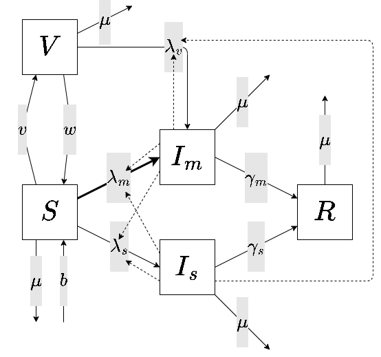

TODO: USE MACROS
TODO: good letter for state vector -- $X$
TODO: maybe use underline and overline for `from` and `to`
TODO: use sans-serif for matrices
TODO: consider defining special matrix/vector symbols for subsetted matrices and vectors (e.g. $I$ just means $X_\text{infectious}$) 
TODO: more common to use capital lambda for force of infection
TODO: perhaps call 'Normalization Variables' 'Aggregated Variables'

<https://img.shields.io/badge/status-working%20draft-red>

$\newcommand{\Coll}[1]{\boldsymbol{\mathrm{#1}}}$
$\newcommand{\Item}[2]{{#1}_{#2}}$
$\newcommand{\Def}[2]{\Coll{#1} = [\Item{#1}{#2}]}$
$\newcommand{\Range}[2]{{#1} = 1, ..., {#2}}$
$\newcommand{\SetFont}[1]{\mathtt{#1}}$
$\newcommand{\IndexSet}[2]{\SetFont{#1}\left({#2}\right)}$
$\newcommand{\InIndexSet}[3]{{#1} \in \IndexSet{#2}{#3}}$
$\newcommand{\InvIndexSet}[2]{\SetFont{#1}^{-1}\left({#2}\right)}$
$\newcommand{\GetItem}[3]{\Item{#1}{\InvIndexSet{#2}{#3}}}$
$\newcommand{\GoesTo}[1]{\xrightarrow{#1}}$

$\newcommand{\State}{Z}$
$\newcommand{\NormState}{\widetilde{Z}}$
$\newcommand{\Flow}{\phi}$
$\newcommand{\Trans}{\beta}$
$\newcommand{\Norm}{N}$
$\newcommand{\From}{from}$
$\newcommand{\To}{to}$
$\newcommand{\Edge}{flow}$
$\newcommand{\Infectious}{infectious}$
$\newcommand{\Infection}{infection}$
$\newcommand{\InfectiousTrans}{infectious\_trans}$
$\newcommand{\InfectionTrans}{infection\_trans}$
$\newcommand{\Normalization}{normalization}$
$\newcommand{\FlowFunc}[3]{f_{#1}\left({#2},{#3}\right)}$

$\newcommand{\StateLen}{n}$
$\newcommand{\FlowLen}{m}$
$\newcommand{\FlowPaths}{p}$
$\newcommand{\InfPaths}{q}$
$\newcommand{\NormLen}{r}$
$\newcommand{\InfFlowLen}{s}$

## Preparing to Generalize the SIR Model

Compartmental models in `macpan2` are generalizations of the the SIR model. Like the SIR model, most compartmental models in `macpan2` have the following four kinds of quantities that map onto the SIR model in a familiar way.

* Variables
  * State
    * $S$ -- number susceptible individuals
    * $I$ -- number of infectious individuals
    * $R$ -- number of recovered individuals
  * Normalization
    * $N = S + I + R$ -- total population size
* Rates
  * Transmission
    * $\beta$ -- transmission rate
  * Flow
    * $\lambda = \beta I / N$ -- force of infection
    * $\gamma$ -- recovery rate

We also assume that mathematical epidemiologists will be familiar with how these variables are involved in the following state transitions that occur in the SIR model.

$$
\begin{align}
S \GoesTo{\lambda S} I \\
I \GoesTo{\gamma I} R \\
\end{align}
$$

We can convert this state-transition notation into a differential equation.

$$
\begin{align*}
\frac{dS}{dt} &= -\lambda S \\
\frac{dI}{dt} &= \lambda S - \gamma I \\
\frac{dR}{dt} &= \gamma I \\
\end{align*}
$$

We could also convert state-transitions into a difference equation.

$$
\begin{align*}
S(t+1) - S(t) &= -\lambda S(t) \\
I(t+1) - I(t) &= \lambda S(t) - \gamma I(t) \\
R(t+1) - R(t) &= \gamma I(t) \\
\end{align*}
$$

## Generalized Compartmental Model

The last section clarified our typology of variables involved in a compartmental diagram using the example of the SIR model. Now we will develop a notation for generalizing this model.

* State variables : $\Def{\State}{i}$, $\Range{i}{\StateLen}$
* Flow variables : $\Def{\Flow}{i}$, $\Range{i}{\FlowLen}$
* Transmission variables : $\Def{\Trans}{i}$, $\Range{i}{\InfPaths}$
* Normalization variables : $\Def{\Norm}{i}$, $\Range{i}{\NormLen}$

## Index Sets

* $\IndexSet{\From}{i}$ : The set of all flow path indices that have $\Item{\State}{i}$ as the compartment from which individuals are flowing.
* $\IndexSet{\To}{i}$ : The set of all flow path indices that have $\Item{\State}{i}$ as the compartment to which individuals are flowing.
* $\IndexSet{\Edge}{i}$ : The set of all flow path indices that have $\Item{\Flow}{i}$ as the variable describing the magnitude of the flow.

The inverse of these sets pick out a single variable from either the $\Coll{\State}$ or $\Coll{\Flow}$ vector. For example, we can describe the $i$th flow path in the following way.

$$
\Item{\State}{j}
\GoesTo{\FlowFunc{i}{\Item{\State}{j}}{\Item{\Flow}{l}}}
\Item{\State}{k}
$$

Where,

* $j = \InvIndexSet{\From}{i}$
* $k = \InvIndexSet{\To}{i}$
* $l = \InvIndexSet{\Edge}{i}$

and the flow function can take on one of the following two options depending on what the user chooses for flow path $i$.

$$
\FlowFunc{i}{\Item{\State}{j}}{\Item{\Flow}{l}} = 
\begin{cases}
\Item{\Flow}{l}\Item{\State}{j}, & \text{per-capita} \\
\Item{\Flow}{l},                 & \text{absolute} \\
\end{cases}
$$

We can also have one-sided flows where nothing flows out of $\Item{\State}{j}$ or nothing flows in to $\Item{\State}{k}$.

$$
\GoesTo{\FlowFunc{i}{\Item{\State}{j}}{\Item{\Flow}{l}}}
\Item{\State}{k}
$$

$$
\Item{\State}{j}
\GoesTo{\FlowFunc{i}{\Item{\State}{j}}{\Item{\Flow}{l}}}
$$

This is abstract, I know.  But it only means things like this.

$$
S \GoesTo{\lambda S} I
$$
Or this.

$$
I \GoesTo{\gamma I} R
$$

### State Normalization

We often need to work state variables that have been normalized by the total number of individuals in their stratum.

$$
\Item{\NormState}{i} = \frac{\Item{\State}{i}}{\Item{\Norm}{j[i]}}
$$

Where ,

* $j[i] = \InvIndexSet{\Normalization}{i}$ is the index into the normalization

### Infection Flow

The $i$th force of infection is given as follows.

$$
\Item{\Trans}{i} \Item{\State}{j[i]}
$$

Where ,

* $j[i] = \InvIndexSet{\InfectiousTrans}{i}$

The $i$th infection flow is computed as follows.

$$
\Flow_j = \sum_i \Item{\Trans}{i} \Item{\State}{k}
$$

Where,

* $j = \InvIndexSet{\InfectionTrans}{i}$
* $k = \InvIndexSet{\InfectiousTrans}{i}$
* $l = \InvIndexSet{\Normalization}{i}$ 

## General Data Structure

All compartmental models in `macpan2` contain a state vector, $s = [s_i]$, a flow
vector, $f = [f_i]$, and population vector, $n = [n_i]$.

* $s_i$ : Number of individuals in compartment $i$.
* $f_i$ : Magnitude of the $i$th flow of individuals between the compartments.
* $n_i$ : Number of individuals in the $i$th sub-population of compartments.

We identify other vectors that are composed entirely of elements taken from $s$
or $f$. Some of these vectors are just subsets of either $s$ or $f$, including
the infectious states, $s_\text{infectious}$, infected states,
$s_\text{infected}$, and infection flows, $f_\text{infection}$. Other vectors
are not necessarily strict subsets because the elements from the original vector
can be repeated. The $s_\text{from}$ and $s_\text{to}$ contain elements from $s$
giving the from and to compartments associated with each flow in $f$. In
particular, $s_\text{from}$, $s_\text{to}$, and $f$ all have the same length and
the $i$th element of each gives the number in the from compartment, to
compartment, and magnitude of the flow respectively.

The elements of the flow vector get transformed into a rate of flow per unit time into a compartment, $\Phi_i\left(f_i, s_{\text{from}[i]}\right)$, and out of a compartment, $\Psi_i\left(f_i, s_{\text{from}[i]}\right)$.

$$
F(f, s, t) = 
\underbrace{\sum_i\Phi_i\left(f_i, s_{\text{from}[i]}, t\right)}_\text{inflow} - 
\underbrace{\sum_i\Psi_i\left(f_i, s_{\text{from}[i]}, t\right)}_\text{outflow}
$$

This $F$ function can get used in many ways. For example, it could be used in a discrete time model.

$$
s(t+1) = s(t) + F(f,s, t)
$$

In a continuous time model we would have the following.

$$
\frac{ds}{dt} = F(f, s, t)
$$

For each flow, $i$, a type must be chosen for the inflow function, $\Phi_i$, and outflow function, $\Psi_i$, can be one of the following types.

$$
  \Phi_i\left(f_i, s_{\text{from}[i]}, t\right) 
- \Psi_i\left(f_i, s_{\text{from}[i]}, t\right) 
= F_i(f, s, t) 
= \begin{cases}
f_is_{\text{from}[i]} & \text{per-capita} \\
f_i & \text{absolute} \\
0 & \text{outflow only}
\end{cases}
$$
$$
 = 
\begin{cases}
f_is_{\text{from}[i]} & \text{per-capita} \\
f_i & \text{absolute} \\
0 & \text{inflow only}
\end{cases}
$$

The per-capita transmission matrix, $\mathbf{B}$, relates the infectious states
to the infection flows.

$$
f_\text{infection} = B s_\text{infectious}
$$

The elements in $f$ that correspond to elements in $f_\text{infection}$ are also
updated when this expression is evaluated.

We know that the units of the elements of $f_\text{infection}$ are those of a
force of infection, which has the same units as a transmission rate.

$$
\frac{\text{number of infections}}{\text{number of people} \times \text{duration of exposure}}
$$
By applying these units to the left-hand side of the equation that relates $f\_\text{infection}$ to $s\_\text{infectious}$ through $\mathbf{B}$, we find that the units of the elements of $\mathbf{B}$
are.

$$
\frac{\text{number of infections}}{\text{number of people}^2 \times \text{duration of exposure}}
$$

The appearance of a another `number of people` in the denominator relative to
the transmission rate case is why we refer to $\mathbf{B}$ as a per-capita
transmission rate.

There are different types of flow variables that differ in how they measure the
magnitude of the flow. The user may choose from a number of flow types for each flow. A common convenient choice is a per-capita flow rate, which has units of ...

## Example

We present an example model that is just complex enough to illustrate the
general model.

The state vector is given as follows.

$$
s = \begin{bmatrix}
S \\ V \\ I_m \\ I_s \\ R
\end{bmatrix},
f = \begin{bmatrix}
v \\ w \\ \lambda_m \\ \lambda_s \\ \lambda_v \\ \gamma_m \\ \gamma_s \\ \mu \\ b
\end{bmatrix}
$$

$$
\text{from} = \begin{bmatrix}
0 \\ 1 \\ 0 \\ 0 \\ 1 \\ 2 \\ 3 \\ 0 \\ 1 \\ 2 \\ 3 \\ 4 \\ -1 \\
\end{bmatrix},
\text{to} = \begin{bmatrix}
1 \\ 0 \\ 2 \\ 3 \\ 2 \\ 4 \\ 4 \\ -1 \\ -1 \\ -1 \\ -1 \\ -1 \\ 0
\end{bmatrix},
\text{flow} = \begin{bmatrix}
0 \\ 1 \\ 2 \\ 3 \\ 4 \\ 5 \\ 6 \\ 7 \\ 7 \\ 7 \\ 7 \\ 7 \\ 8
\end{bmatrix}
$$

The flows are defined by the following three vectors that line up with one row
per flow.

$$
s_\text{from} = \begin{bmatrix}
S \\ V \\ S \\ S \\ V \\ I_m \\ I_s
\end{bmatrix}
,
s_\text{to} = \begin{bmatrix}
V \\ S \\ I_m \\ I_s \\ I_m \\ R \\ R
\end{bmatrix}
,
f_\text{flow} = \begin{bmatrix}
v \\ w \\ \lambda_m \\ \lambda_s \\ \lambda_v \\ \gamma_m \\ \gamma_s
\end{bmatrix}
$$

The infection flow vector is given by the following.

$$
f_\text{infection} = 
\begin{bmatrix}
\lambda_m \\ \lambda_s \\ \lambda_v
\end{bmatrix}
$$

The infectious state vector is given by the following.

$$
s_\text{infectious} = 
\begin{bmatrix}
I_m \\ I_s
\end{bmatrix}
$$

$$
f_\text{infection} = Bs_\text{infectious}
$$

We also define a vector of reference population sizes that lines up with the
infectious state vector.

$$
N_\text{infectious} = 
\begin{bmatrix}
N \\ N
\end{bmatrix},
s_\text{infectious} = 
\begin{bmatrix}
I_m \\ I_s
\end{bmatrix}
$$

The per-capita transmission matrix is given by the following.

$$
B =
\frac{1}{N}\begin{bmatrix}
\beta_{mm} & \beta_{ms} \\
\beta_{sm} & \beta_{ss} \\
\beta_{vm} & \beta_{vs} \\
\end{bmatrix}
$$
Here $N$ is the total population size and each of the $\beta$s
give rates of transmission of each infection flow contributed by each infectious
state.

The key point is that the infection flow vector is the matrix product of the
transmission matrix and the infectious state vector.

## Alternative Formulation
