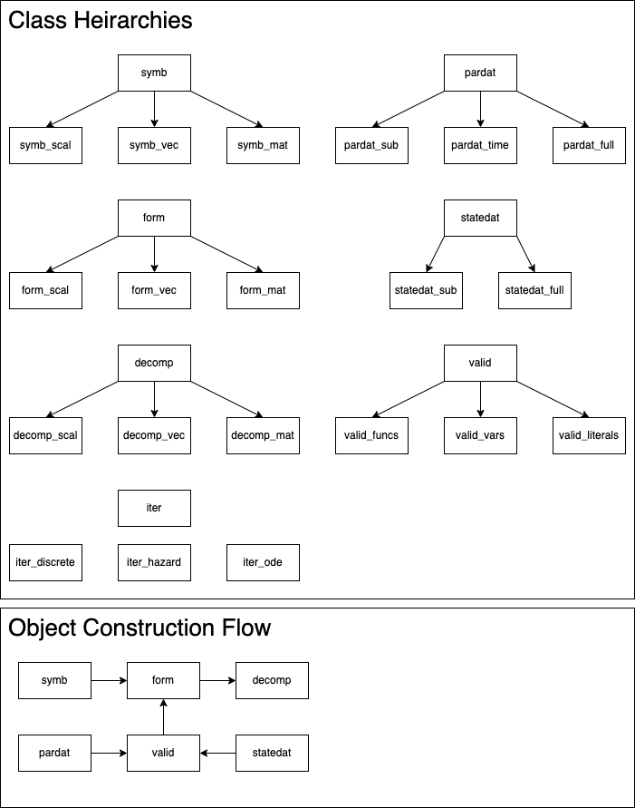

# Arithmetic Engine

## Specs

All quantities are matrices.  We classify some of these quantities though.

* scalar -- both dimensions equal 1
* vector -- at most one dimension equals 1

Let the 'length' of a matrix is the product of the two dimensions -- i.e. the length is the number of elements in the array

There are different kinds of functions:

* Unary functions and operators
* Elementwise binary operators -- e.g. `+`, `^`, `*`
* Matrix binary operators -- `%*%`, `%o%`

## Elementwise Binary Operators

* If only one dimension is matched
    * If one of these unmatched dimensions is 1, replicate this dimension to match the other argument
    * Error

## Matrix Binary Operators

### Matrix/Inner Product

In R this is the `%*%` operator.

* case 1: 

* case 1: either argument is a scalar -- ERROR
* case 2: both arguments are vectors
    * do elementwise multiplication and sum the results
* case 3: both arguments are matrices
    * if the second dimension of the first argument does not equal the first dimension of the second argument -- ERROR
    * do standard matrix multiplication
* case 4: one argument is a vector and another is a matrix
    * try to transpose the _vector_ such that the dimensions are consistent for a matrix multiplication -- if this is not possible: ERROR
    * do standard matrix multiplication

### Outer Products

In R this is the `%o%` operator.

* case 1: one argument is a scalar and the other is 

## Matrix Algebra

There are three types of objects that can be used to build symbolic epressions involving scalars, vectors, and matrices.

### Symbolic Algebra (`symb` objects)

### Structured Formulas (`form` objects)

### Decomposed Expressions (`decomp` objects)

## Structured Parameter Vectors (`pardat` objects)

## Structured State Vectors (`statedat` objects)

## Valid Name Lists (`valid` objects)
