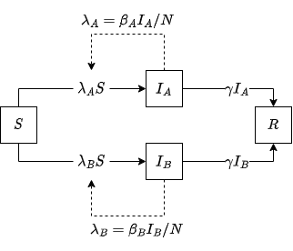

[](https://canmod.github.io/macpan2/articles/vignette-status#working-draft)

```{r setup, echo = FALSE, message = FALSE}
library(macpan2)
library(ggplot2)
library(dplyr)
```

[

TO DO:

- make sure all functions used have good help pages
- get model library ready (or remove text below referencing it)
- update `mp_report()` so that row names are reset before outputting the results df

]

One of the main goals of `macpan2` is to provide a flexible grammar for model specification that reduces friction when building upon and expanding an existing model. This goal complements the standard approach of modelling, which is to start simply and add complexity as needed. 

There is a trade-off between the flexibility and the simplicity of the model grammar: specifying a simple model may not always be very concise, and there is a learning curve to the model grammar. However, it can be very powerful when it comes to specifying **structured** models, especially when they are cast as expansions of simple models. Such [structured models](https://idpjournal.biomedcentral.com/articles/10.1186/s40249-022-01001-y) can include:

- multiple pathogen strains
- multiple infection types (_e.g._, asymptomatic and symptomatic or mild and severe)
- age-structure
- multiple locations (a metapopulation model)
- testing processes to identify infections
- vaccination status

This vignette seeks to explain `macpan2`'s model specification grammar and in particular how one could take a simple model and expand it with additional structure. The package also comes with a model library (see `vignette("example_models")`) to get users started with commonly used basic models, and to demonstrate some more complex cases.

# Amuse bouche: a structured SIR model {#amuse-bouche}

A key to `macpan2`'s flexible model grammar is the use of **archetypes** to repeat the same kinds of calculations across model structures. For instance, consider an SIR model that has two pathogen strains (without co-infections):

<center>

</center>

Here, 

- $S$, $I_A$, $I_B$, and $R$ are the numbers of individuals that are susceptible, infected with strain A, infected with strain B, and recovered, respectively,
- $\beta_A$ and $\beta_B$ are the transmission rates for strains A and B, respectively,
- $\gamma$ is the recovery rate for all infected individuals.

We can cast this model as a system of difference equations, since this is how we will iterate them numerically in our simulation:

\begin{align}
S_{t+1} &= - [\beta_a (I_A)_t/N + \beta_s (I_B)_t/N] S_t, \\ 
(I_A)_{t+1} &= \beta_A (I_A)_t/N - \gamma (I_A)_t, \\ 
(I_B)_{t+1} &= \beta_B (I_B)_t/N - \gamma (I_B)_t, \\ 
R_{t+1} &= \gamma (I_A)_t + \gamma (I_B)_t.
\end{align}

where $N = S + I_A + I_B + R$ is the total population size. Note that each force of infection, $\lambda_A = \beta_A (I_A)/N$ and  $\lambda_B = \beta_B (I_B)/N$ has the same **form**, that is, using an expression like $\lambda = \beta I / N$.

When numerically simulating this model, it doesn't take much effort to write out each calculation separately as something like:

```
lambda.A = beta.A * I.A / N
lambda.B = beta.B * I.B / N
```

However, in `macpan2`, we can specify a single calculation archetype for it, for instance something like,
```
lambda = beta * I / N
```

and then attach a **ledger** to the model object that tabulates which specific calculations to do under this archetype, that is, a table of which specific subscripted `lambda`, `beta`, and `I` to use each time we invoke this archetype during the simulation. 

In this case, there would only be two calculations in the force of infection ledger (one calculation per strain), but one can easily imagine a more complicated case. For instance, consider a relatively simple two-city age-structured metapopulation model with 10 age groups within each its two patches: there would be 10x10x2 = `r 10*10*2` force of infection terms of the same form (one per combination of age groups to capture the options for susceptible and infected interaction, repeated for each of the two patches).

**By using calculation archetypes and ledgers, the modeller can focus on the modelling**, like designing model structure and choosing an expression for the forces of infection, **while `macpan2` will handle the bookkeeping**, matching stratified variables with each other each time an expression must be calculated. This approach cuts down on rote repetition when setting up model calculations, which in turn reduces the opportunity for bugs in the simulation code. It also means that expanding a model can be as simple as updating the calculation ledger, as opposed to directly editing specific calculations in the simulation code. 

While a modeller could certainly write their own code to cut down on repetition when expanding a simple model (and many do), the idea behind `macpan2` is to give individuals a ready-made model specification grammar that enables easy model extension, especially when building [product models](https://arxiv.org/abs/2307.10308), and that can readily interface with fast simulation engines, like [TMB](https://cran.r-project.org/web/packages/TMB/index.html). 

# Appetizer: specifying the basic SIR model

Let's start with specifying the basic SIR model in `macpan2`, which is the foundation of the two-strain model above:

\begin{align}
S_{t+1} &= -\beta S_t I_t/N, \\ 
I_{t+1} &= \beta S_t I_t/N - \gamma I_t, \\ 
R_{t+1} &= \gamma I_t.
\end{align}

It will be helpful to set $\lambda = \beta I/N$ and recast the equations as:

\begin{align}
S_{t+1} &= -\lambda S_t, \\ 
I_{t+1} &= \lambda S_t - \gamma I_t, \\ 
R_{t+1} &= \gamma I_t.
\end{align}

Since the focus of this quickstart guide is `macpan2`'s model specification grammar, we have defined an `SIR_starter()` function to sweep some of the details of initializing a model object under the rug (for now, though we will revisit it [later](#dessert)). All you need to know about `SIR_starter()` at this stage is that we will pass it some inputs to define the model using the model grammar and it will output a model object from which we can build a simulator. Our primary focus for the remainder of this vignette will be how the inputs to `SIR_starter()` are created.

```{r SIR-starter, echo = FALSE}
## helper function to simplify the exposition in this vigette -----------
SIR_starter = function(
  # indices for model quantities
  state,
  rate,
  # ledgers for calculation archetypes
  flow, # list of individual ledgers
  force_of_infection
){
  
  ## Set up expressions list for each calculation archetype --------------
  ## names are when the calculation gets performed relative to 
  ## the simulation loop (before, during, ...)
  expr_list = mp_expr_list(
    before = list(
      ## aggregations
        N ~ sum(state)
    ),
    during = list(
      ## force of infections
        rate[infection_flow_rates] ~
          state[infectious_states] * rate[transmission_rates] / N
  
      ## unsigned individual flows
      , flow_per_time ~ state[from_states] * rate[flow_rates]
  
      ## state update
      , total_inflow ~ groupSums(flow_per_time, to_states, state)
      , total_outflow ~ groupSums(flow_per_time, from_states, state)
      , state ~ state + total_inflow - total_outflow
    )
  )
  
  ## Ledgers for each specific calculation --------------
  ledgers = list(
    flow = mp_ledgers(flow),
    force_of_infection = mp_ledgers(force_of_infection)
  )
  
  ## Initialize indexed vectors (to all zeros) --------------
  # used as placeholders for user input
  init_vecs = list(
    state = mp_vector(state),
    rate = mp_vector(rate)
  )
  
  ## Initialize model object -----------------
  DynamicModel(
    expr_list = expr_list,
    ledgers = ledgers,
    init_vecs = init_vecs
  )
}
```

The inputs to `SIR_starter()` are of two types:

- **indices** (labels) for model quantities, 
- **ledgers** that tabulate specific calculations required to simulate the model equations (based on the included calculation archetypes).

The indices we need to specify fall into two groups:

- `state`: state names, $S$, $I$, and $R$ from the model equations
- `rate`: rate names, $\beta$, $\gamma$, and the derived rate $\lambda$

We have identified two useful **calculation archetypes** that we have baked into `SIR_starter()`. In this case, we're thinking of calculation archetypes not necessarily as repeated calculations in this particular model, but as calculations that a modeller may want to repeat down the line, as they expand this simple model with additional structure (as we will do [below](#main-course)). The archetypes are:

- `flow`: Unsigned flows from one class to another of the form $rX$, with $r$ being the flow rate and $X$ being the state from which the flow originates. This calculation is repeated for all terms on the right-hand side of the recast system of difference equations above.
- `force_of_infection`: The prevalence-dependent per capita rate of flow from susceptible classes to infectious classes of the form $\lambda = \beta I /N$, used in calculating infection flows.

In this case, the `flow` archetype is actually repeated within these model equations but the `force_of_infection` archetype is only used once. We've identified the force of infection as an archetype since we will want to repeat it later when [expanding into the two-strain model](#main-course). Either way, these archetypes are already baked into `SIR_starter()`, so our task will be creating a calculation ledger for each of these archetypes.  

We start by creating the `state` and `rate` indices:

```{r sir-indices}
## indices (labels) for model quantities -------------------------
state = mp_index(Epi = c("S", "I", "R"))
rate = mp_index(Epi = c("beta", "gamma", "lambda"))
```

You can think of the `mp_index()` function as setting up data frames tabulating the model quantity labels:

```{r sir-state-and-rate}
state
rate
```

The `Epi` column name is not really important in this simple model, but it will be key to stratifying model quantities with different features (such as epidemiological status, infection type, age group, location) in more complicated models.

For the `flow` archetype, we will create two ledgers: `infection` for the flow from $S$ to $I$ and `recovery` for the flow from $I$ to $R$. We specify flows using the name of the state from which it originates (`from_states`), the state to which it goes (`to_states`), and a flow rate name (`flow_rates`).

We use the `mp_join()` function to create the `infection` ledger like so:

```{r sir-infection-ledger}
## infection ledger -------------------------
infection = mp_join(
  from_states = mp_subset(state, Epi = "S"),
  to_states = mp_subset(state, Epi = "I"), 
  flow_rates = mp_subset(rate, Epi = "lambda")
)
```

The `mp_join()` function takes the options provided in each argument `from_states`, `to_states`, and `flow_rates`, namely

```{r sir-infection-ledger-inputs}
mp_subset(state, Epi = "S")
mp_subset(state, Epi = "I")
mp_subset(rate, Epi = "lambda")
```

and by default creates one entry in the ledger for each combination of these values (_i.e._, a "[full join](https://dplyr.tidyverse.org/reference/mutate-joins.html#outer-joins)"). However, since there is only one value in each column, there is only one entry in the resulting ledger:

```{r sir-infection-ledger-2}
infection
```

As a side note, the names of the arguments in the `mp_join()` function are tied to the calculation archetypes baked into `SIR_starter()`, but in general they are completely up to the modeller and how they choose to specify their calculation archetypes.^[There is only one `mp_join()` argument name that is not available to the user, and that is `by`, which has a special role that we will see [later](#main-course).]

We create the `recovery` ledger in a similar way:

```{r sir-recovery-ledger}
## recovery ledger -------------------------
recovery  = mp_join(
  from_states = mp_subset(state, Epi = "I"),
  to_states = mp_subset(state, Epi = "R"),
  flow_rates = mp_subset(rate, Epi = "gamma")
)

recovery
```

Finally, the `force_of_infection` ledger is slightly different as it corresponds to a different calculation archetype in `SIR_starter()` (so the `mp_join()` argument names are different):

```{r sir-foi-ledger}
## force of infection ledger -------------------------
# infection additionally involves the calculation of a force of infection
force_of_infection = mp_join(
  infectious_states = mp_subset(state, Epi = "I"),
  transmission_rates = mp_subset(rate, Epi = "beta"),
  infection_flow_rates = mp_subset(rate, Epi = "lambda")
)
```

For this calculation archetype, we need to specify the `transmission_rates` and `infectious_states` involved in computing the force of infection, as well as the names where we want to store the results of this calculation (`infection_flow_rates`) for use in the `infection` flow calculations. 

Now we can use the `SIR_starter()` function to initialize our model object:

```{r sir}
## SIR model object -------------------------
sir = SIR_starter(
  # indices
  state = state,
  rate = rate,
  # ledgers
  flow = list(
    infection,
    recovery
  ),
  force_of_infection = force_of_infection
)
```

We can create a model simulator using `mp_tmb_simulator()`, provided we give it the model object (`model`), initial values for the indices (`vectors`), as well as the number of total time steps in the simulation (`time_steps`):

```{r sir-simulator}
## SIR model simulator -------------------------
sir_simulator = mp_tmb_simulator(
  sir,
  vectors = list(
    state = c(S = 999, I = 1, R = 0),
    rate = c(beta = 0.25, gamma = 0.1, lambda = NA)
  ),
  time_steps = 100L
)
```

Note that we've specified `NA` for `lambda` as it will be calculated for us using the `force_of_infection` archetype.

Then we can actually simulate the model by passing our model simulator to `mp_report()`:

```{r sir-results}
## SIR model simulation results -------------------------
sir_results = mp_report(sir_simulator)
```

The output of the simulation is a [long data frame](https://r4ds.had.co.nz/tidy-data.html#longer):

```{r sir-results-head}
head(sir_results)
```

This output can be manipulated and plotted easily with standard tools, like `dplyr` and `ggplot2`:

```{r sir-ggplot-example, fig.width = 6, fig.height = 4}
(sir_results
  |> filter(matrix == "state") # keep just the state variables at each point in time
  |> mutate(state = factor(row, levels = c("S", "I", "R"))) # to enforce logical state ordering in plot
  |> ggplot(aes(time, value, colour = state))
  +  geom_line()
)
```

(Above, we used the [base R pipe operator](https://www.tidyverse.org/blog/2023/04/base-vs-magrittr-pipe/#pipes), `|>`.)

If you want to use base R for plotting, you can convert the long format data to wide format:

```{r pivot_wider}
sir_results_wide <- (sir_results
    |> dplyr::filter(matrix == "state") # keep state variables at each point in time
    ## drop unneeded columns before pivoting
    |> dplyr::select(-c(matrix, col))
    |> tidyr::pivot_wider(id_cols = time, names_from = row)
)

head(sir_results_wide, n = 3)
```

We can plot one state like so

```{r sir-base-plot-ex, fig.width = 6}
with(sir_results_wide,
     plot(x = time,
          y = I,
          type = "l")
)
```

or multiple states on the same plot with

```{r sir-base-matplot-ex, fig.width = 6}
par(las = 1) ## horizontal y-axis ticks
matplot(sir_results_wide[, 1],
        sir_results_wide[,-1],
        type = "l",
        xlab = "time", ylab = "")
legend("left", col = 1:3, lty = 1:3, legend = state$labels())
```

# Main course: expanding the basic SIR with additional structure {#main-course}

As previously noted, we created a `force_of_infection` archetype of the form $\beta I / N$ despite it only being used once to define the SIR model. However, if we consider the two-strain model from [before](#amuse-bouche), we see this calculation is repeated for each strain:

\begin{align}
\lambda_A &= \beta_A I_A/N \\ 
\lambda_B &= \beta_B I_B/N
\end{align}

Since we already have an archetype for the force of infection, we can easily expand our basic SIR with the strain-related structure to get the two-strain SIR model.

We start by creating a new index for the strains:

```{r strain-indices}
Strain_indices = c("A", "B")
```

Now we expand the states and rates associated with different strains. For the state, we want to cross $I$ with the different strains to create one $I$ compartment per strain. We can do so using the `mp_cartesian()` function, which takes the [Cartesian product](https://en.wikipedia.org/wiki/Cartesian_product) of indices (all possible combinations across sets):

```{r strain-expand-I}
I_index = mp_cartesian(
  mp_subset(state, Epi = "I"),
  mp_index(Strain = Strain_indices)
)

I_index
```

We then combine the newly-stratified $I$ indices with the other states that remain unchanged using the `mp_union()` function:

```{r two-strain-state}
state = mp_union(
  mp_subset(state, Epi = "S"),
  I_index, 
  mp_subset(state, Epi = "R")
)

state
```

We update the rates similarly:

```{r two-strain-rate}
rate = 
  mp_union(
  # stratify rates involved in the infection process by strain
  mp_cartesian(
    mp_subset(rate, Epi = c("beta", "lambda")),
    mp_index(Strain = Strain_indices)
  ),
  # recovery rate will be the same across strains
  mp_subset(rate, Epi = "gamma")
)

rate
```

It may seem like overkill to use `mp_subset()`, `mp_cartesian()`, and `mp_union()` here to define the indices using the original ones from the SIR model when they could be written out by hand quickly as

```{r two-strain-state-rate-manual, eval = FALSE}
state = mp_index(
  Epi = c("S", rep("I", 2), "R"),
  Strain = c("", Strain_indices, "")
)

rate = mp_index(
  Epi = c(rep(c("beta", "lambda"), 2), "gamma"),
  Strain = c(rep(c("A", "B"), each = 2), "")
)
```

but you can imagine if you're building off of an existing, working model and you want to stratify many states into many new categories, the first way of building the indices might be preferred, which is why we demonstrated it above.

For the `infection` ledger, let's see what our previous code for generating it yields now that we have some stratification by `Strain`:

```{r two-strain-infection-default}
# infection ledger from before
mp_join(
  from_states = mp_subset(state, Epi = "S"),
  to_states = mp_subset(state, Epi = "I"), 
  flow_rates = mp_subset(rate, Epi = "lambda")
)
```

As before, the default in `mp_join()` is to give all possible combinations for the indices (the full join), where the individual indices, denoted by values in the `Epi` and `Strain` columns, are dot concatenated for the full quantity labels. 

For this model, we want only two of these flows:

- a flow between `S` and `I.A` with flow rate `lambda.A`
- a flow between `S` and `I.B` with flow rate `lambda.B`

In other words, we want the `Strain` index on `I` to match with the `Strain` index on `lambda`. We can specify this within `mp_join()` when building the ledger like so:

```{r two-strain-infection-ledger}
## new infection ledger -------------------------
infection = mp_join(
  from_states = mp_subset(state, Epi = "S"),
  to_states = mp_subset(state, Epi = "I"), 
  flow_rates = mp_subset(rate, Epi = "lambda"),
  by = list(
    to_states.flow_rates = "Strain"
  )
)

infection
```

Note the syntax of the `by` argument here. Each `by` list element will correspond to a pairwise join of two of the index tables passed to `mp_join()`. Which indices are involved in the join will correspond to the dot concatenated list element name (`to_states.flow_rates`), with the names coming from `mp_join()`'s argument names (`to_states`, `flow_rates`). The list element value should be a character name of the index type upon which to match. In this case, the value is `"Strain"` because we want the "to state" labels and the "flow rate" labels to match based on the strain index (`I.A` with `lambda.A` and `I.B` with `lambda.B`).

For the recovery ledger, we haven't stratified `gamma` or `R`, so the default full join with the `I` labels yields exactly the flows we want:

```{r two-strain-recovery-ledger}
recovery = mp_join(
    from_states = mp_subset(state, Epi = "I"),
    to_states = mp_subset(state, Epi = "R"),
    flow_rates = mp_subset(rate, Epi = "gamma")
)
recovery
```

For the force of infection ledger, the full join yields all sorts of combinations that we don't want:

```{r two-strain-foi-default}
mp_join(
  infection_flow_rates = mp_subset(rate, Epi = "lambda"),
  infectious_states = mp_subset(state, Epi = "I"),
  transmission_rates = mp_subset(rate, Epi = "beta")
)
```

We want the `lambda`, `I`, and `beta` labels all matched on the `Strain` column of the respective indices. Internally, `mp_join()` performs pairwise joins, so we cannot specify a three-way `by` argument. Instead, we will specify two pairwise joins to the same effect:

```{r two-strain-foi-ledger}
## new force of infection ledger -------------------------
force_of_infection = mp_join(
  infection_flow_rates = mp_subset(rate, Epi = "lambda"),
  infectious_states = mp_subset(state, Epi = "I"),
  transmission_rates = mp_subset(rate, Epi = "beta"),
  by = list(
    infection_flow_rates.infectious_states = "Strain", # first pairwise join
    infectious_states.transmission_rates = "Strain" # second pairwise join
  )
)

force_of_infection
```

Now we're ready to build the two-strain model object and simulate it:

```{r two-strain-results, fig.width = 6, fig.height = 4}
two_strain_model = SIR_starter(
  # indices
  state = state,
  rate = rate,
  # ledgers
  flow = list(
    infection,
    recovery
  ),
  force_of_infection = force_of_infection
)

two_strain_simulator = mp_tmb_simulator(
  two_strain_model,
  vectors = list(
    state = c(S = 998, I.A = 1, I.B = 1, R = 0),
    rate = c(beta.A = 0.25, lambda.A = NA, beta.B = 0.2, lambda.B = NA, gamma = 0.1)
  ),
  time_steps = 100L
)

two_strain_results = (mp_report(two_strain_simulator)
  |> filter(matrix == "state")                    
)

levels = unique(two_strain_results$row) # get state variables in the desired order

(two_strain_results # keep state variables at each point in time
  |> mutate(state = factor(row, levels = levels)) # to enforce logical state ordering in plot
  |> ggplot(aes(time, value, colour = state))
  +  geom_line()
)
```

# Dessert: understanding model simulation in `macpan2` {#dessert}

As mentioned, we've hidden some of the details of initializing a model object within the `SIR_starter()` function: 

```{r sir-starter-print}
<<SIR-starter>>
```

You may begin to see from this function definition how all the pieces fit together. The expressions list `expr_list` is perhaps the most interesting as it contains all of the calculation archetypes used to simulate the model, including some we explored above (for the forces of infection and the unsigned flows), as well as some that we didn't discuss, like the archetypes for total inflow, total outflow, and state update. The `ledgers` and `init_vecs` are simply set up to ensure that the ledgers and initial conditions for simulation get attached to the model object correctly.

These topics will be discussed fully in a future vignette.

